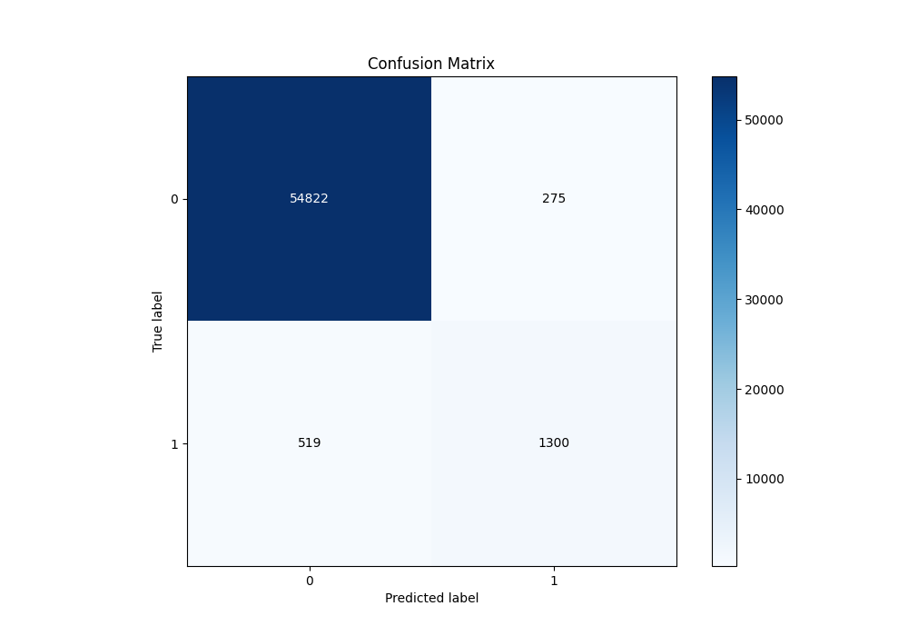

# Summary of Ensemble

[<< Go back](../README.md)

## Ensemble structure
| Model                   |   Weight |
|:------------------------|---------:|
| 3_Default_Xgboost       |        4 |
| 4_Default_NeuralNetwork |        1 |

## Metric details
|           |     score |     threshold |
|:----------|----------:|--------------:|
| logloss   | 0.0411581 | nan           |
| auc       | 0.985272  | nan           |
| f1        | 0.766058  |   0.394393    |
| accuracy  | 0.98605   |   0.394393    |
| precision | 0.826115  |   0.397521    |
| recall    | 1         |   5.15745e-05 |
| mcc       | 0.760998  |   0.394393    |

## Metric details with threshold from accuracy metric
|           |     score |   threshold |
|:----------|----------:|------------:|
| logloss   | 0.0411581 |  nan        |
| auc       | 0.985272  |  nan        |
| f1        | 0.766058  |    0.394393 |
| accuracy  | 0.98605   |    0.394393 |
| precision | 0.825397  |    0.394393 |
| recall    | 0.714678  |    0.394393 |
| mcc       | 0.760998  |    0.394393 |

## Confusion matrix (at threshold=0.394393)
|              |   Predicted as 0 |   Predicted as 1 |
|:-------------|-----------------:|-----------------:|
| Labeled as 0 |            54822 |              275 |
| Labeled as 1 |              519 |             1300 |

## Learning curves

## Confusion Matrix

## Normalized Confusion Matrix

## ROC Curve

## Kolmogorov-Smirnov Statistic

## Precision-Recall Curve

## Calibration Curve

## Cumulative Gains Curve

## Lift Curve

[<< Go back](../README.md)
