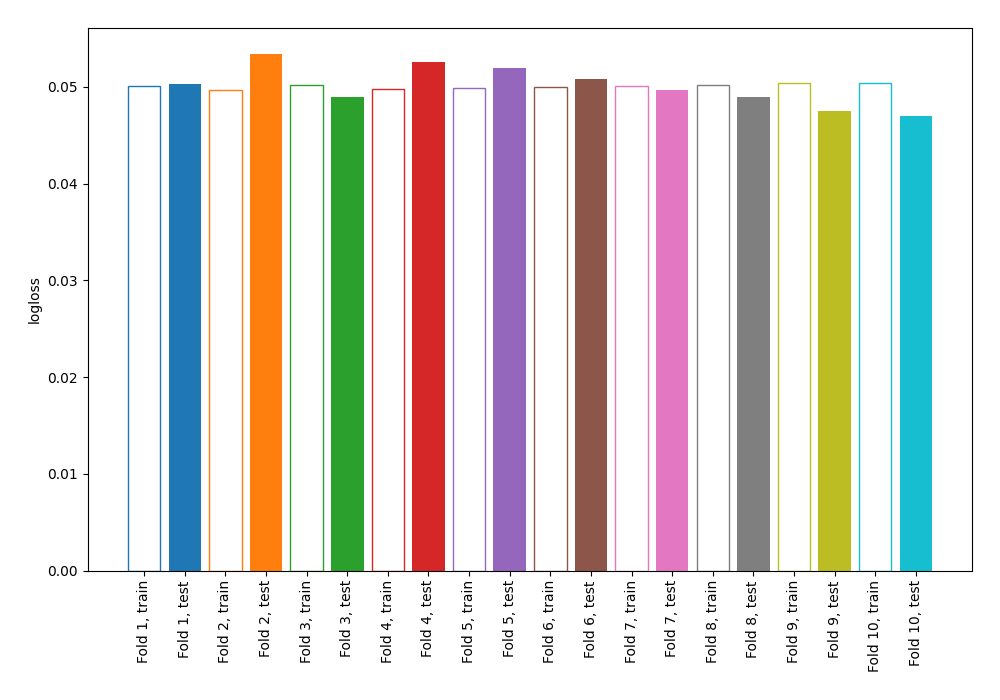
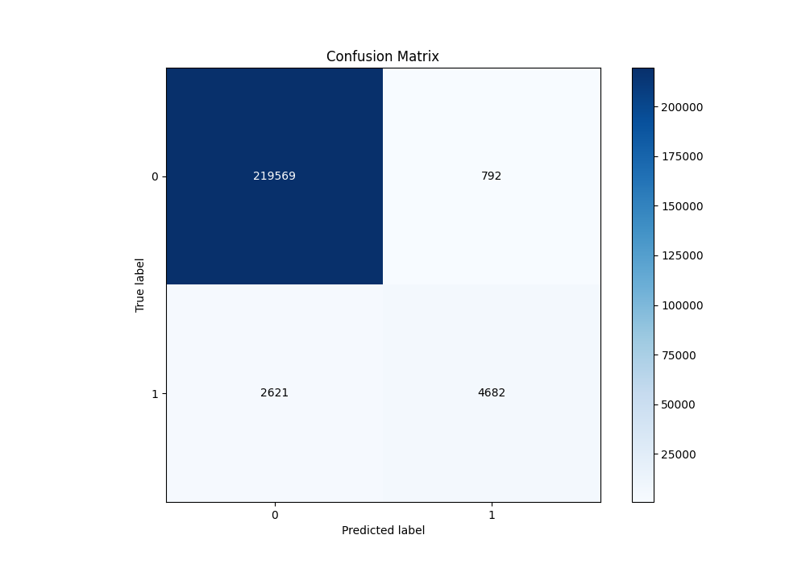
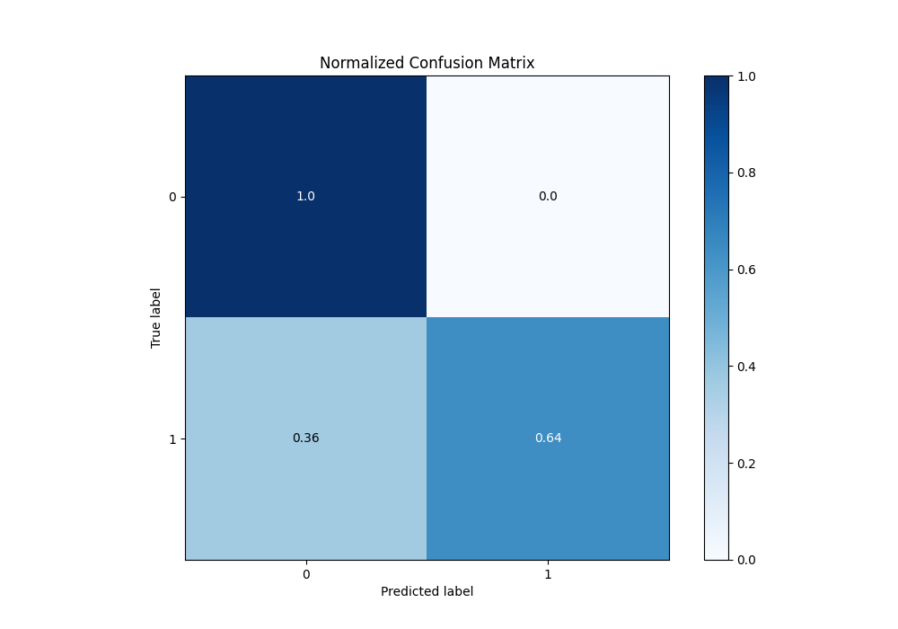
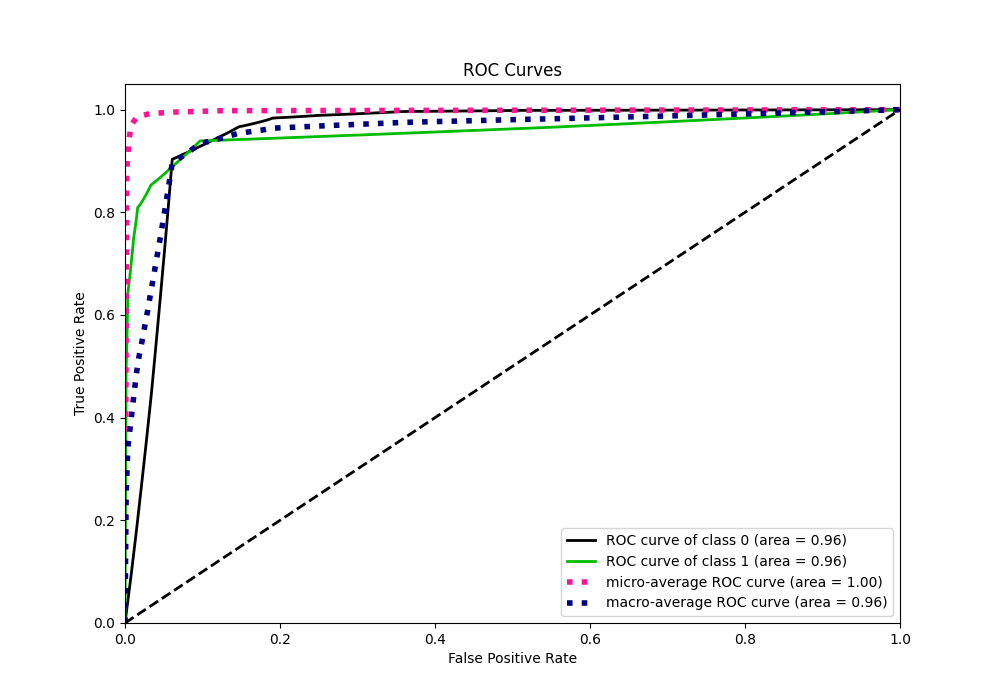
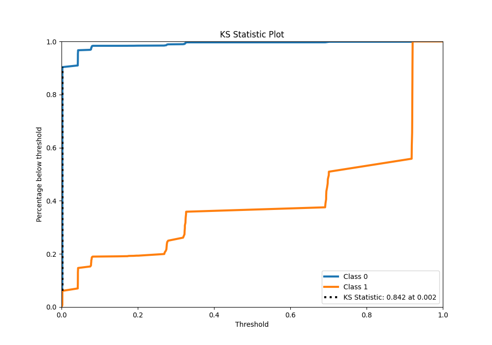
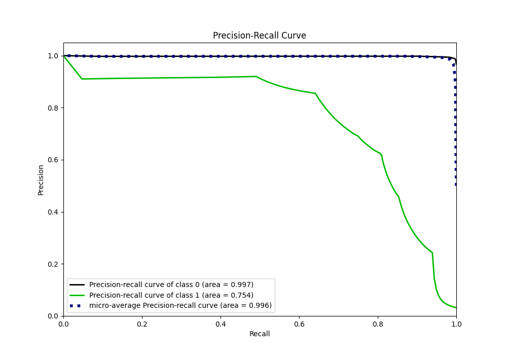
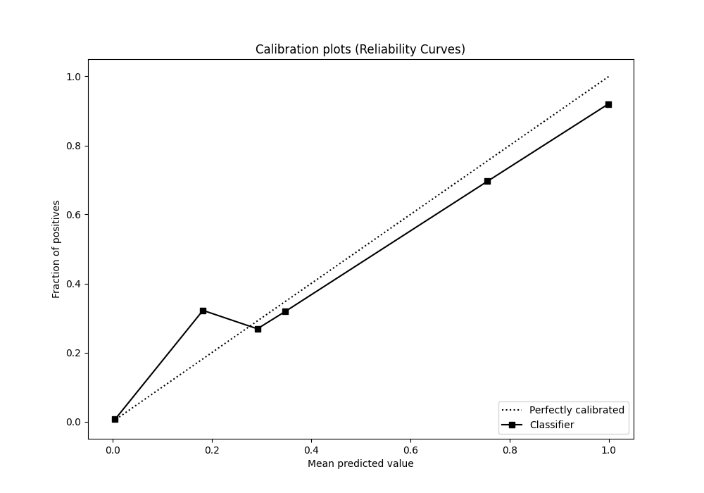
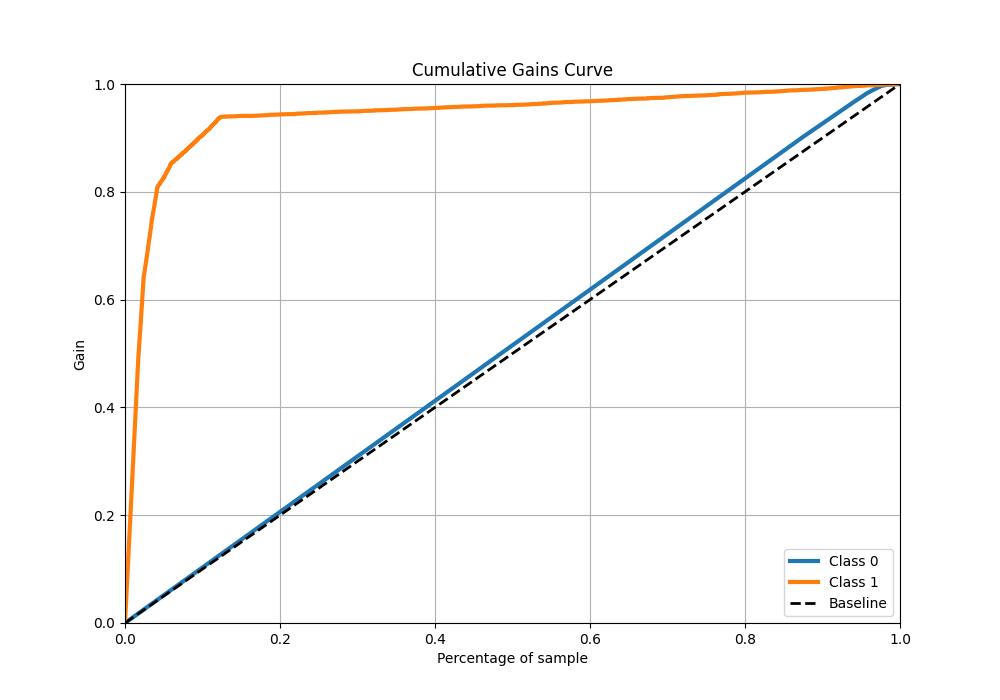
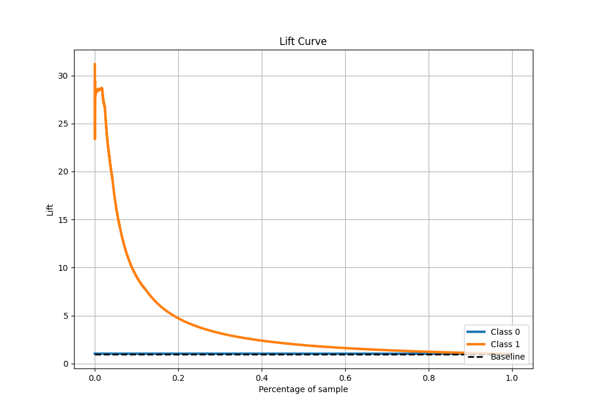

# Summary of 1_DecisionTree

[<< Go back](../README.md)

## Decision Tree
- **n_jobs**: -1
- **criterion**: gini
- **max_depth**: 3
- **explain_level**: 0

## Validation
 - **validation_type**: kfold
 - **shuffle**: True
 - **stratify**: True
 - **k_folds**: 10

## Optimized metric
logloss

## Training time

33.3 seconds

## Metric details
|           |     score |   threshold |
|:----------|----------:|------------:|
| logloss   | 0.0501305 | nan         |
| auc       | 0.955169  | nan         |
| f1        | 0.732879  |   0.461116  |
| accuracy  | 0.985009  |   0.461116  |
| precision | 0.855316  |   0.461116  |
| recall    | 1         |   0.0019504 |
| mcc       | 0.733317  |   0.461116  |

## Metric details with threshold from accuracy metric
|           |     score |   threshold |
|:----------|----------:|------------:|
| logloss   | 0.0501305 |  nan        |
| auc       | 0.955169  |  nan        |
| f1        | 0.732879  |    0.461116 |
| accuracy  | 0.985009  |    0.461116 |
| precision | 0.855316  |    0.461116 |
| recall    | 0.641106  |    0.461116 |
| mcc       | 0.733317  |    0.461116 |

## Confusion matrix (at threshold=0.461116)
|              |   Predicted as 0 |   Predicted as 1 |
|:-------------|-----------------:|-----------------:|
| Labeled as 0 |           219569 |              792 |
| Labeled as 1 |             2621 |             4682 |

## Learning curves

## Confusion Matrix

## Normalized Confusion Matrix

## ROC Curve

## Kolmogorov-Smirnov Statistic

## Precision-Recall Curve

## Calibration Curve

## Cumulative Gains Curve

## Lift Curve

[<< Go back](../README.md)
