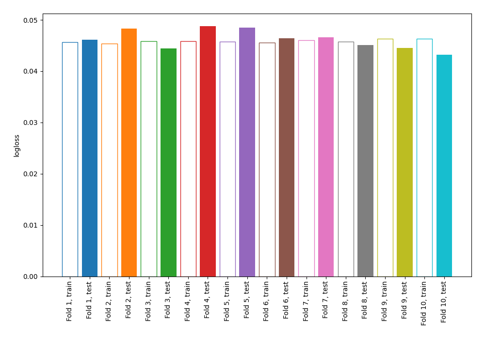
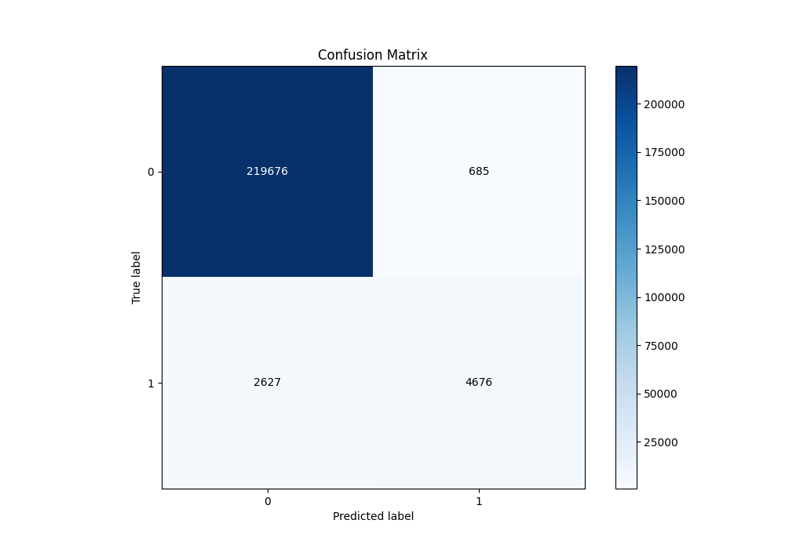
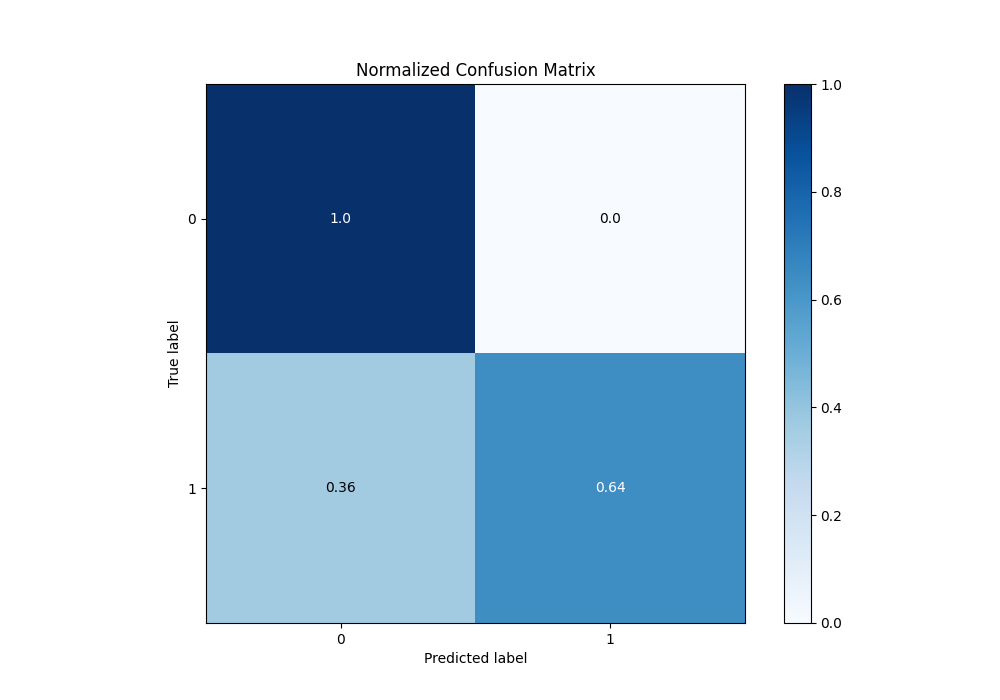
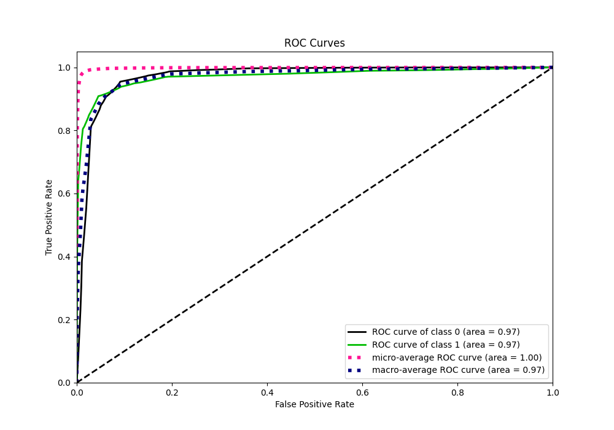
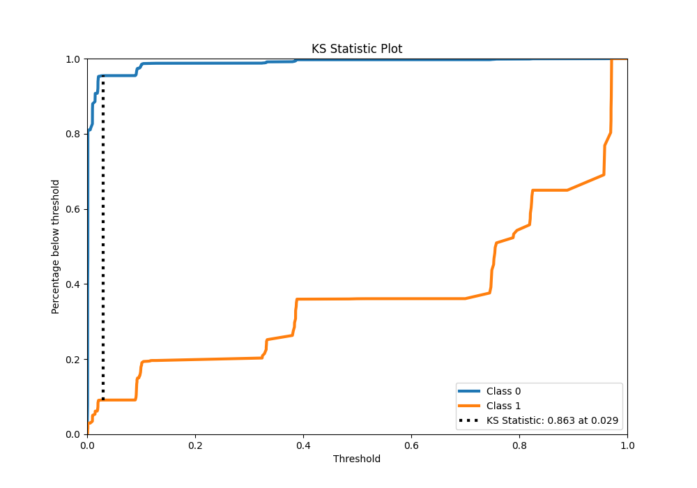
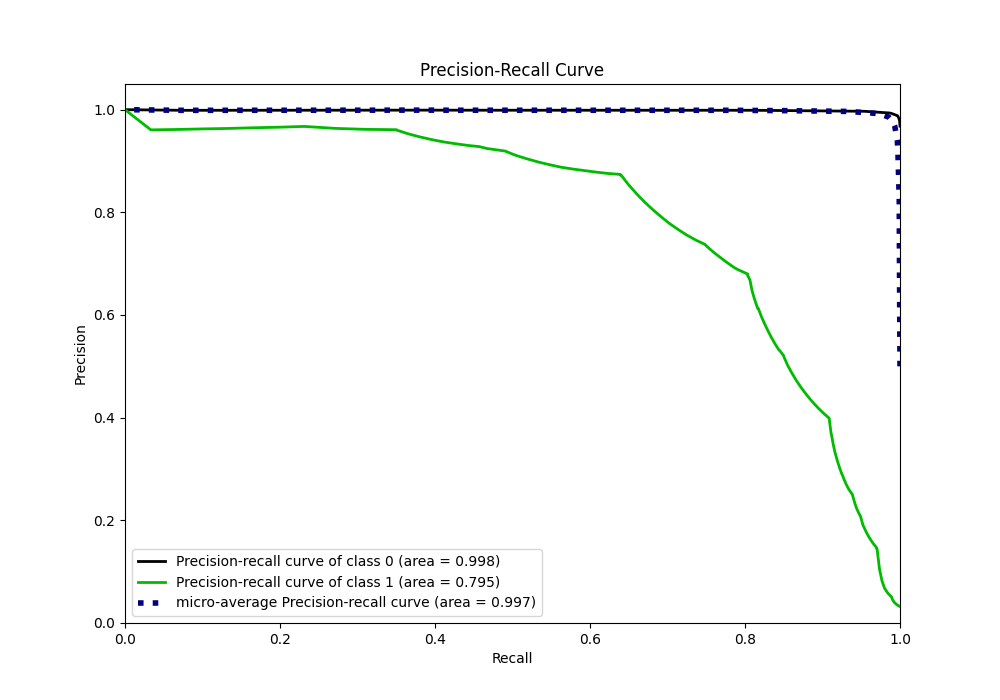
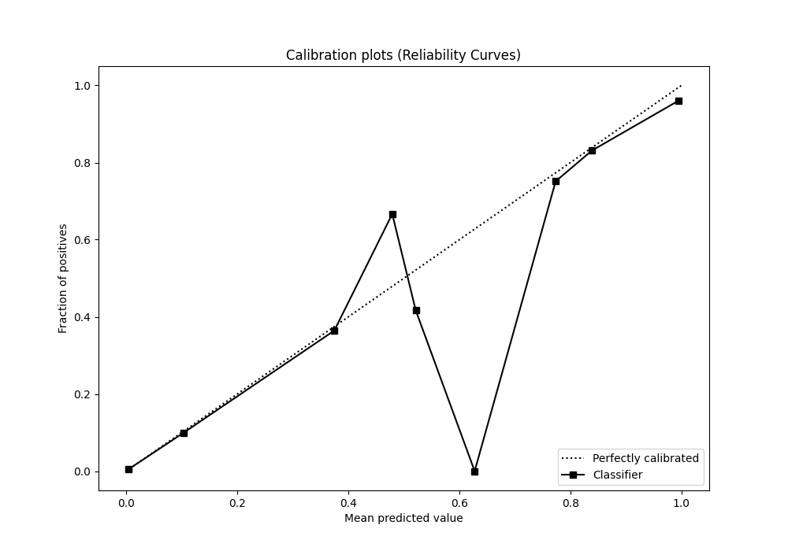
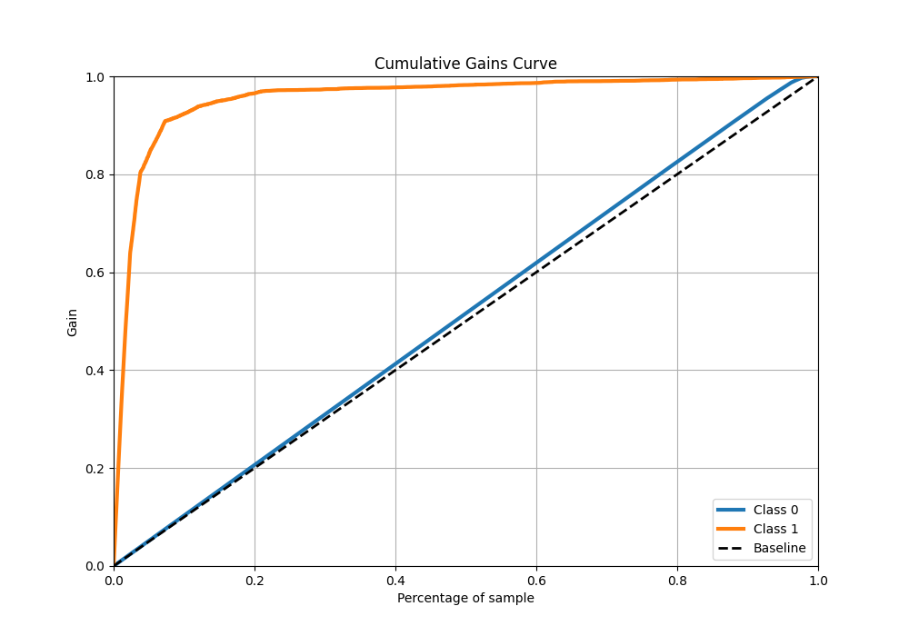
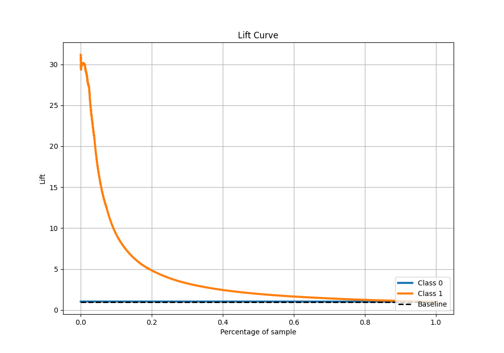

# Summary of 2_DecisionTree

[<< Go back](../README.md)

## Decision Tree
- **n_jobs**: -1
- **criterion**: gini
- **max_depth**: 4
- **explain_level**: 0

## Validation
 - **validation_type**: kfold
 - **shuffle**: True
 - **stratify**: True
 - **k_folds**: 10

## Optimized metric
logloss

## Training time

33.4 seconds

## Metric details
|           |     score |    threshold |
|:----------|----------:|-------------:|
| logloss   | 0.0462095 | nan          |
| auc       | 0.971498  | nan          |
| f1        | 0.742861  |   0.374427   |
| accuracy  | 0.985452  |   0.41215    |
| precision | 0.872456  |   0.485349   |
| recall    | 1         |   0.00075923 |
| mcc       | 0.740427  |   0.41215    |

## Metric details with threshold from accuracy metric
|           |     score |   threshold |
|:----------|----------:|------------:|
| logloss   | 0.0462095 |   nan       |
| auc       | 0.971498  |   nan       |
| f1        | 0.738471  |     0.41215 |
| accuracy  | 0.985452  |     0.41215 |
| precision | 0.872225  |     0.41215 |
| recall    | 0.640285  |     0.41215 |
| mcc       | 0.740427  |     0.41215 |

## Confusion matrix (at threshold=0.41215)
|              |   Predicted as 0 |   Predicted as 1 |
|:-------------|-----------------:|-----------------:|
| Labeled as 0 |           219676 |              685 |
| Labeled as 1 |             2627 |             4676 |

## Learning curves

## Confusion Matrix

## Normalized Confusion Matrix

## ROC Curve

## Kolmogorov-Smirnov Statistic

## Precision-Recall Curve

## Calibration Curve

## Cumulative Gains Curve

## Lift Curve

[<< Go back](../README.md)
