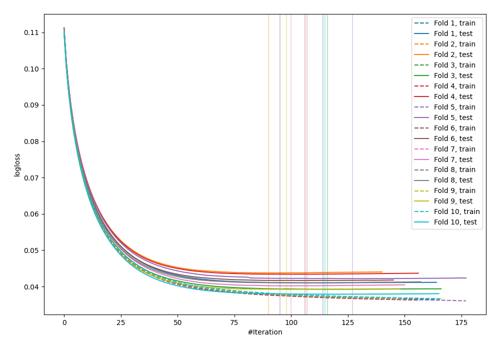
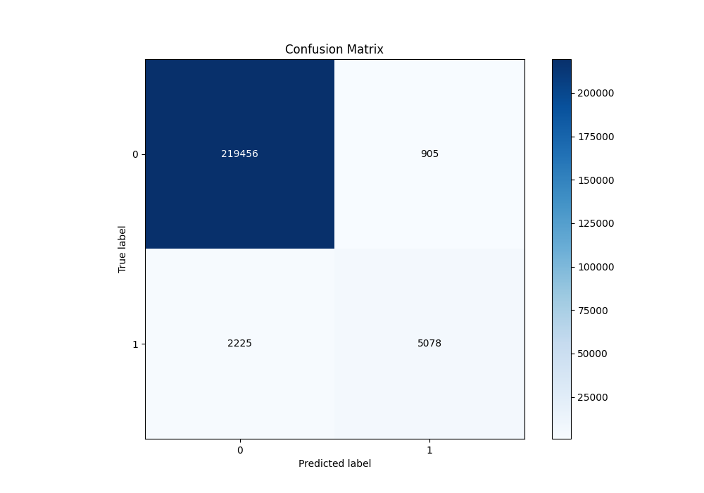
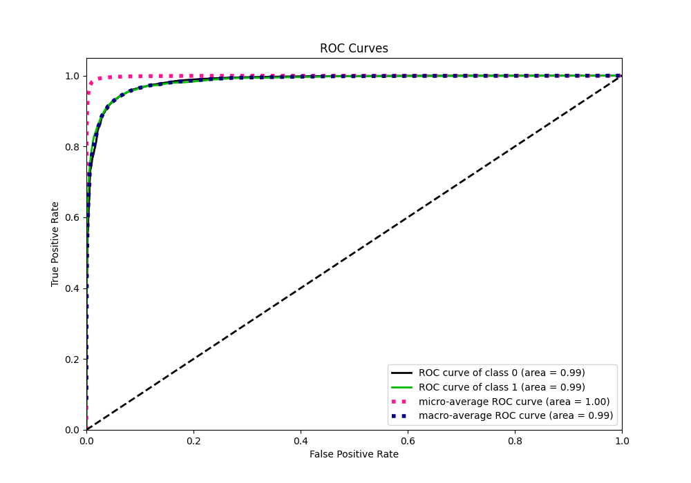
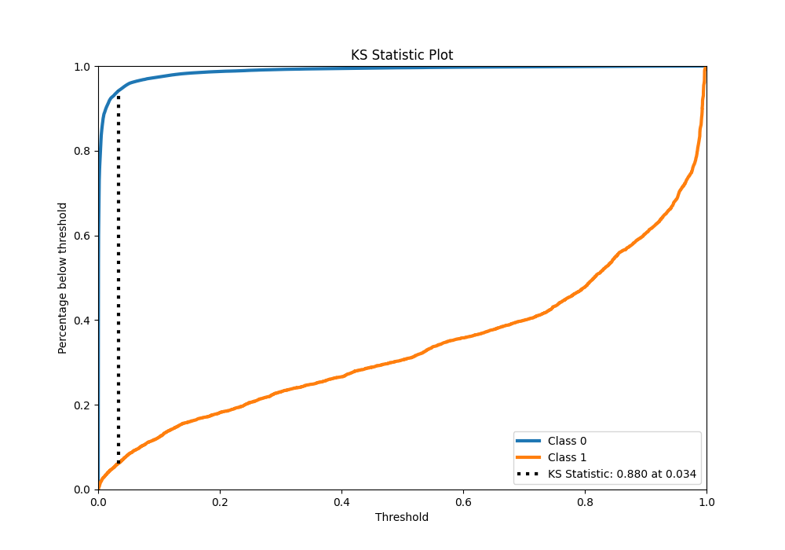
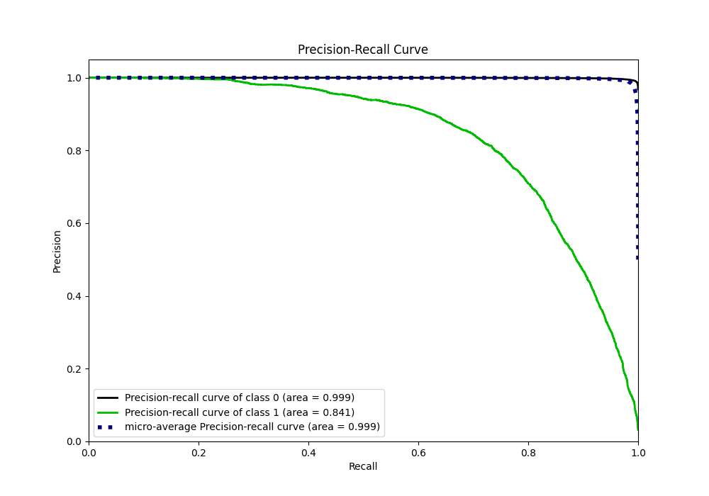
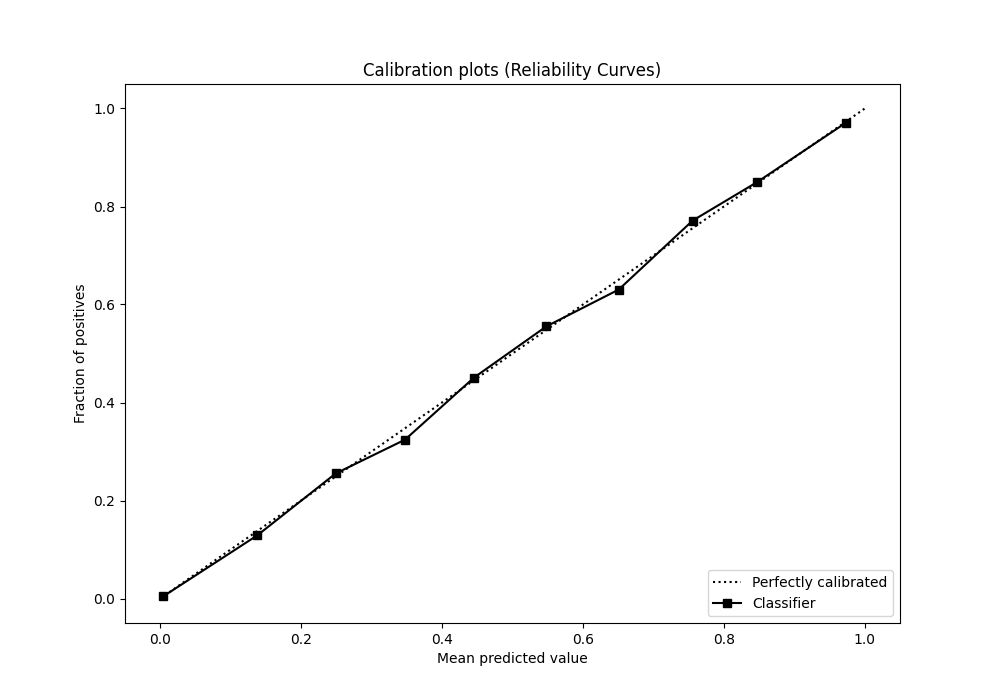
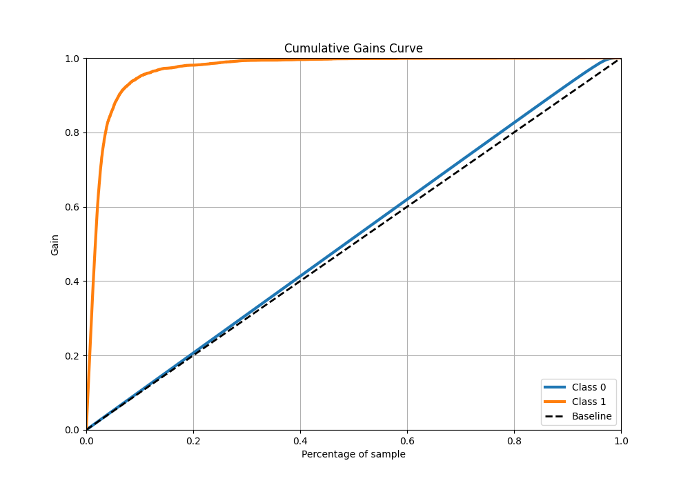
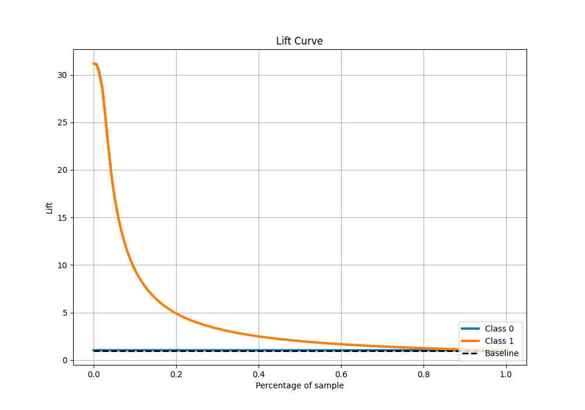

# Summary of 4_Default_LightGBM

[<< Go back](../README.md)

## LightGBM
- **n_jobs**: -1
- **objective**: binary
- **num_leaves**: 63
- **learning_rate**: 0.05
- **feature_fraction**: 0.9
- **bagging_fraction**: 0.9
- **min_data_in_leaf**: 10
- **metric**: binary_logloss
- **custom_eval_metric_name**: None
- **explain_level**: 0

## Validation
 - **validation_type**: kfold
 - **shuffle**: True
 - **stratify**: True
 - **k_folds**: 10

## Optimized metric
logloss

## Training time

42.9 seconds

## Metric details
|           |     score |    threshold |
|:----------|----------:|-------------:|
| logloss   | 0.0409542 | nan          |
| auc       | 0.985075  | nan          |
| f1        | 0.770958  |   0.402467   |
| accuracy  | 0.986252  |   0.496739   |
| precision | 0.850143  |   0.501202   |
| recall    | 1         |   1.3734e-05 |
| mcc       | 0.764826  |   0.402467   |

## Metric details with threshold from accuracy metric
|           |     score |   threshold |
|:----------|----------:|------------:|
| logloss   | 0.0409542 |  nan        |
| auc       | 0.985075  |  nan        |
| f1        | 0.764414  |    0.496739 |
| accuracy  | 0.986252  |    0.496739 |
| precision | 0.848738  |    0.496739 |
| recall    | 0.695331  |    0.496739 |
| mcc       | 0.7614    |    0.496739 |

## Confusion matrix (at threshold=0.496739)
|              |   Predicted as 0 |   Predicted as 1 |
|:-------------|-----------------:|-----------------:|
| Labeled as 0 |           219456 |              905 |
| Labeled as 1 |             2225 |             5078 |

## Learning curves

## Confusion Matrix

## Normalized Confusion Matrix

## ROC Curve

## Kolmogorov-Smirnov Statistic

## Precision-Recall Curve

## Calibration Curve

## Cumulative Gains Curve

## Lift Curve

[<< Go back](../README.md)
