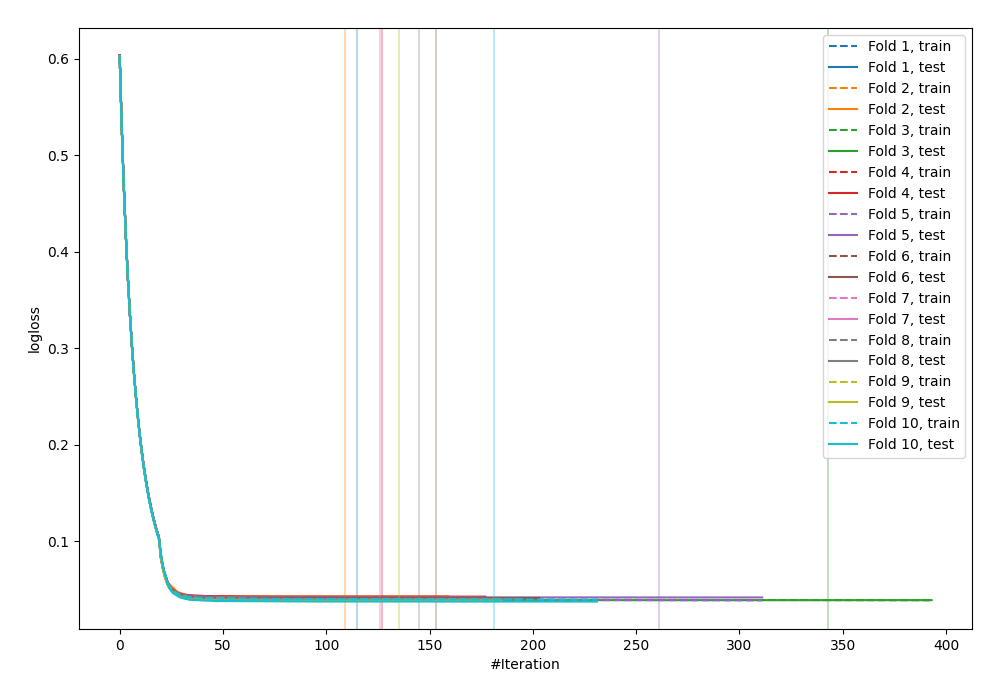
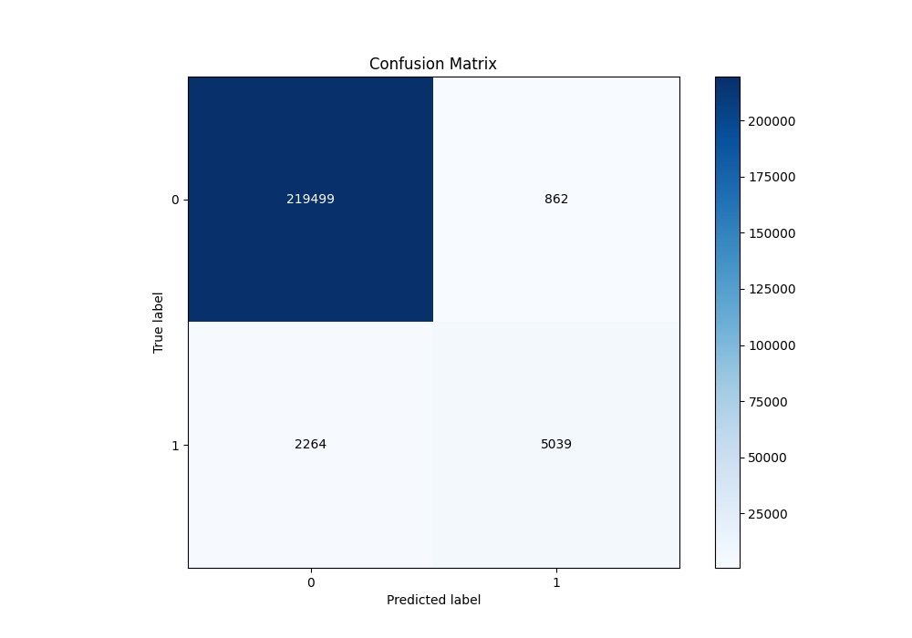
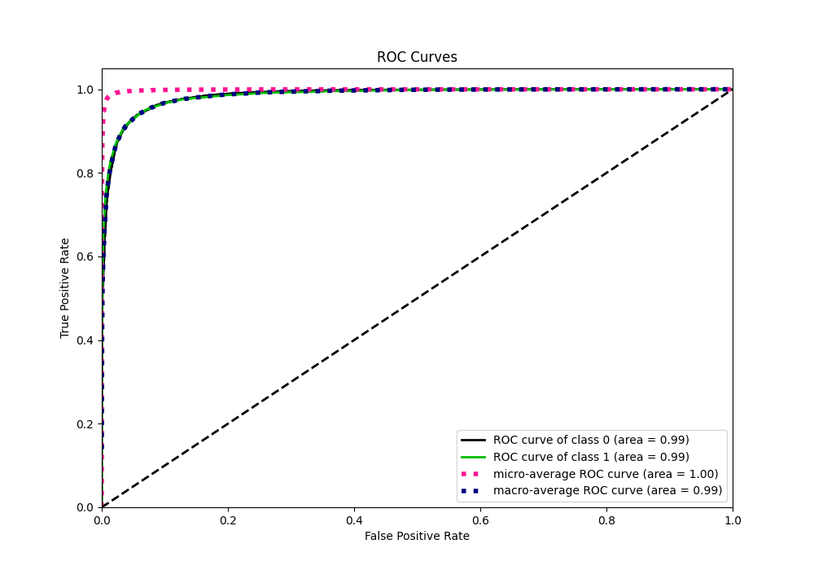
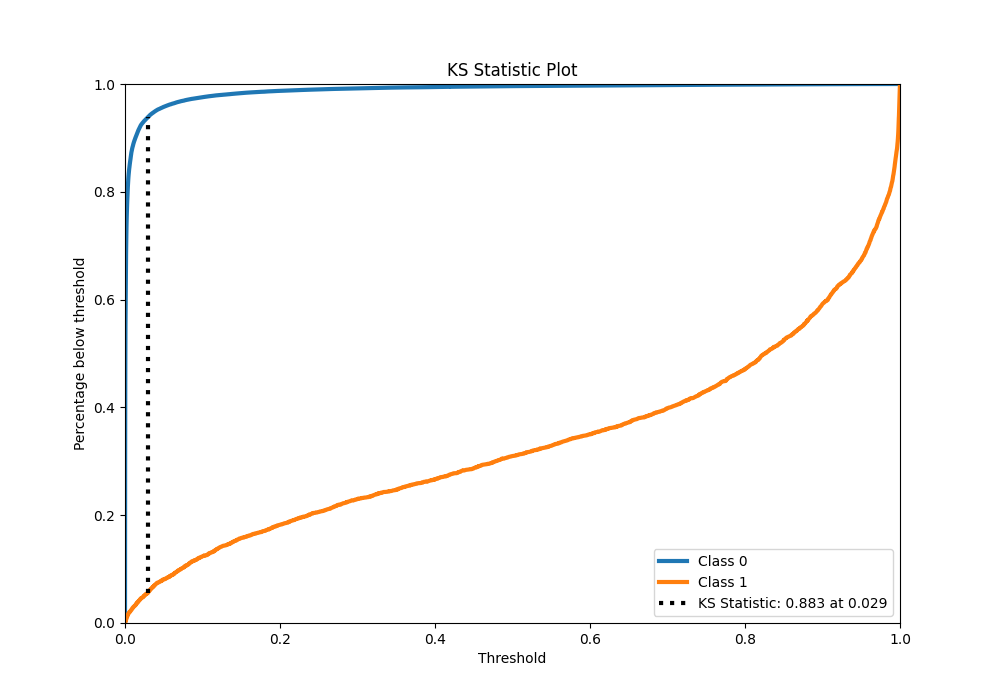
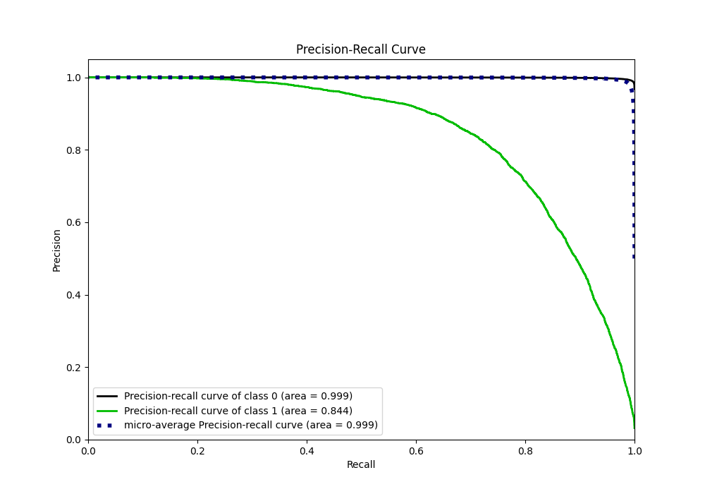
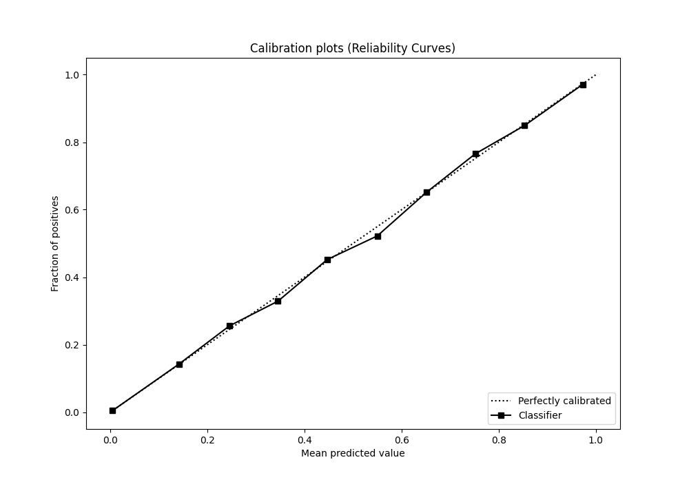
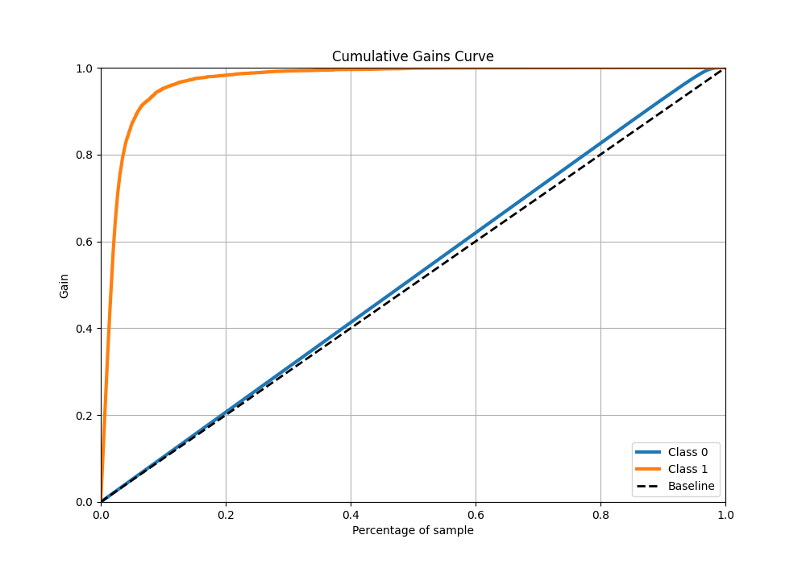
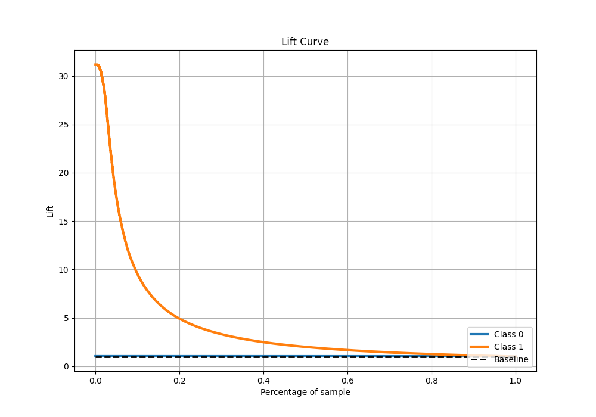

# Summary of 6_Default_CatBoost

[<< Go back](../README.md)

## CatBoost
- **n_jobs**: -1
- **learning_rate**: 0.1
- **depth**: 6
- **rsm**: 1
- **loss_function**: Logloss
- **eval_metric**: Logloss
- **explain_level**: 0

## Validation
 - **validation_type**: kfold
 - **shuffle**: True
 - **stratify**: True
 - **k_folds**: 10

## Optimized metric
logloss

## Training time

164.5 seconds

## Metric details
|           |     score |     threshold |
|:----------|----------:|--------------:|
| logloss   | 0.0403559 | nan           |
| auc       | 0.985727  | nan           |
| f1        | 0.770612  |   0.363482    |
| accuracy  | 0.986269  |   0.502032    |
| precision | 0.853923  |   0.502032    |
| recall    | 1         |   9.50848e-07 |
| mcc       | 0.764439  |   0.408304    |

## Metric details with threshold from accuracy metric
|           |     score |   threshold |
|:----------|----------:|------------:|
| logloss   | 0.0403559 |  nan        |
| auc       | 0.985727  |  nan        |
| f1        | 0.763254  |    0.502032 |
| accuracy  | 0.986269  |    0.502032 |
| precision | 0.853923  |    0.502032 |
| recall    | 0.68999   |    0.502032 |
| mcc       | 0.760825  |    0.502032 |

## Confusion matrix (at threshold=0.502032)
|              |   Predicted as 0 |   Predicted as 1 |
|:-------------|-----------------:|-----------------:|
| Labeled as 0 |           219499 |              862 |
| Labeled as 1 |             2264 |             5039 |

## Learning curves

## Confusion Matrix

## Normalized Confusion Matrix

## ROC Curve

## Kolmogorov-Smirnov Statistic

## Precision-Recall Curve

## Calibration Curve

## Cumulative Gains Curve

## Lift Curve

[<< Go back](../README.md)
