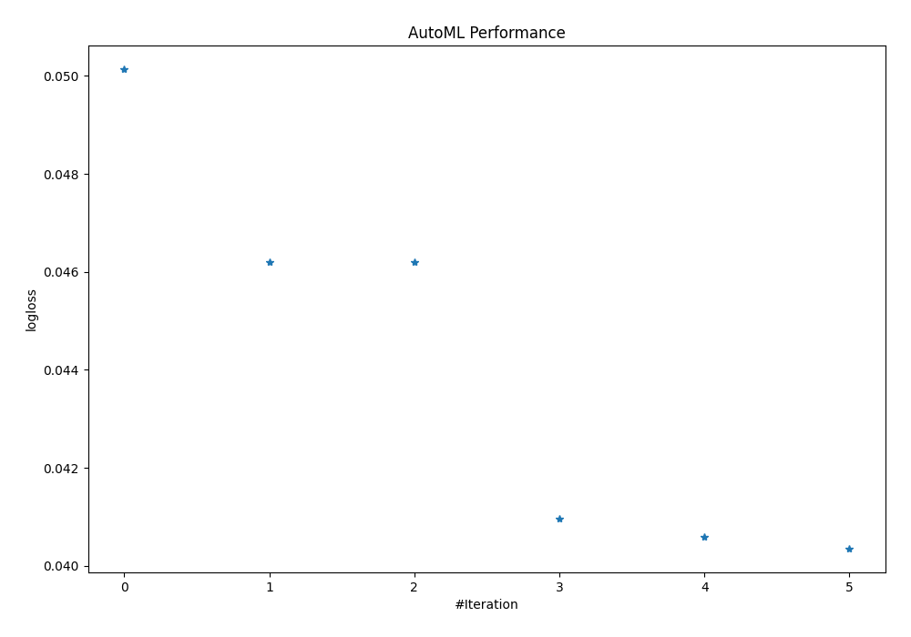
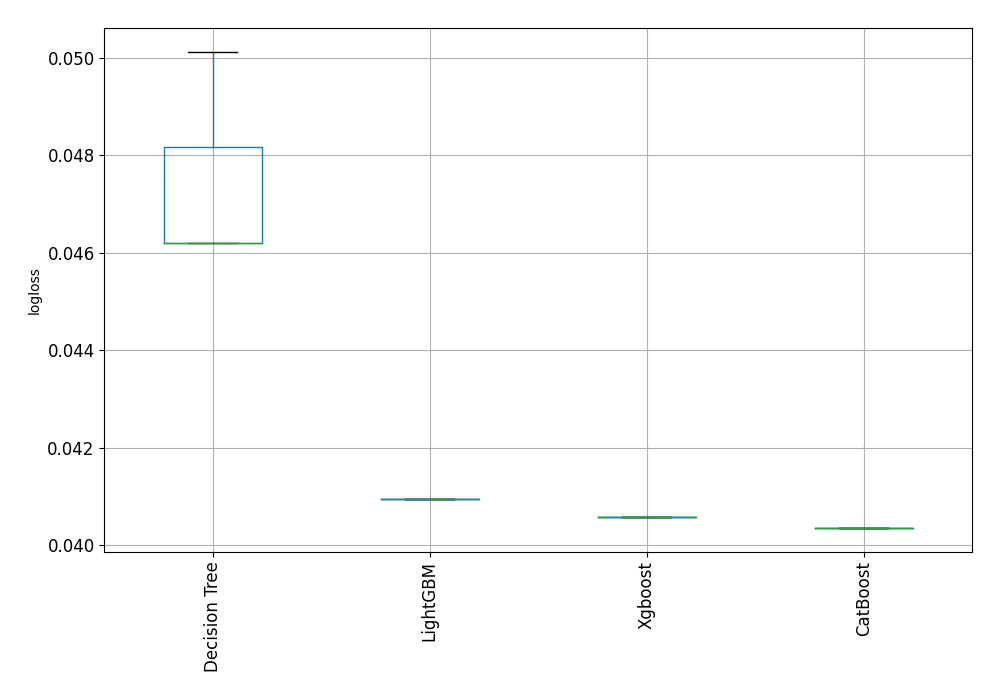

# AutoML Leaderboard

| Best model   | name                                               | model_type    | metric_type   |   metric_value |   train_time |
|:-------------|:---------------------------------------------------|:--------------|:--------------|---------------:|-------------:|
|              | [1_DecisionTree](1_DecisionTree/README.md)         | Decision Tree | logloss       |      0.0501305 |        34.58 |
|              | [2_DecisionTree](2_DecisionTree/README.md)         | Decision Tree | logloss       |      0.0462095 |        34.79 |
|              | [3_DecisionTree](3_DecisionTree/README.md)         | Decision Tree | logloss       |      0.0462095 |        34.88 |
|              | [4_Default_LightGBM](4_Default_LightGBM/README.md) | LightGBM      | logloss       |      0.0409542 |        44.36 |
|              | [5_Default_Xgboost](5_Default_Xgboost/README.md)   | Xgboost       | logloss       |      0.0405873 |        51.39 |
| **the best** | [6_Default_CatBoost](6_Default_CatBoost/README.md) | CatBoost      | logloss       |      0.0403559 |       164.55 |

### AutoML Performance

### AutoML Performance Boxplot
