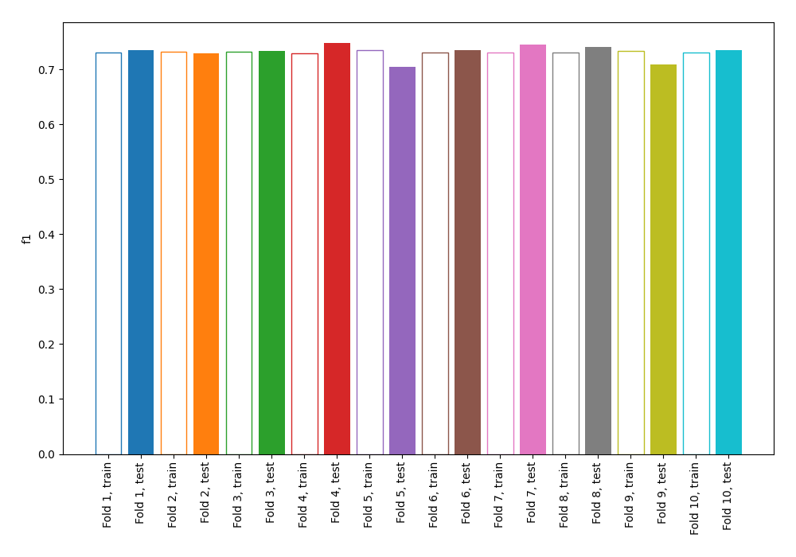
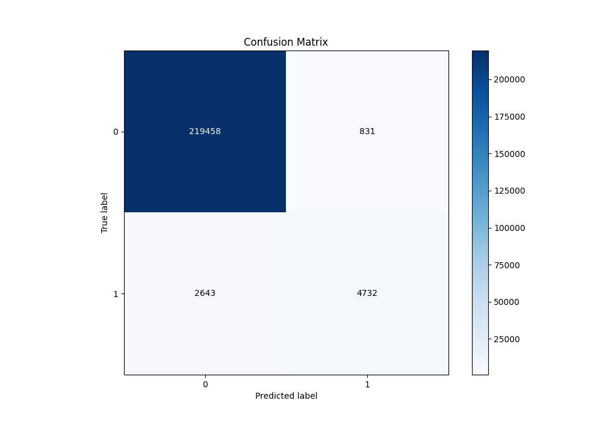
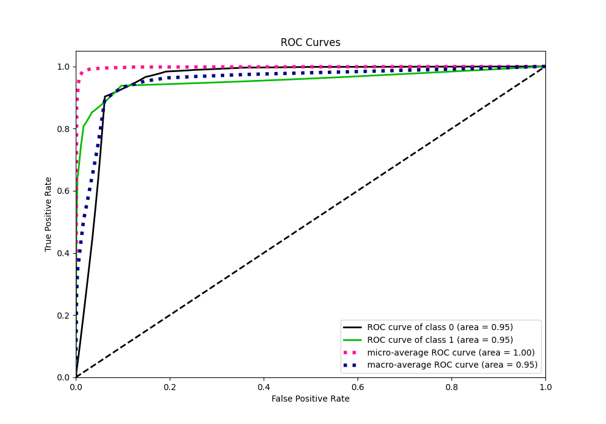
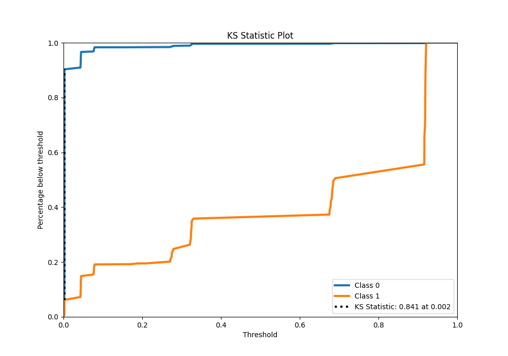
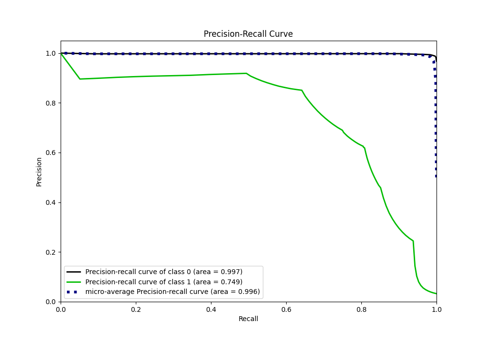
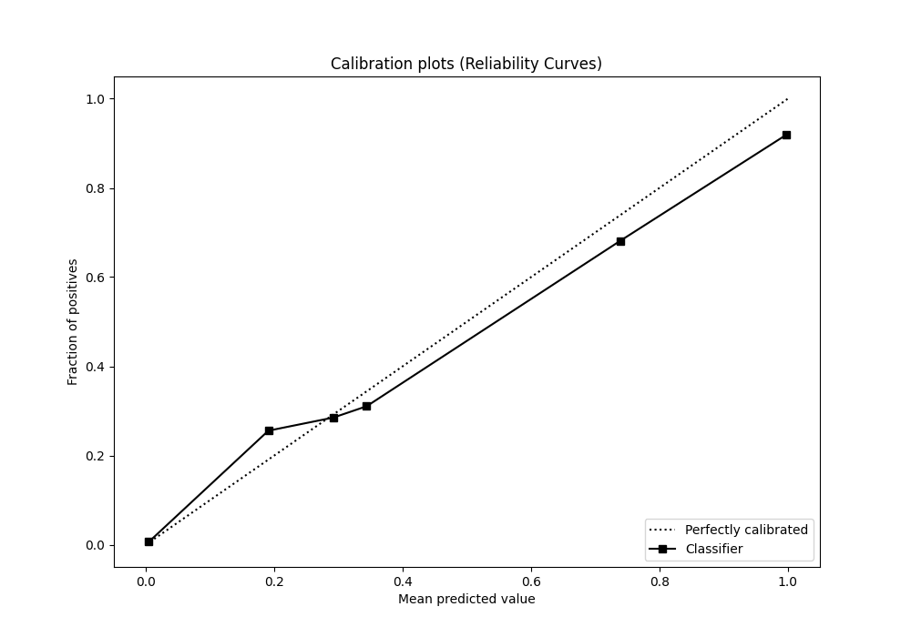
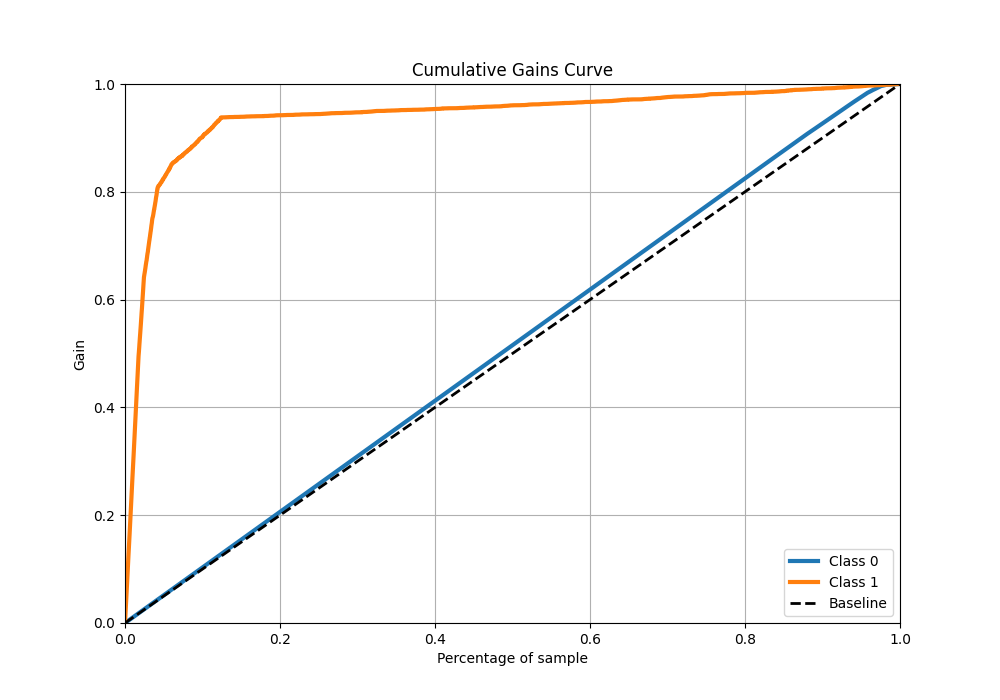
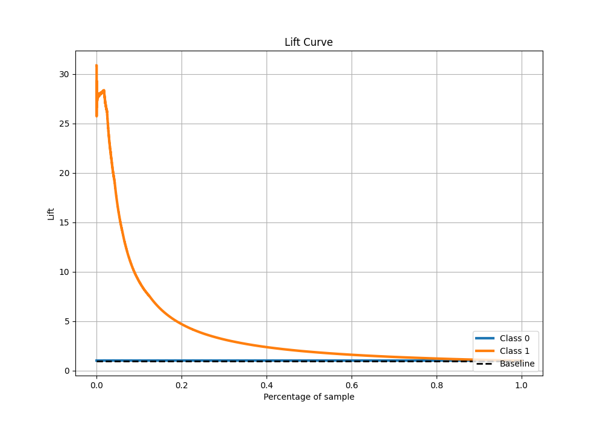

# Summary of 1_DecisionTree

[<< Go back](../README.md)

## Decision Tree
- **n_jobs**: -1
- **criterion**: gini
- **max_depth**: 3
- **explain_level**: 0

## Validation
 - **validation_type**: kfold
 - **shuffle**: True
 - **stratify**: True
 - **k_folds**: 10

## Optimized metric
f1

## Training time

33.4 seconds

## Metric details
|           |     score |   threshold |
|:----------|----------:|------------:|
| logloss   | 0.0508625 | nan         |
| auc       | 0.953944  | nan         |
| f1        | 0.731489  |   0.343696  |
| accuracy  | 0.984741  |   0.343696  |
| precision | 0.85062   |   0.343696  |
| recall    | 1         |   0.0020064 |
| mcc       | 0.731424  |   0.343696  |

## Metric details with threshold from accuracy metric
|           |     score |   threshold |
|:----------|----------:|------------:|
| logloss   | 0.0508625 |  nan        |
| auc       | 0.953944  |  nan        |
| f1        | 0.731489  |    0.343696 |
| accuracy  | 0.984741  |    0.343696 |
| precision | 0.85062   |    0.343696 |
| recall    | 0.641627  |    0.343696 |
| mcc       | 0.731424  |    0.343696 |

## Confusion matrix (at threshold=0.343696)
|              |   Predicted as 0 |   Predicted as 1 |
|:-------------|-----------------:|-----------------:|
| Labeled as 0 |           219458 |              831 |
| Labeled as 1 |             2643 |             4732 |

## Learning curves

## Confusion Matrix

## Normalized Confusion Matrix

## ROC Curve

## Kolmogorov-Smirnov Statistic

## Precision-Recall Curve

## Calibration Curve

## Cumulative Gains Curve

## Lift Curve

[<< Go back](../README.md)
