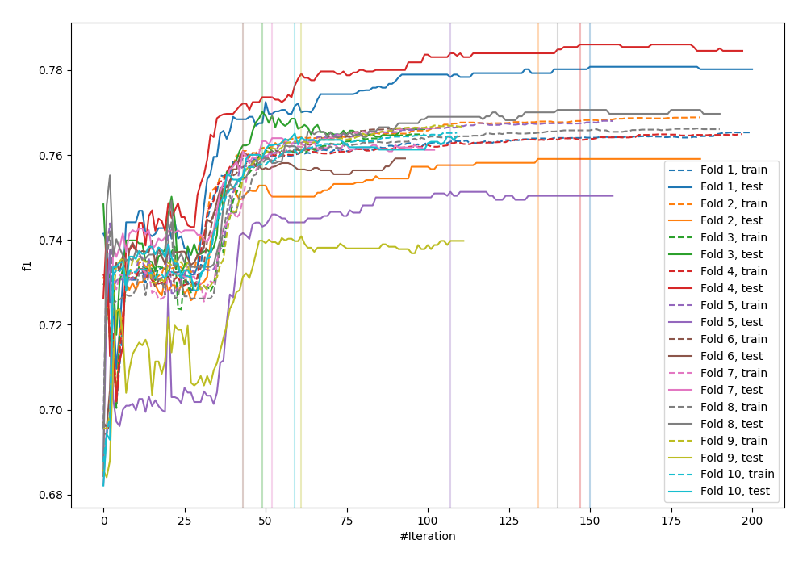

# Summary of 26_CatBoost

[<< Go back](../README.md)

## CatBoost
- **n_jobs**: -1
- **learning_rate**: 0.05
- **depth**: 8
- **rsm**: 0.8
- **loss_function**: Logloss
- **eval_metric**: F1
- **explain_level**: 0

## Validation
 - **validation_type**: kfold
 - **shuffle**: True
 - **stratify**: True
 - **k_folds**: 10

## Optimized metric
f1

## Training time

134.5 seconds

## Metric details
|           |     score |     threshold |
|:----------|----------:|--------------:|
| logloss   | 0.0424243 | nan           |
| auc       | 0.983055  | nan           |
| f1        | 0.769757  |   0.388372    |
| accuracy  | 0.986124  |   0.487388    |
| precision | 0.850166  |   0.487388    |
| recall    | 1         |   8.55019e-06 |
| mcc       | 0.763468  |   0.388372    |

## Metric details with threshold from accuracy metric
|           |     score |   threshold |
|:----------|----------:|------------:|
| logloss   | 0.0424243 |  nan        |
| auc       | 0.983055  |  nan        |
| f1        | 0.764166  |    0.487388 |
| accuracy  | 0.986124  |    0.487388 |
| precision | 0.850166  |    0.487388 |
| recall    | 0.693966  |    0.487388 |
| mcc       | 0.761236  |    0.487388 |

## Confusion matrix (at threshold=0.487388)
|              |   Predicted as 0 |   Predicted as 1 |
|:-------------|-----------------:|-----------------:|
| Labeled as 0 |           219387 |              902 |
| Labeled as 1 |             2257 |             5118 |

## Learning curves

## Confusion Matrix

## Normalized Confusion Matrix

## ROC Curve

## Kolmogorov-Smirnov Statistic

## Precision-Recall Curve

## Calibration Curve

## Cumulative Gains Curve

## Lift Curve

[<< Go back](../README.md)
