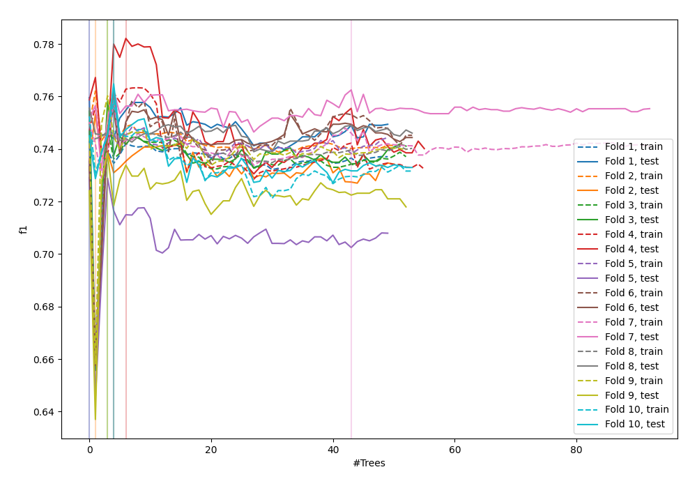
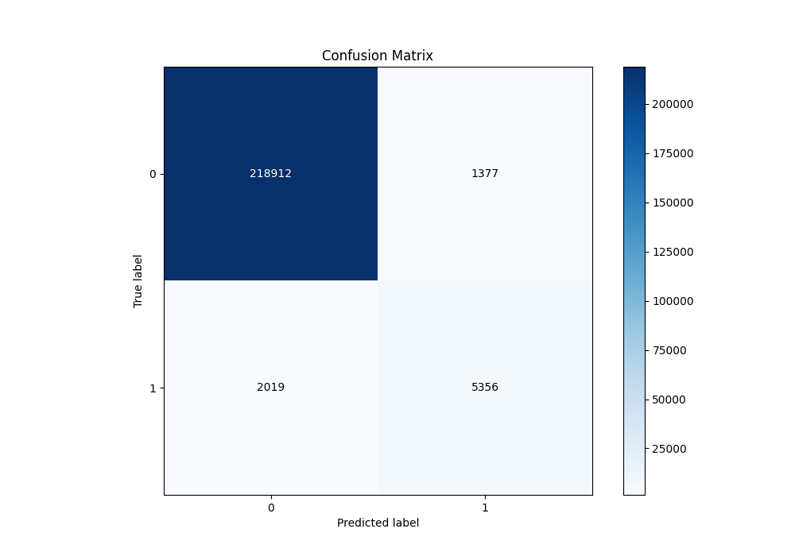
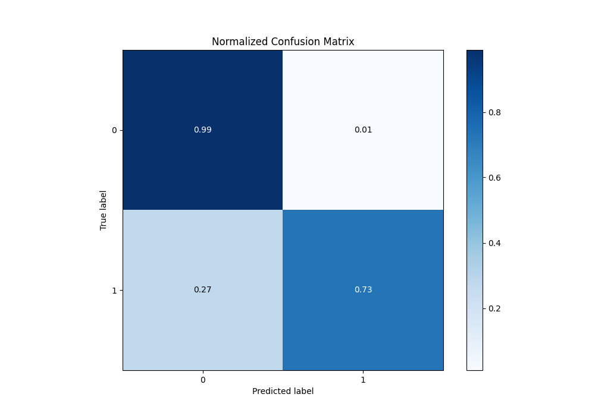
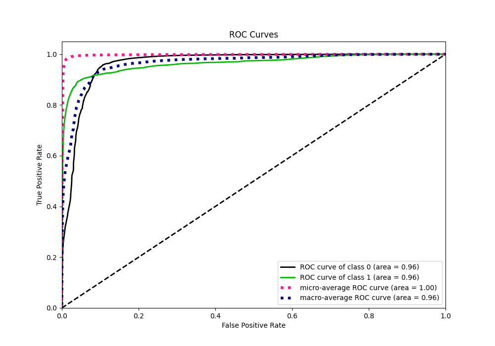
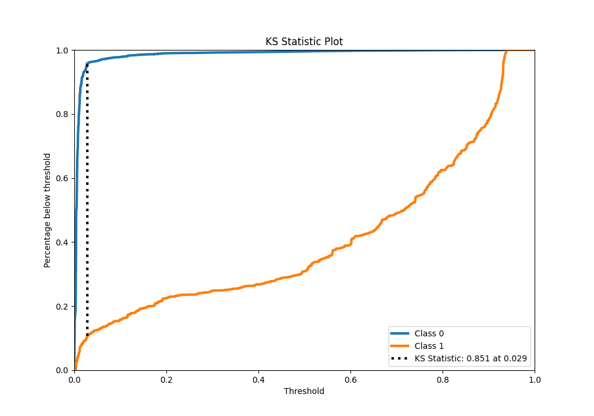
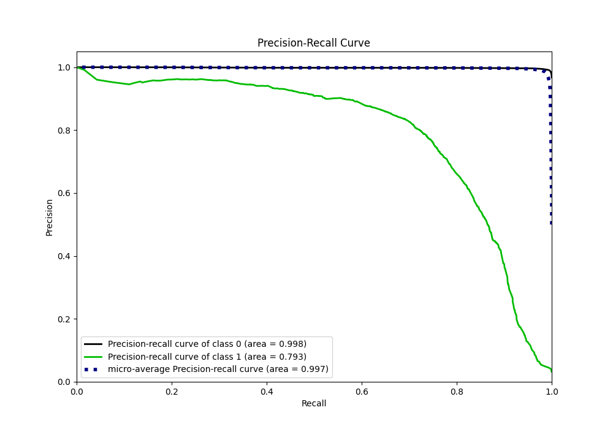
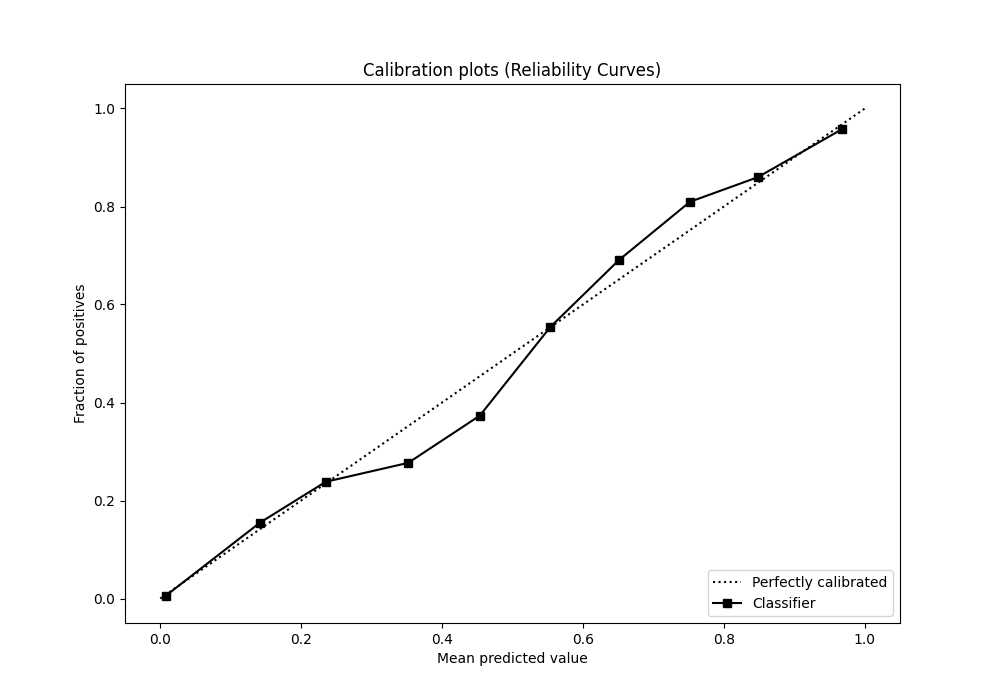
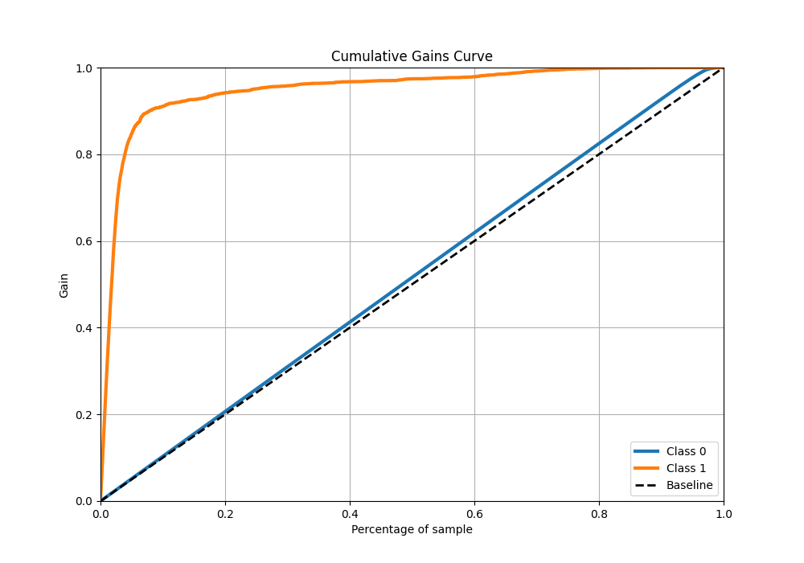
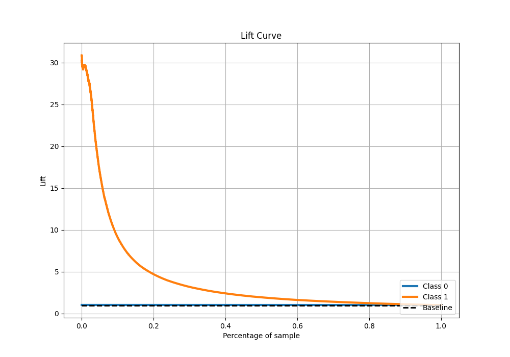

# Summary of 35_RandomForest

[<< Go back](../README.md)

## Random Forest
- **n_jobs**: -1
- **criterion**: gini
- **max_features**: 0.5
- **min_samples_split**: 20
- **max_depth**: 4
- **eval_metric_name**: f1
- **explain_level**: 0

## Validation
 - **validation_type**: kfold
 - **shuffle**: True
 - **stratify**: True
 - **k_folds**: 10

## Optimized metric
f1

## Training time

90.5 seconds

## Metric details
|           |    score |   threshold |
|:----------|---------:|------------:|
| logloss   | 0.049782 |  nan        |
| auc       | 0.964593 |  nan        |
| f1        | 0.759286 |    0.418241 |
| accuracy  | 0.985083 |    0.418241 |
| precision | 0.795485 |    0.418241 |
| recall    | 1        |    0        |
| mcc       | 0.752435 |    0.418241 |

## Metric details with threshold from accuracy metric
|           |    score |   threshold |
|:----------|---------:|------------:|
| logloss   | 0.049782 |  nan        |
| auc       | 0.964593 |  nan        |
| f1        | 0.759286 |    0.418241 |
| accuracy  | 0.985083 |    0.418241 |
| precision | 0.795485 |    0.418241 |
| recall    | 0.726237 |    0.418241 |
| mcc       | 0.752435 |    0.418241 |

## Confusion matrix (at threshold=0.418241)
|              |   Predicted as 0 |   Predicted as 1 |
|:-------------|-----------------:|-----------------:|
| Labeled as 0 |           218912 |             1377 |
| Labeled as 1 |             2019 |             5356 |

## Learning curves

## Confusion Matrix

## Normalized Confusion Matrix

## ROC Curve

## Kolmogorov-Smirnov Statistic

## Precision-Recall Curve

## Calibration Curve

## Cumulative Gains Curve

## Lift Curve

[<< Go back](../README.md)
