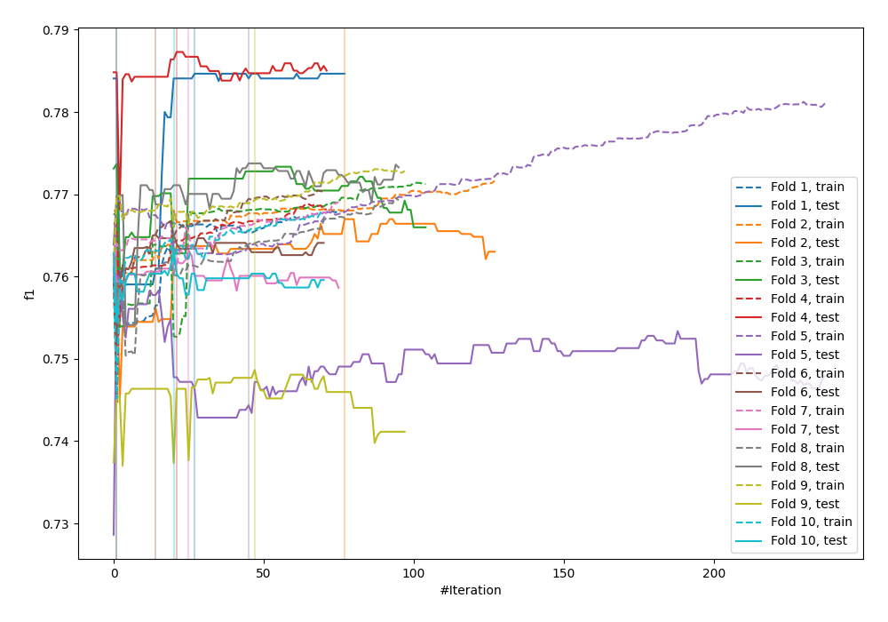
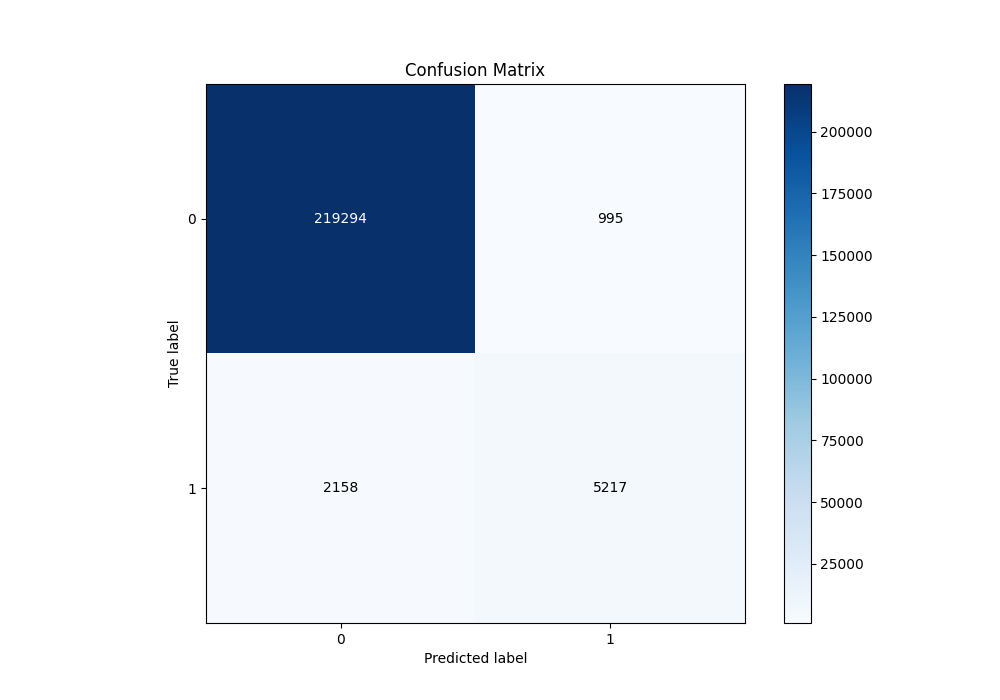
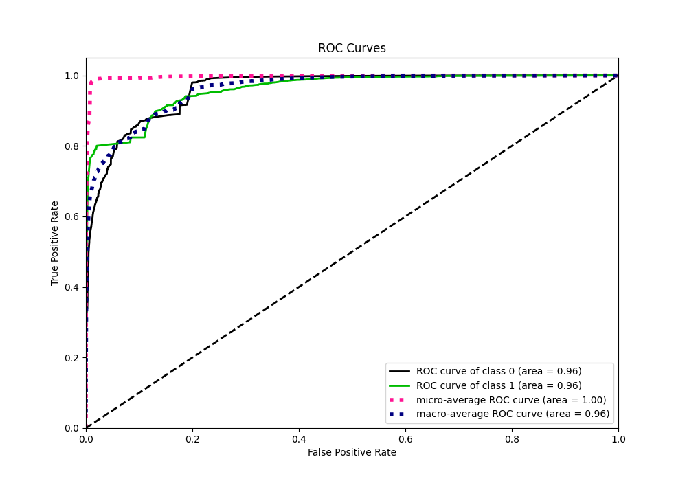
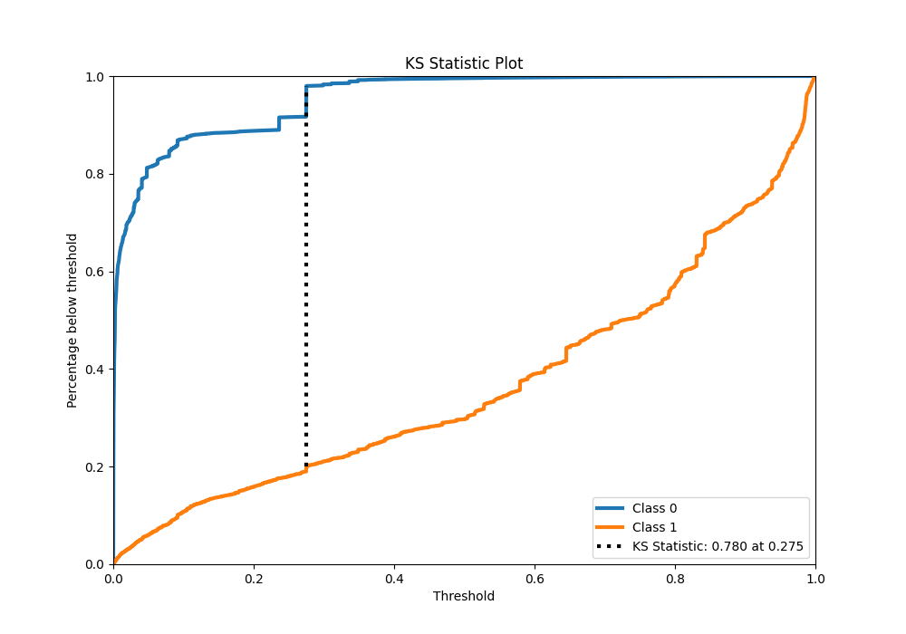
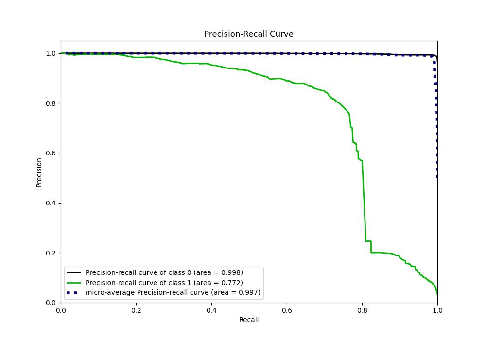
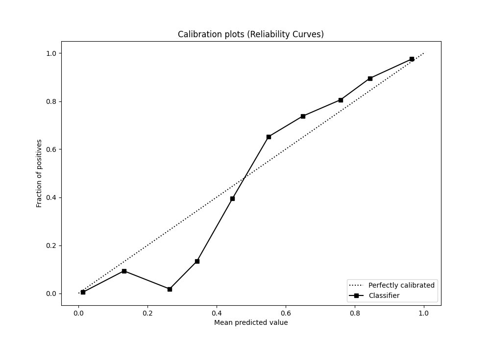
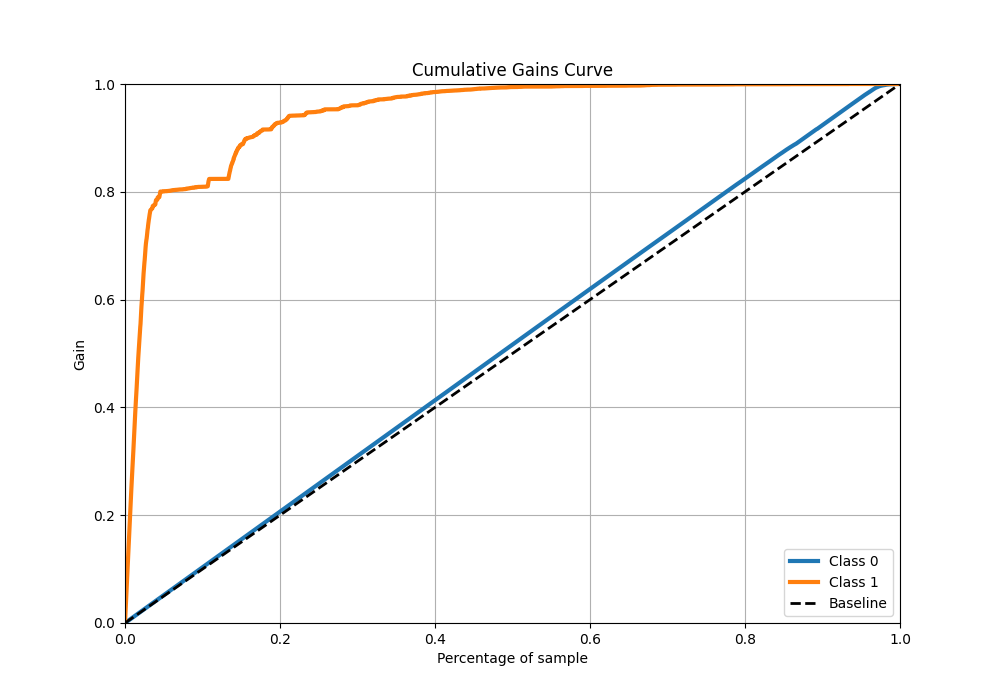
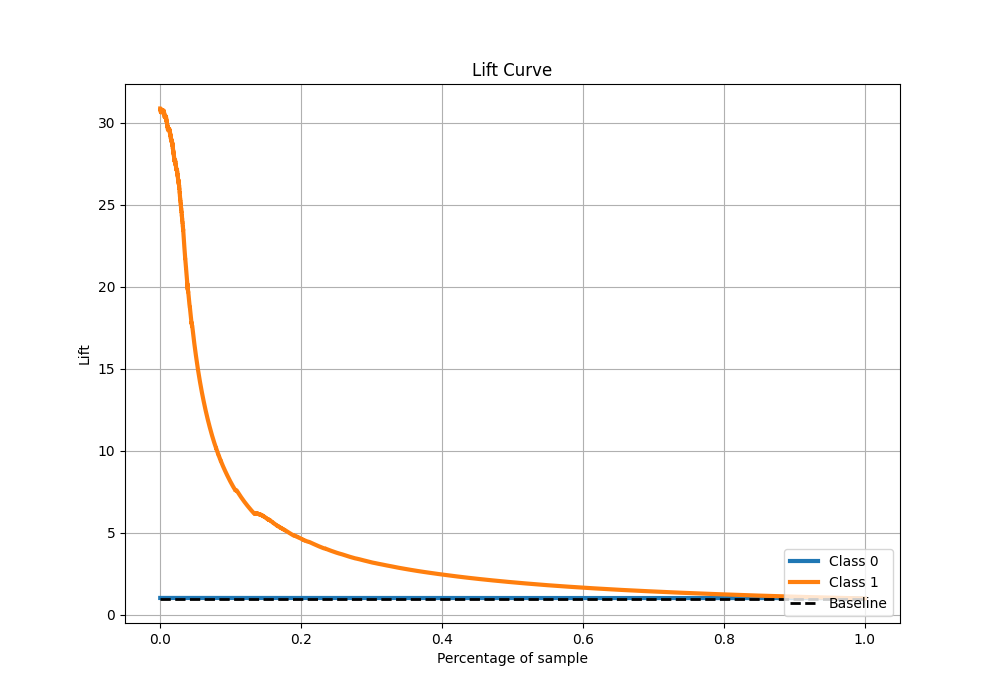

# Summary of 36_CatBoost_GoldenFeatures_Stacked

[<< Go back](../README.md)

## CatBoost
- **n_jobs**: -1
- **learning_rate**: 0.1
- **depth**: 5
- **rsm**: 1
- **loss_function**: Logloss
- **eval_metric**: F1
- **explain_level**: 0

## Validation
 - **validation_type**: kfold
 - **shuffle**: True
 - **stratify**: True
 - **k_folds**: 10

## Optimized metric
f1

## Training time

103.5 seconds

## Metric details
|           |     score |     threshold |
|:----------|----------:|--------------:|
| logloss   | 0.0769848 | nan           |
| auc       | 0.961041  | nan           |
| f1        | 0.76819   |   0.39705     |
| accuracy  | 0.986151  |   0.485185    |
| precision | 0.839826  |   0.485185    |
| recall    | 1         |   1.31246e-05 |
| mcc       | 0.763834  |   0.485185    |

## Metric details with threshold from accuracy metric
|           |     score |   threshold |
|:----------|----------:|------------:|
| logloss   | 0.0769848 |  nan        |
| auc       | 0.961041  |  nan        |
| f1        | 0.76794   |    0.485185 |
| accuracy  | 0.986151  |    0.485185 |
| precision | 0.839826  |    0.485185 |
| recall    | 0.70739   |    0.485185 |
| mcc       | 0.763834  |    0.485185 |

## Confusion matrix (at threshold=0.485185)
|              |   Predicted as 0 |   Predicted as 1 |
|:-------------|-----------------:|-----------------:|
| Labeled as 0 |           219294 |              995 |
| Labeled as 1 |             2158 |             5217 |

## Learning curves

## Confusion Matrix

## Normalized Confusion Matrix

## ROC Curve

## Kolmogorov-Smirnov Statistic

## Precision-Recall Curve

## Calibration Curve

## Cumulative Gains Curve

## Lift Curve

[<< Go back](../README.md)
