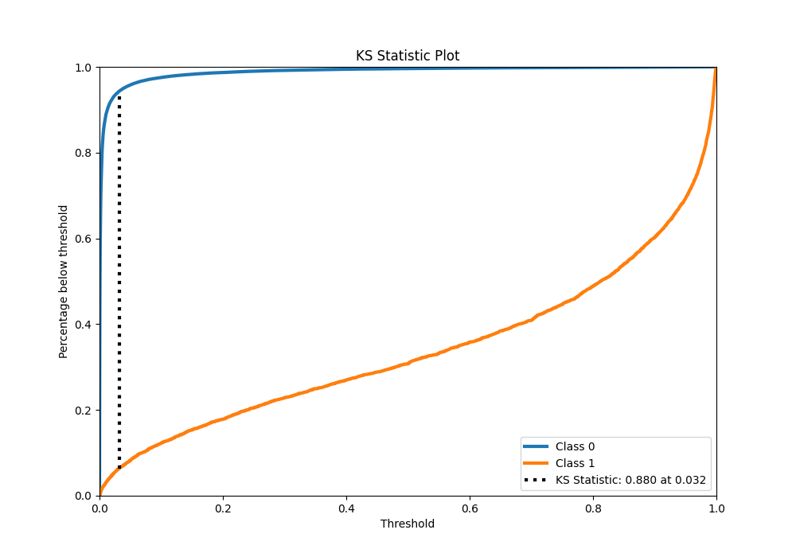

# Summary of 38_CatBoost

[<< Go back](../README.md)

## CatBoost
- **n_jobs**: -1
- **learning_rate**: 0.1
- **depth**: 5
- **rsm**: 1
- **loss_function**: Logloss
- **eval_metric**: F1
- **explain_level**: 0

## Validation
 - **validation_type**: kfold
 - **shuffle**: True
 - **stratify**: True
 - **k_folds**: 10

## Optimized metric
f1

## Training time

103.0 seconds

## Metric details
|           |     score |     threshold |
|:----------|----------:|--------------:|
| logloss   | 0.0411708 | nan           |
| auc       | 0.98483   | nan           |
| f1        | 0.770498  |   0.417989    |
| accuracy  | 0.986129  |   0.482934    |
| precision | 0.846166  |   0.482934    |
| recall    | 1         |   5.38698e-06 |
| mcc       | 0.765082  |   0.417989    |

## Metric details with threshold from accuracy metric
|           |     score |   threshold |
|:----------|----------:|------------:|
| logloss   | 0.0411708 |  nan        |
| auc       | 0.98483   |  nan        |
| f1        | 0.765483  |    0.482934 |
| accuracy  | 0.986129  |    0.482934 |
| precision | 0.846166  |    0.482934 |
| recall    | 0.698847  |    0.482934 |
| mcc       | 0.762089  |    0.482934 |

## Confusion matrix (at threshold=0.482934)
|              |   Predicted as 0 |   Predicted as 1 |
|:-------------|-----------------:|-----------------:|
| Labeled as 0 |           219352 |              937 |
| Labeled as 1 |             2221 |             5154 |

## Learning curves

## Confusion Matrix

## Normalized Confusion Matrix

## ROC Curve

## Kolmogorov-Smirnov Statistic

## Precision-Recall Curve

## Calibration Curve

## Cumulative Gains Curve

## Lift Curve

[<< Go back](../README.md)
