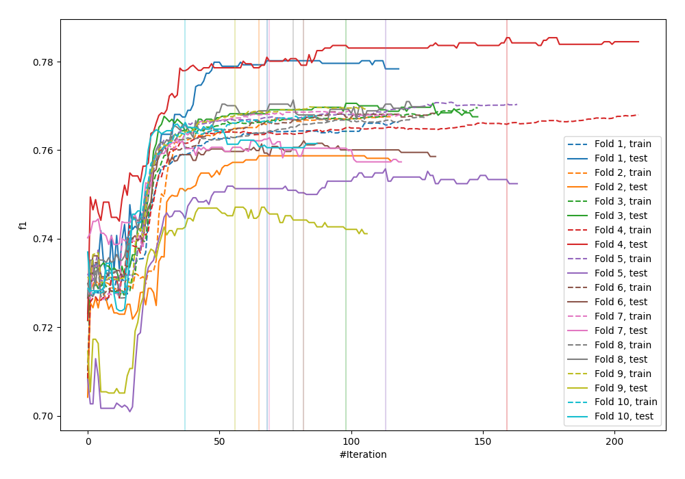
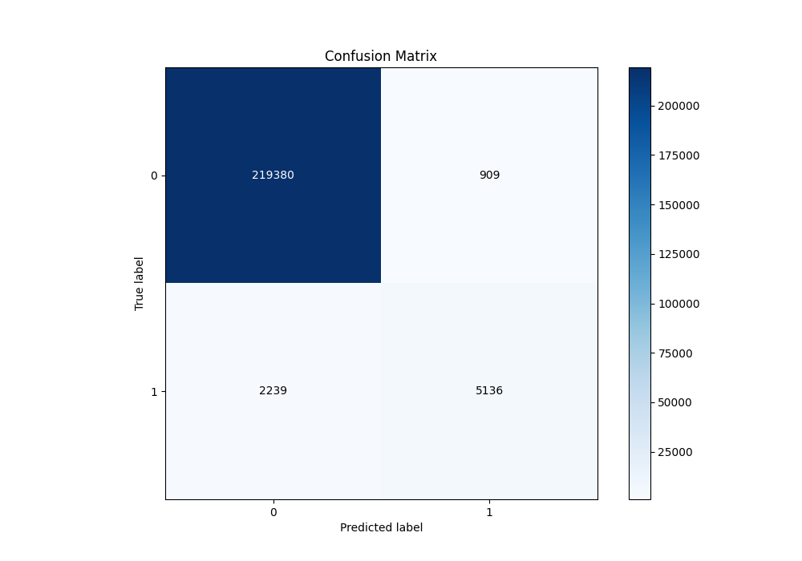
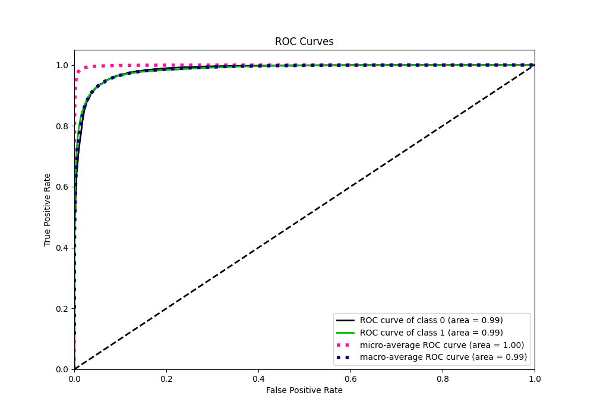
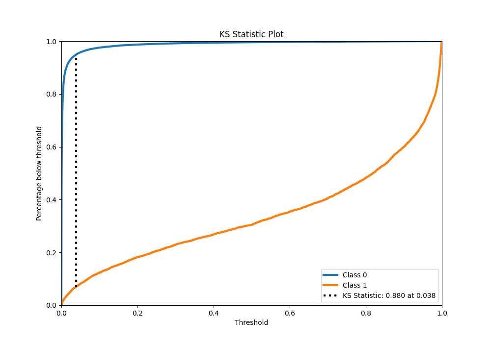
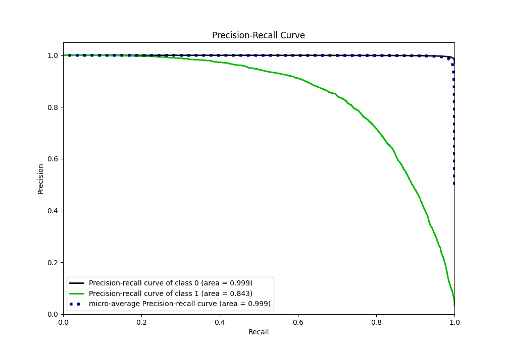
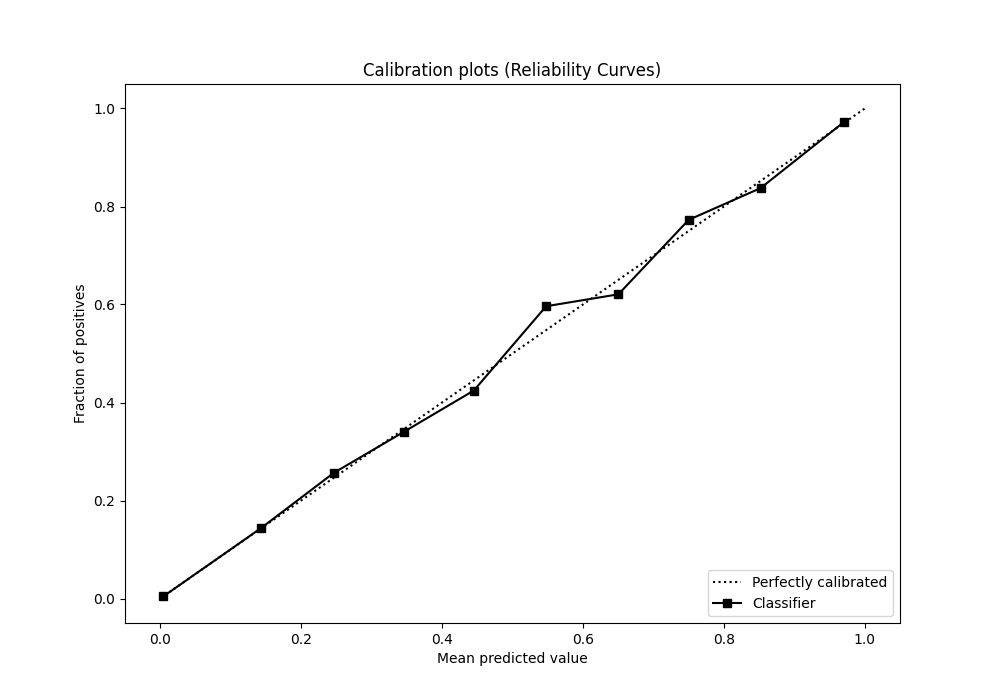
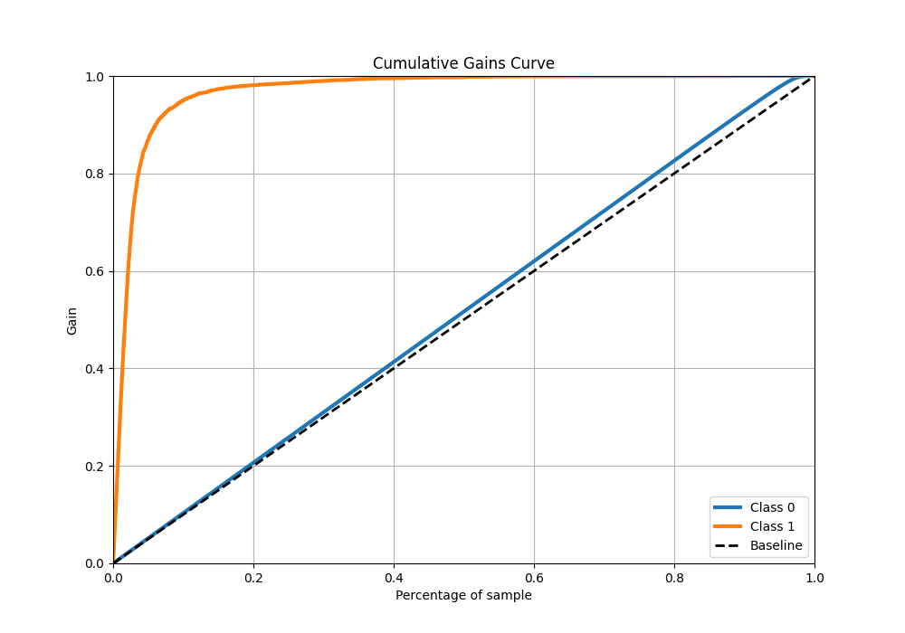
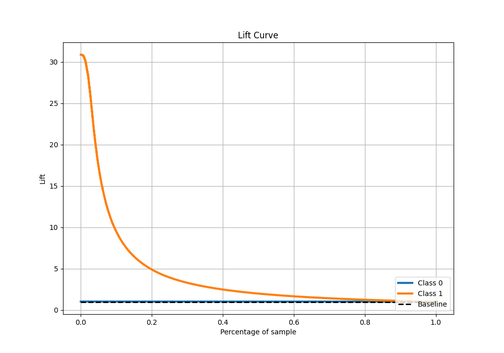

# Summary of 39_CatBoost

[<< Go back](../README.md)

## CatBoost
- **n_jobs**: -1
- **learning_rate**: 0.1
- **depth**: 7
- **rsm**: 1
- **loss_function**: Logloss
- **eval_metric**: F1
- **explain_level**: 0

## Validation
 - **validation_type**: kfold
 - **shuffle**: True
 - **stratify**: True
 - **k_folds**: 10

## Optimized metric
f1

## Training time

116.6 seconds

## Metric details
|           |     score |     threshold |
|:----------|----------:|--------------:|
| logloss   | 0.0410716 | nan           |
| auc       | 0.985052  | nan           |
| f1        | 0.769862  |   0.419142    |
| accuracy  | 0.986173  |   0.496818    |
| precision | 0.849628  |   0.496818    |
| recall    | 1         |   1.74965e-06 |
| mcc       | 0.764241  |   0.419142    |

## Metric details with threshold from accuracy metric
|           |     score |   threshold |
|:----------|----------:|------------:|
| logloss   | 0.0410716 |  nan        |
| auc       | 0.985052  |  nan        |
| f1        | 0.765425  |    0.496818 |
| accuracy  | 0.986173  |    0.496818 |
| precision | 0.849628  |    0.496818 |
| recall    | 0.696407  |    0.496818 |
| mcc       | 0.762356  |    0.496818 |

## Confusion matrix (at threshold=0.496818)
|              |   Predicted as 0 |   Predicted as 1 |
|:-------------|-----------------:|-----------------:|
| Labeled as 0 |           219380 |              909 |
| Labeled as 1 |             2239 |             5136 |

## Learning curves

## Confusion Matrix

## Normalized Confusion Matrix

## ROC Curve

## Kolmogorov-Smirnov Statistic

## Precision-Recall Curve

## Calibration Curve

## Cumulative Gains Curve

## Lift Curve

[<< Go back](../README.md)
