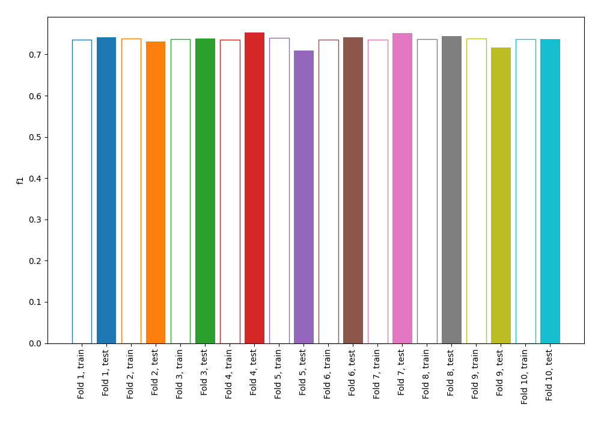
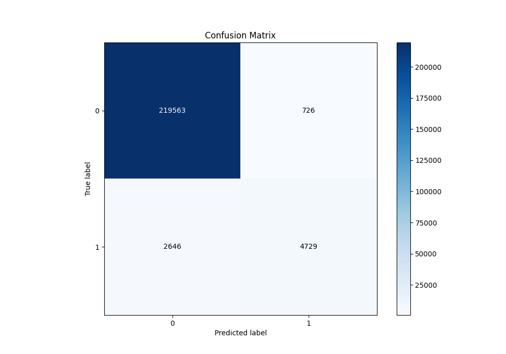
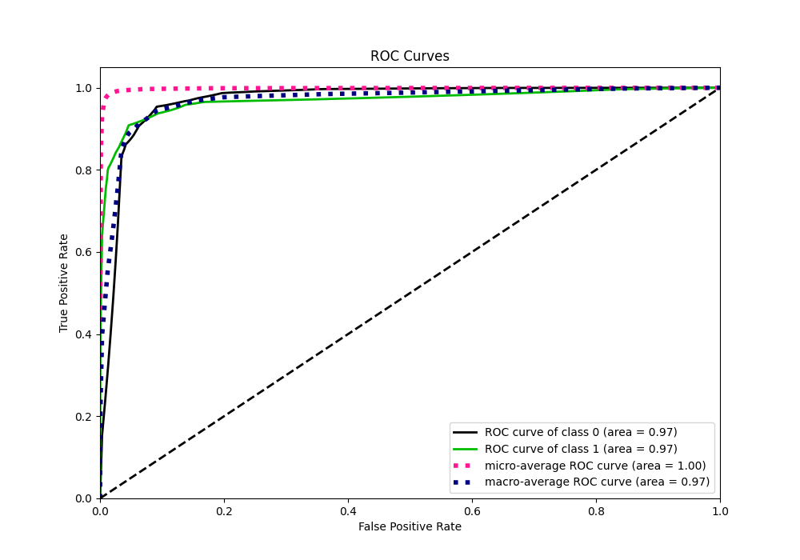
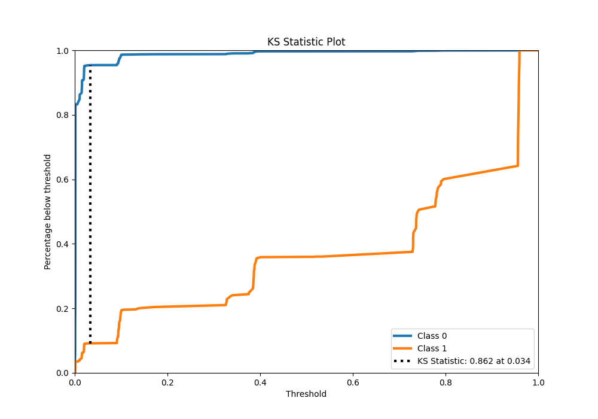
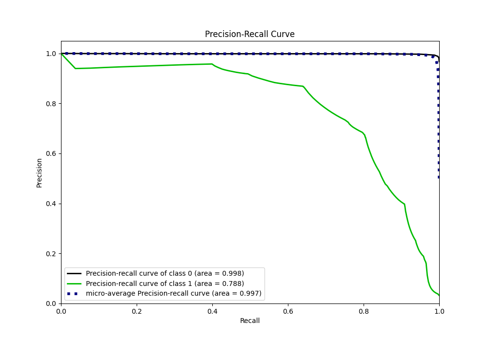
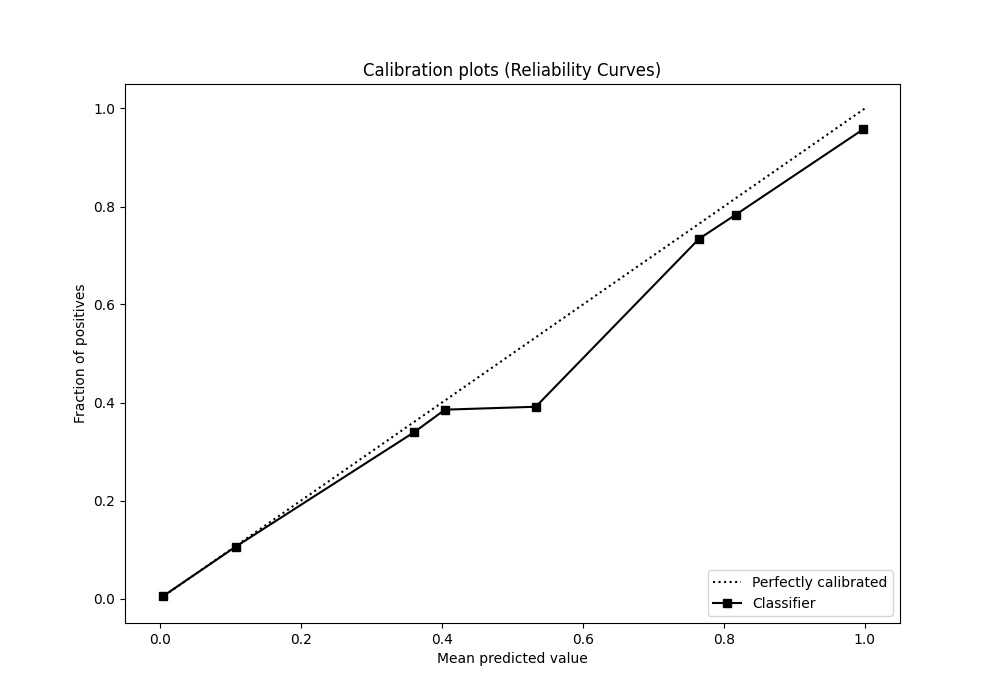
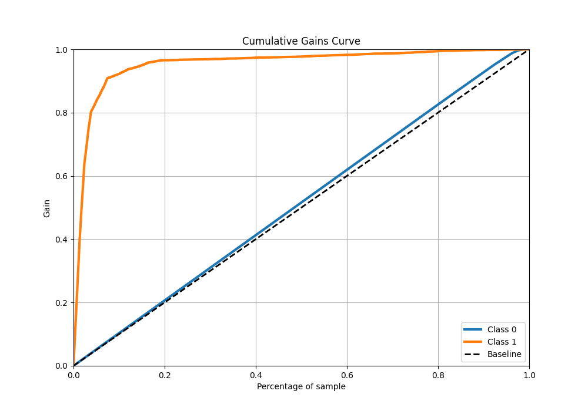
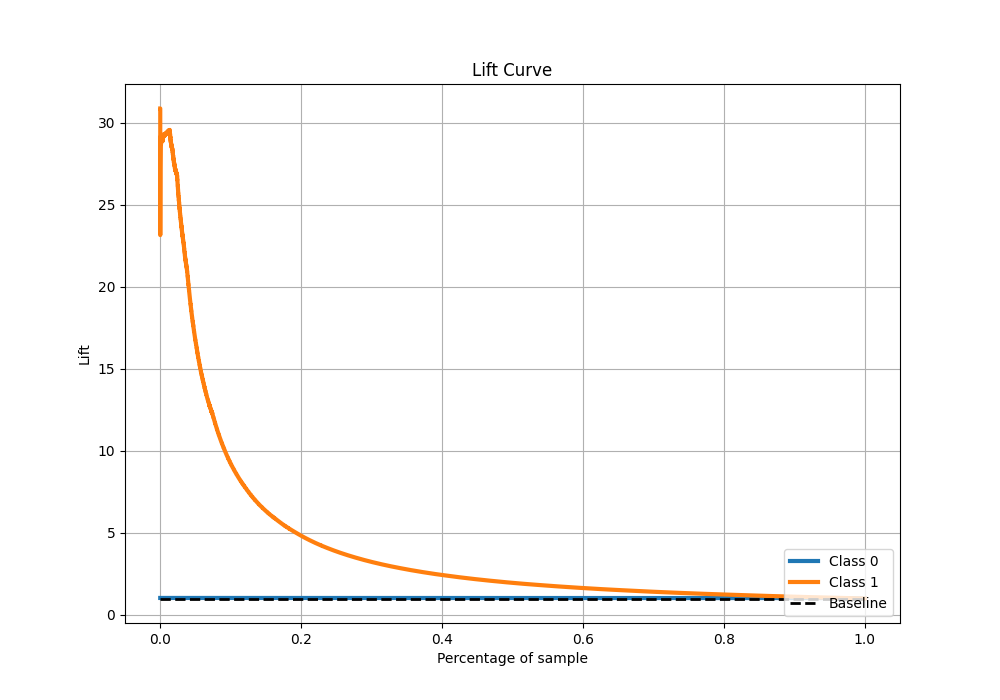

# Summary of 3_DecisionTree

[<< Go back](../README.md)

## Decision Tree
- **n_jobs**: -1
- **criterion**: gini
- **max_depth**: 4
- **explain_level**: 0

## Validation
 - **validation_type**: kfold
 - **shuffle**: True
 - **stratify**: True
 - **k_folds**: 10

## Optimized metric
f1

## Training time

33.1 seconds

## Metric details
|           |     score |     threshold |
|:----------|----------:|--------------:|
| logloss   | 0.0469401 | nan           |
| auc       | 0.96922   | nan           |
| f1        | 0.741575  |   0.369219    |
| accuracy  | 0.985189  |   0.411067    |
| precision | 0.866911  |   0.411067    |
| recall    | 1         |   0.000823384 |
| mcc       | 0.738531  |   0.411067    |

## Metric details with threshold from accuracy metric
|           |     score |   threshold |
|:----------|----------:|------------:|
| logloss   | 0.0469401 |  nan        |
| auc       | 0.96922   |  nan        |
| f1        | 0.737178  |    0.411067 |
| accuracy  | 0.985189  |    0.411067 |
| precision | 0.866911  |    0.411067 |
| recall    | 0.64122   |    0.411067 |
| mcc       | 0.738531  |    0.411067 |

## Confusion matrix (at threshold=0.411067)
|              |   Predicted as 0 |   Predicted as 1 |
|:-------------|-----------------:|-----------------:|
| Labeled as 0 |           219563 |              726 |
| Labeled as 1 |             2646 |             4729 |

## Learning curves

## Confusion Matrix

## Normalized Confusion Matrix

## ROC Curve

## Kolmogorov-Smirnov Statistic

## Precision-Recall Curve

## Calibration Curve

## Cumulative Gains Curve

## Lift Curve

[<< Go back](../README.md)
