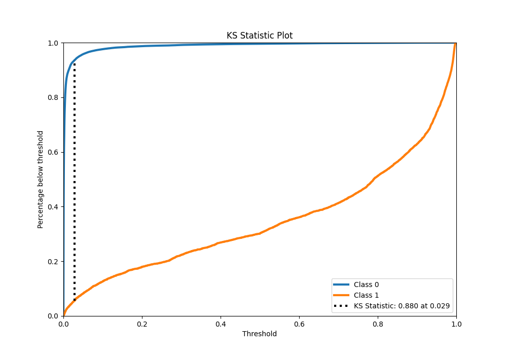

# Summary of 42_LightGBM

[<< Go back](../README.md)

## LightGBM
- **n_jobs**: -1
- **objective**: binary
- **num_leaves**: 31
- **learning_rate**: 0.05
- **feature_fraction**: 0.8
- **bagging_fraction**: 0.5
- **min_data_in_leaf**: 50
- **metric**: custom
- **custom_eval_metric_name**: f1
- **explain_level**: 0

## Validation
 - **validation_type**: kfold
 - **shuffle**: True
 - **stratify**: True
 - **k_folds**: 10

## Optimized metric
f1

## Training time

249.4 seconds

## Metric details
|           |     score |     threshold |
|:----------|----------:|--------------:|
| logloss   | 0.0413233 | nan           |
| auc       | 0.984865  | nan           |
| f1        | 0.768498  |   0.395766    |
| accuracy  | 0.986072  |   0.473995    |
| precision | 0.83816   |   0.473995    |
| recall    | 1         |   2.05521e-05 |
| mcc       | 0.762509  |   0.473995    |

## Metric details with threshold from accuracy metric
|           |     score |   threshold |
|:----------|----------:|------------:|
| logloss   | 0.0413233 |  nan        |
| auc       | 0.984865  |  nan        |
| f1        | 0.766684  |    0.473995 |
| accuracy  | 0.986072  |    0.473995 |
| precision | 0.83816   |    0.473995 |
| recall    | 0.706441  |    0.473995 |
| mcc       | 0.762509  |    0.473995 |

## Confusion matrix (at threshold=0.473995)
|              |   Predicted as 0 |   Predicted as 1 |
|:-------------|-----------------:|-----------------:|
| Labeled as 0 |           219283 |             1006 |
| Labeled as 1 |             2165 |             5210 |

## Learning curves

## Confusion Matrix

## Normalized Confusion Matrix

## ROC Curve

## Kolmogorov-Smirnov Statistic

## Precision-Recall Curve

## Calibration Curve

## Cumulative Gains Curve

## Lift Curve

[<< Go back](../README.md)
