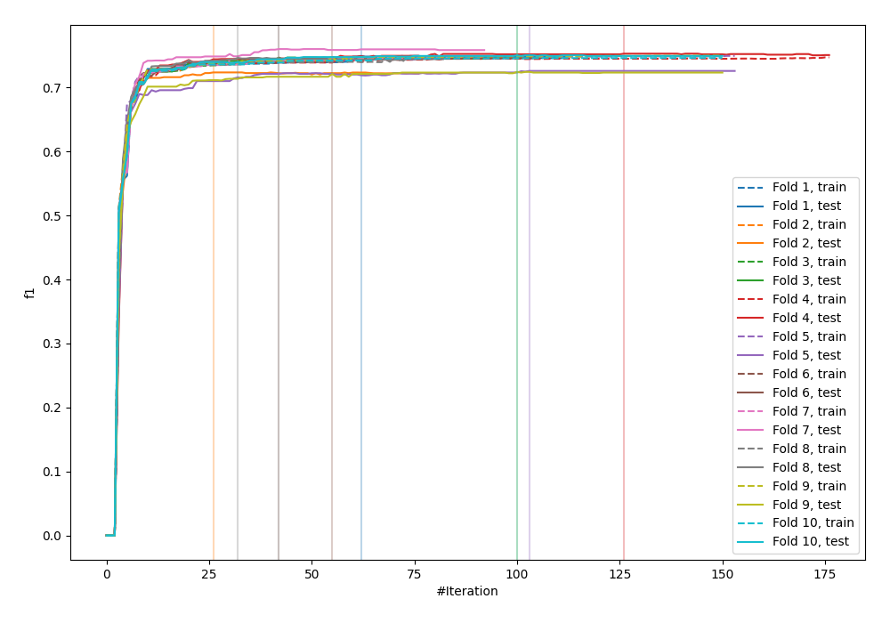
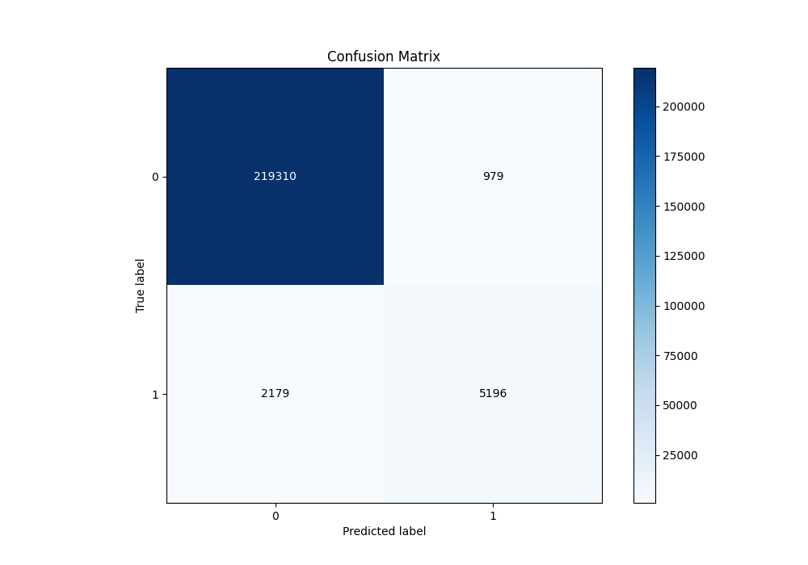
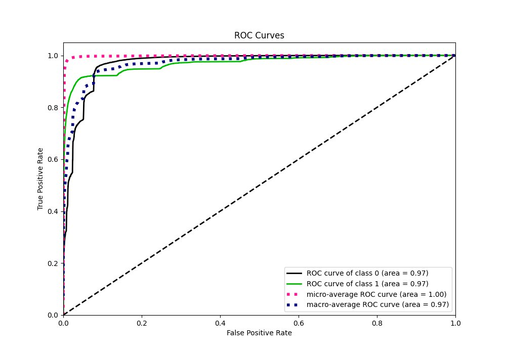
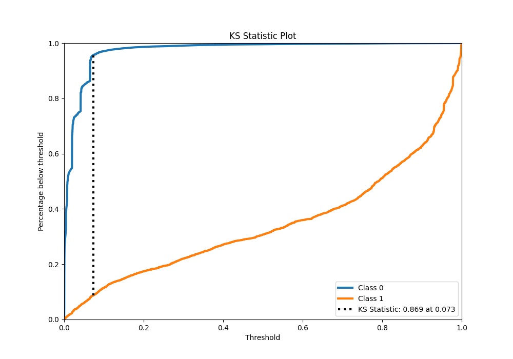
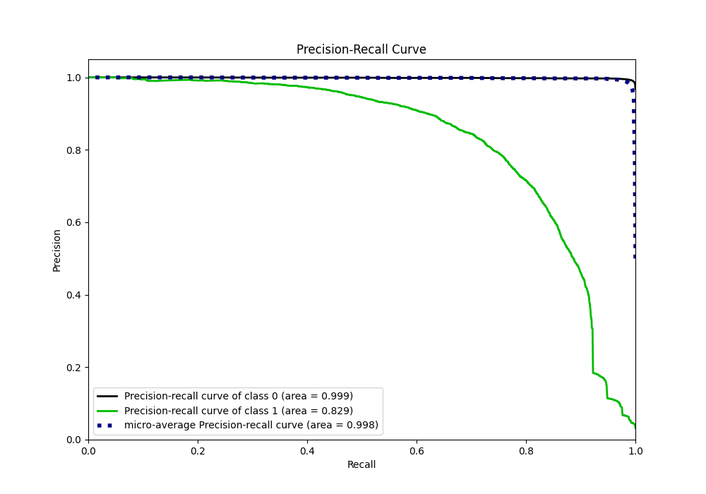
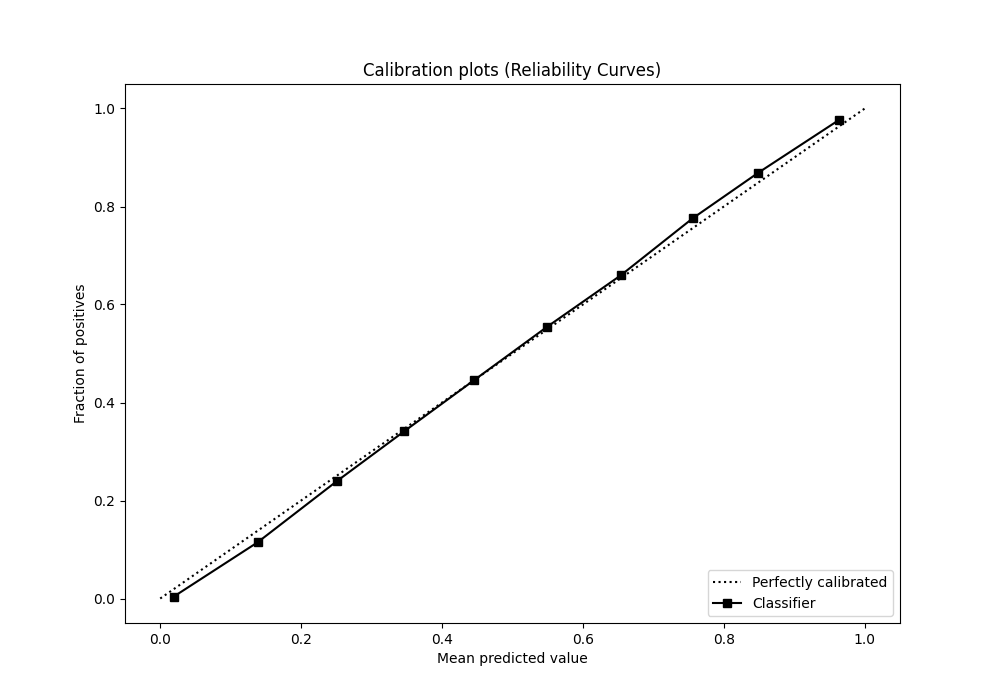
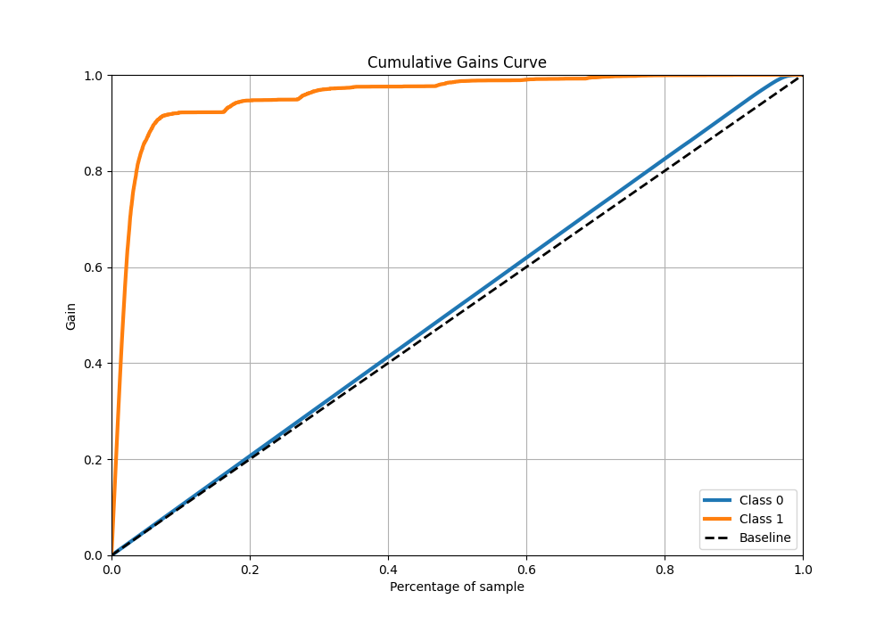
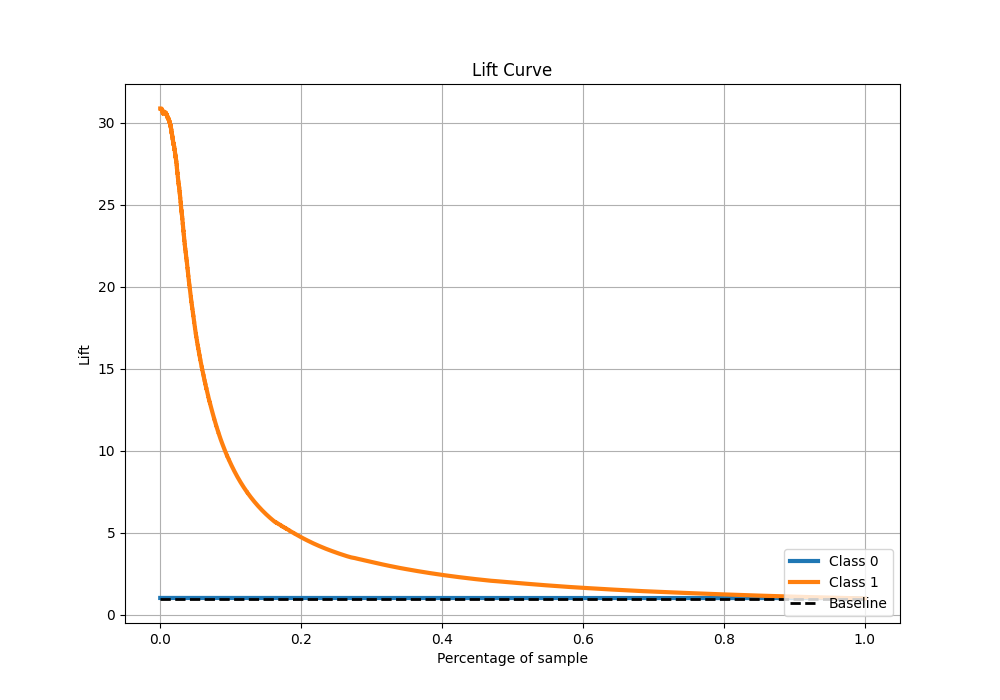

# Summary of 5_Default_Xgboost_categorical_mix

[<< Go back](../README.md)

## Extreme Gradient Boosting (Xgboost)
- **n_jobs**: -1
- **objective**: binary:logistic
- **eta**: 0.075
- **max_depth**: 6
- **min_child_weight**: 1
- **subsample**: 1.0
- **colsample_bytree**: 1.0
- **eval_metric**: f1
- **explain_level**: 0

## Validation
 - **validation_type**: kfold
 - **shuffle**: True
 - **stratify**: True
 - **k_folds**: 10

## Optimized metric
f1

## Training time

186.0 seconds

## Metric details
|           |     score |     threshold |
|:----------|----------:|--------------:|
| logloss   | 0.0542334 | nan           |
| auc       | 0.970526  | nan           |
| f1        | 0.769264  |   0.390931    |
| accuracy  | 0.986129  |   0.475301    |
| precision | 0.841457  |   0.475301    |
| recall    | 1         |   6.08506e-05 |
| mcc       | 0.76303   |   0.475301    |

## Metric details with threshold from accuracy metric
|           |     score |   threshold |
|:----------|----------:|------------:|
| logloss   | 0.0542334 |  nan        |
| auc       | 0.970526  |  nan        |
| f1        | 0.766937  |    0.475301 |
| accuracy  | 0.986129  |    0.475301 |
| precision | 0.841457  |    0.475301 |
| recall    | 0.704542  |    0.475301 |
| mcc       | 0.76303   |    0.475301 |

## Confusion matrix (at threshold=0.475301)
|              |   Predicted as 0 |   Predicted as 1 |
|:-------------|-----------------:|-----------------:|
| Labeled as 0 |           219310 |              979 |
| Labeled as 1 |             2179 |             5196 |

## Learning curves

## Confusion Matrix

## Normalized Confusion Matrix

## ROC Curve

## Kolmogorov-Smirnov Statistic

## Precision-Recall Curve

## Calibration Curve

## Cumulative Gains Curve

## Lift Curve

[<< Go back](../README.md)
