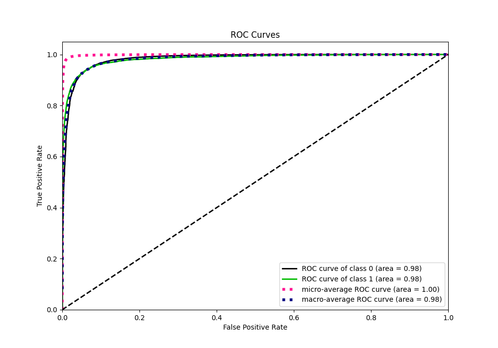

# Summary of 6_Default_CatBoost_KMeansFeatures

[<< Go back](../README.md)

## CatBoost
- **n_jobs**: -1
- **learning_rate**: 0.1
- **depth**: 6
- **rsm**: 1
- **loss_function**: Logloss
- **eval_metric**: F1
- **explain_level**: 0

## Validation
 - **validation_type**: kfold
 - **shuffle**: True
 - **stratify**: True
 - **k_folds**: 10

## Optimized metric
f1

## Training time

106.8 seconds

## Metric details
|           |     score |     threshold |
|:----------|----------:|--------------:|
| logloss   | 0.0423519 | nan           |
| auc       | 0.983221  | nan           |
| f1        | 0.768407  |   0.399179    |
| accuracy  | 0.98594   |   0.443981    |
| precision | 0.828558  |   0.443981    |
| recall    | 1         |   4.03584e-06 |
| mcc       | 0.762235  |   0.399179    |

## Metric details with threshold from accuracy metric
|           |     score |   threshold |
|:----------|----------:|------------:|
| logloss   | 0.0423519 |  nan        |
| auc       | 0.983221  |  nan        |
| f1        | 0.76681   |    0.443981 |
| accuracy  | 0.98594   |    0.443981 |
| precision | 0.828558  |    0.443981 |
| recall    | 0.713627  |    0.443981 |
| mcc       | 0.761855  |    0.443981 |

## Confusion matrix (at threshold=0.443981)
|              |   Predicted as 0 |   Predicted as 1 |
|:-------------|-----------------:|-----------------:|
| Labeled as 0 |           219200 |             1089 |
| Labeled as 1 |             2112 |             5263 |

## Learning curves

## Confusion Matrix

## Normalized Confusion Matrix

## ROC Curve

## Kolmogorov-Smirnov Statistic

## Precision-Recall Curve

## Calibration Curve

## Cumulative Gains Curve

## Lift Curve

[<< Go back](../README.md)
