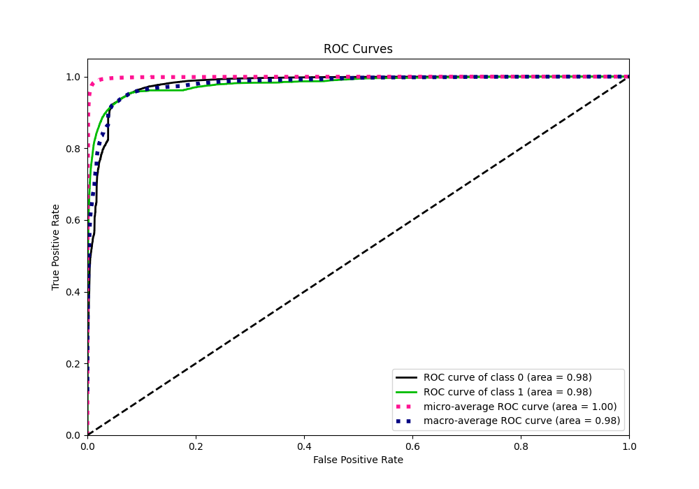

# Summary of 8_Xgboost

[<< Go back](../README.md)

## Extreme Gradient Boosting (Xgboost)
- **n_jobs**: -1
- **objective**: binary:logistic
- **eta**: 0.075
- **max_depth**: 8
- **min_child_weight**: 5
- **subsample**: 1.0
- **colsample_bytree**: 1.0
- **eval_metric**: f1
- **explain_level**: 0

## Validation
 - **validation_type**: kfold
 - **shuffle**: True
 - **stratify**: True
 - **k_folds**: 10

## Optimized metric
f1

## Training time

233.2 seconds

## Metric details
|           |     score |     threshold |
|:----------|----------:|--------------:|
| logloss   | 0.0435298 | nan           |
| auc       | 0.980026  | nan           |
| f1        | 0.768153  |   0.410594    |
| accuracy  | 0.985957  |   0.456399    |
| precision | 0.828356  |   0.456399    |
| recall    | 1         |   1.97455e-05 |
| mcc       | 0.762278  |   0.456399    |

## Metric details with threshold from accuracy metric
|           |     score |   threshold |
|:----------|----------:|------------:|
| logloss   | 0.0435298 |  nan        |
| auc       | 0.980026  |  nan        |
| f1        | 0.767271  |    0.456399 |
| accuracy  | 0.985957  |    0.456399 |
| precision | 0.828356  |    0.456399 |
| recall    | 0.714576  |    0.456399 |
| mcc       | 0.762278  |    0.456399 |

## Confusion matrix (at threshold=0.456399)
|              |   Predicted as 0 |   Predicted as 1 |
|:-------------|-----------------:|-----------------:|
| Labeled as 0 |           219197 |             1092 |
| Labeled as 1 |             2105 |             5270 |

## Learning curves

## Confusion Matrix

## Normalized Confusion Matrix

## ROC Curve

## Kolmogorov-Smirnov Statistic

## Precision-Recall Curve

## Calibration Curve

## Cumulative Gains Curve

## Lift Curve

[<< Go back](../README.md)
