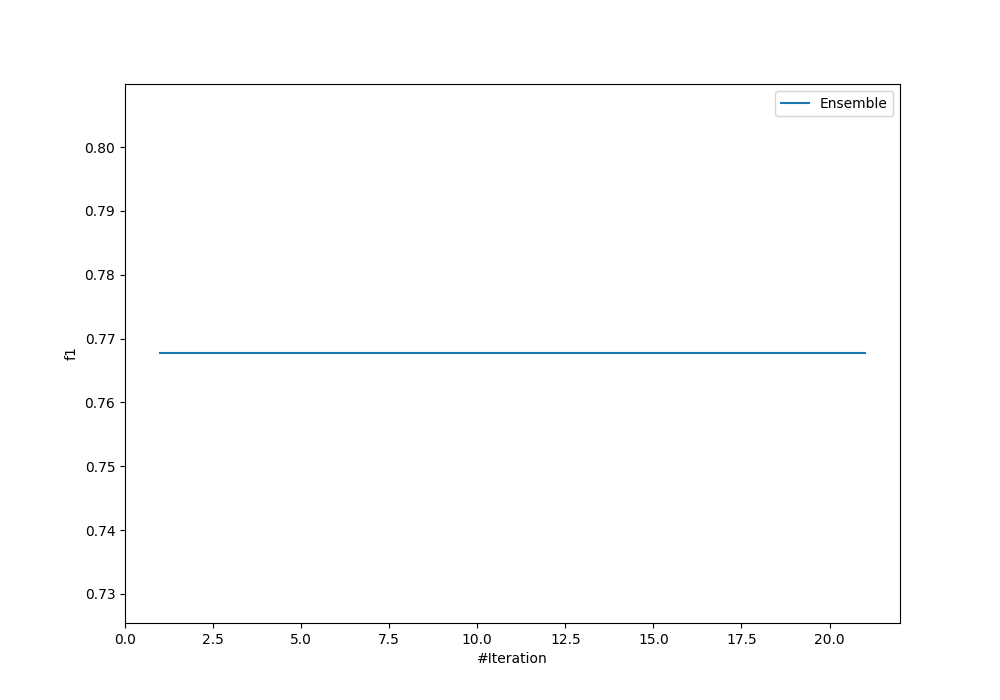
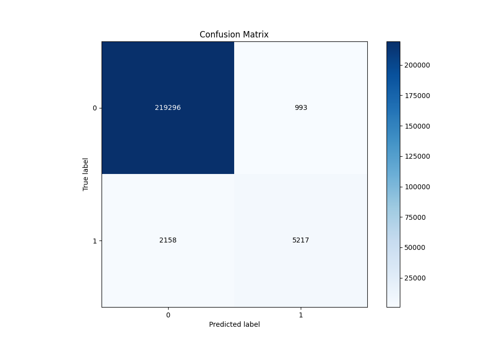
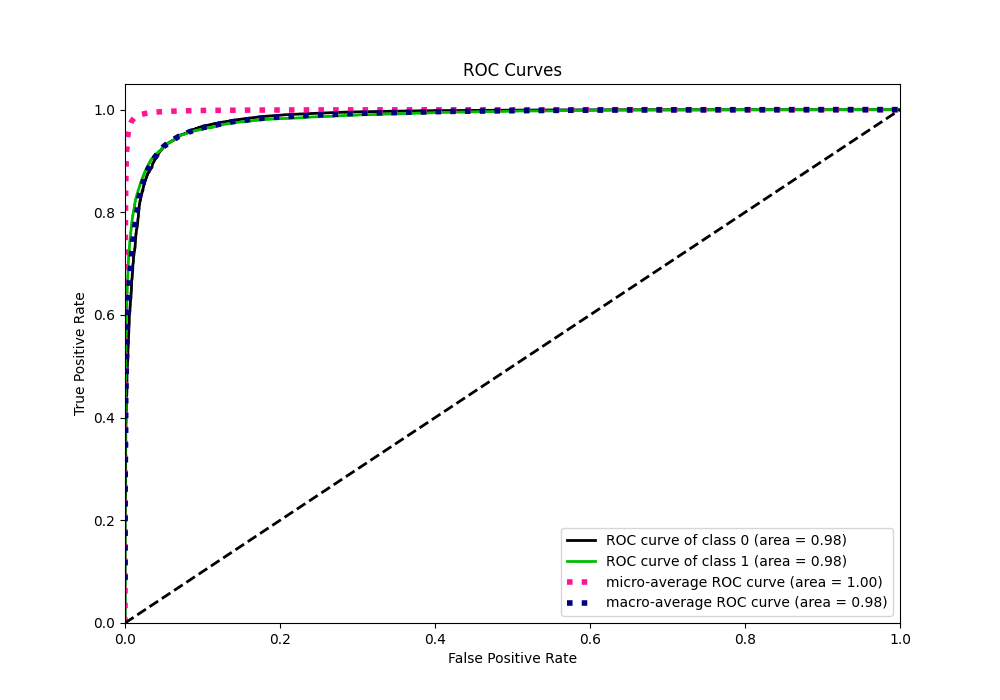
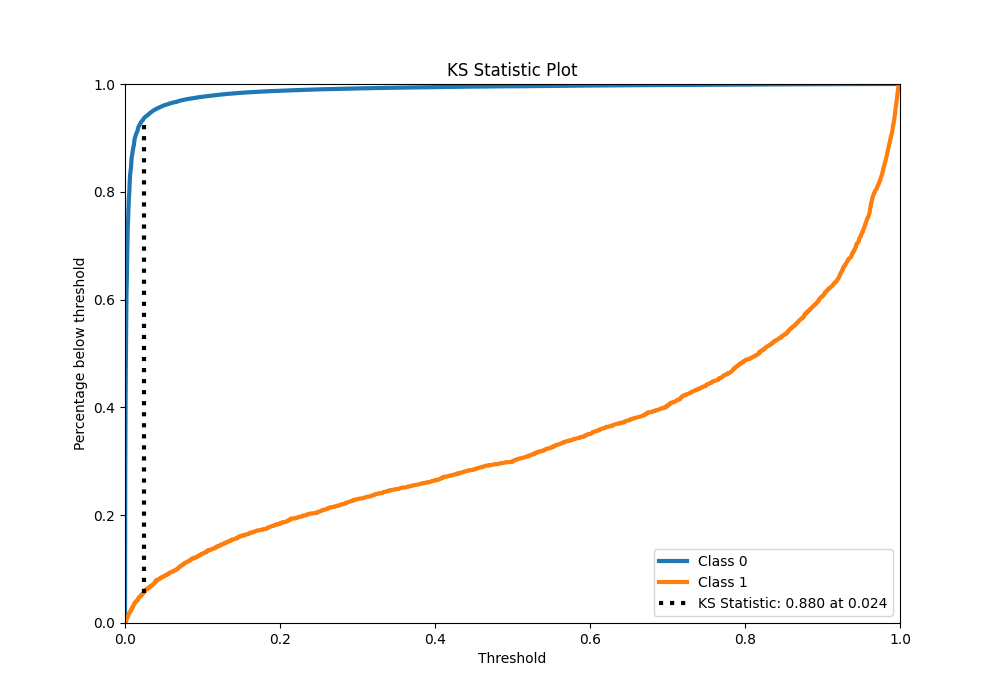
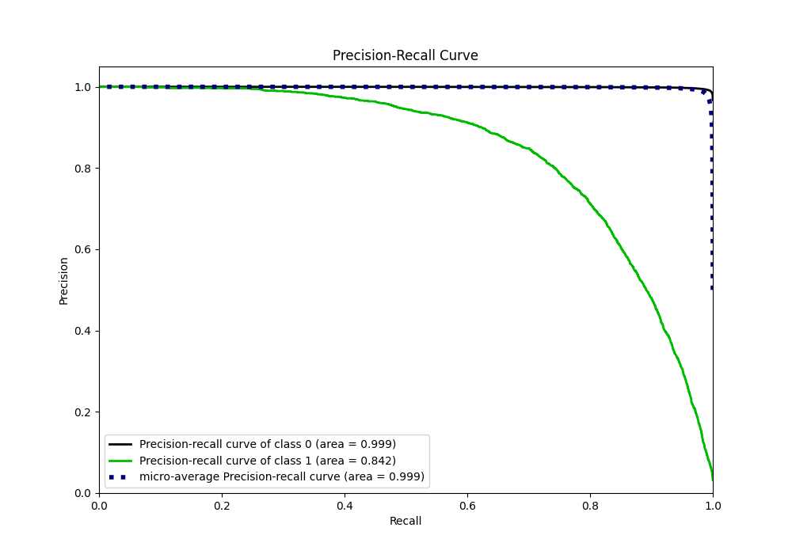
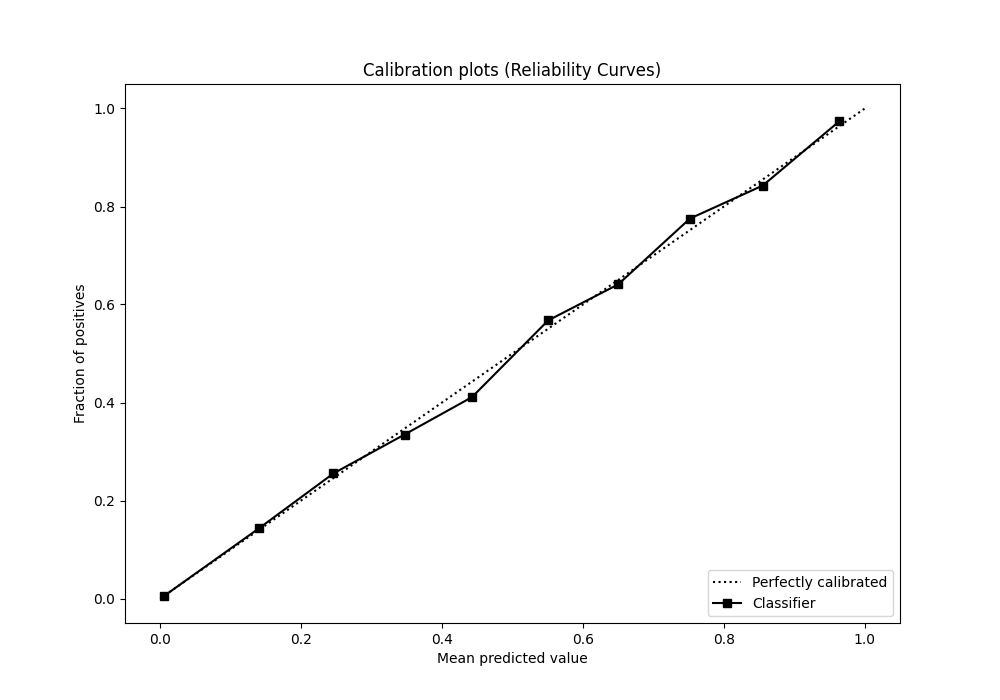
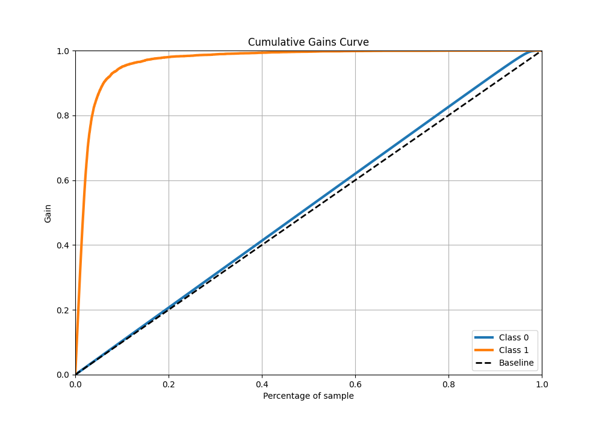
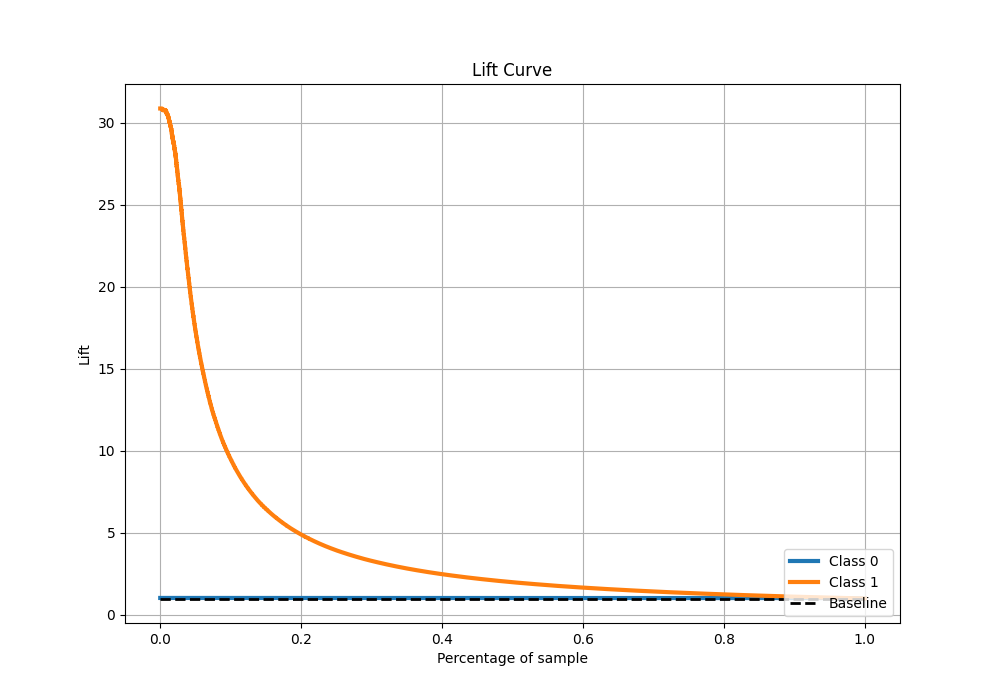

# Summary of Ensemble

[<< Go back](../README.md)

## Ensemble structure
| Model                      |   Weight |
|:---------------------------|---------:|
| 36_CatBoost_GoldenFeatures |        1 |

## Metric details
|           |     score |     threshold |
|:----------|----------:|--------------:|
| logloss   | 0.0415916 | nan           |
| auc       | 0.983982  | nan           |
| f1        | 0.769077  |   0.409204    |
| accuracy  | 0.986159  |   0.47189     |
| precision | 0.840097  |   0.47189     |
| recall    | 1         |   6.42797e-06 |
| mcc       | 0.763963  |   0.47189     |

## Metric details with threshold from accuracy metric
|           |     score |   threshold |
|:----------|----------:|------------:|
| logloss   | 0.0415916 |   nan       |
| auc       | 0.983982  |   nan       |
| f1        | 0.768053  |     0.47189 |
| accuracy  | 0.986159  |     0.47189 |
| precision | 0.840097  |     0.47189 |
| recall    | 0.70739   |     0.47189 |
| mcc       | 0.763963  |     0.47189 |

## Confusion matrix (at threshold=0.47189)
|              |   Predicted as 0 |   Predicted as 1 |
|:-------------|-----------------:|-----------------:|
| Labeled as 0 |           219296 |              993 |
| Labeled as 1 |             2158 |             5217 |

## Learning curves

## Confusion Matrix

## Normalized Confusion Matrix

## ROC Curve

## Kolmogorov-Smirnov Statistic

## Precision-Recall Curve

## Calibration Curve

## Cumulative Gains Curve

## Lift Curve

[<< Go back](../README.md)
