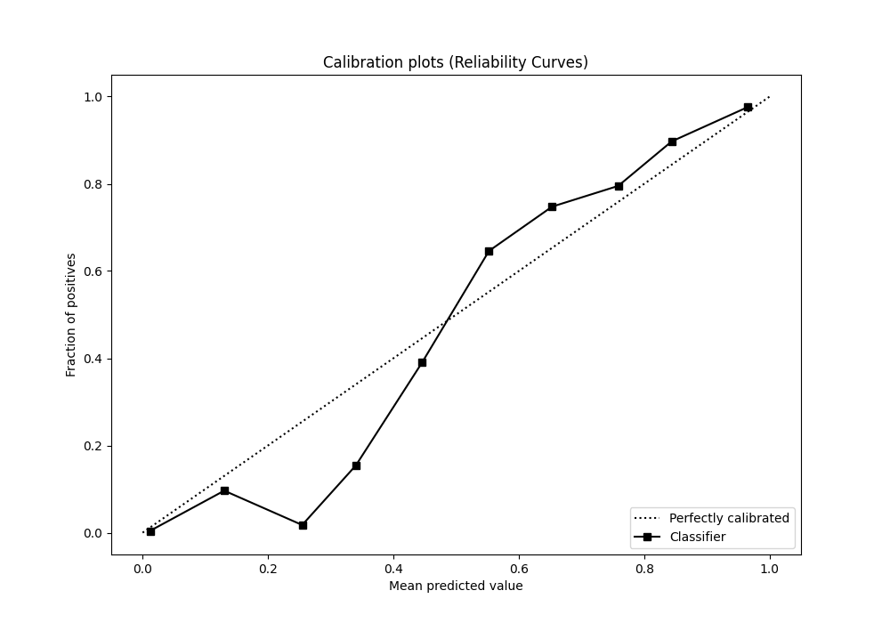

# Summary of Ensemble_Stacked

[<< Go back](../README.md)

## Ensemble structure
| Model                              |   Weight |
|:-----------------------------------|---------:|
| 36_CatBoost_GoldenFeatures_Stacked |       23 |
| 38_CatBoost                        |        1 |

## Metric details
|           |     score |     threshold |
|:----------|----------:|--------------:|
| logloss   | 0.0751947 | nan           |
| auc       | 0.962094  | nan           |
| f1        | 0.768558  |   0.397922    |
| accuracy  | 0.986155  |   0.485092    |
| precision | 0.840729  |   0.485092    |
| recall    | 1         |   1.46915e-05 |
| mcc       | 0.763738  |   0.485092    |

## Metric details with threshold from accuracy metric
|           |     score |   threshold |
|:----------|----------:|------------:|
| logloss   | 0.0751947 |  nan        |
| auc       | 0.962094  |  nan        |
| f1        | 0.767757  |    0.485092 |
| accuracy  | 0.986155  |    0.485092 |
| precision | 0.840729  |    0.485092 |
| recall    | 0.706441  |    0.485092 |
| mcc       | 0.763738  |    0.485092 |

## Confusion matrix (at threshold=0.485092)
|              |   Predicted as 0 |   Predicted as 1 |
|:-------------|-----------------:|-----------------:|
| Labeled as 0 |           219302 |              987 |
| Labeled as 1 |             2165 |             5210 |

## Learning curves

## Confusion Matrix

## Normalized Confusion Matrix

## ROC Curve

## Kolmogorov-Smirnov Statistic

## Precision-Recall Curve

## Calibration Curve

## Cumulative Gains Curve

## Lift Curve

[<< Go back](../README.md)
