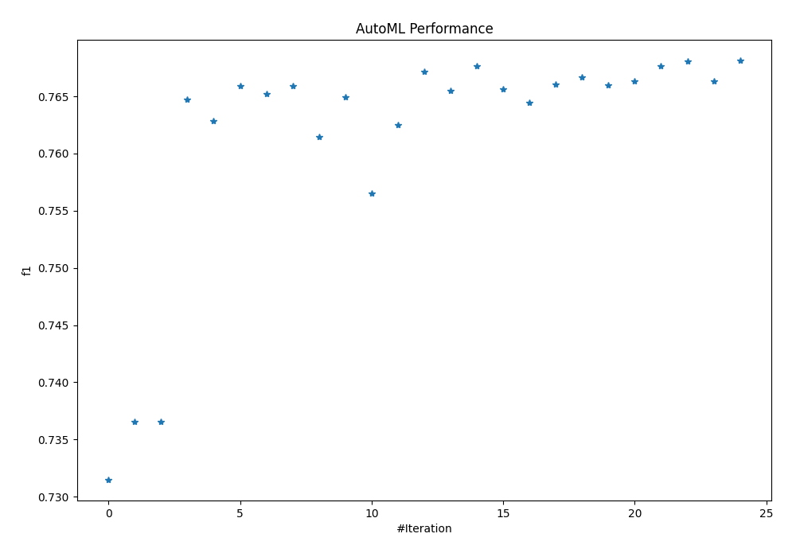
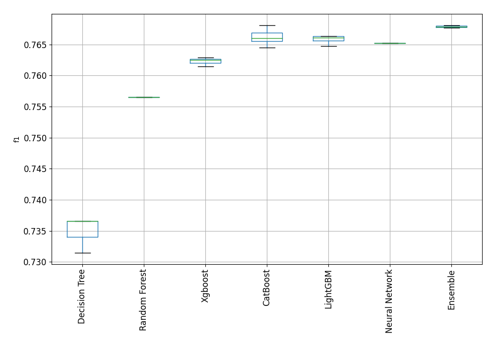
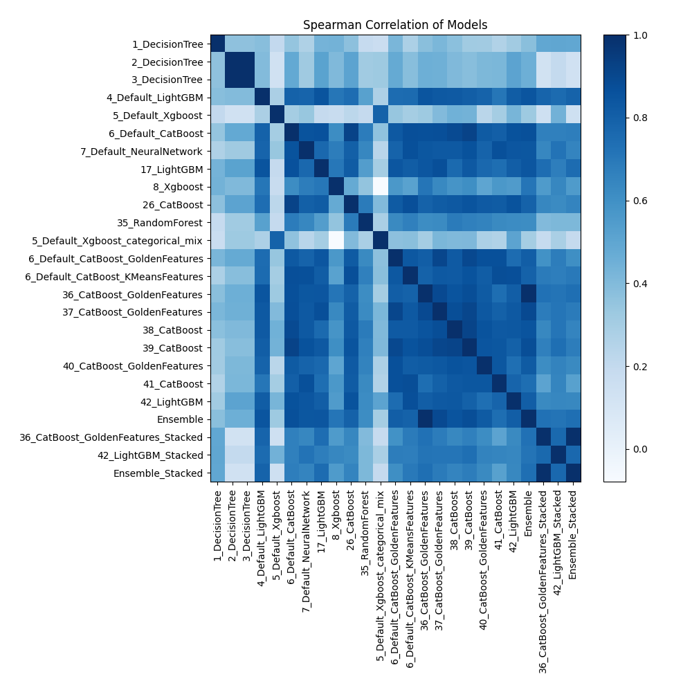

# AutoML Leaderboard

| Best model   | name                                                                               | model_type     | metric_type   |   metric_value |   train_time |
|:-------------|:-----------------------------------------------------------------------------------|:---------------|:--------------|---------------:|-------------:|
|              | [1_DecisionTree](1_DecisionTree/README.md)                                         | Decision Tree  | f1            |       0.731489 |        34.76 |
|              | [2_DecisionTree](2_DecisionTree/README.md)                                         | Decision Tree  | f1            |       0.736563 |        34.08 |
|              | [3_DecisionTree](3_DecisionTree/README.md)                                         | Decision Tree  | f1            |       0.736563 |        34.42 |
|              | [4_Default_LightGBM](4_Default_LightGBM/README.md)                                 | LightGBM       | f1            |       0.764758 |       237.44 |
|              | [5_Default_Xgboost](5_Default_Xgboost/README.md)                                   | Xgboost        | f1            |       0.762871 |       184.26 |
|              | [6_Default_CatBoost](6_Default_CatBoost/README.md)                                 | CatBoost       | f1            |       0.765942 |       114.2  |
|              | [7_Default_NeuralNetwork](7_Default_NeuralNetwork/README.md)                       | Neural Network | f1            |       0.765239 |       428.69 |
|              | [17_LightGBM](17_LightGBM/README.md)                                               | LightGBM       | f1            |       0.765913 |       258.27 |
|              | [8_Xgboost](8_Xgboost/README.md)                                                   | Xgboost        | f1            |       0.761445 |       234.58 |
|              | [26_CatBoost](26_CatBoost/README.md)                                               | CatBoost       | f1            |       0.764971 |       136.01 |
|              | [35_RandomForest](35_RandomForest/README.md)                                       | Random Forest  | f1            |       0.756528 |        91.98 |
|              | [5_Default_Xgboost_categorical_mix](5_Default_Xgboost_categorical_mix/README.md)   | Xgboost        | f1            |       0.762537 |       187.41 |
|              | [6_Default_CatBoost_GoldenFeatures](6_Default_CatBoost_GoldenFeatures/README.md)   | CatBoost       | f1            |       0.767168 |       142.15 |
|              | [6_Default_CatBoost_KMeansFeatures](6_Default_CatBoost_KMeansFeatures/README.md)   | CatBoost       | f1            |       0.765495 |       108.46 |
|              | [36_CatBoost_GoldenFeatures](36_CatBoost_GoldenFeatures/README.md)                 | CatBoost       | f1            |       0.767654 |       106    |
|              | [37_CatBoost_GoldenFeatures](37_CatBoost_GoldenFeatures/README.md)                 | CatBoost       | f1            |       0.765631 |       118.08 |
|              | [38_CatBoost](38_CatBoost/README.md)                                               | CatBoost       | f1            |       0.764477 |       104.5  |
|              | [39_CatBoost](39_CatBoost/README.md)                                               | CatBoost       | f1            |       0.766075 |       118.24 |
|              | [40_CatBoost_GoldenFeatures](40_CatBoost_GoldenFeatures/README.md)                 | CatBoost       | f1            |       0.766649 |       103.45 |
|              | [41_CatBoost](41_CatBoost/README.md)                                               | CatBoost       | f1            |       0.765999 |       122.69 |
|              | [42_LightGBM](42_LightGBM/README.md)                                               | LightGBM       | f1            |       0.76635  |       250.87 |
|              | [Ensemble](Ensemble/README.md)                                                     | Ensemble       | f1            |       0.767654 |        51.6  |
|              | [36_CatBoost_GoldenFeatures_Stacked](36_CatBoost_GoldenFeatures_Stacked/README.md) | CatBoost       | f1            |       0.768069 |       104.98 |
|              | [42_LightGBM_Stacked](42_LightGBM_Stacked/README.md)                               | LightGBM       | f1            |       0.766347 |       231.49 |
| **the best** | [Ensemble_Stacked](Ensemble_Stacked/README.md)                                     | Ensemble       | f1            |       0.768113 |        60.92 |

### AutoML Performance

### AutoML Performance Boxplot

### Spearman Correlation of Models

