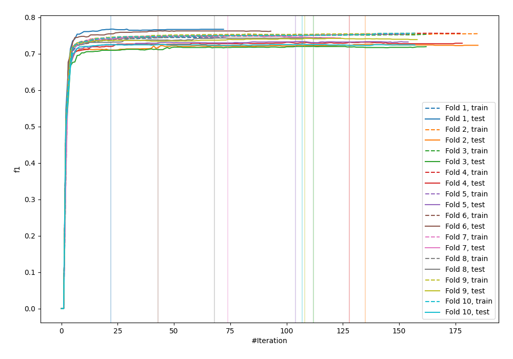
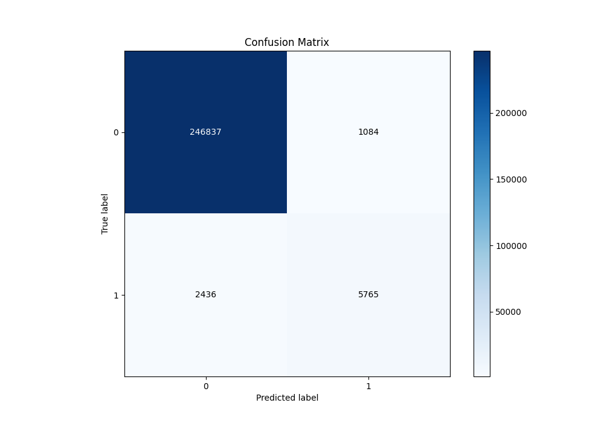
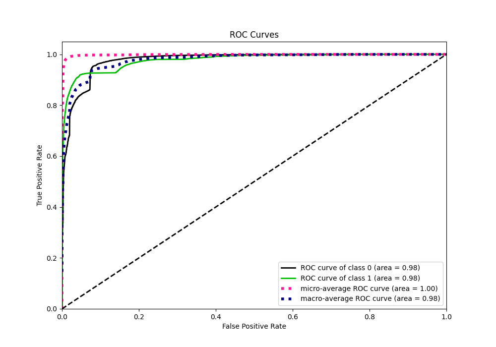
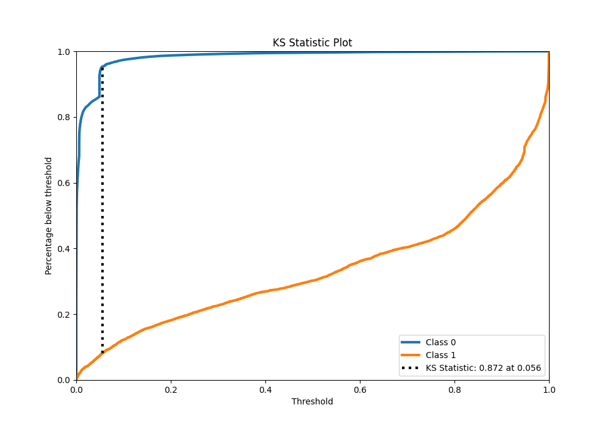
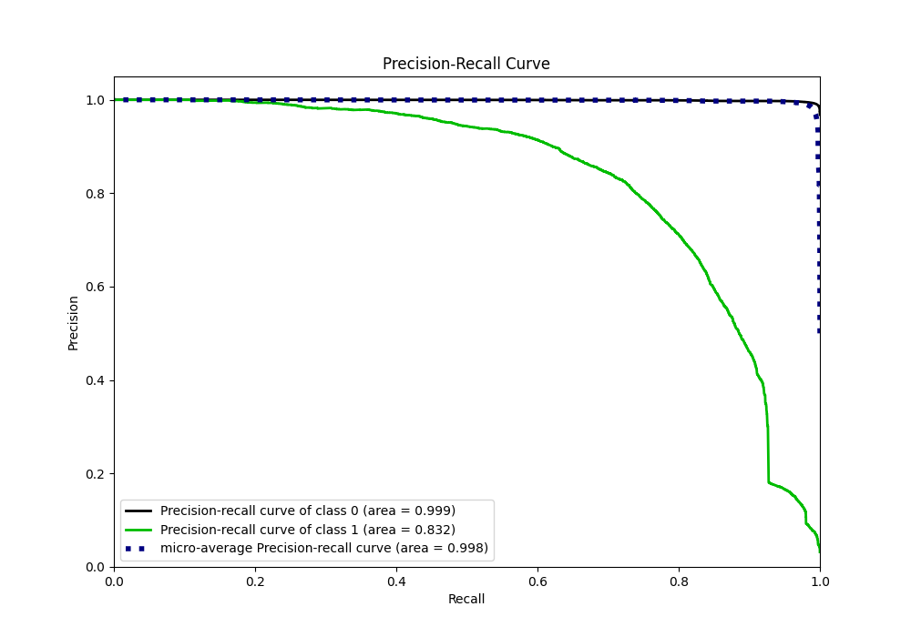
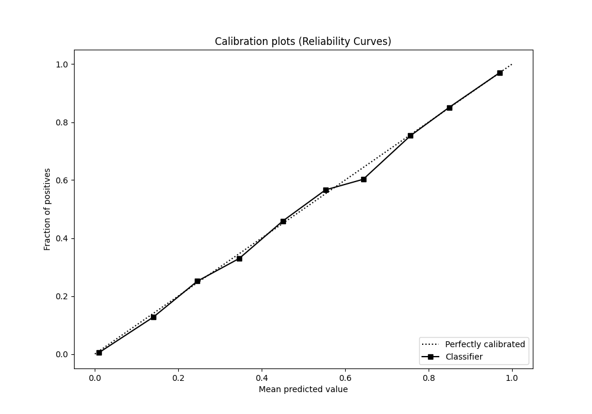
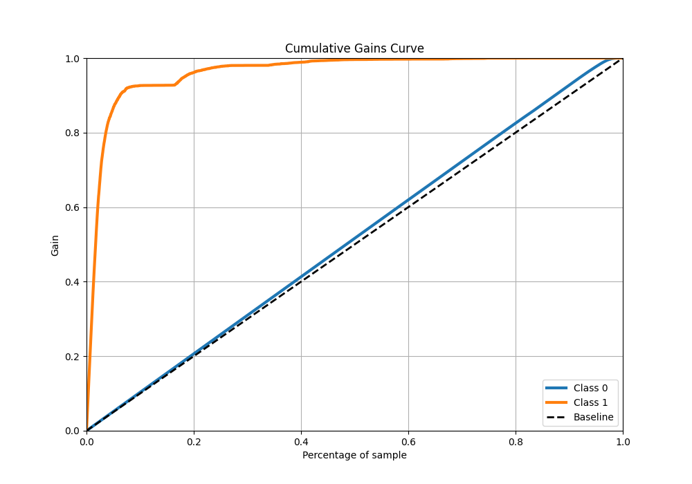
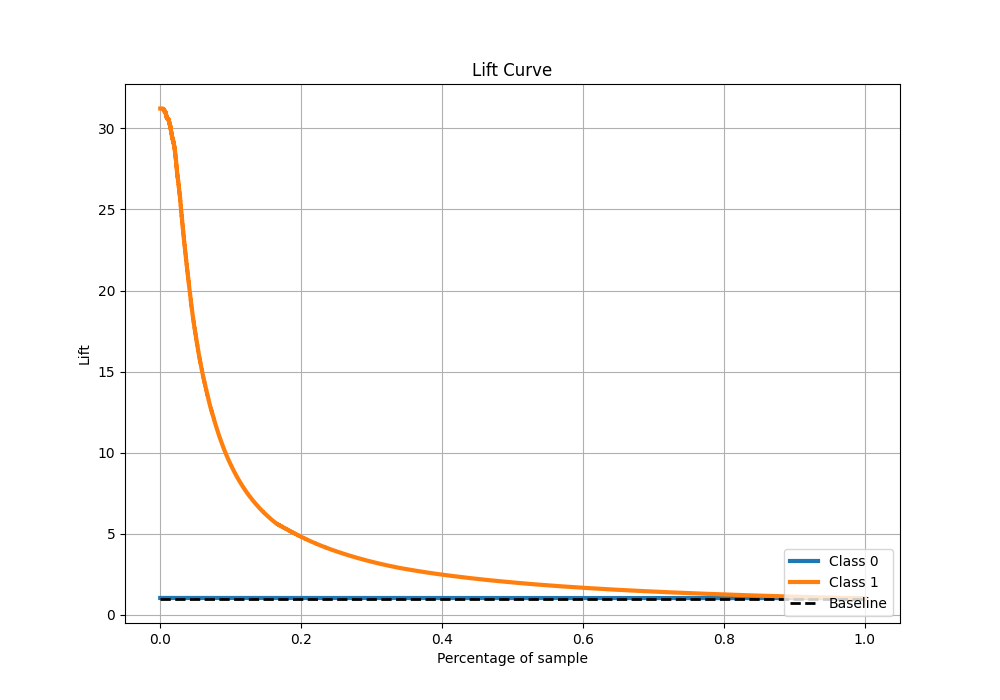

# Summary of 11_Xgboost

[<< Go back](../README.md)

## Extreme Gradient Boosting (Xgboost)
- **n_jobs**: -1
- **objective**: binary:logistic
- **eta**: 0.1
- **max_depth**: 8
- **min_child_weight**: 1
- **subsample**: 1.0
- **colsample_bytree**: 1.0
- **eval_metric**: f1
- **explain_level**: 0

## Validation
 - **validation_type**: kfold
 - **shuffle**: True
 - **stratify**: True
 - **k_folds**: 10

## Optimized metric
f1

## Training time

217.6 seconds

## Metric details
|           |     score |    threshold |
|:----------|----------:|-------------:|
| logloss   | 0.0454785 | nan          |
| auc       | 0.977923  | nan          |
| f1        | 0.766113  |   0.486563   |
| accuracy  | 0.986257  |   0.486563   |
| precision | 0.841729  |   0.486563   |
| recall    | 1         |   8.0796e-06 |
| mcc       | 0.762363  |   0.486563   |

## Metric details with threshold from accuracy metric
|           |     score |   threshold |
|:----------|----------:|------------:|
| logloss   | 0.0454785 |  nan        |
| auc       | 0.977923  |  nan        |
| f1        | 0.766113  |    0.486563 |
| accuracy  | 0.986257  |    0.486563 |
| precision | 0.841729  |    0.486563 |
| recall    | 0.702963  |    0.486563 |
| mcc       | 0.762363  |    0.486563 |

## Confusion matrix (at threshold=0.486563)
|              |   Predicted as 0 |   Predicted as 1 |
|:-------------|-----------------:|-----------------:|
| Labeled as 0 |           246837 |             1084 |
| Labeled as 1 |             2436 |             5765 |

## Learning curves

## Confusion Matrix

## Normalized Confusion Matrix

## ROC Curve

## Kolmogorov-Smirnov Statistic

## Precision-Recall Curve

## Calibration Curve

## Cumulative Gains Curve

## Lift Curve

[<< Go back](../README.md)
