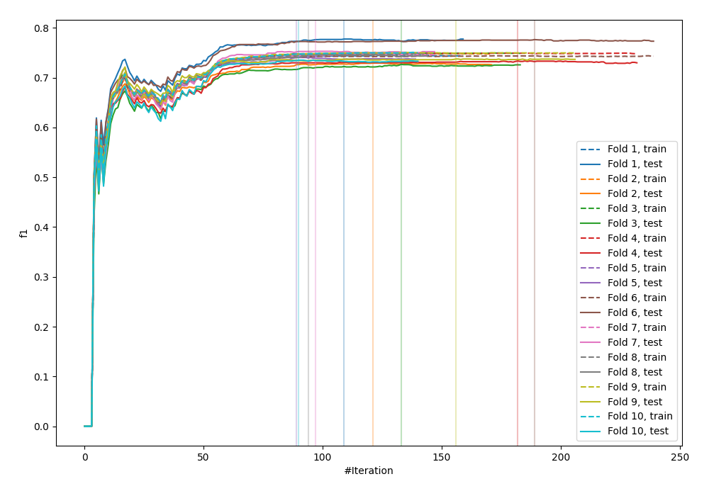
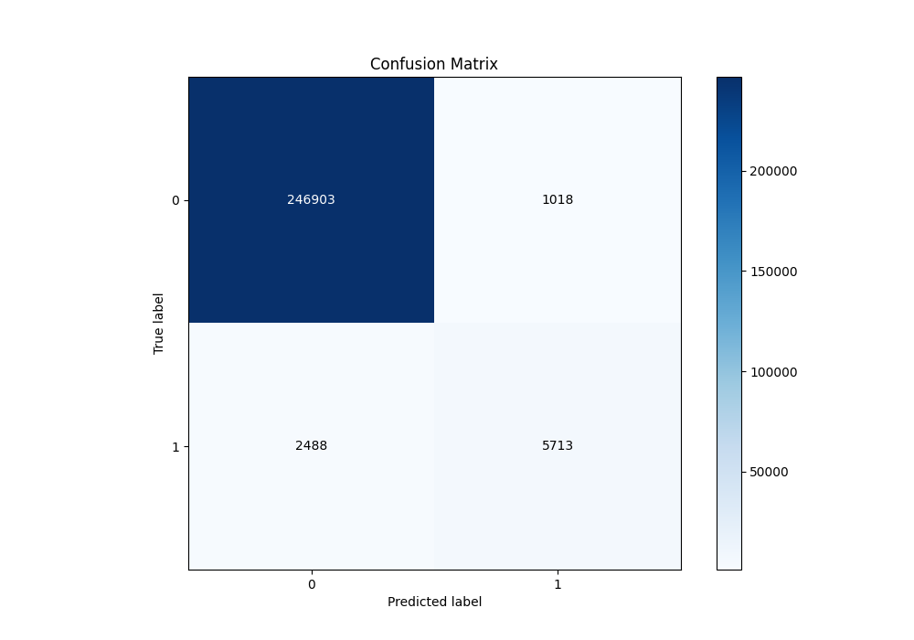
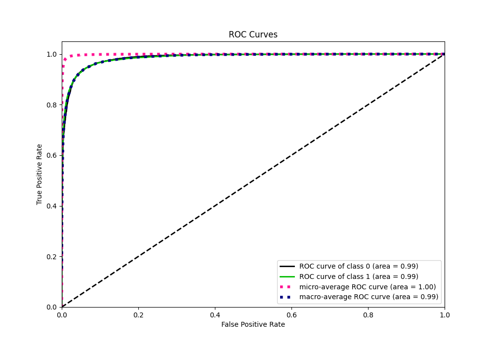
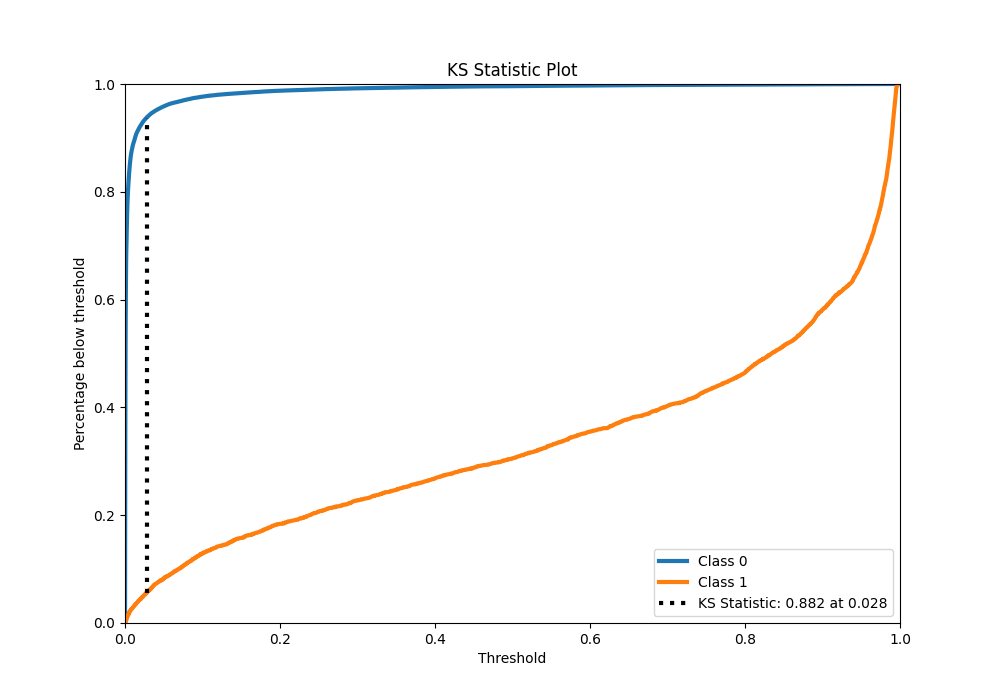
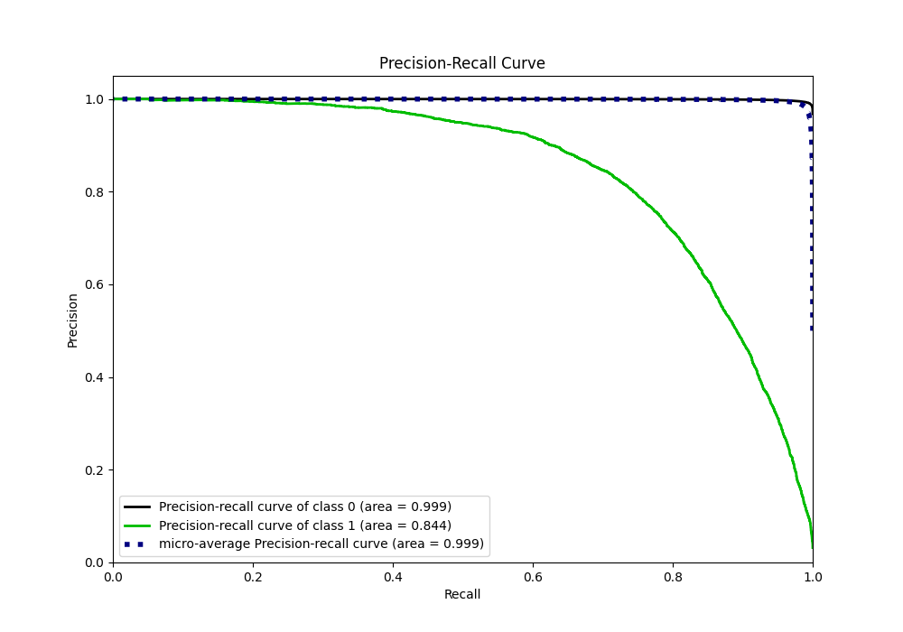
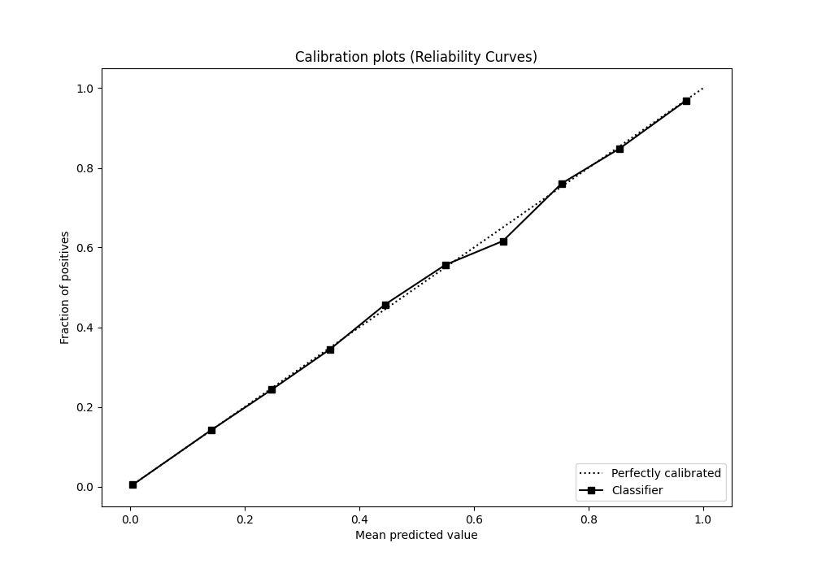
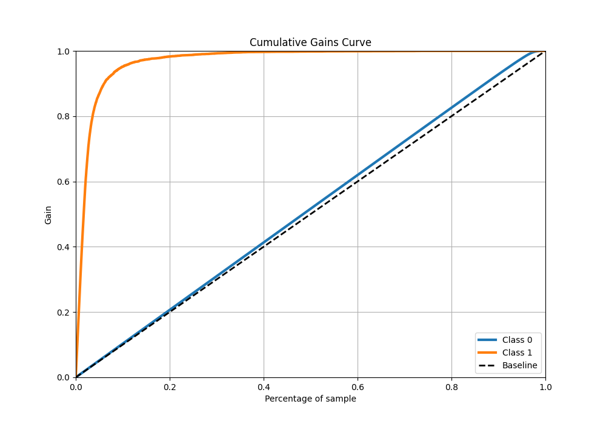
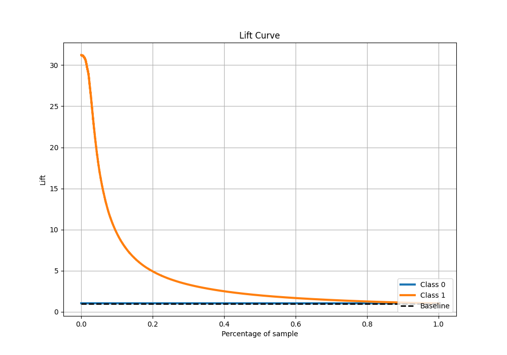

# Summary of 14_Xgboost

[<< Go back](../README.md)

## Extreme Gradient Boosting (Xgboost)
- **n_jobs**: -1
- **objective**: binary:logistic
- **eta**: 0.1
- **max_depth**: 6
- **min_child_weight**: 50
- **subsample**: 0.9
- **colsample_bytree**: 0.7
- **eval_metric**: f1
- **explain_level**: 0

## Validation
 - **validation_type**: kfold
 - **shuffle**: True
 - **stratify**: True
 - **k_folds**: 10

## Optimized metric
f1

## Training time

269.1 seconds

## Metric details
|           |     score |    threshold |
|:----------|----------:|-------------:|
| logloss   | 0.0404173 | nan          |
| auc       | 0.985754  | nan          |
| f1        | 0.765202  |   0.49382    |
| accuracy  | 0.986311  |   0.49382    |
| precision | 0.848759  |   0.49382    |
| recall    | 1         |   2.4246e-05 |
| mcc       | 0.762149  |   0.49382    |

## Metric details with threshold from accuracy metric
|           |     score |   threshold |
|:----------|----------:|------------:|
| logloss   | 0.0404173 |   nan       |
| auc       | 0.985754  |   nan       |
| f1        | 0.765202  |     0.49382 |
| accuracy  | 0.986311  |     0.49382 |
| precision | 0.848759  |     0.49382 |
| recall    | 0.696622  |     0.49382 |
| mcc       | 0.762149  |     0.49382 |

## Confusion matrix (at threshold=0.49382)
|              |   Predicted as 0 |   Predicted as 1 |
|:-------------|-----------------:|-----------------:|
| Labeled as 0 |           246903 |             1018 |
| Labeled as 1 |             2488 |             5713 |

## Learning curves

## Confusion Matrix

## Normalized Confusion Matrix

## ROC Curve

## Kolmogorov-Smirnov Statistic

## Precision-Recall Curve

## Calibration Curve

## Cumulative Gains Curve

## Lift Curve

[<< Go back](../README.md)
