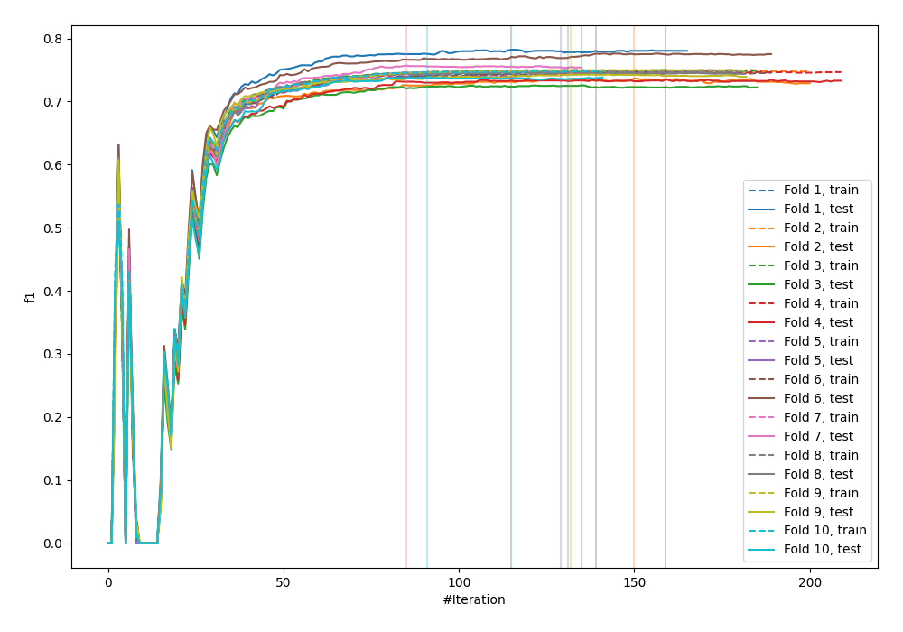
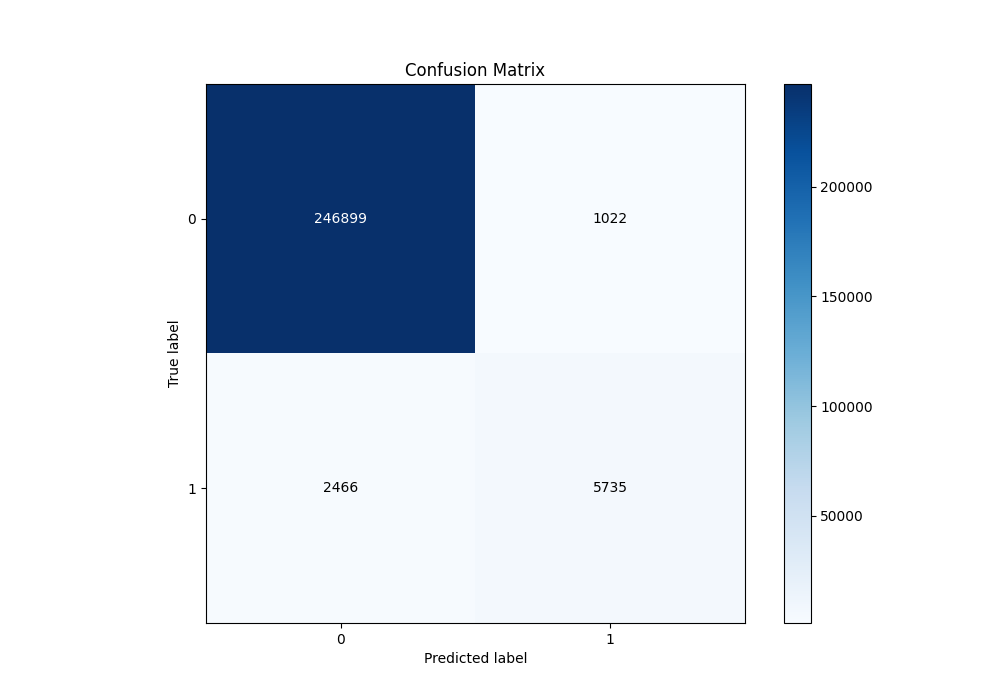
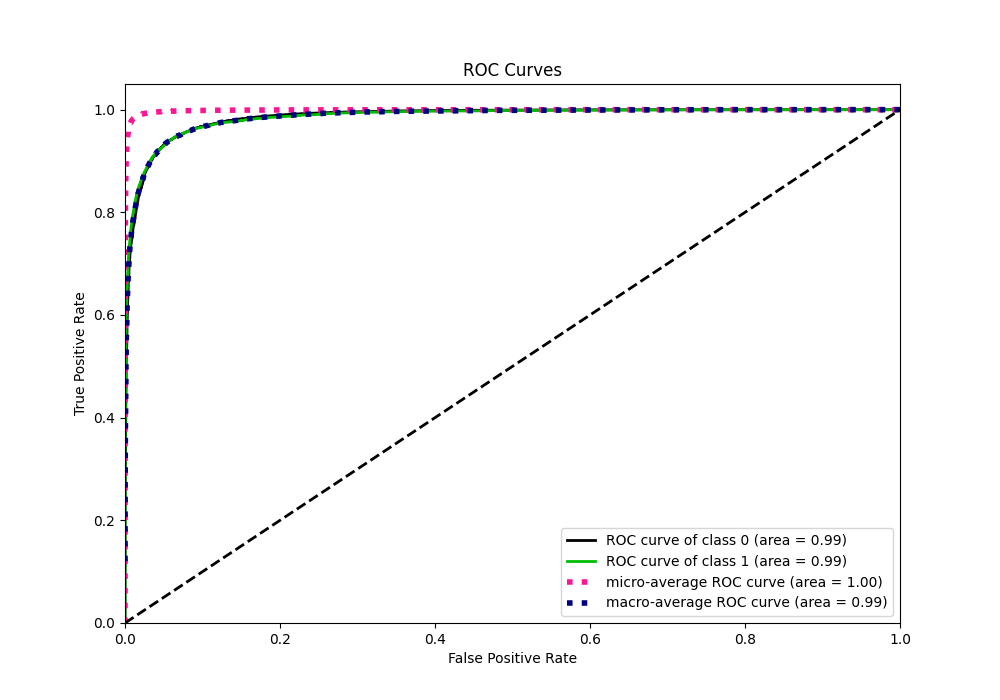
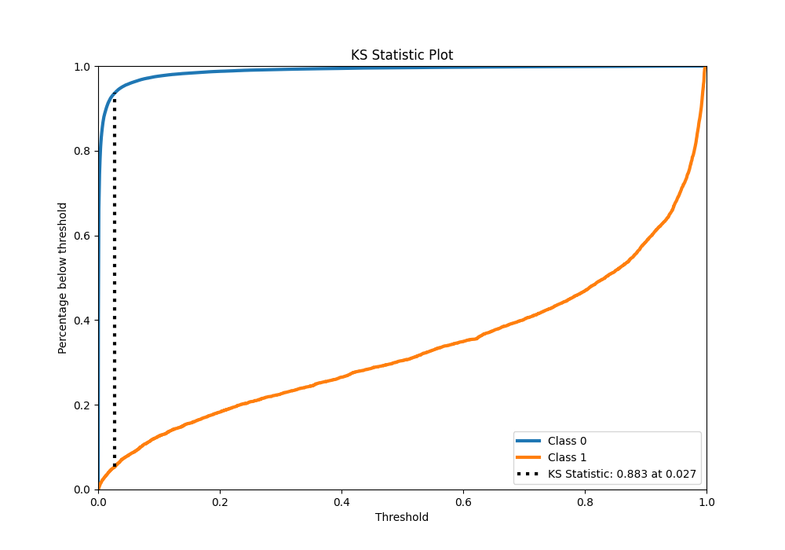
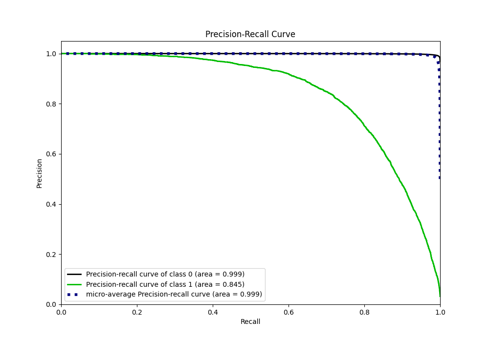
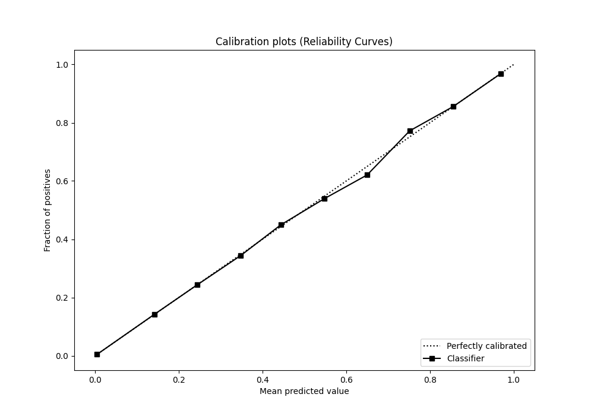
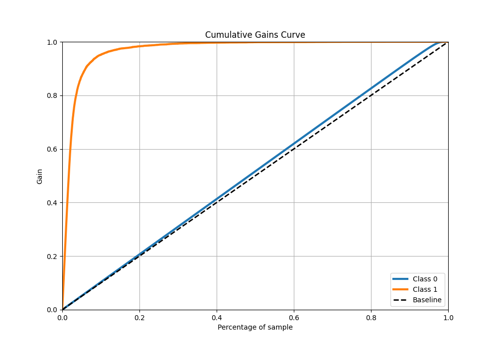
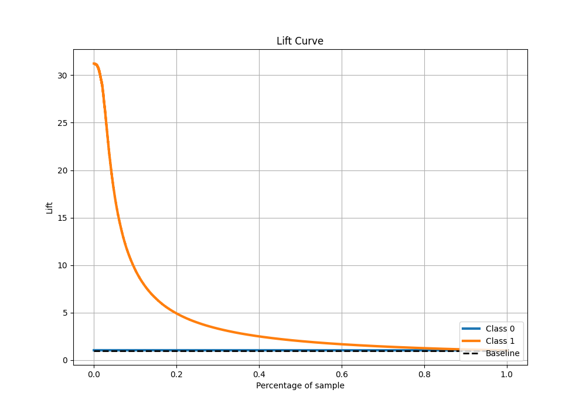

# Summary of 15_Xgboost

[<< Go back](../README.md)

## Extreme Gradient Boosting (Xgboost)
- **n_jobs**: -1
- **objective**: binary:logistic
- **eta**: 0.1
- **max_depth**: 4
- **min_child_weight**: 25
- **subsample**: 0.7
- **colsample_bytree**: 0.7
- **eval_metric**: f1
- **explain_level**: 0

## Validation
 - **validation_type**: kfold
 - **shuffle**: True
 - **stratify**: True
 - **k_folds**: 10

## Optimized metric
f1

## Training time

265.9 seconds

## Metric details
|           |     score |     threshold |
|:----------|----------:|--------------:|
| logloss   | 0.0402592 | nan           |
| auc       | 0.985852  | nan           |
| f1        | 0.766814  |   0.490785    |
| accuracy  | 0.986381  |   0.490785    |
| precision | 0.848749  |   0.490785    |
| recall    | 1         |   2.45086e-05 |
| mcc       | 0.76365   |   0.490785    |

## Metric details with threshold from accuracy metric
|           |     score |   threshold |
|:----------|----------:|------------:|
| logloss   | 0.0402592 |  nan        |
| auc       | 0.985852  |  nan        |
| f1        | 0.766814  |    0.490785 |
| accuracy  | 0.986381  |    0.490785 |
| precision | 0.848749  |    0.490785 |
| recall    | 0.699305  |    0.490785 |
| mcc       | 0.76365   |    0.490785 |

## Confusion matrix (at threshold=0.490785)
|              |   Predicted as 0 |   Predicted as 1 |
|:-------------|-----------------:|-----------------:|
| Labeled as 0 |           246899 |             1022 |
| Labeled as 1 |             2466 |             5735 |

## Learning curves

## Confusion Matrix

## Normalized Confusion Matrix

## ROC Curve

## Kolmogorov-Smirnov Statistic

## Precision-Recall Curve

## Calibration Curve

## Cumulative Gains Curve

## Lift Curve

[<< Go back](../README.md)
