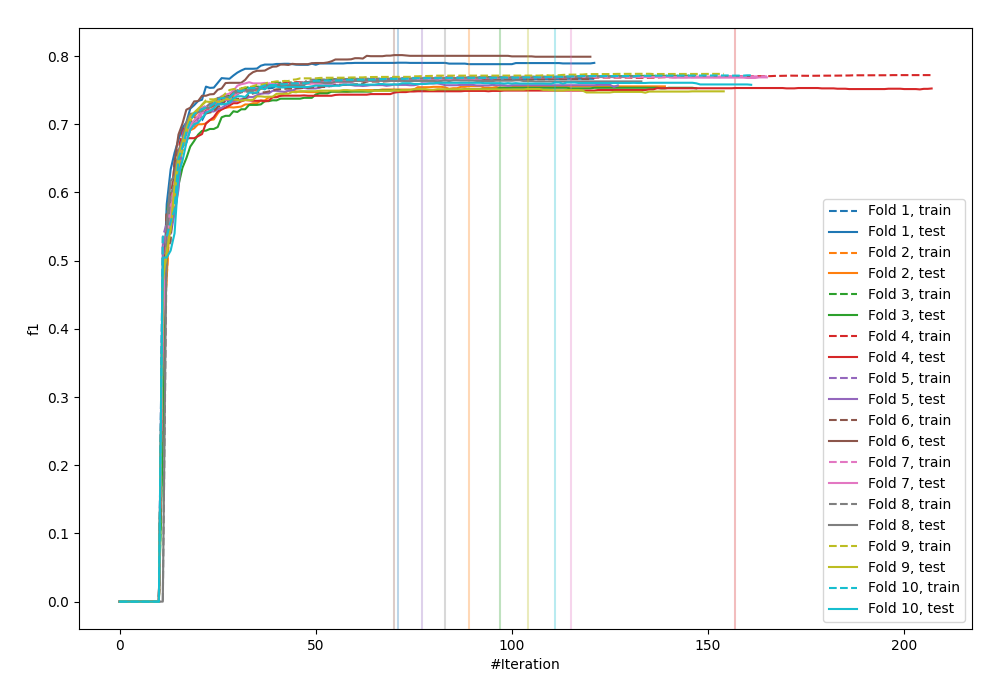
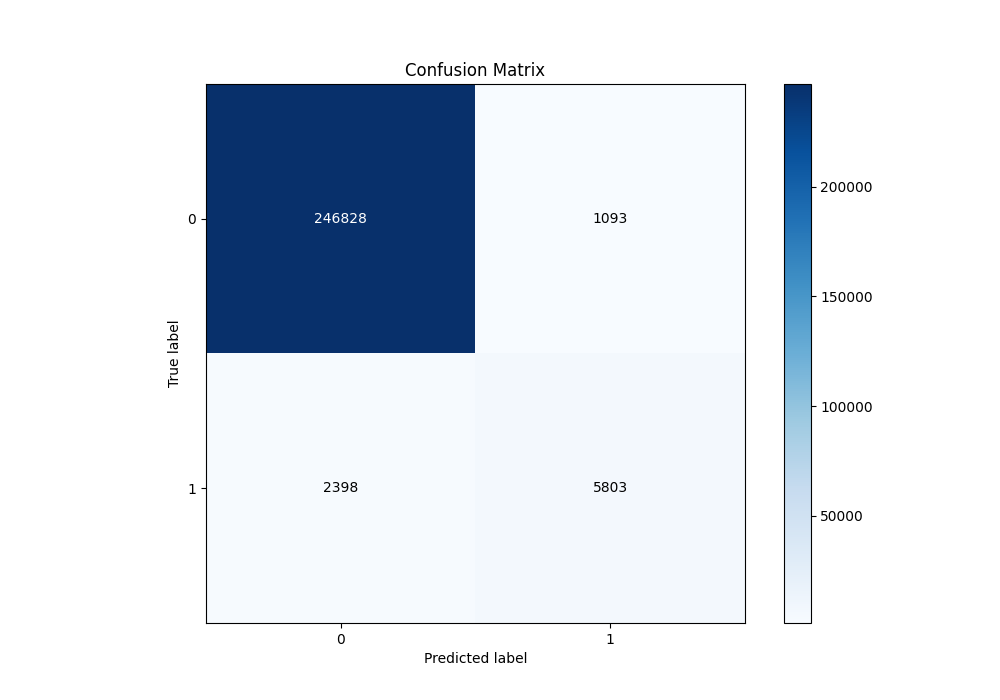
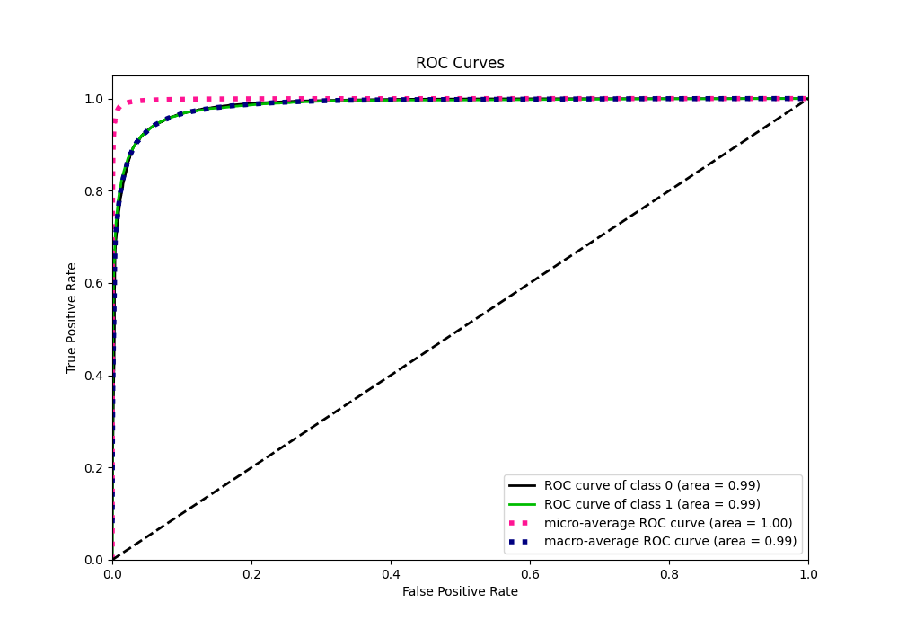
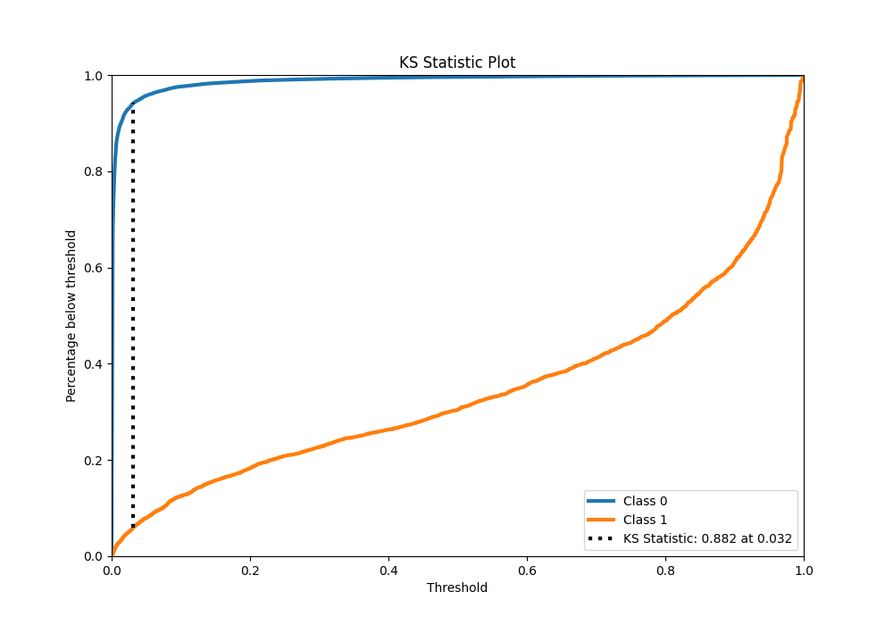
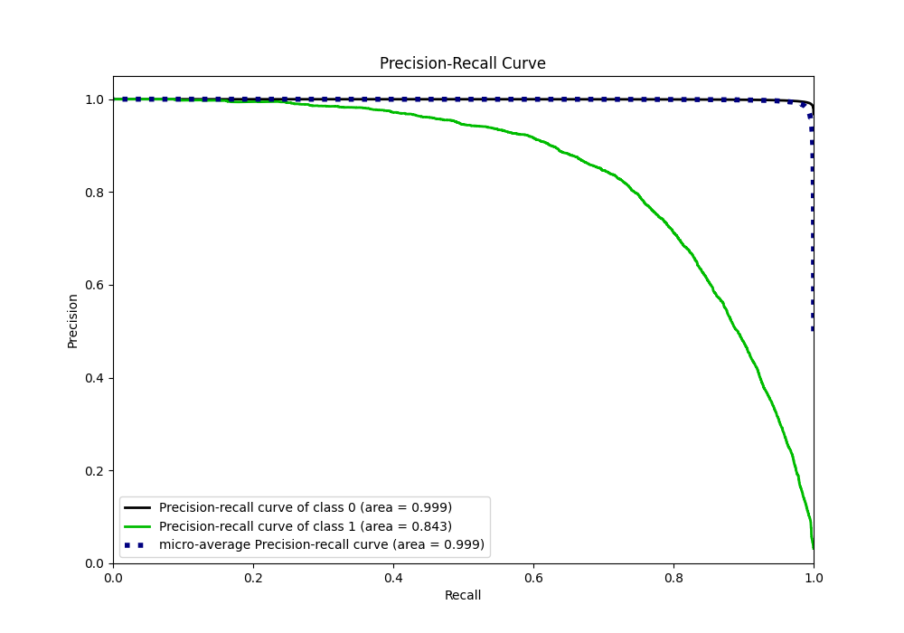
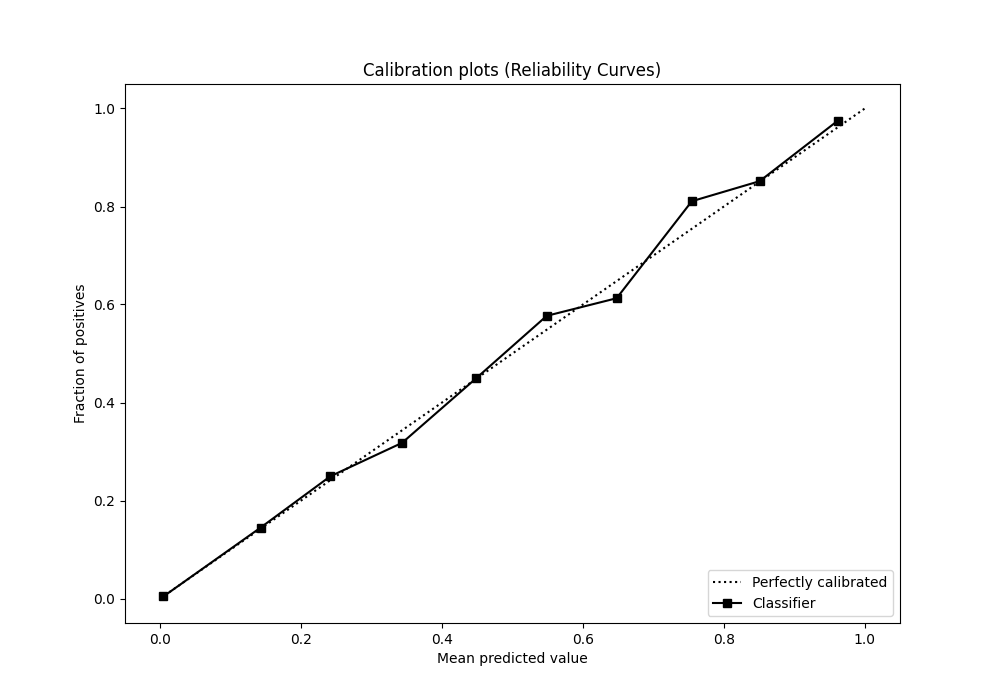
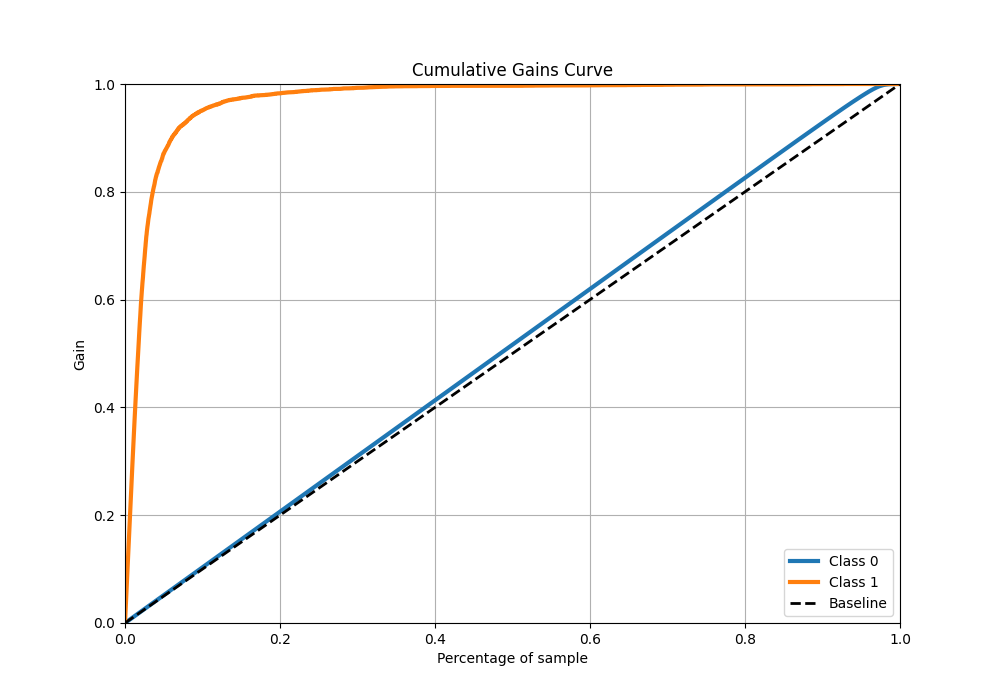
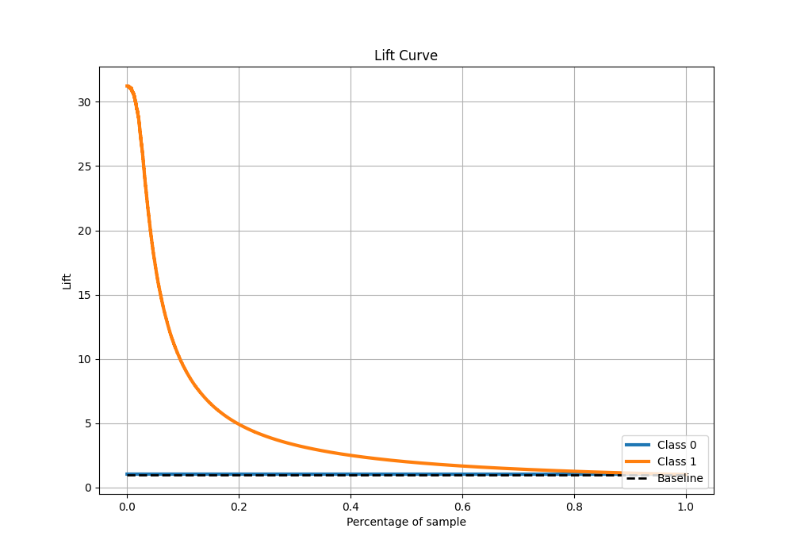

# Summary of 19_LightGBM_GoldenFeatures

[<< Go back](../README.md)

## LightGBM
- **n_jobs**: -1
- **objective**: binary
- **num_leaves**: 15
- **learning_rate**: 0.05
- **feature_fraction**: 0.8
- **bagging_fraction**: 0.5
- **min_data_in_leaf**: 50
- **metric**: custom
- **custom_eval_metric_name**: f1
- **explain_level**: 0

## Validation
 - **validation_type**: kfold
 - **shuffle**: True
 - **stratify**: True
 - **k_folds**: 10

## Optimized metric
f1

## Training time

248.4 seconds

## Metric details
|           |     score |     threshold |
|:----------|----------:|--------------:|
| logloss   | 0.0406189 | nan           |
| auc       | 0.985323  | nan           |
| f1        | 0.768762  |   0.472319    |
| accuracy  | 0.98637   |   0.472319    |
| precision | 0.841502  |   0.472319    |
| recall    | 1         |   1.72784e-05 |
| mcc       | 0.764832  |   0.472319    |

## Metric details with threshold from accuracy metric
|           |     score |   threshold |
|:----------|----------:|------------:|
| logloss   | 0.0406189 |  nan        |
| auc       | 0.985323  |  nan        |
| f1        | 0.768762  |    0.472319 |
| accuracy  | 0.98637   |    0.472319 |
| precision | 0.841502  |    0.472319 |
| recall    | 0.707597  |    0.472319 |
| mcc       | 0.764832  |    0.472319 |

## Confusion matrix (at threshold=0.472319)
|              |   Predicted as 0 |   Predicted as 1 |
|:-------------|-----------------:|-----------------:|
| Labeled as 0 |           246828 |             1093 |
| Labeled as 1 |             2398 |             5803 |

## Learning curves

## Confusion Matrix

## Normalized Confusion Matrix

## ROC Curve

## Kolmogorov-Smirnov Statistic

## Precision-Recall Curve

## Calibration Curve

## Cumulative Gains Curve

## Lift Curve

[<< Go back](../README.md)
