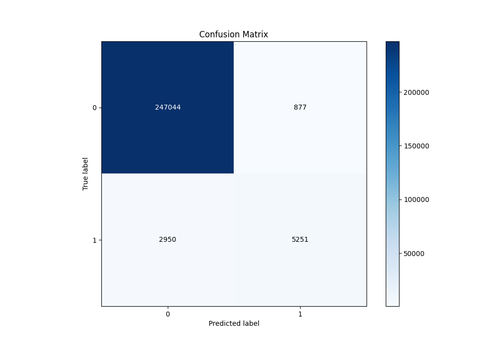
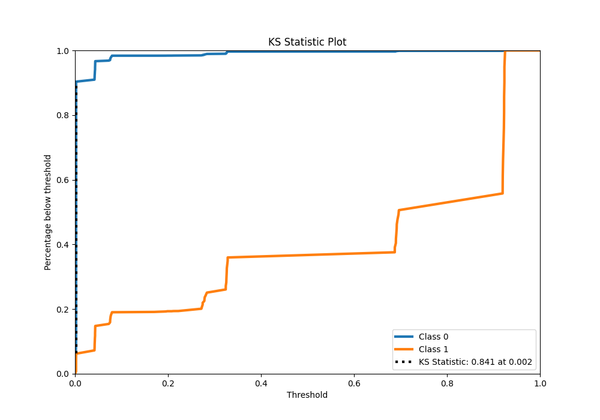

# Summary of 1_DecisionTree

[<< Go back](../README.md)

## Decision Tree
- **n_jobs**: -1
- **criterion**: gini
- **max_depth**: 3
- **explain_level**: 0

## Validation
 - **validation_type**: kfold
 - **shuffle**: True
 - **stratify**: True
 - **k_folds**: 10

## Optimized metric
f1

## Training time

37.9 seconds

## Metric details
|           |     score |    threshold |
|:----------|----------:|-------------:|
| logloss   | 0.0500671 | nan          |
| auc       | 0.955139  | nan          |
| f1        | 0.732919  |   0.348994   |
| accuracy  | 0.985058  |   0.348994   |
| precision | 0.856886  |   0.348994   |
| recall    | 1         |   0.00200945 |
| mcc       | 0.733559  |   0.348994   |

## Metric details with threshold from accuracy metric
|           |     score |   threshold |
|:----------|----------:|------------:|
| logloss   | 0.0500671 |  nan        |
| auc       | 0.955139  |  nan        |
| f1        | 0.732919  |    0.348994 |
| accuracy  | 0.985058  |    0.348994 |
| precision | 0.856886  |    0.348994 |
| recall    | 0.640288  |    0.348994 |
| mcc       | 0.733559  |    0.348994 |

## Confusion matrix (at threshold=0.348994)
|              |   Predicted as 0 |   Predicted as 1 |
|:-------------|-----------------:|-----------------:|
| Labeled as 0 |           247044 |              877 |
| Labeled as 1 |             2950 |             5251 |

## Learning curves

## Confusion Matrix

## Normalized Confusion Matrix

## ROC Curve

## Kolmogorov-Smirnov Statistic

## Precision-Recall Curve

## Calibration Curve

## Cumulative Gains Curve

## Lift Curve

[<< Go back](../README.md)
