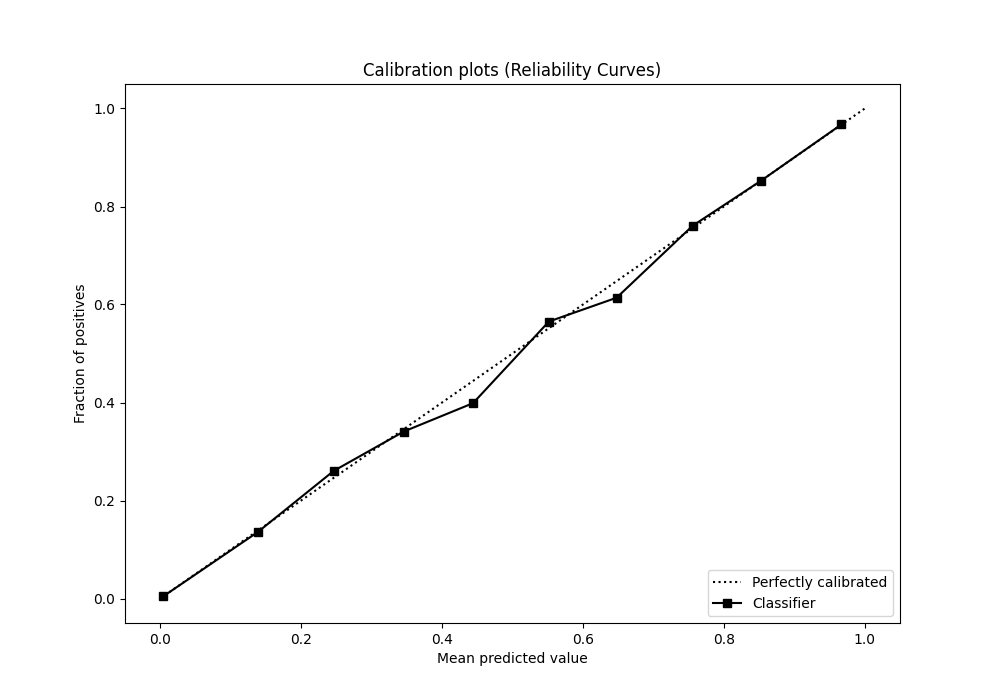
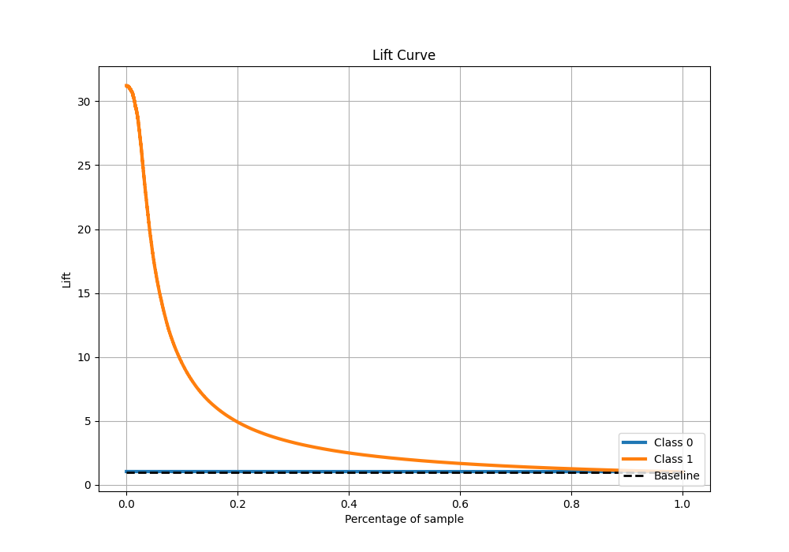

# Summary of 20_LightGBM

[<< Go back](../README.md)

## LightGBM
- **n_jobs**: -1
- **objective**: binary
- **num_leaves**: 63
- **learning_rate**: 0.2
- **feature_fraction**: 0.5
- **bagging_fraction**: 1.0
- **min_data_in_leaf**: 10
- **metric**: custom
- **custom_eval_metric_name**: f1
- **explain_level**: 0

## Validation
 - **validation_type**: kfold
 - **shuffle**: True
 - **stratify**: True
 - **k_folds**: 10

## Optimized metric
f1

## Training time

180.1 seconds

## Metric details
|           |    score |     threshold |
|:----------|---------:|--------------:|
| logloss   | 0.040985 | nan           |
| auc       | 0.985078 | nan           |
| f1        | 0.767025 |   0.479123    |
| accuracy  | 0.986296 |   0.479123    |
| precision | 0.841661 |   0.479123    |
| recall    | 1        |   3.78388e-09 |
| mcc       | 0.763213 |   0.479123    |

## Metric details with threshold from accuracy metric
|           |    score |   threshold |
|:----------|---------:|------------:|
| logloss   | 0.040985 |  nan        |
| auc       | 0.985078 |  nan        |
| f1        | 0.767025 |    0.479123 |
| accuracy  | 0.986296 |    0.479123 |
| precision | 0.841661 |    0.479123 |
| recall    | 0.704548 |    0.479123 |
| mcc       | 0.763213 |    0.479123 |

## Confusion matrix (at threshold=0.479123)
|              |   Predicted as 0 |   Predicted as 1 |
|:-------------|-----------------:|-----------------:|
| Labeled as 0 |           246834 |             1087 |
| Labeled as 1 |             2423 |             5778 |

## Learning curves

## Confusion Matrix

## Normalized Confusion Matrix

## ROC Curve

## Kolmogorov-Smirnov Statistic

## Precision-Recall Curve

## Calibration Curve

## Cumulative Gains Curve

## Lift Curve

[<< Go back](../README.md)
