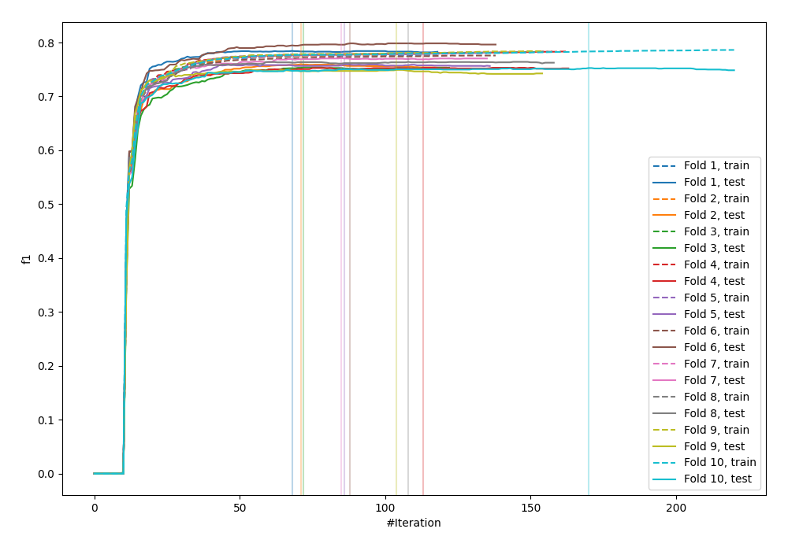
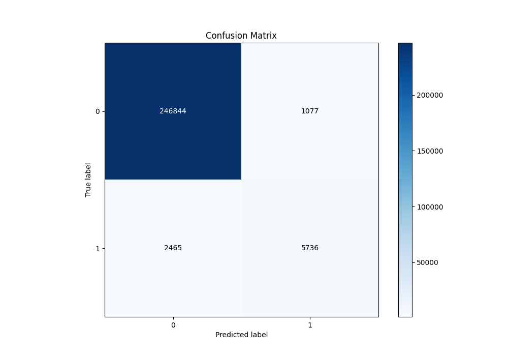
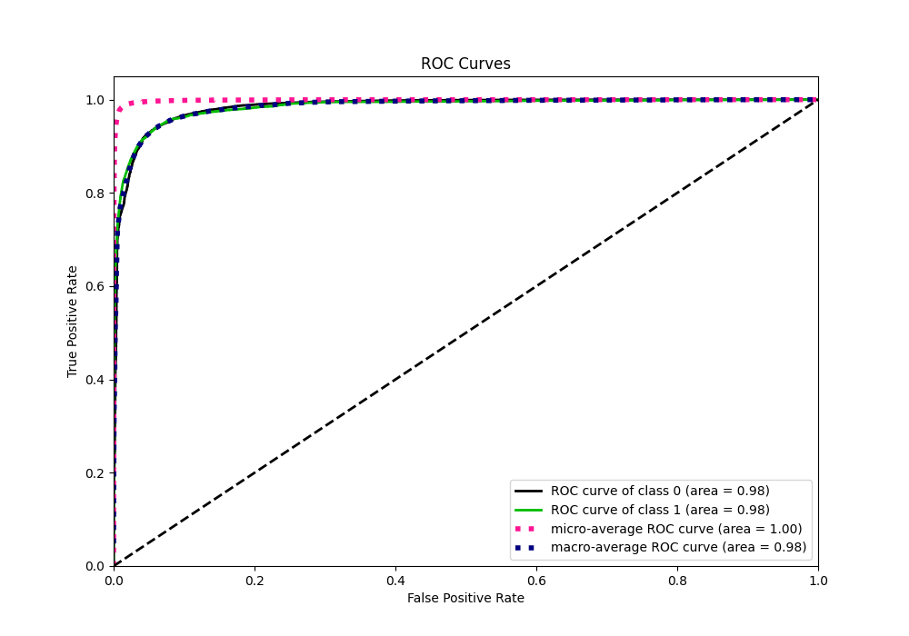
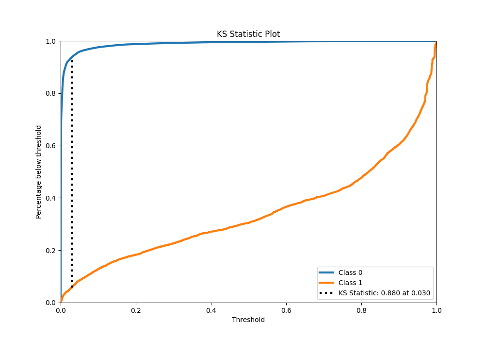
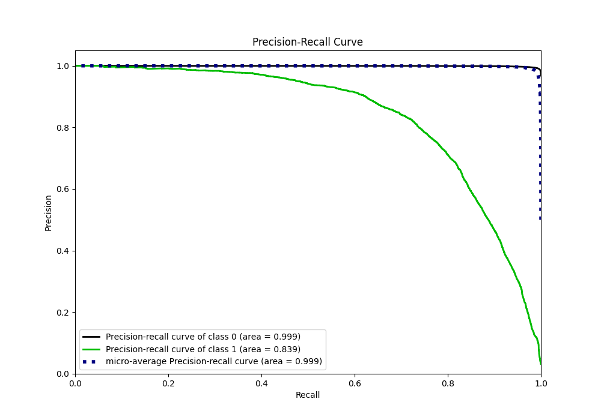
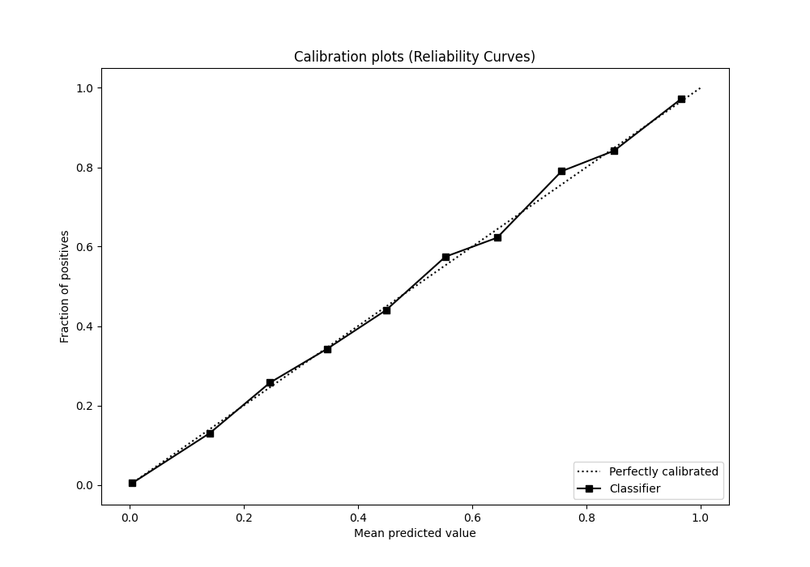
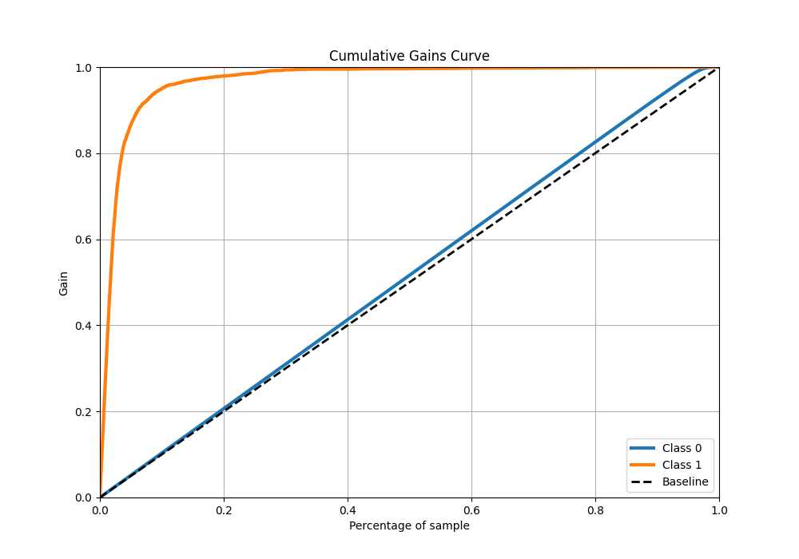
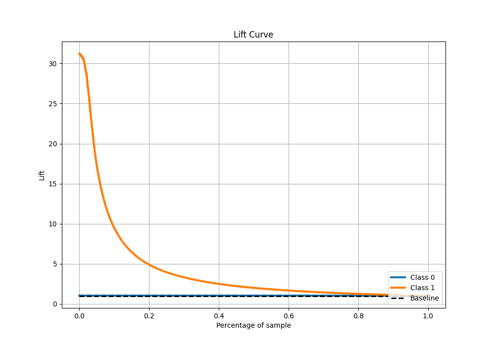

# Summary of 22_LightGBM

[<< Go back](../README.md)

## LightGBM
- **n_jobs**: -1
- **objective**: binary
- **num_leaves**: 95
- **learning_rate**: 0.05
- **feature_fraction**: 1.0
- **bagging_fraction**: 1.0
- **min_data_in_leaf**: 10
- **metric**: custom
- **custom_eval_metric_name**: f1
- **explain_level**: 0

## Validation
 - **validation_type**: kfold
 - **shuffle**: True
 - **stratify**: True
 - **k_folds**: 10

## Optimized metric
f1

## Training time

246.8 seconds

## Metric details
|           |     score |     threshold |
|:----------|----------:|--------------:|
| logloss   | 0.0412156 | nan           |
| auc       | 0.984323  | nan           |
| f1        | 0.764087  |   0.486011    |
| accuracy  | 0.986171  |   0.486011    |
| precision | 0.84192   |   0.486011    |
| recall    | 1         |   6.73201e-06 |
| mcc       | 0.760481  |   0.486011    |

## Metric details with threshold from accuracy metric
|           |     score |   threshold |
|:----------|----------:|------------:|
| logloss   | 0.0412156 |  nan        |
| auc       | 0.984323  |  nan        |
| f1        | 0.764087  |    0.486011 |
| accuracy  | 0.986171  |    0.486011 |
| precision | 0.84192   |    0.486011 |
| recall    | 0.699427  |    0.486011 |
| mcc       | 0.760481  |    0.486011 |

## Confusion matrix (at threshold=0.486011)
|              |   Predicted as 0 |   Predicted as 1 |
|:-------------|-----------------:|-----------------:|
| Labeled as 0 |           246844 |             1077 |
| Labeled as 1 |             2465 |             5736 |

## Learning curves

## Confusion Matrix

## Normalized Confusion Matrix

## ROC Curve

## Kolmogorov-Smirnov Statistic

## Precision-Recall Curve

## Calibration Curve

## Cumulative Gains Curve

## Lift Curve

[<< Go back](../README.md)
