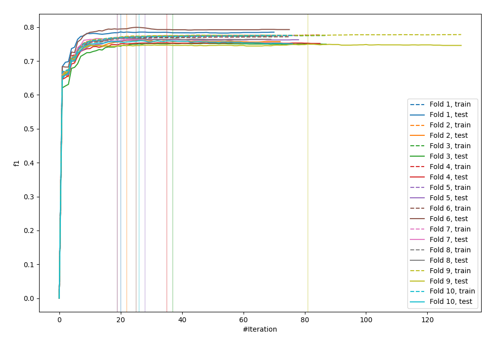
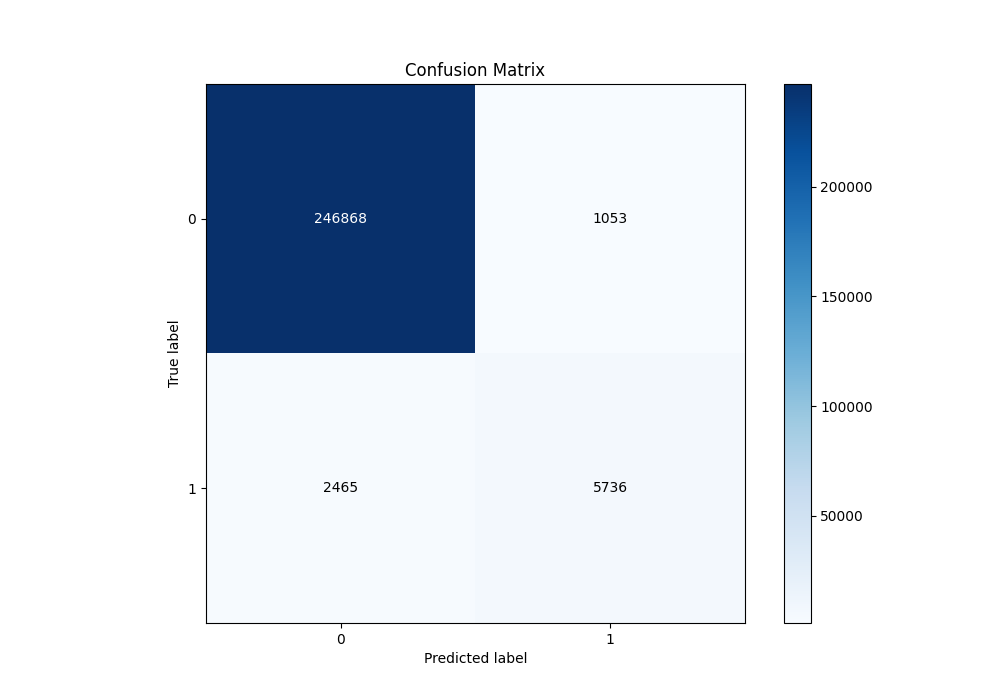
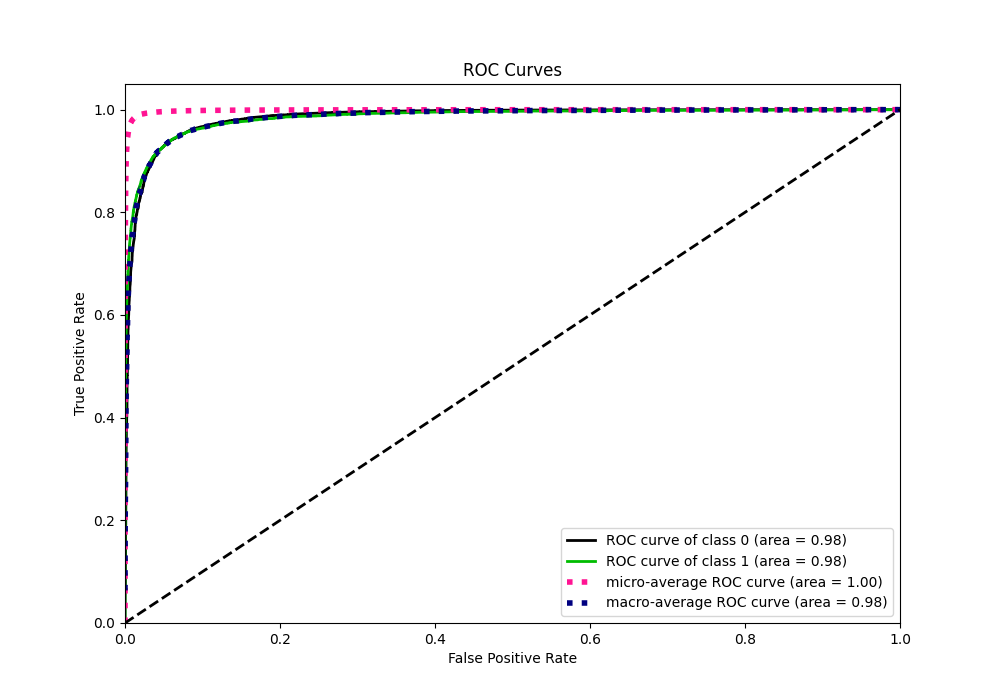
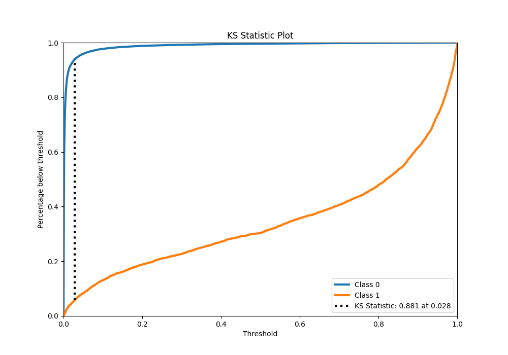
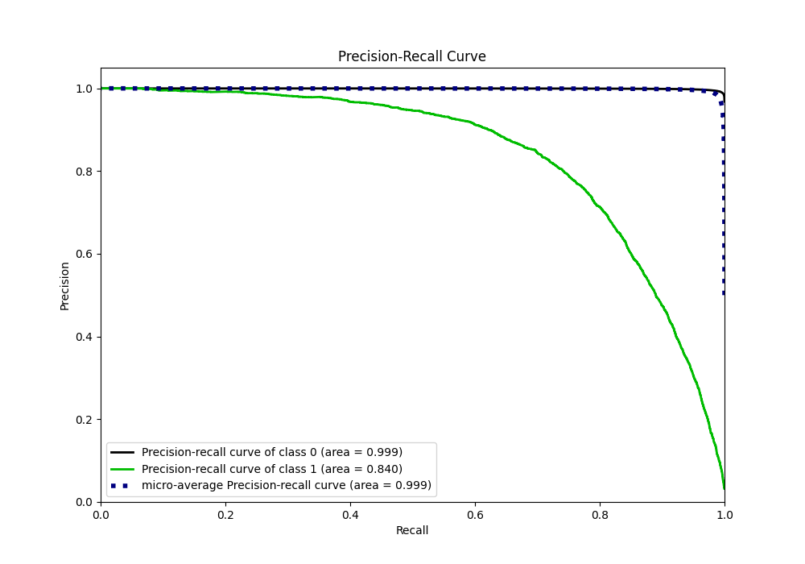
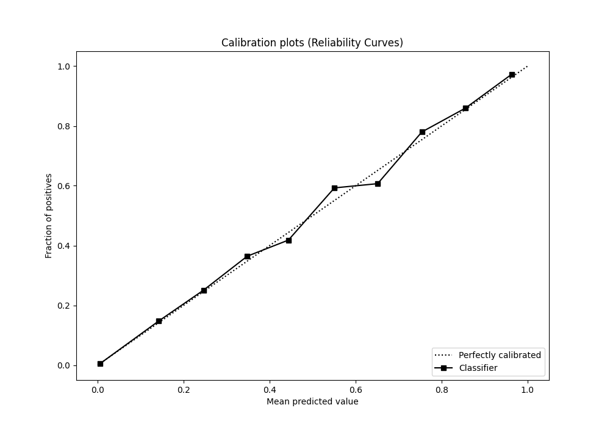
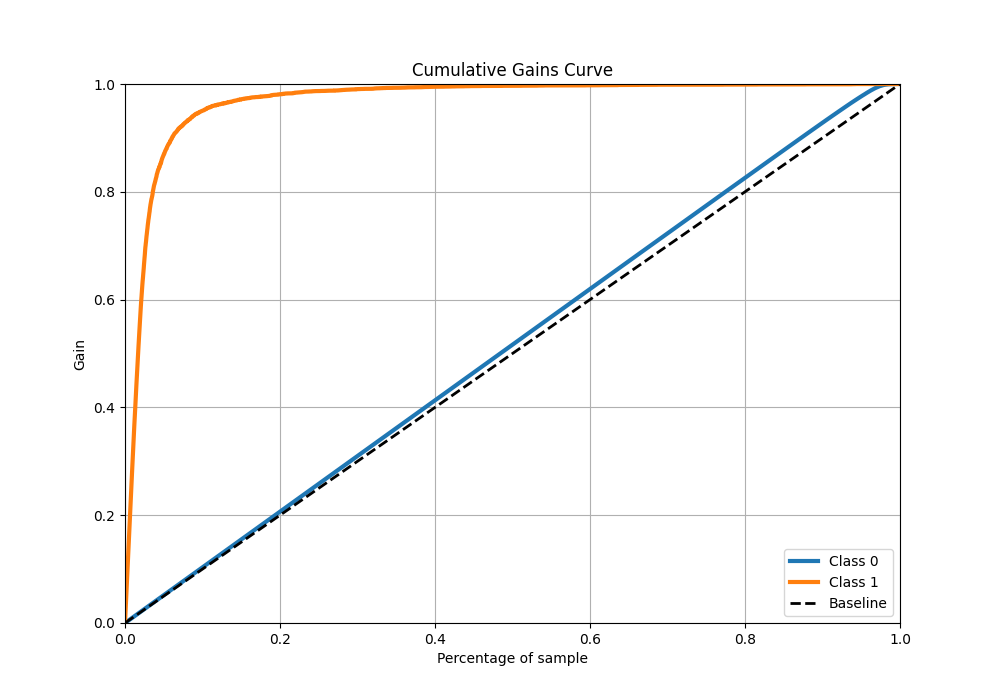
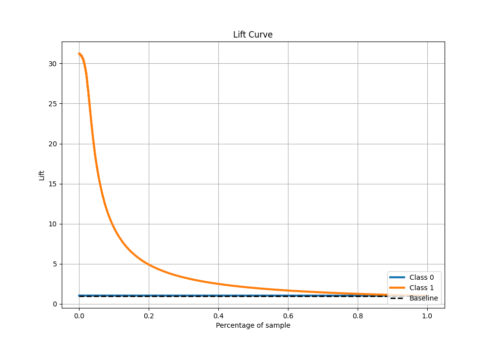

# Summary of 23_LightGBM

[<< Go back](../README.md)

## LightGBM
- **n_jobs**: -1
- **objective**: binary
- **num_leaves**: 63
- **learning_rate**: 0.2
- **feature_fraction**: 0.5
- **bagging_fraction**: 1.0
- **min_data_in_leaf**: 30
- **metric**: custom
- **custom_eval_metric_name**: f1
- **explain_level**: 0

## Validation
 - **validation_type**: kfold
 - **shuffle**: True
 - **stratify**: True
 - **k_folds**: 10

## Optimized metric
f1

## Training time

155.9 seconds

## Metric details
|           |    score |     threshold |
|:----------|---------:|--------------:|
| logloss   | 0.041198 | nan           |
| auc       | 0.984435 | nan           |
| f1        | 0.76531  |   0.483599    |
| accuracy  | 0.986264 |   0.483599    |
| precision | 0.844896 |   0.483599    |
| recall    | 1        |   6.34815e-09 |
| mcc       | 0.761894 |   0.483599    |

## Metric details with threshold from accuracy metric
|           |    score |   threshold |
|:----------|---------:|------------:|
| logloss   | 0.041198 |  nan        |
| auc       | 0.984435 |  nan        |
| f1        | 0.76531  |    0.483599 |
| accuracy  | 0.986264 |    0.483599 |
| precision | 0.844896 |    0.483599 |
| recall    | 0.699427 |    0.483599 |
| mcc       | 0.761894 |    0.483599 |

## Confusion matrix (at threshold=0.483599)
|              |   Predicted as 0 |   Predicted as 1 |
|:-------------|-----------------:|-----------------:|
| Labeled as 0 |           246868 |             1053 |
| Labeled as 1 |             2465 |             5736 |

## Learning curves

## Confusion Matrix

## Normalized Confusion Matrix

## ROC Curve

## Kolmogorov-Smirnov Statistic

## Precision-Recall Curve

## Calibration Curve

## Cumulative Gains Curve

## Lift Curve

[<< Go back](../README.md)
