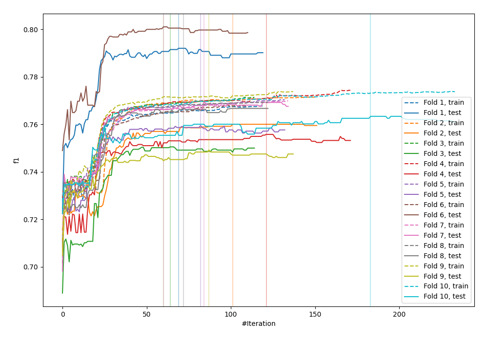
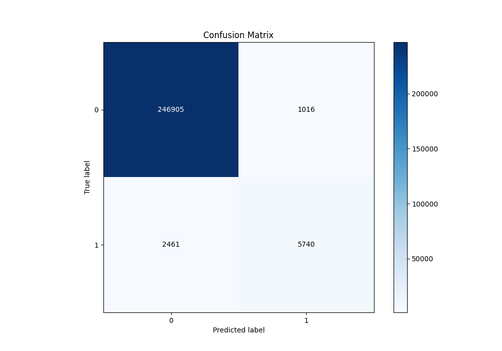
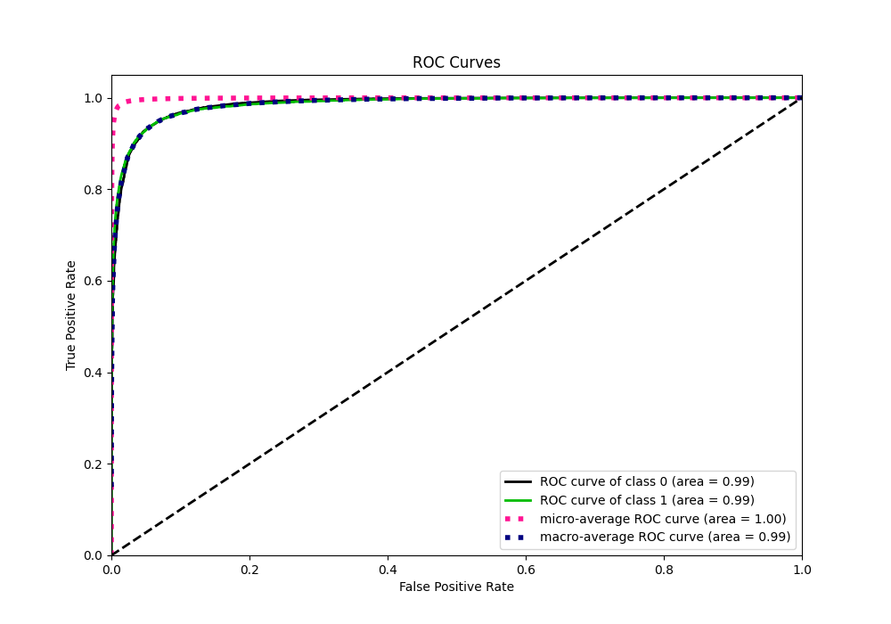
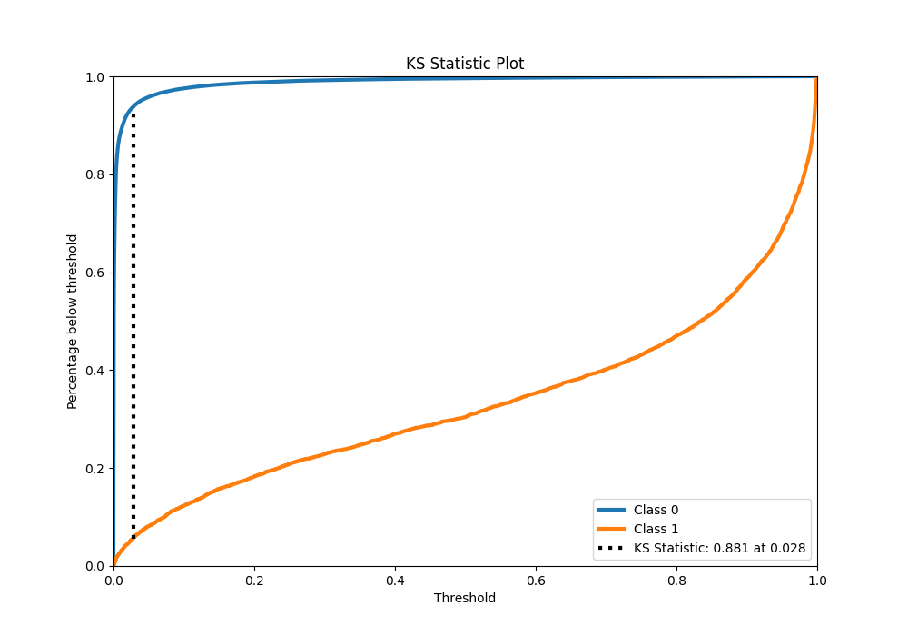
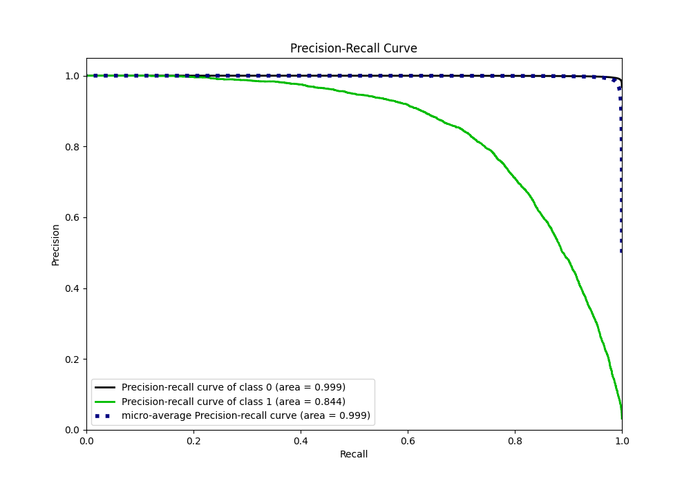
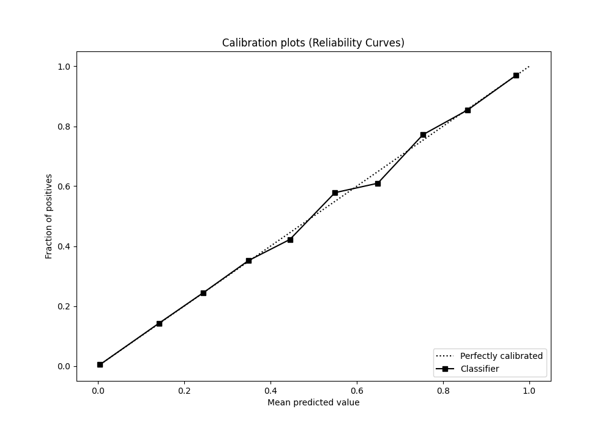
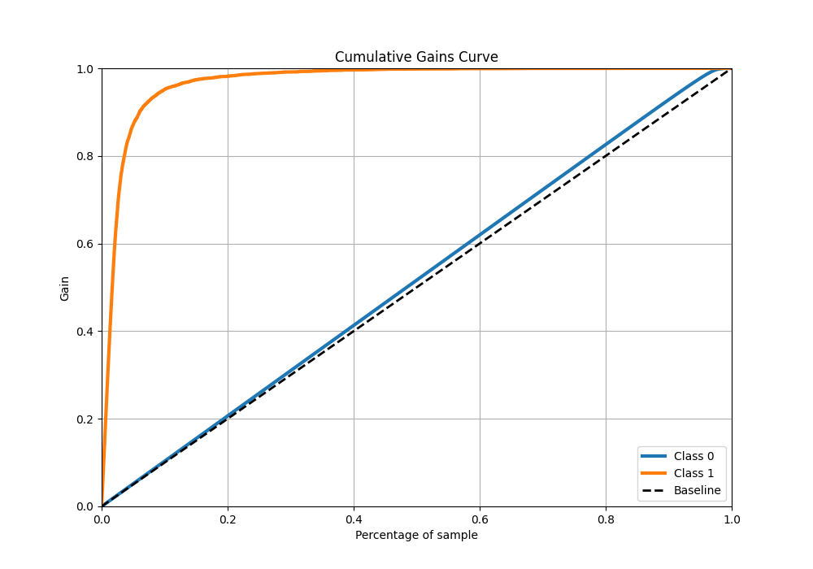
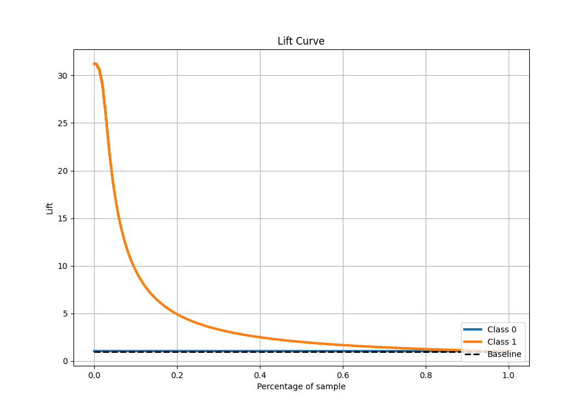

# Summary of 29_CatBoost

[<< Go back](../README.md)

## CatBoost
- **n_jobs**: -1
- **learning_rate**: 0.1
- **depth**: 8
- **rsm**: 1.0
- **loss_function**: Logloss
- **eval_metric**: F1
- **explain_level**: 0

## Validation
 - **validation_type**: kfold
 - **shuffle**: True
 - **stratify**: True
 - **k_folds**: 10

## Optimized metric
f1

## Training time

147.2 seconds

## Metric details
|           |    score |     threshold |
|:----------|---------:|--------------:|
| logloss   | 0.040383 | nan           |
| auc       | 0.985623 | nan           |
| f1        | 0.767534 |   0.486996    |
| accuracy  | 0.986424 |   0.486996    |
| precision | 0.849615 |   0.486996    |
| recall    | 1        |   1.85471e-06 |
| mcc       | 0.764401 |   0.486996    |

## Metric details with threshold from accuracy metric
|           |    score |   threshold |
|:----------|---------:|------------:|
| logloss   | 0.040383 |  nan        |
| auc       | 0.985623 |  nan        |
| f1        | 0.767534 |    0.486996 |
| accuracy  | 0.986424 |    0.486996 |
| precision | 0.849615 |    0.486996 |
| recall    | 0.699915 |    0.486996 |
| mcc       | 0.764401 |    0.486996 |

## Confusion matrix (at threshold=0.486996)
|              |   Predicted as 0 |   Predicted as 1 |
|:-------------|-----------------:|-----------------:|
| Labeled as 0 |           246905 |             1016 |
| Labeled as 1 |             2461 |             5740 |

## Learning curves

## Confusion Matrix

## Normalized Confusion Matrix

## ROC Curve

## Kolmogorov-Smirnov Statistic

## Precision-Recall Curve

## Calibration Curve

## Cumulative Gains Curve

## Lift Curve

[<< Go back](../README.md)
