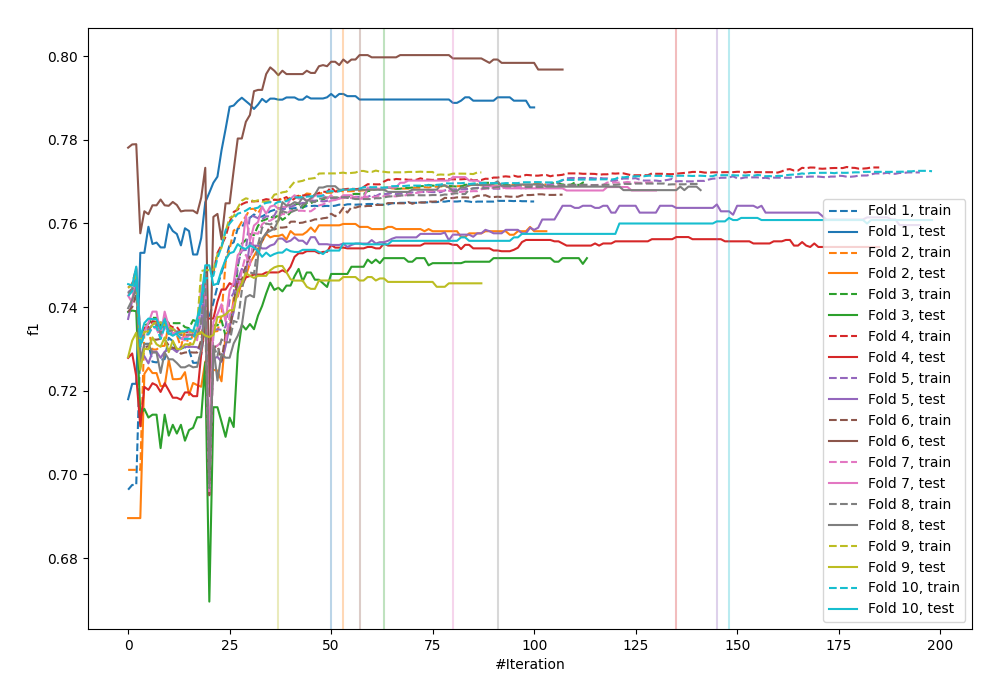
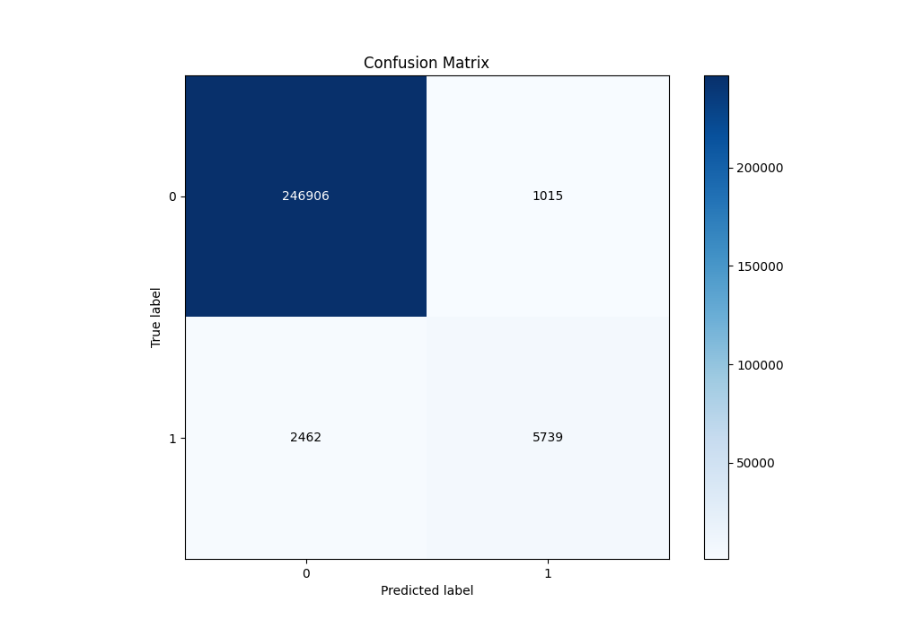
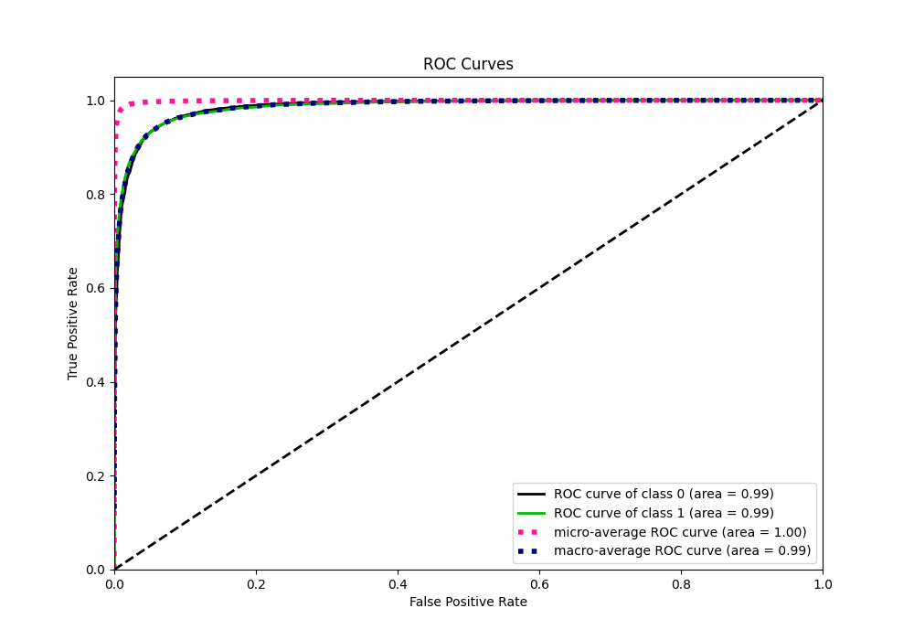
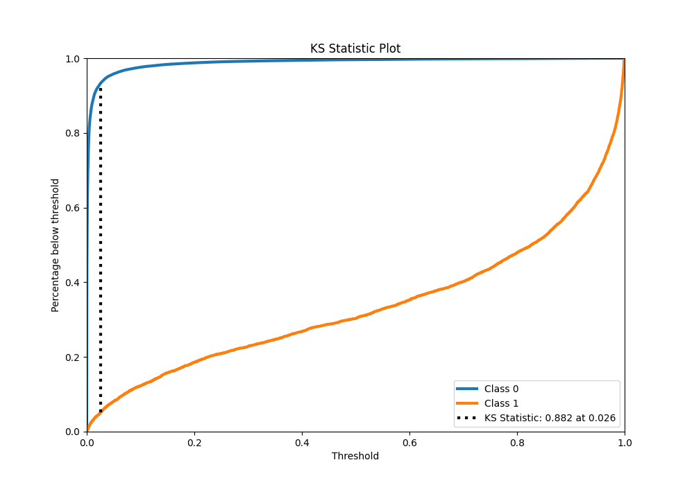
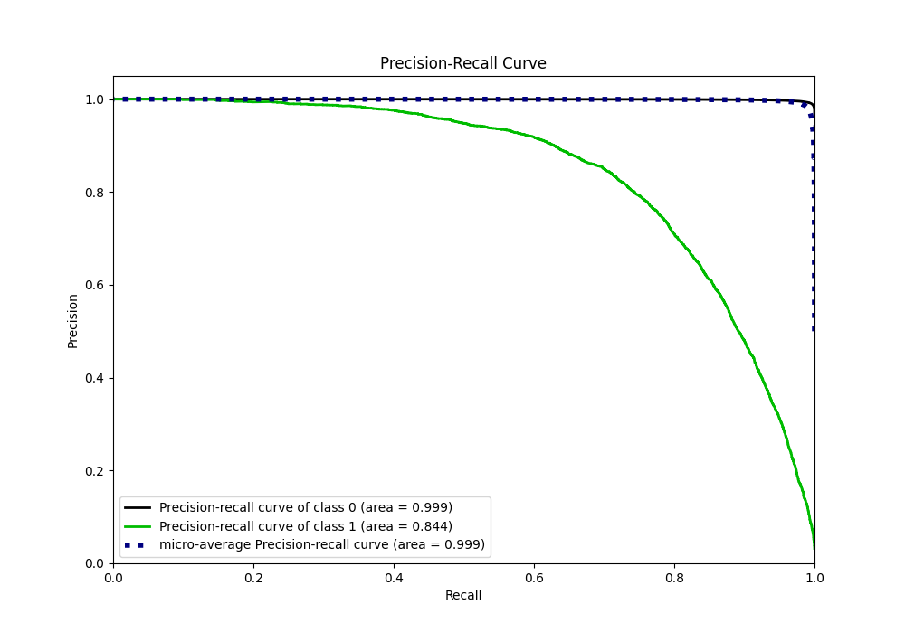
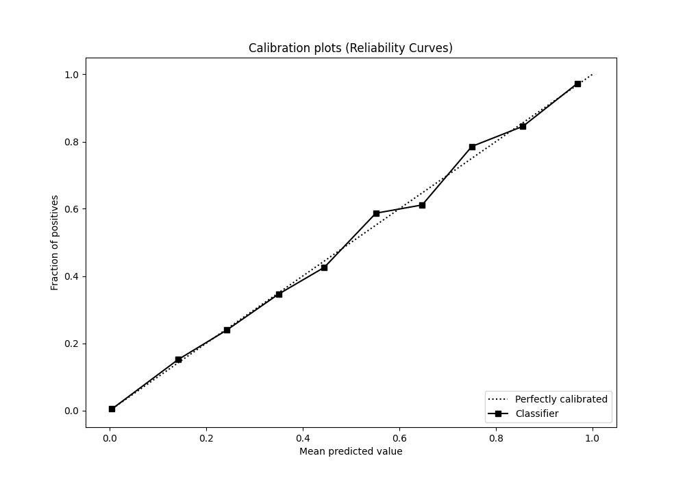
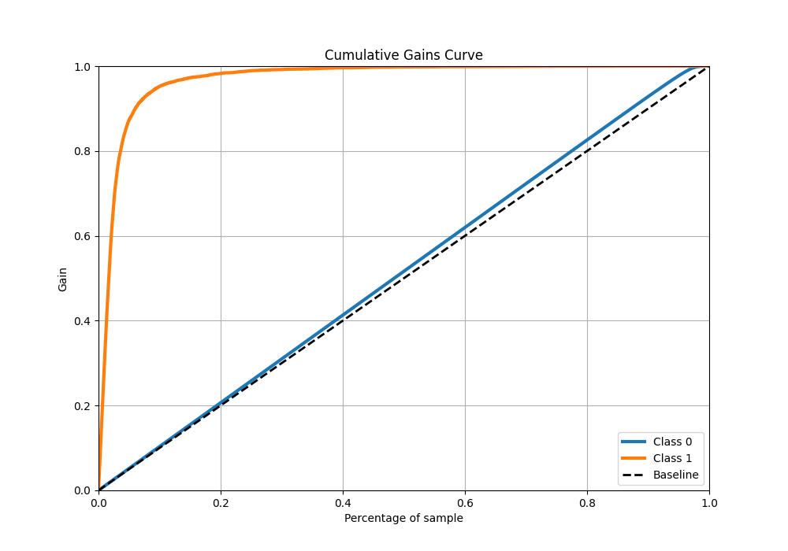
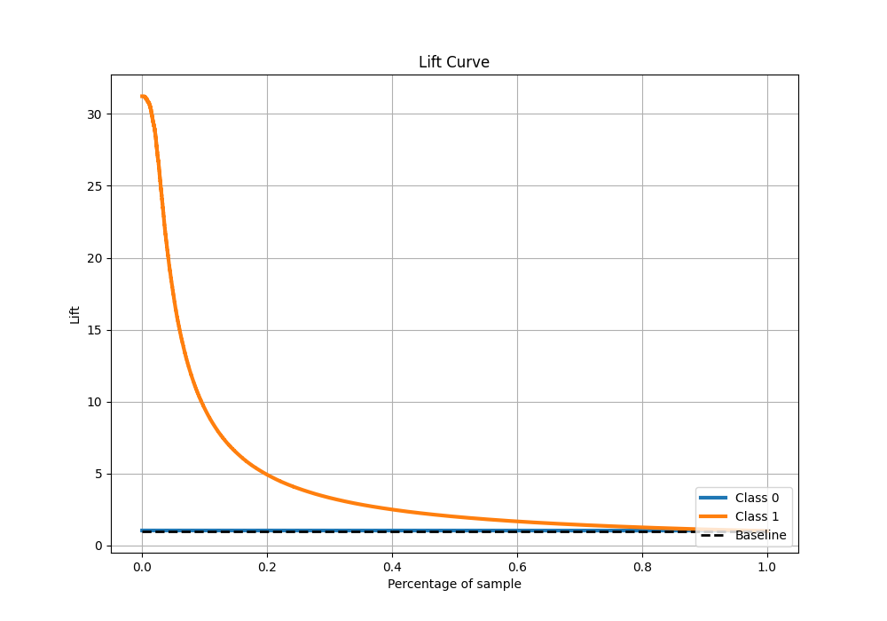

# Summary of 30_CatBoost

[<< Go back](../README.md)

## CatBoost
- **n_jobs**: -1
- **learning_rate**: 0.1
- **depth**: 7
- **rsm**: 1.0
- **loss_function**: Logloss
- **eval_metric**: F1
- **explain_level**: 0

## Validation
 - **validation_type**: kfold
 - **shuffle**: True
 - **stratify**: True
 - **k_folds**: 10

## Optimized metric
f1

## Training time

137.7 seconds

## Metric details
|           |     score |     threshold |
|:----------|----------:|--------------:|
| logloss   | 0.0403753 | nan           |
| auc       | 0.985552  | nan           |
| f1        | 0.767503  |   0.489271    |
| accuracy  | 0.986424  |   0.489271    |
| precision | 0.849719  |   0.489271    |
| recall    | 1         |   7.97636e-07 |
| mcc       | 0.764382  |   0.489271    |

## Metric details with threshold from accuracy metric
|           |     score |   threshold |
|:----------|----------:|------------:|
| logloss   | 0.0403753 |  nan        |
| auc       | 0.985552  |  nan        |
| f1        | 0.767503  |    0.489271 |
| accuracy  | 0.986424  |    0.489271 |
| precision | 0.849719  |    0.489271 |
| recall    | 0.699793  |    0.489271 |
| mcc       | 0.764382  |    0.489271 |

## Confusion matrix (at threshold=0.489271)
|              |   Predicted as 0 |   Predicted as 1 |
|:-------------|-----------------:|-----------------:|
| Labeled as 0 |           246906 |             1015 |
| Labeled as 1 |             2462 |             5739 |

## Learning curves

## Confusion Matrix

## Normalized Confusion Matrix

## ROC Curve

## Kolmogorov-Smirnov Statistic

## Precision-Recall Curve

## Calibration Curve

## Cumulative Gains Curve

## Lift Curve

[<< Go back](../README.md)
