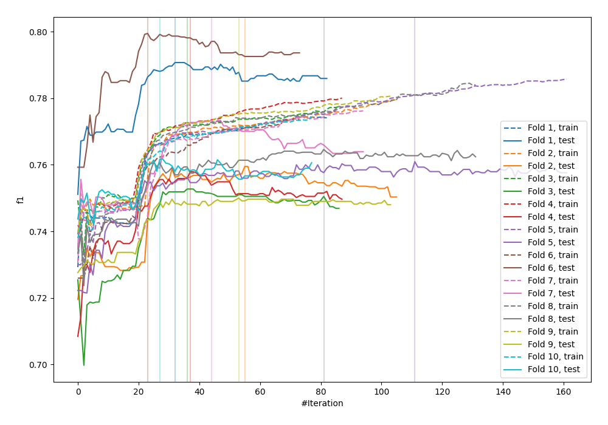
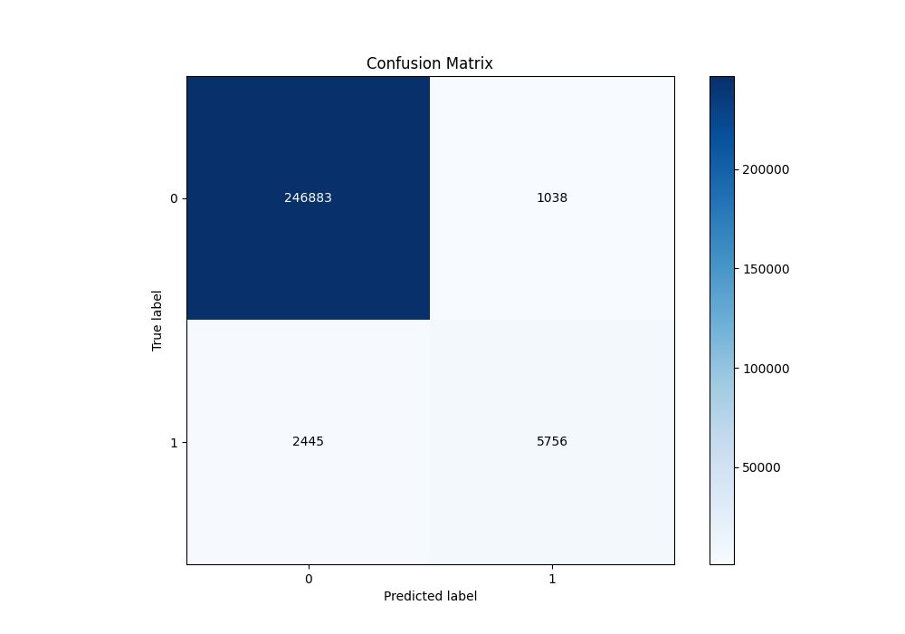
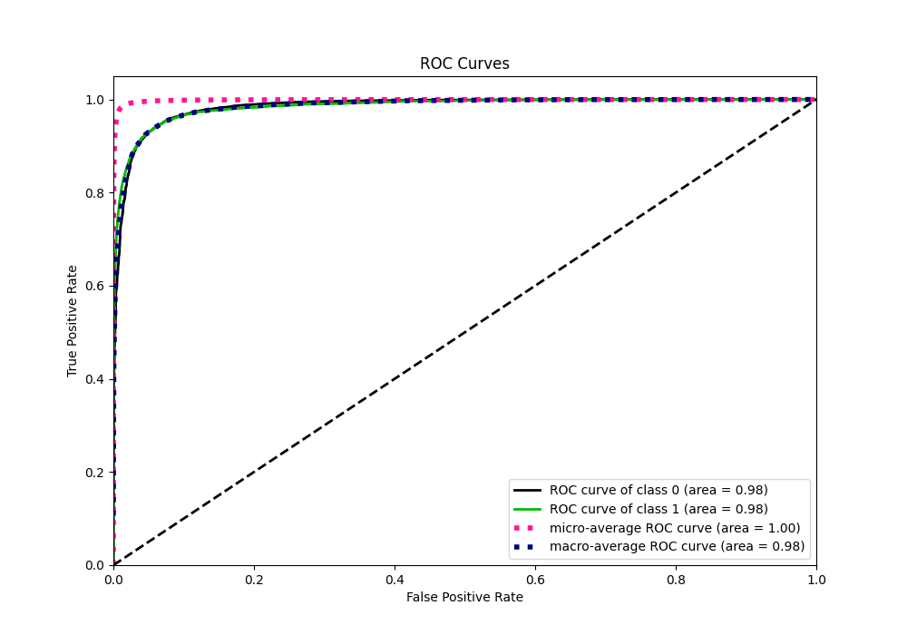
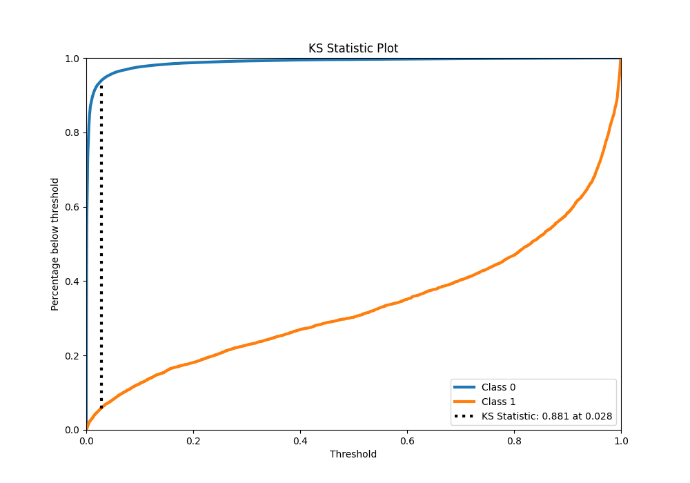
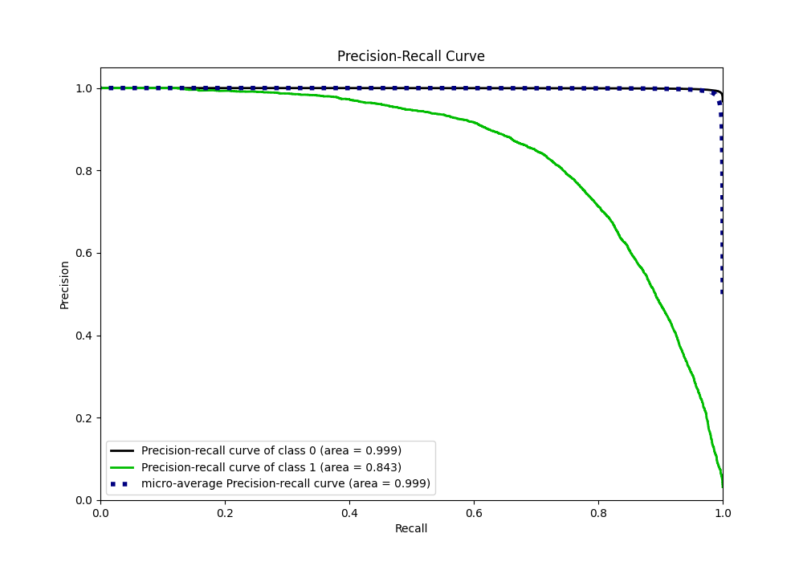
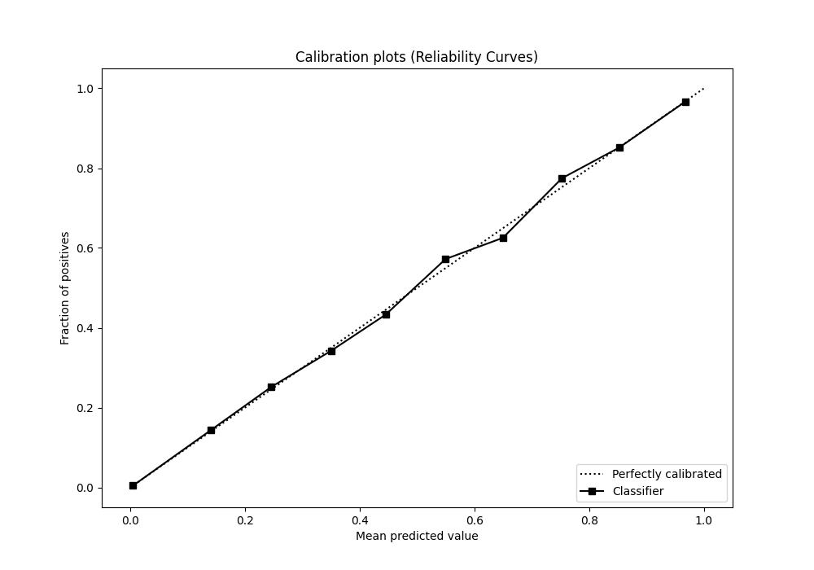
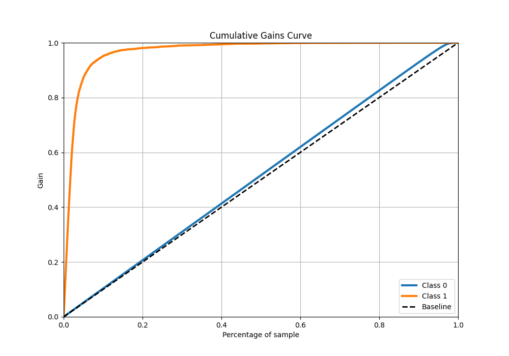
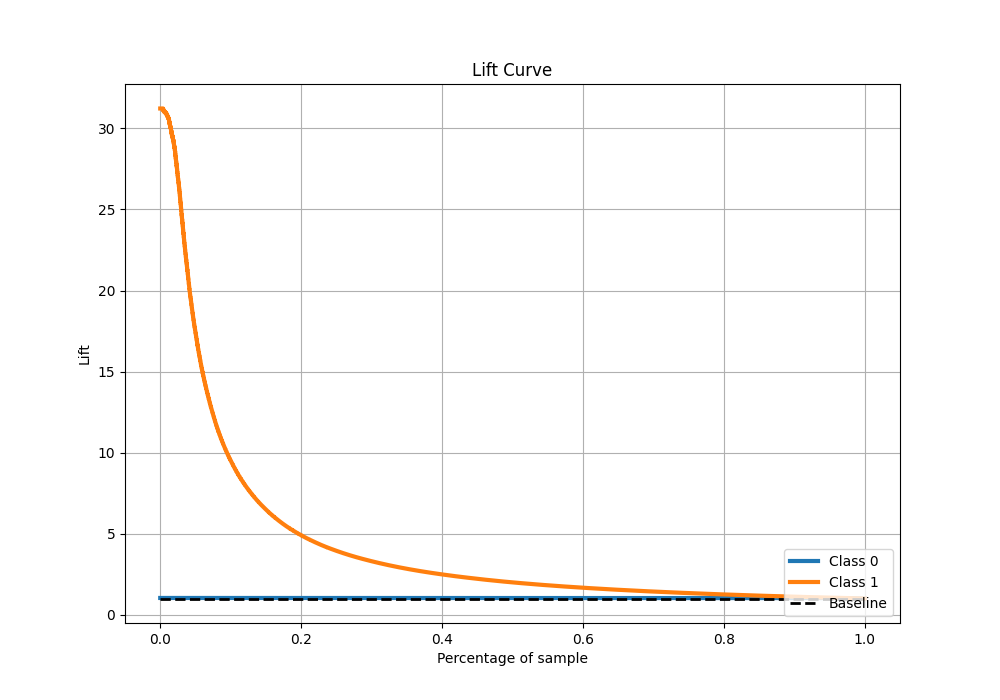

# Summary of 31_CatBoost_GoldenFeatures

[<< Go back](../README.md)

## CatBoost
- **n_jobs**: -1
- **learning_rate**: 0.2
- **depth**: 8
- **rsm**: 1.0
- **loss_function**: Logloss
- **eval_metric**: F1
- **explain_level**: 0

## Validation
 - **validation_type**: kfold
 - **shuffle**: True
 - **stratify**: True
 - **k_folds**: 10

## Optimized metric
f1

## Training time

136.7 seconds

## Metric details
|           |    score |     threshold |
|:----------|---------:|--------------:|
| logloss   | 0.040656 | nan           |
| auc       | 0.984836 | nan           |
| f1        | 0.767723 |   0.484089    |
| accuracy  | 0.986401 |   0.484089    |
| precision | 0.847218 |   0.484089    |
| recall    | 1        |   7.62606e-07 |
| mcc       | 0.764359 |   0.484089    |

## Metric details with threshold from accuracy metric
|           |    score |   threshold |
|:----------|---------:|------------:|
| logloss   | 0.040656 |  nan        |
| auc       | 0.984836 |  nan        |
| f1        | 0.767723 |    0.484089 |
| accuracy  | 0.986401 |    0.484089 |
| precision | 0.847218 |    0.484089 |
| recall    | 0.701866 |    0.484089 |
| mcc       | 0.764359 |    0.484089 |

## Confusion matrix (at threshold=0.484089)
|              |   Predicted as 0 |   Predicted as 1 |
|:-------------|-----------------:|-----------------:|
| Labeled as 0 |           246883 |             1038 |
| Labeled as 1 |             2445 |             5756 |

## Learning curves

## Confusion Matrix

## Normalized Confusion Matrix

## ROC Curve

## Kolmogorov-Smirnov Statistic

## Precision-Recall Curve

## Calibration Curve

## Cumulative Gains Curve

## Lift Curve

[<< Go back](../README.md)
