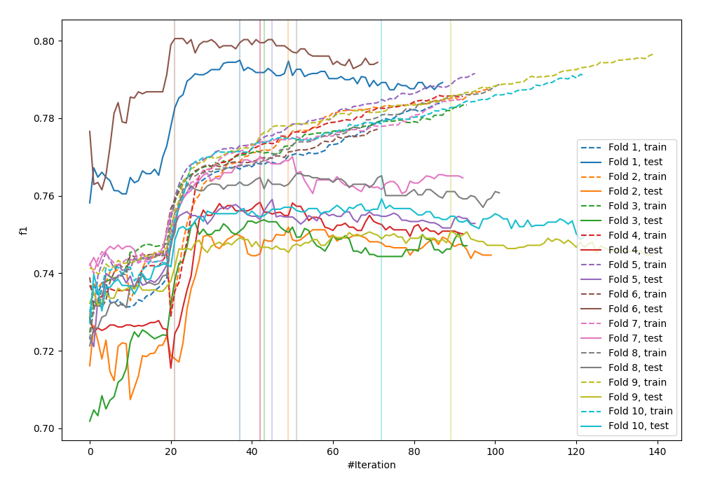
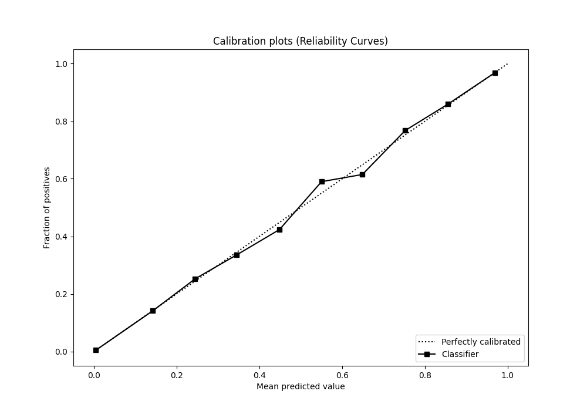
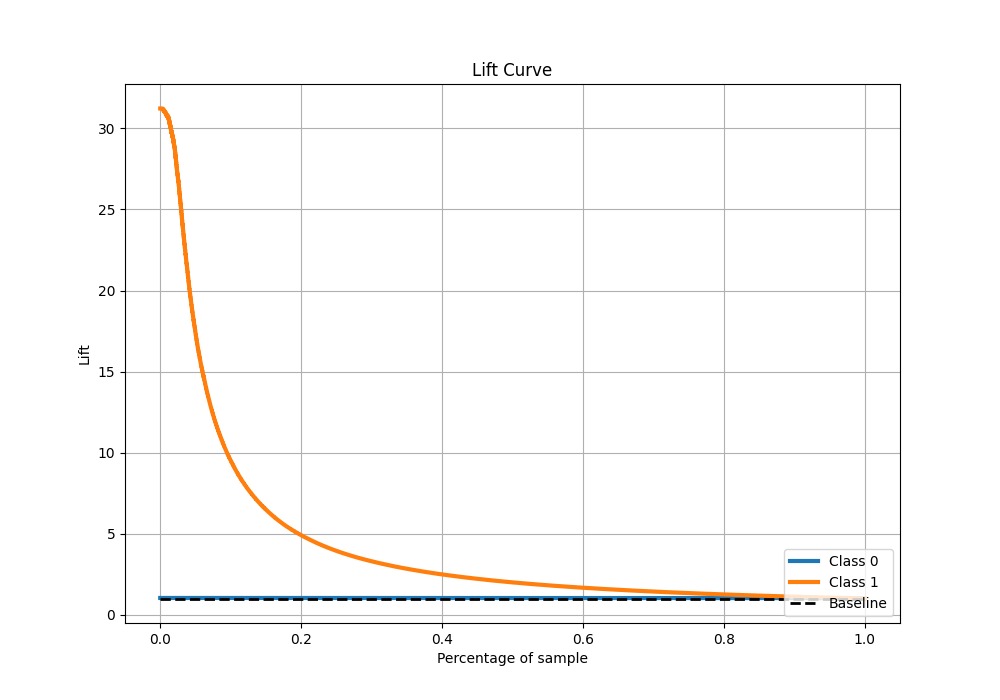

# Summary of 31_CatBoost_KMeansFeatures_RandomFeature

[<< Go back](../README.md)

## CatBoost
- **n_jobs**: -1
- **learning_rate**: 0.2
- **depth**: 8
- **rsm**: 1.0
- **loss_function**: Logloss
- **eval_metric**: F1
- **explain_level**: 1

## Validation
 - **validation_type**: kfold
 - **shuffle**: True
 - **stratify**: True
 - **k_folds**: 10

## Optimized metric
f1

## Training time

188.7 seconds

## Metric details
|           |     score |     threshold |
|:----------|----------:|--------------:|
| logloss   | 0.0407475 | nan           |
| auc       | 0.984783  | nan           |
| f1        | 0.76617   |   0.483057    |
| accuracy  | 0.986323  |   0.483057    |
| precision | 0.84646   |   0.483057    |
| recall    | 1         |   1.45914e-06 |
| mcc       | 0.76284   |   0.483057    |

## Metric details with threshold from accuracy metric
|           |     score |   threshold |
|:----------|----------:|------------:|
| logloss   | 0.0407475 |  nan        |
| auc       | 0.984783  |  nan        |
| f1        | 0.76617   |    0.483057 |
| accuracy  | 0.986323  |    0.483057 |
| precision | 0.84646   |    0.483057 |
| recall    | 0.699793  |    0.483057 |
| mcc       | 0.76284   |    0.483057 |

## Confusion matrix (at threshold=0.483057)
|              |   Predicted as 0 |   Predicted as 1 |
|:-------------|-----------------:|-----------------:|
| Labeled as 0 |           246880 |             1041 |
| Labeled as 1 |             2462 |             5739 |

## Learning curves

## Confusion Matrix

## Normalized Confusion Matrix

## ROC Curve

## Kolmogorov-Smirnov Statistic

## Precision-Recall Curve

## Calibration Curve

## Cumulative Gains Curve

## Lift Curve

[<< Go back](../README.md)
