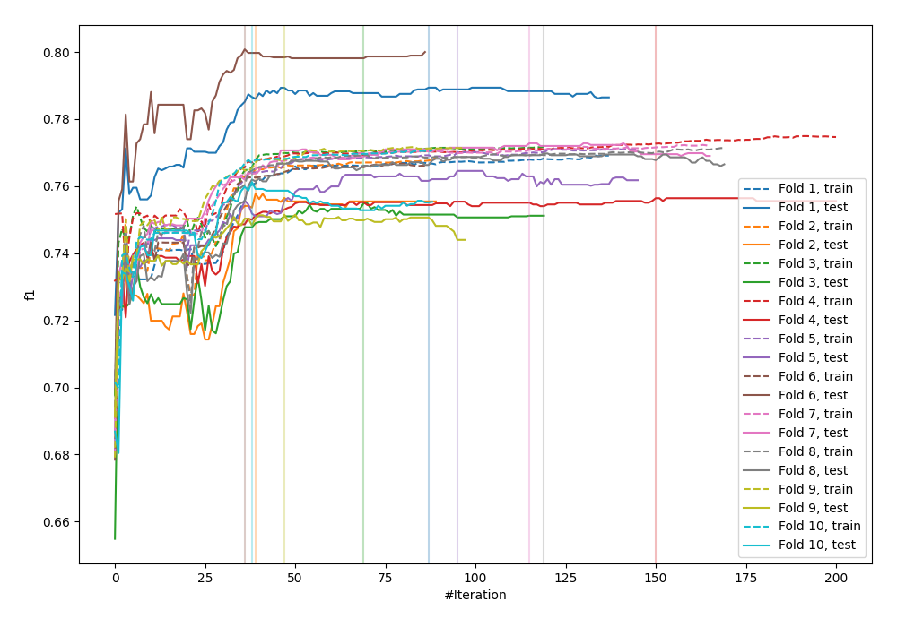
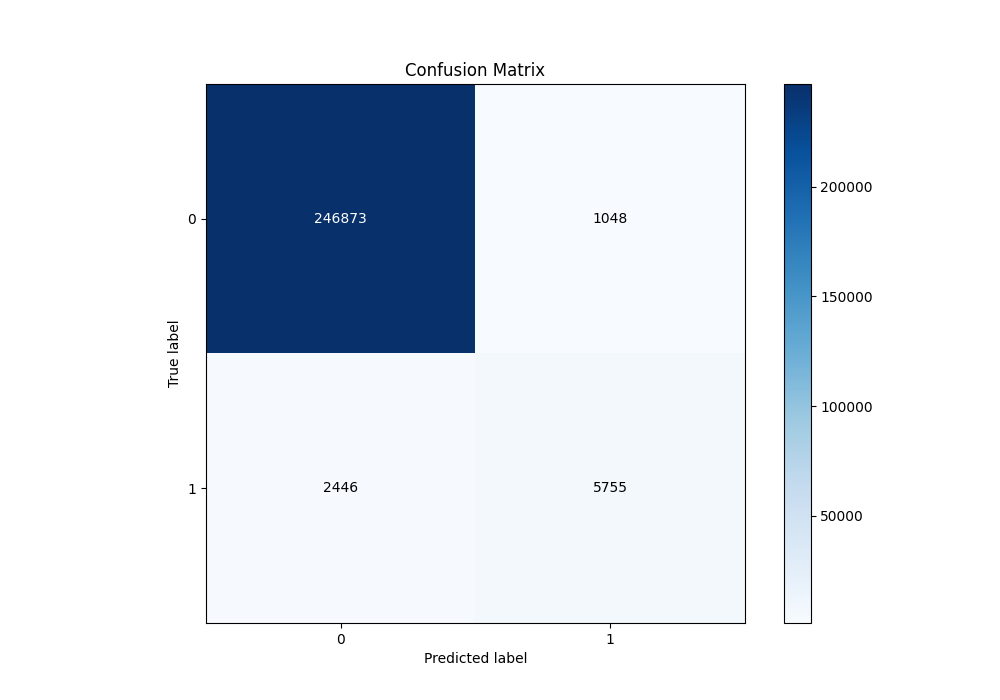
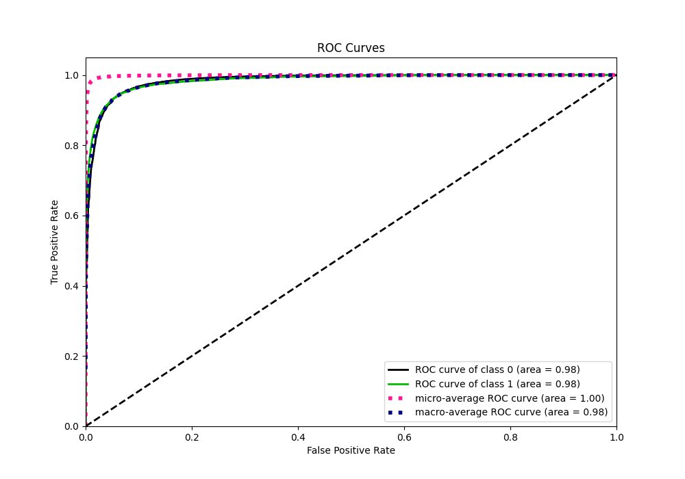
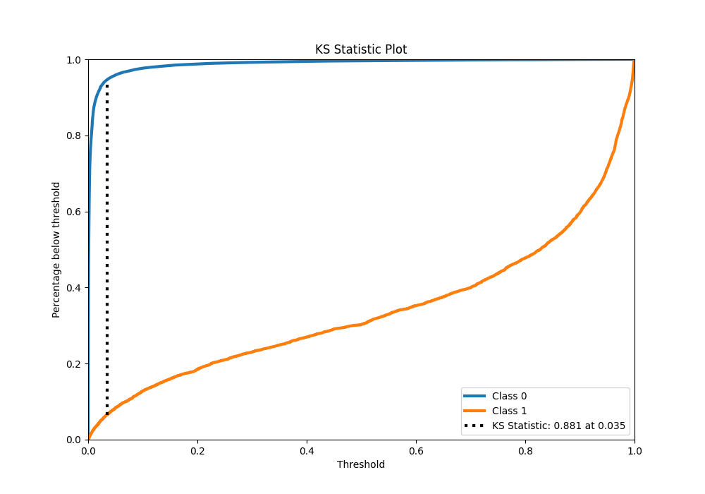
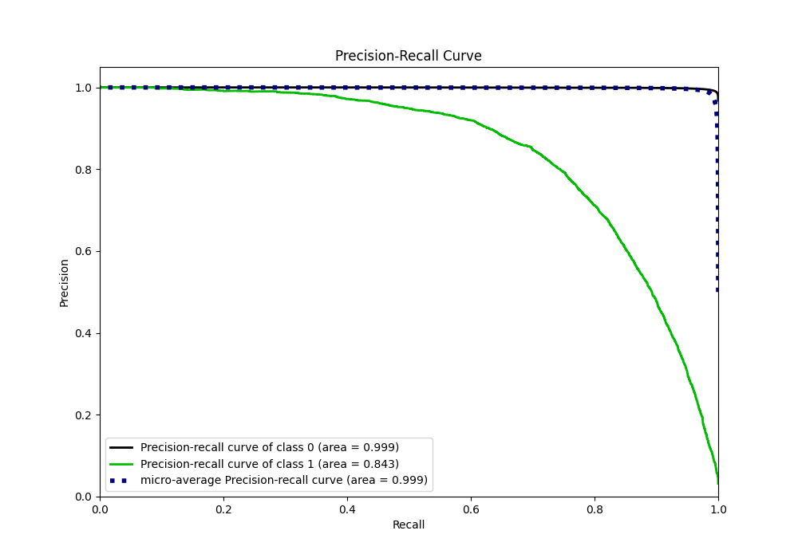
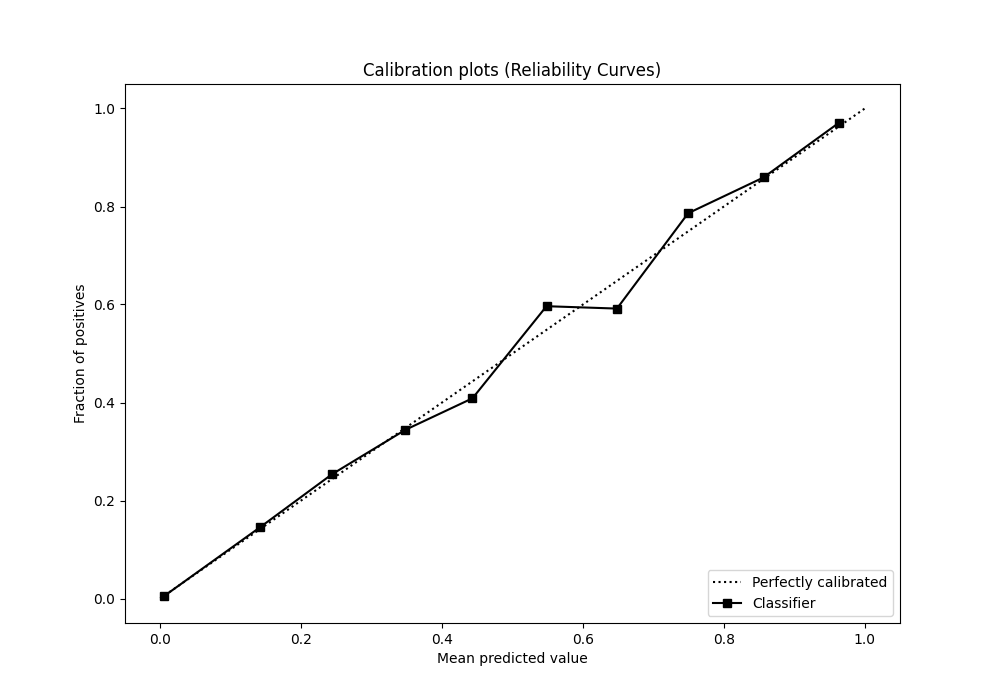
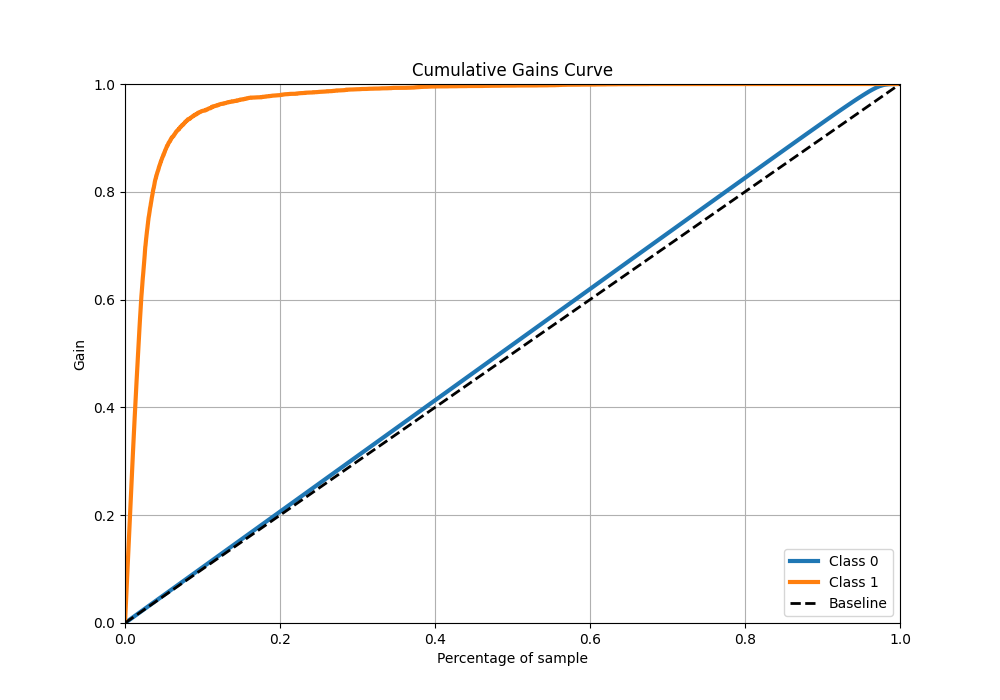
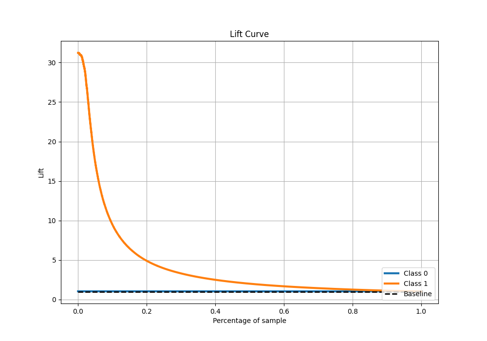

# Summary of 32_CatBoost_GoldenFeatures

[<< Go back](../README.md)

## CatBoost
- **n_jobs**: -1
- **learning_rate**: 0.1
- **depth**: 6
- **rsm**: 0.7
- **loss_function**: Logloss
- **eval_metric**: F1
- **explain_level**: 0

## Validation
 - **validation_type**: kfold
 - **shuffle**: True
 - **stratify**: True
 - **k_folds**: 10

## Optimized metric
f1

## Training time

134.3 seconds

## Metric details
|           |     score |    threshold |
|:----------|----------:|-------------:|
| logloss   | 0.0408475 | nan          |
| auc       | 0.984783  | nan          |
| f1        | 0.767129  |   0.477918   |
| accuracy  | 0.986358  |   0.477918   |
| precision | 0.84595   |   0.477918   |
| recall    | 1         |   5.6803e-07 |
| mcc       | 0.763689  |   0.477918   |

## Metric details with threshold from accuracy metric
|           |     score |   threshold |
|:----------|----------:|------------:|
| logloss   | 0.0408475 |  nan        |
| auc       | 0.984783  |  nan        |
| f1        | 0.767129  |    0.477918 |
| accuracy  | 0.986358  |    0.477918 |
| precision | 0.84595   |    0.477918 |
| recall    | 0.701744  |    0.477918 |
| mcc       | 0.763689  |    0.477918 |

## Confusion matrix (at threshold=0.477918)
|              |   Predicted as 0 |   Predicted as 1 |
|:-------------|-----------------:|-----------------:|
| Labeled as 0 |           246873 |             1048 |
| Labeled as 1 |             2446 |             5755 |

## Learning curves

## Confusion Matrix

## Normalized Confusion Matrix

## ROC Curve

## Kolmogorov-Smirnov Statistic

## Precision-Recall Curve

## Calibration Curve

## Cumulative Gains Curve

## Lift Curve

[<< Go back](../README.md)
