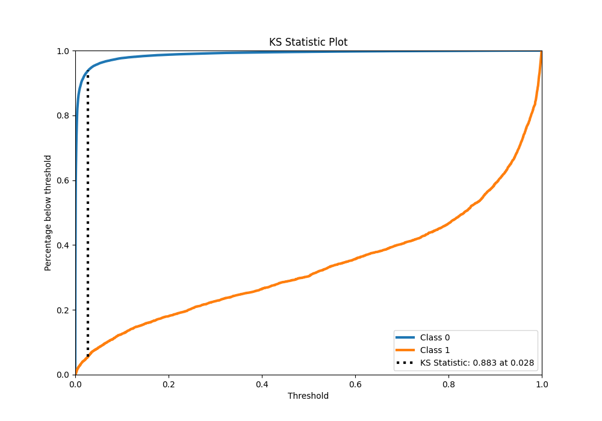

# Summary of 32_CatBoost_KMeansFeatures

[<< Go back](../README.md)

## CatBoost
- **n_jobs**: -1
- **learning_rate**: 0.1
- **depth**: 6
- **rsm**: 0.7
- **loss_function**: Logloss
- **eval_metric**: F1
- **explain_level**: 0

## Validation
 - **validation_type**: kfold
 - **shuffle**: True
 - **stratify**: True
 - **k_folds**: 10

## Optimized metric
f1

## Training time

145.4 seconds

## Metric details
|           |     score |     threshold |
|:----------|----------:|--------------:|
| logloss   | 0.0404554 | nan           |
| auc       | 0.985503  | nan           |
| f1        | 0.767304  |   0.480606    |
| accuracy  | 0.986362  |   0.480606    |
| precision | 0.845668  |   0.480606    |
| recall    | 1         |   2.81668e-06 |
| mcc       | 0.763828  |   0.480606    |

## Metric details with threshold from accuracy metric
|           |     score |   threshold |
|:----------|----------:|------------:|
| logloss   | 0.0404554 |  nan        |
| auc       | 0.985503  |  nan        |
| f1        | 0.767304  |    0.480606 |
| accuracy  | 0.986362  |    0.480606 |
| precision | 0.845668  |    0.480606 |
| recall    | 0.702231  |    0.480606 |
| mcc       | 0.763828  |    0.480606 |

## Confusion matrix (at threshold=0.480606)
|              |   Predicted as 0 |   Predicted as 1 |
|:-------------|-----------------:|-----------------:|
| Labeled as 0 |           246870 |             1051 |
| Labeled as 1 |             2442 |             5759 |

## Learning curves

## Confusion Matrix

## Normalized Confusion Matrix

## ROC Curve

## Kolmogorov-Smirnov Statistic

## Precision-Recall Curve

## Calibration Curve

## Cumulative Gains Curve

## Lift Curve

[<< Go back](../README.md)
