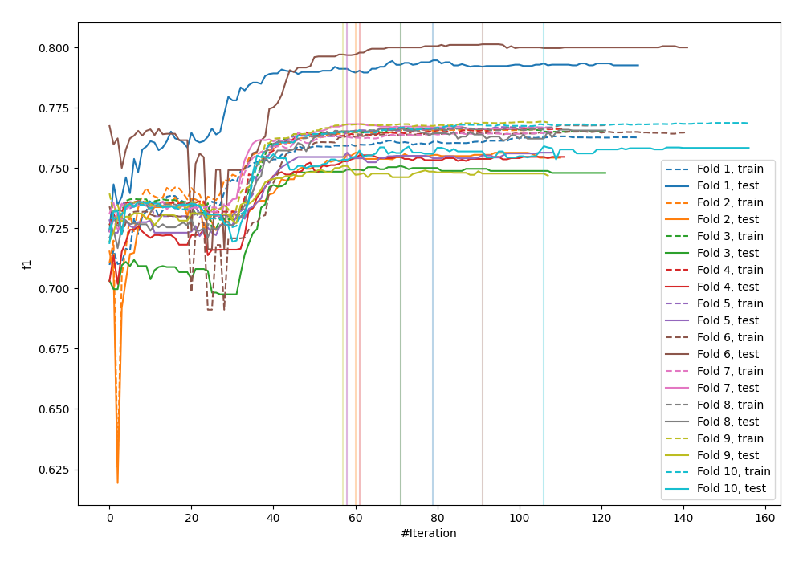
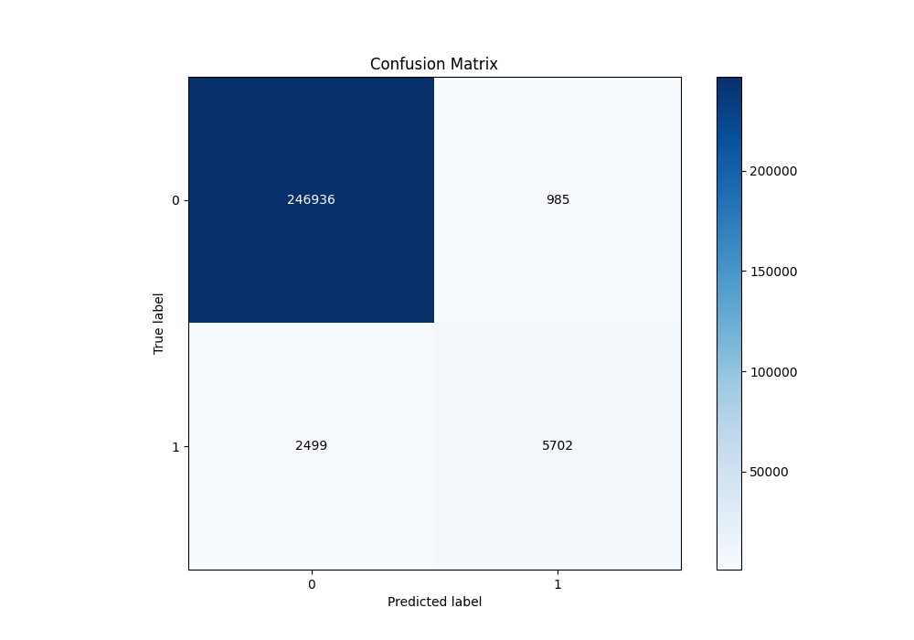
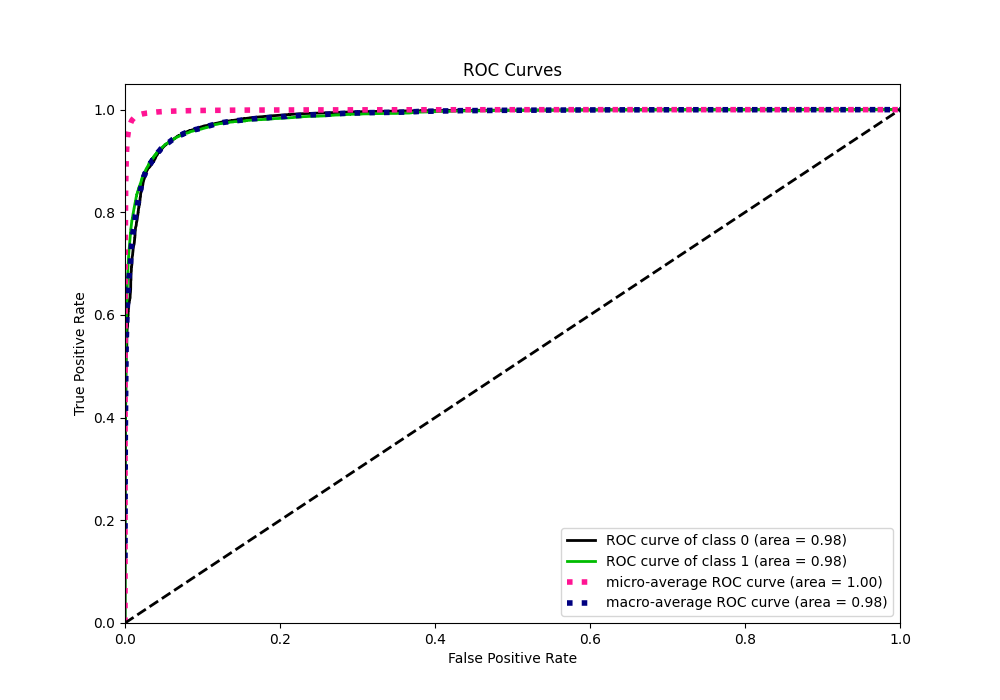
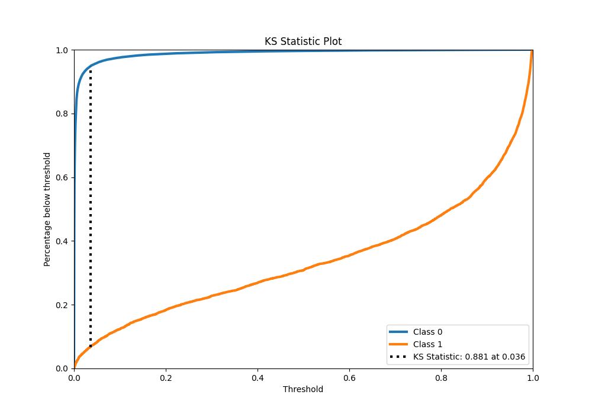
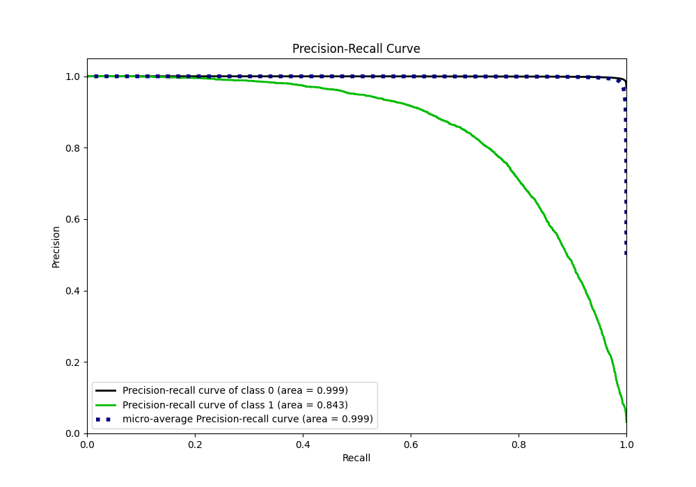
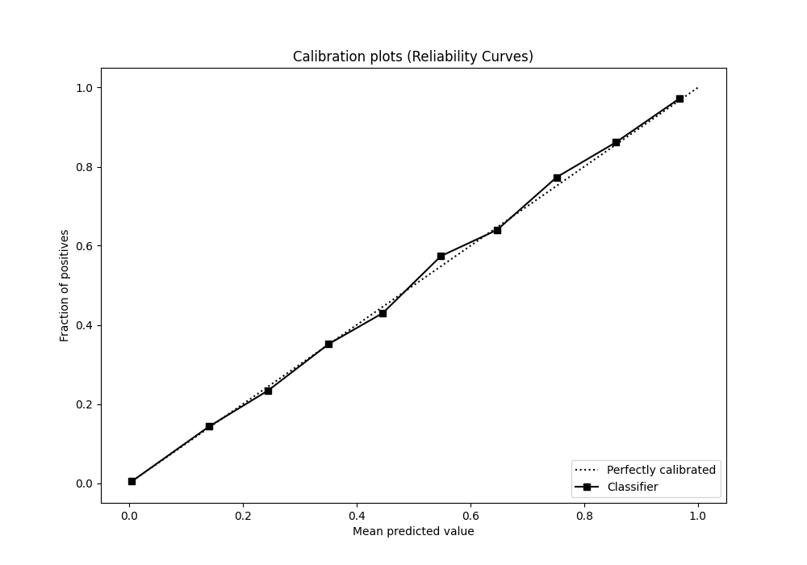
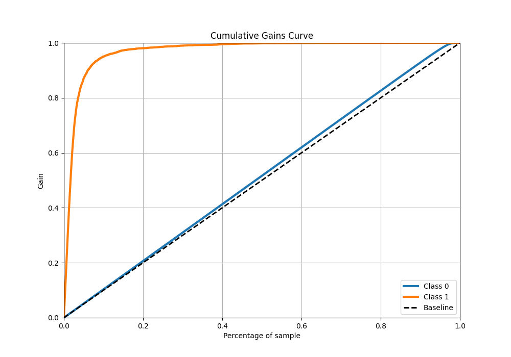
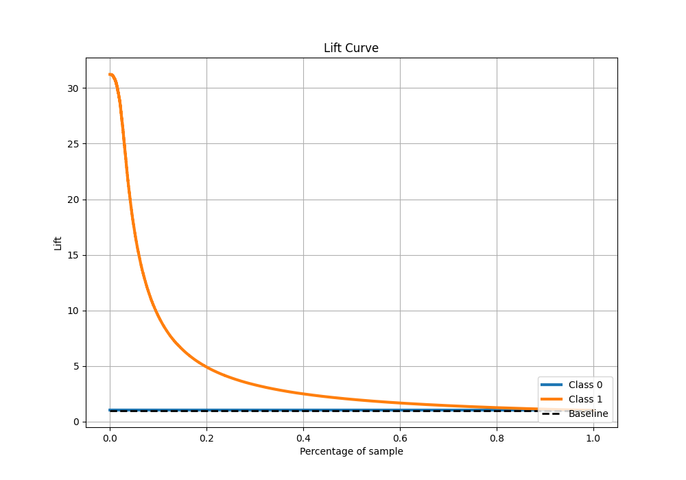

# Summary of 33_CatBoost

[<< Go back](../README.md)

## CatBoost
- **n_jobs**: -1
- **learning_rate**: 0.1
- **depth**: 4
- **rsm**: 0.7
- **loss_function**: Logloss
- **eval_metric**: F1
- **explain_level**: 0

## Validation
 - **validation_type**: kfold
 - **shuffle**: True
 - **stratify**: True
 - **k_folds**: 10

## Optimized metric
f1

## Training time

103.2 seconds

## Metric details
|           |     score |     threshold |
|:----------|----------:|--------------:|
| logloss   | 0.0406837 | nan           |
| auc       | 0.984944  | nan           |
| f1        | 0.765986  |   0.489735    |
| accuracy  | 0.986397  |   0.489735    |
| precision | 0.852699  |   0.489735    |
| recall    | 1         |   8.06885e-06 |
| mcc       | 0.763251  |   0.489735    |

## Metric details with threshold from accuracy metric
|           |     score |   threshold |
|:----------|----------:|------------:|
| logloss   | 0.0406837 |  nan        |
| auc       | 0.984944  |  nan        |
| f1        | 0.765986  |    0.489735 |
| accuracy  | 0.986397  |    0.489735 |
| precision | 0.852699  |    0.489735 |
| recall    | 0.695281  |    0.489735 |
| mcc       | 0.763251  |    0.489735 |

## Confusion matrix (at threshold=0.489735)
|              |   Predicted as 0 |   Predicted as 1 |
|:-------------|-----------------:|-----------------:|
| Labeled as 0 |           246936 |              985 |
| Labeled as 1 |             2499 |             5702 |

## Learning curves

## Confusion Matrix

## Normalized Confusion Matrix

## ROC Curve

## Kolmogorov-Smirnov Statistic

## Precision-Recall Curve

## Calibration Curve

## Cumulative Gains Curve

## Lift Curve

[<< Go back](../README.md)
