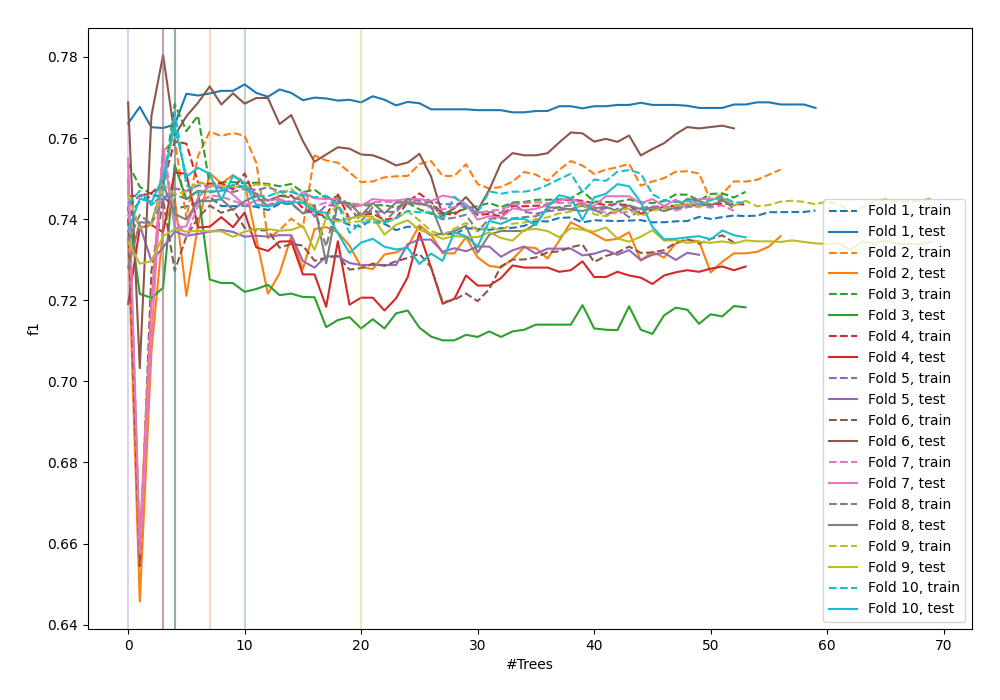
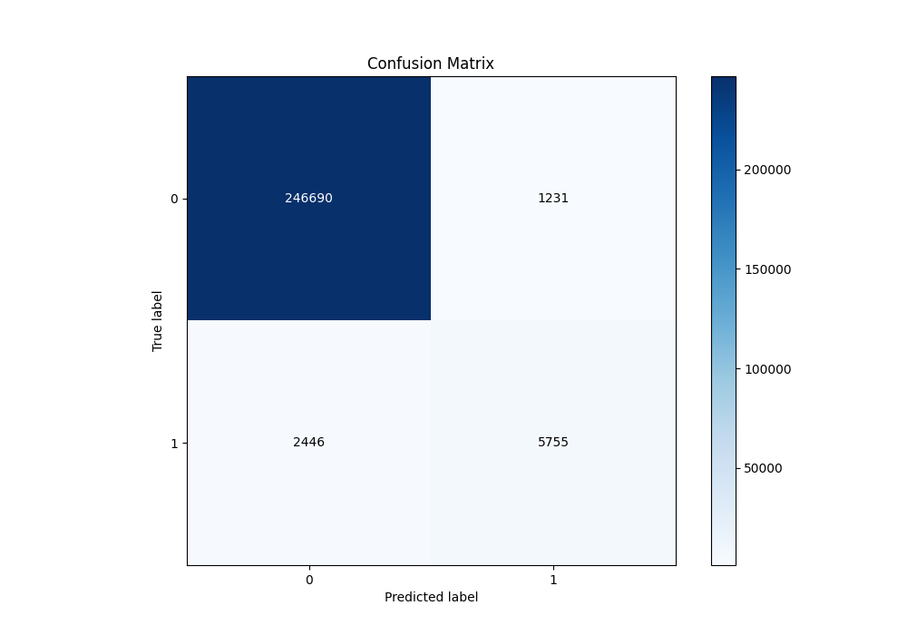
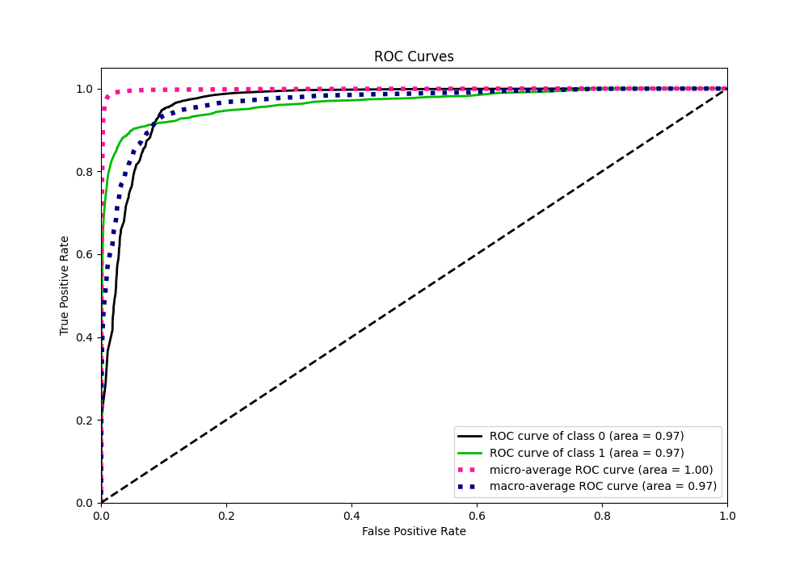
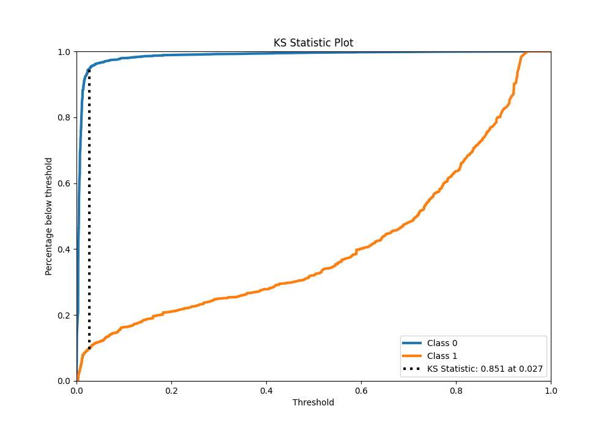
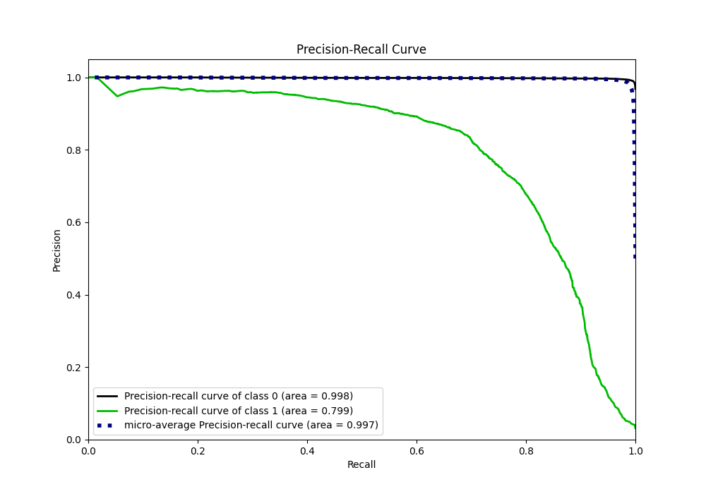
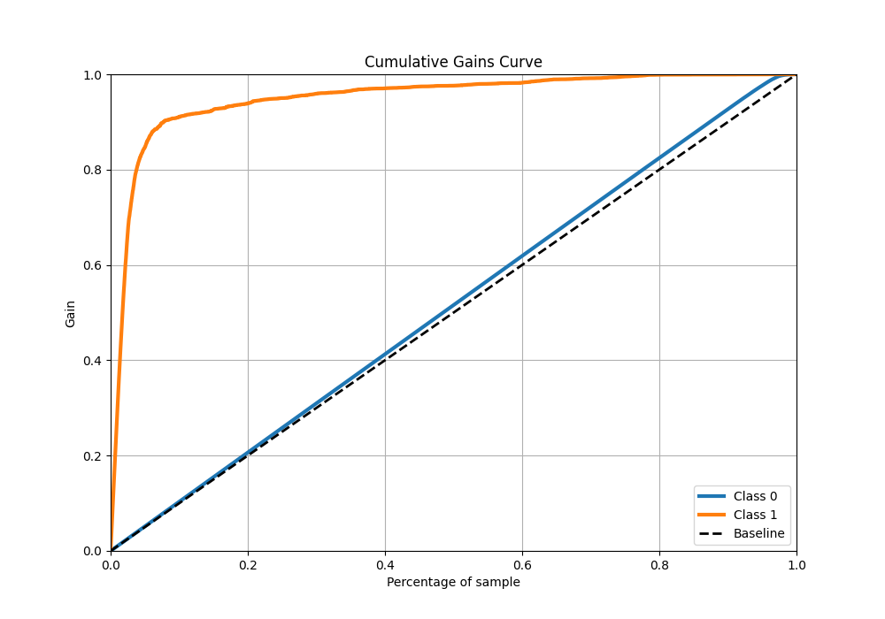
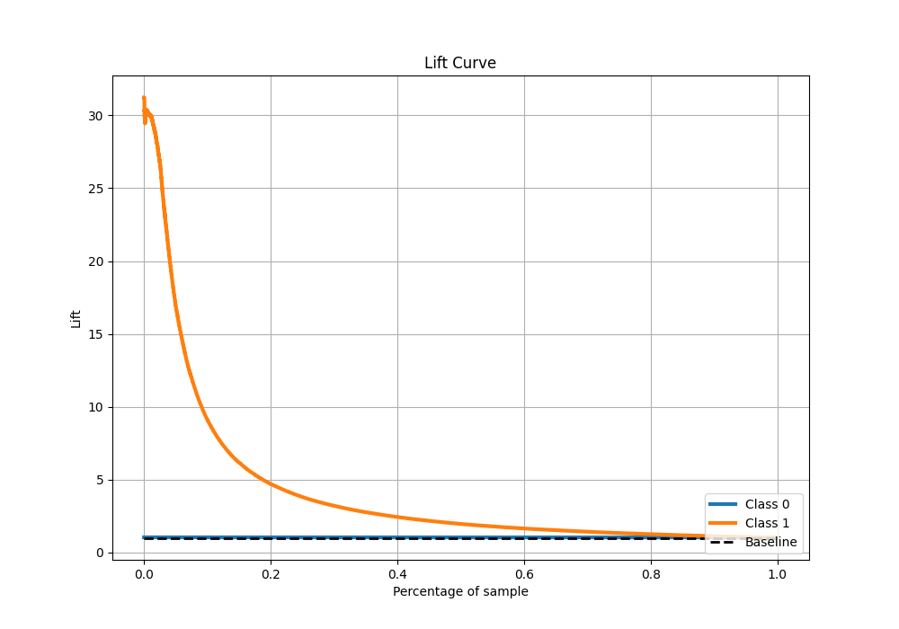

# Summary of 37_RandomForest

[<< Go back](../README.md)

## Random Forest
- **n_jobs**: -1
- **criterion**: gini
- **max_features**: 0.5
- **min_samples_split**: 20
- **max_depth**: 4
- **eval_metric_name**: f1
- **explain_level**: 0

## Validation
 - **validation_type**: kfold
 - **shuffle**: True
 - **stratify**: True
 - **k_folds**: 10

## Optimized metric
f1

## Training time

101.5 seconds

## Metric details
|           |     score |   threshold |
|:----------|----------:|------------:|
| logloss   | 0.0489703 |  nan        |
| auc       | 0.965801  |  nan        |
| f1        | 0.757885  |    0.452547 |
| accuracy  | 0.985644  |    0.452547 |
| precision | 0.82379   |    0.452547 |
| recall    | 1         |    0        |
| mcc       | 0.753099  |    0.452547 |

## Metric details with threshold from accuracy metric
|           |     score |   threshold |
|:----------|----------:|------------:|
| logloss   | 0.0489703 |  nan        |
| auc       | 0.965801  |  nan        |
| f1        | 0.757885  |    0.452547 |
| accuracy  | 0.985644  |    0.452547 |
| precision | 0.82379   |    0.452547 |
| recall    | 0.701744  |    0.452547 |
| mcc       | 0.753099  |    0.452547 |

## Confusion matrix (at threshold=0.452547)
|              |   Predicted as 0 |   Predicted as 1 |
|:-------------|-----------------:|-----------------:|
| Labeled as 0 |           246690 |             1231 |
| Labeled as 1 |             2446 |             5755 |

## Learning curves

## Confusion Matrix

## Normalized Confusion Matrix

## ROC Curve

## Kolmogorov-Smirnov Statistic

## Precision-Recall Curve

## Calibration Curve

## Cumulative Gains Curve

## Lift Curve

[<< Go back](../README.md)
