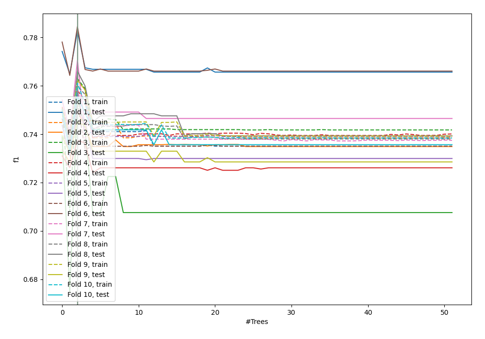
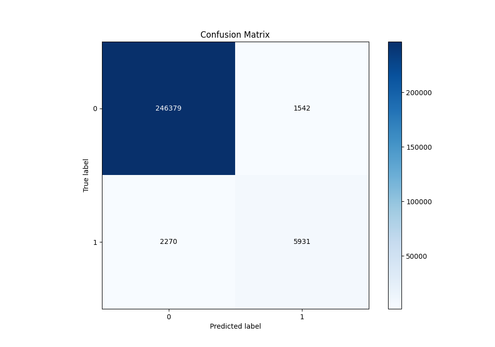
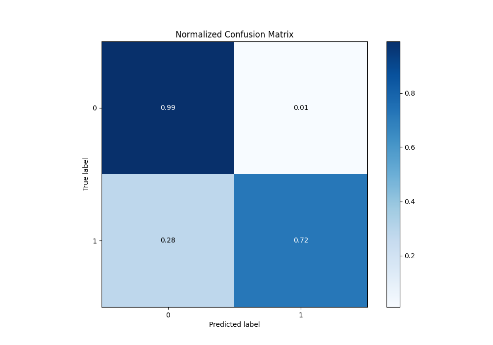
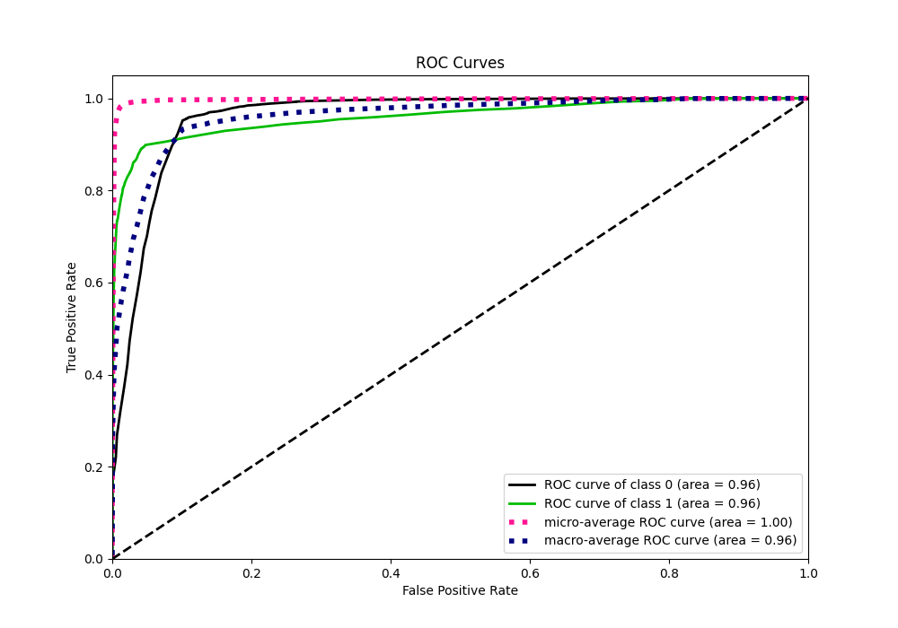
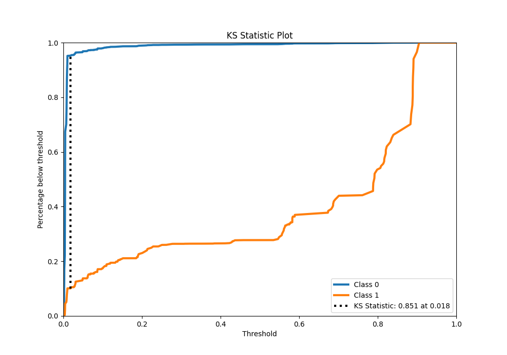
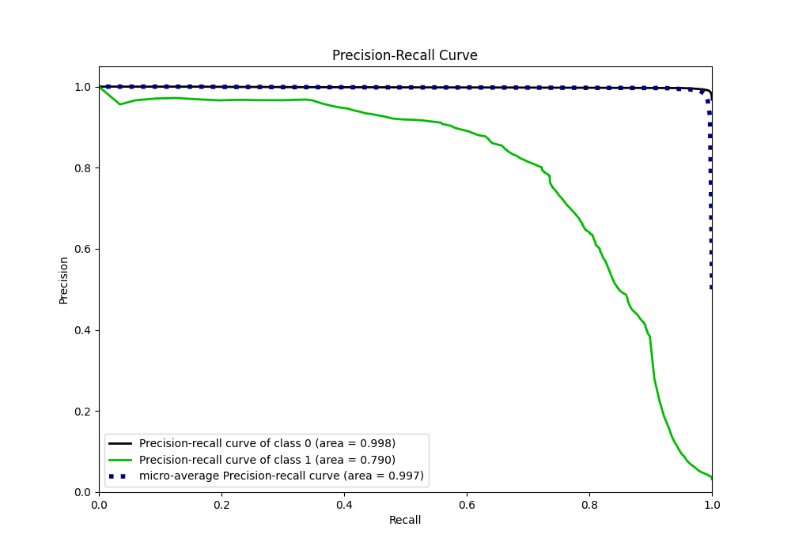
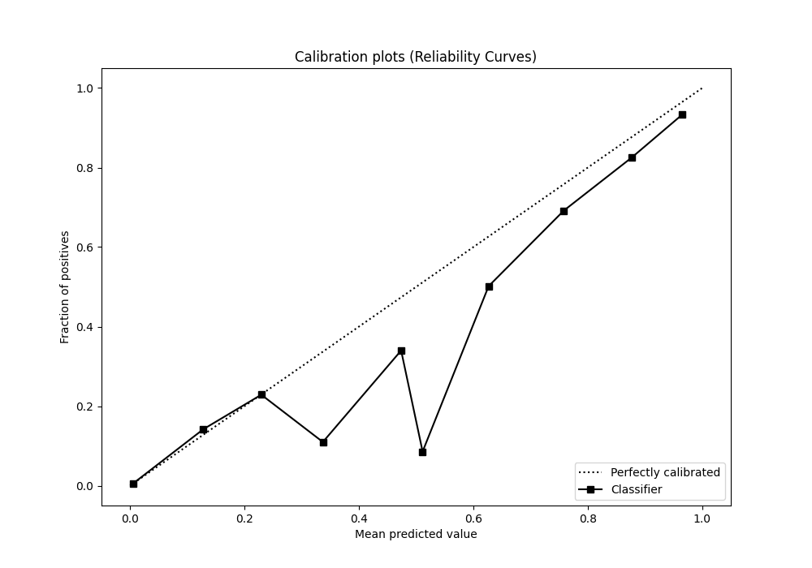
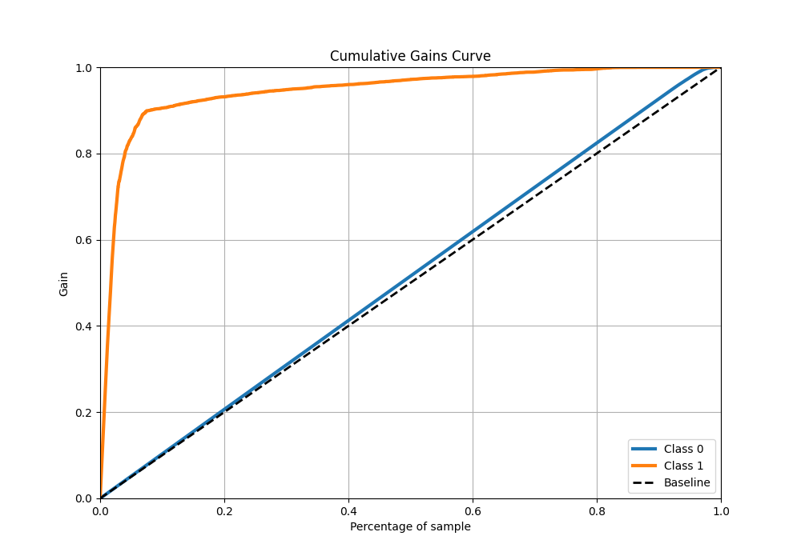
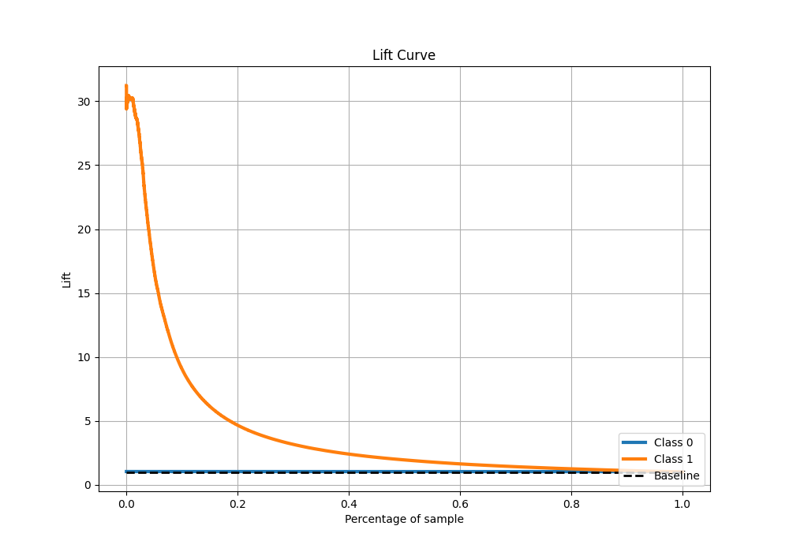

# Summary of 39_RandomForest

[<< Go back](../README.md)

## Random Forest
- **n_jobs**: -1
- **criterion**: gini
- **max_features**: 0.8
- **min_samples_split**: 40
- **max_depth**: 3
- **eval_metric_name**: f1
- **explain_level**: 0

## Validation
 - **validation_type**: kfold
 - **shuffle**: True
 - **stratify**: True
 - **k_folds**: 10

## Optimized metric
f1

## Training time

100.2 seconds

## Metric details
|           |     score |    threshold |
|:----------|----------:|-------------:|
| logloss   | 0.0501237 | nan          |
| auc       | 0.960507  | nan          |
| f1        | 0.756795  |   0.443986   |
| accuracy  | 0.985116  |   0.443986   |
| precision | 0.793657  |   0.443986   |
| recall    | 1         |   0.00128037 |
| mcc       | 0.749996  |   0.443986   |

## Metric details with threshold from accuracy metric
|           |     score |   threshold |
|:----------|----------:|------------:|
| logloss   | 0.0501237 |  nan        |
| auc       | 0.960507  |  nan        |
| f1        | 0.756795  |    0.443986 |
| accuracy  | 0.985116  |    0.443986 |
| precision | 0.793657  |    0.443986 |
| recall    | 0.723204  |    0.443986 |
| mcc       | 0.749996  |    0.443986 |

## Confusion matrix (at threshold=0.443986)
|              |   Predicted as 0 |   Predicted as 1 |
|:-------------|-----------------:|-----------------:|
| Labeled as 0 |           246379 |             1542 |
| Labeled as 1 |             2270 |             5931 |

## Learning curves

## Confusion Matrix

## Normalized Confusion Matrix

## ROC Curve

## Kolmogorov-Smirnov Statistic

## Precision-Recall Curve

## Calibration Curve

## Cumulative Gains Curve

## Lift Curve

[<< Go back](../README.md)
