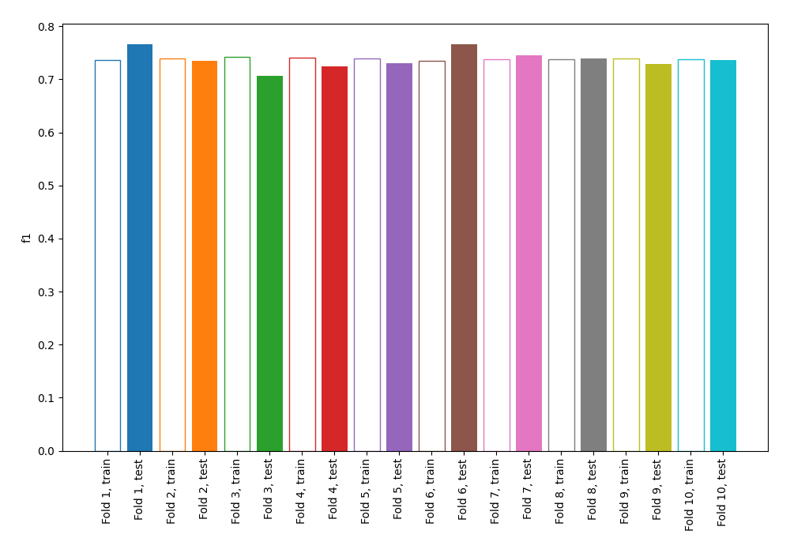
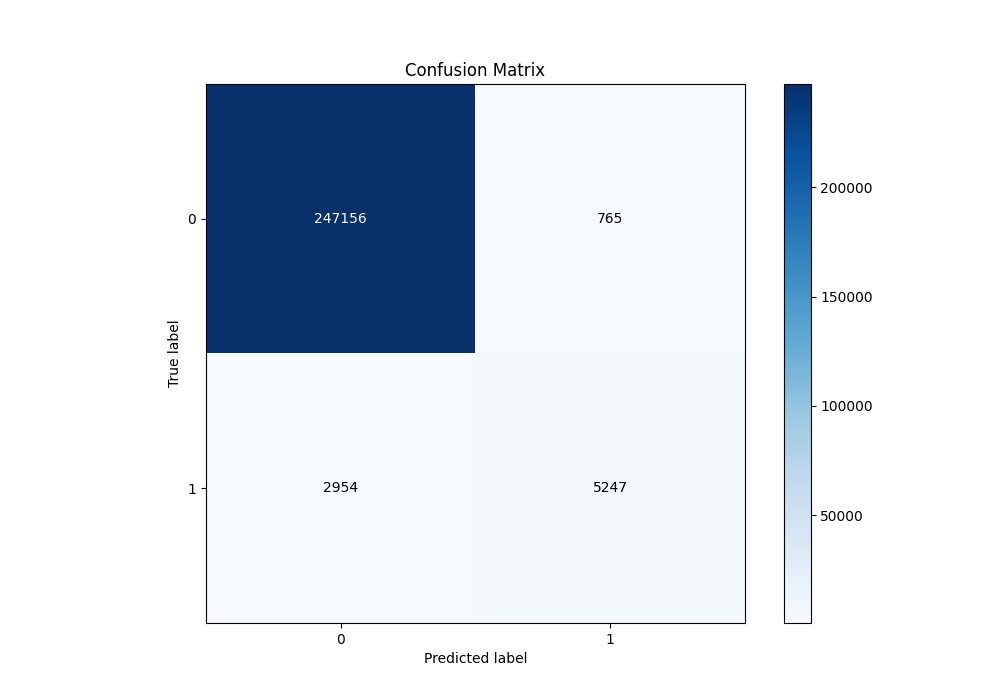
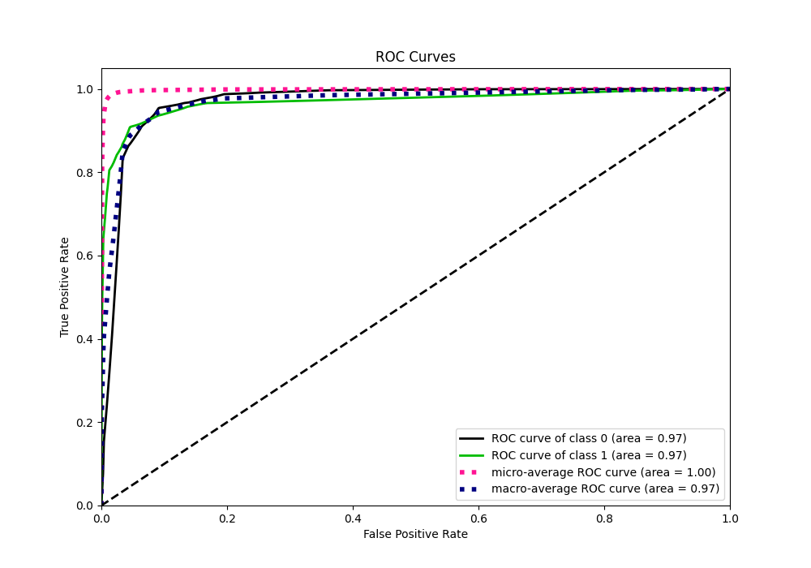
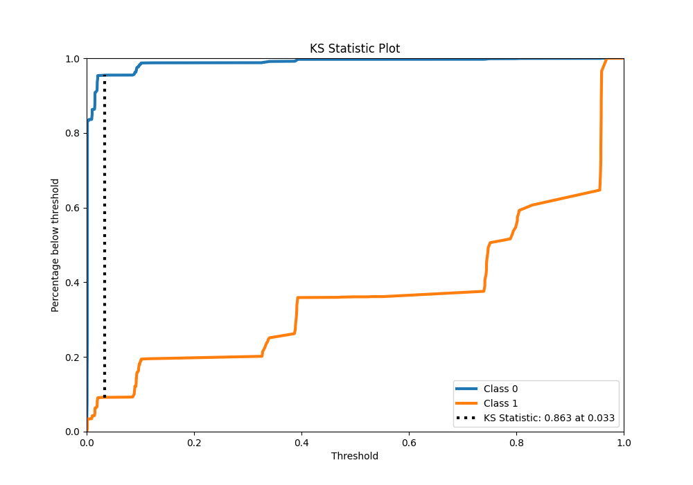
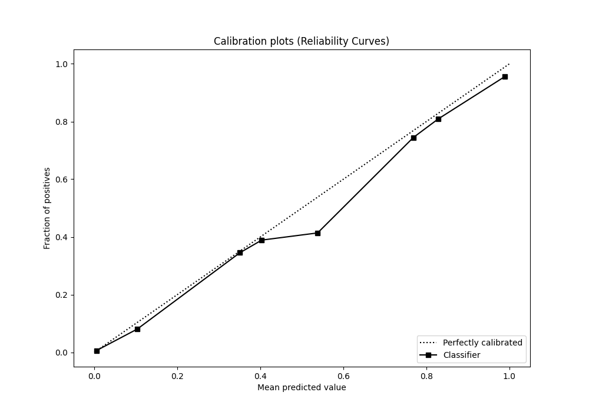
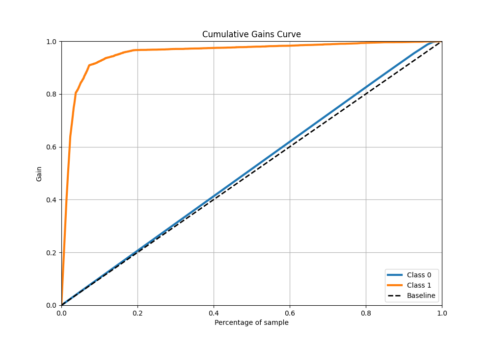
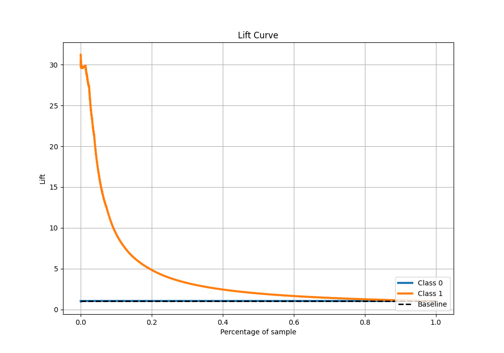

# Summary of 3_DecisionTree

[<< Go back](../README.md)

## Decision Tree
- **n_jobs**: -1
- **criterion**: gini
- **max_depth**: 4
- **explain_level**: 0

## Validation
 - **validation_type**: kfold
 - **shuffle**: True
 - **stratify**: True
 - **k_folds**: 10

## Optimized metric
f1

## Training time

37.0 seconds

## Metric details
|           |     score |     threshold |
|:----------|----------:|--------------:|
| logloss   | 0.0460664 | nan           |
| auc       | 0.969676  | nan           |
| f1        | 0.73861   |   0.195836    |
| accuracy  | 0.98548   |   0.478417    |
| precision | 0.872754  |   0.478417    |
| recall    | 1         |   0.000763399 |
| mcc       | 0.740389  |   0.478417    |

## Metric details with threshold from accuracy metric
|           |     score |   threshold |
|:----------|----------:|------------:|
| logloss   | 0.0460664 |  nan        |
| auc       | 0.969676  |  nan        |
| f1        | 0.738338  |    0.478417 |
| accuracy  | 0.98548   |    0.478417 |
| precision | 0.872754  |    0.478417 |
| recall    | 0.6398    |    0.478417 |
| mcc       | 0.740389  |    0.478417 |

## Confusion matrix (at threshold=0.478417)
|              |   Predicted as 0 |   Predicted as 1 |
|:-------------|-----------------:|-----------------:|
| Labeled as 0 |           247156 |              765 |
| Labeled as 1 |             2954 |             5247 |

## Learning curves

## Confusion Matrix

## Normalized Confusion Matrix

## ROC Curve

## Kolmogorov-Smirnov Statistic

## Precision-Recall Curve

## Calibration Curve

## Cumulative Gains Curve

## Lift Curve

[<< Go back](../README.md)
