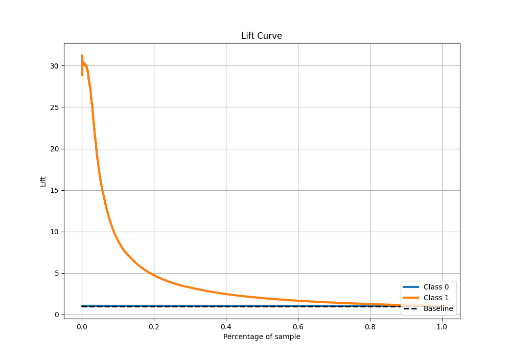

# Summary of 41_RandomForest

[<< Go back](../README.md)

## Random Forest
- **n_jobs**: -1
- **criterion**: gini
- **max_features**: 0.7
- **min_samples_split**: 50
- **max_depth**: 3
- **eval_metric_name**: f1
- **explain_level**: 0

## Validation
 - **validation_type**: kfold
 - **shuffle**: True
 - **stratify**: True
 - **k_folds**: 10

## Optimized metric
f1

## Training time

112.3 seconds

## Metric details
|           |     score |    threshold |
|:----------|----------:|-------------:|
| logloss   | 0.0509271 | nan          |
| auc       | 0.968264  | nan          |
| f1        | 0.743903  |   0.205814   |
| accuracy  | 0.9853    |   0.438637   |
| precision | 0.843769  |   0.438637   |
| recall    | 1         |   0.00122318 |
| mcc       | 0.741213  |   0.438637   |

## Metric details with threshold from accuracy metric
|           |     score |   threshold |
|:----------|----------:|------------:|
| logloss   | 0.0509271 |  nan        |
| auc       | 0.968264  |  nan        |
| f1        | 0.743056  |    0.438637 |
| accuracy  | 0.9853    |    0.438637 |
| precision | 0.843769  |    0.438637 |
| recall    | 0.663821  |    0.438637 |
| mcc       | 0.741213  |    0.438637 |

## Confusion matrix (at threshold=0.438637)
|              |   Predicted as 0 |   Predicted as 1 |
|:-------------|-----------------:|-----------------:|
| Labeled as 0 |           246913 |             1008 |
| Labeled as 1 |             2757 |             5444 |

## Learning curves

## Confusion Matrix

## Normalized Confusion Matrix

## ROC Curve

## Kolmogorov-Smirnov Statistic

## Precision-Recall Curve

## Calibration Curve

## Cumulative Gains Curve

## Lift Curve

[<< Go back](../README.md)
