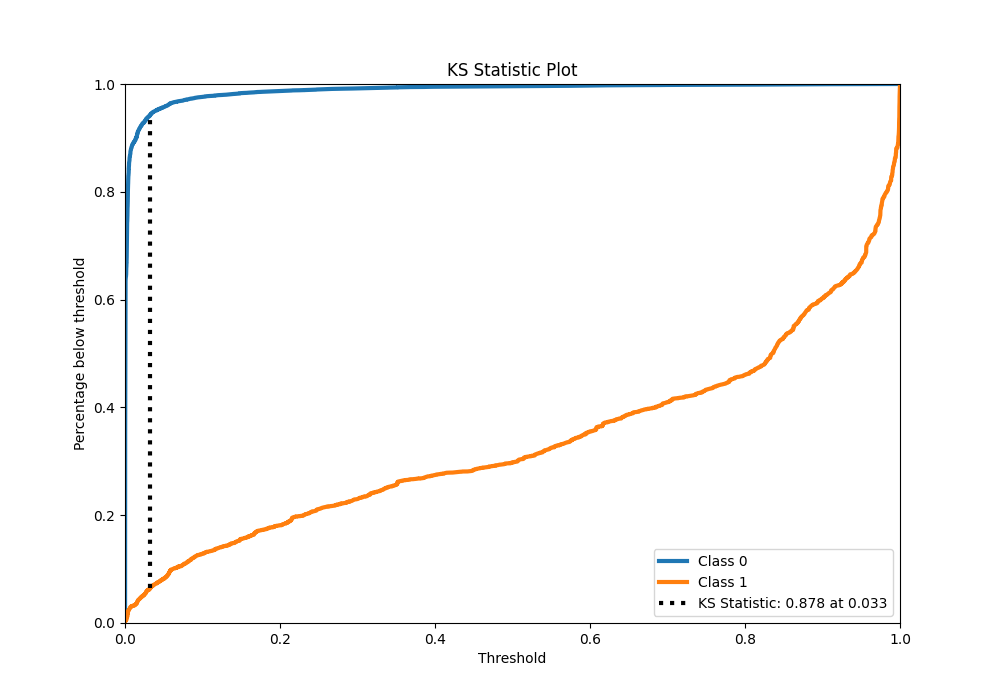

# Summary of 42_RandomForest

[<< Go back](../README.md)

## Random Forest
- **n_jobs**: -1
- **criterion**: gini
- **max_features**: 1.0
- **min_samples_split**: 40
- **max_depth**: 7
- **eval_metric_name**: f1
- **explain_level**: 0

## Validation
 - **validation_type**: kfold
 - **shuffle**: True
 - **stratify**: True
 - **k_folds**: 10

## Optimized metric
f1

## Training time

148.0 seconds

## Metric details
|           |     score |   threshold |
|:----------|----------:|------------:|
| logloss   | 0.0414838 |   nan       |
| auc       | 0.983205  |   nan       |
| f1        | 0.768005  |     0.48905 |
| accuracy  | 0.986354  |     0.48905 |
| precision | 0.842803  |     0.48905 |
| recall    | 0.998537  |     0       |
| mcc       | 0.764233  |     0.48905 |

## Metric details with threshold from accuracy metric
|           |     score |   threshold |
|:----------|----------:|------------:|
| logloss   | 0.0414838 |   nan       |
| auc       | 0.983205  |   nan       |
| f1        | 0.768005  |     0.48905 |
| accuracy  | 0.986354  |     0.48905 |
| precision | 0.842803  |     0.48905 |
| recall    | 0.705402  |     0.48905 |
| mcc       | 0.764233  |     0.48905 |

## Confusion matrix (at threshold=0.48905)
|              |   Predicted as 0 |   Predicted as 1 |
|:-------------|-----------------:|-----------------:|
| Labeled as 0 |           246842 |             1079 |
| Labeled as 1 |             2416 |             5785 |

## Learning curves

## Confusion Matrix

## Normalized Confusion Matrix

## ROC Curve

## Kolmogorov-Smirnov Statistic

## Precision-Recall Curve

## Calibration Curve

## Cumulative Gains Curve

## Lift Curve

[<< Go back](../README.md)
