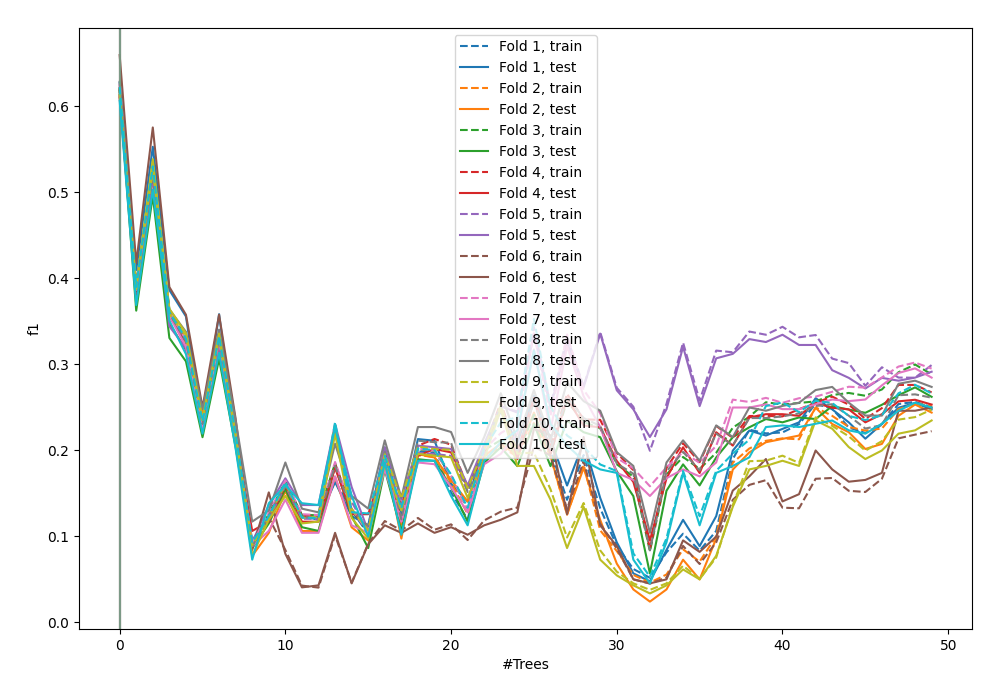
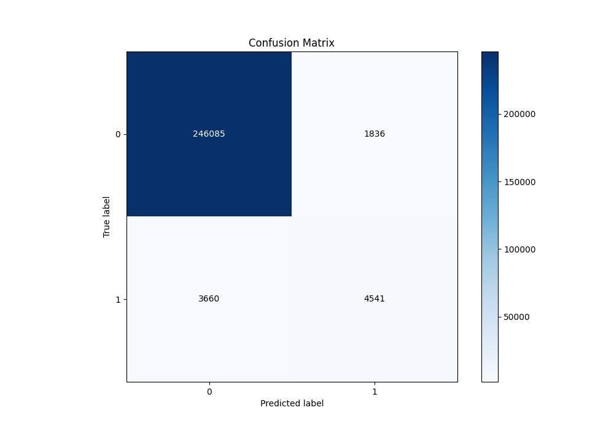
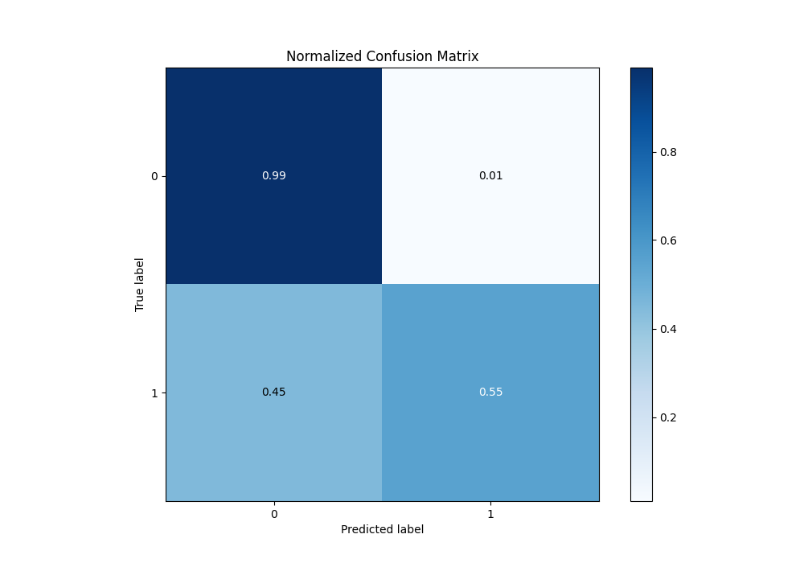
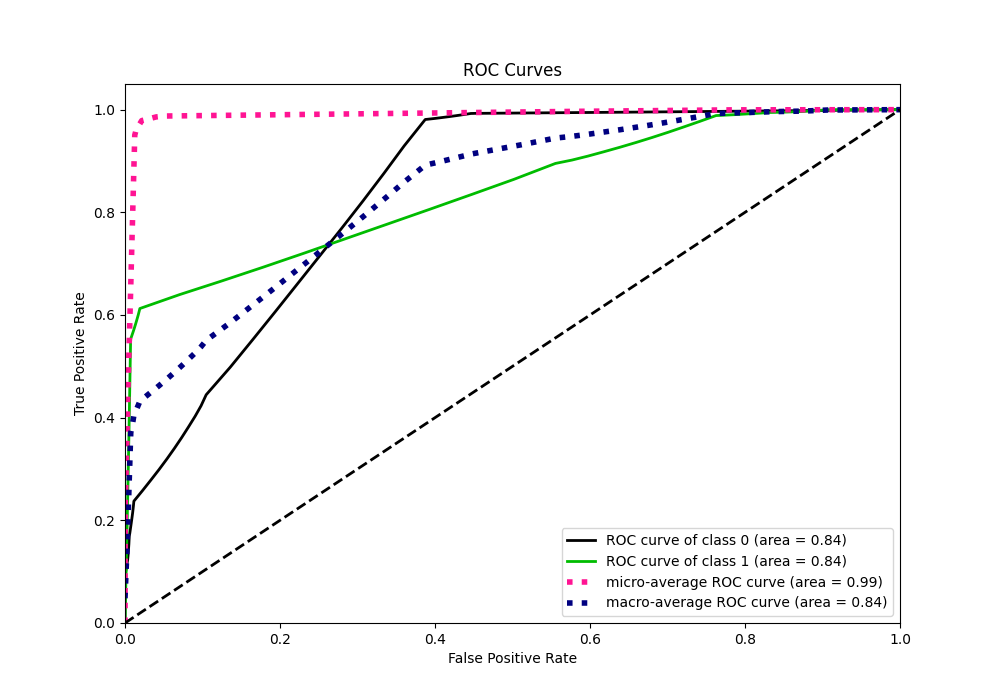
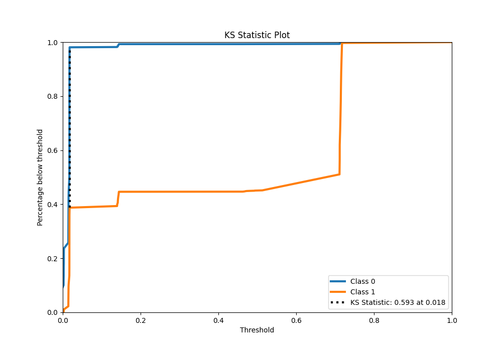
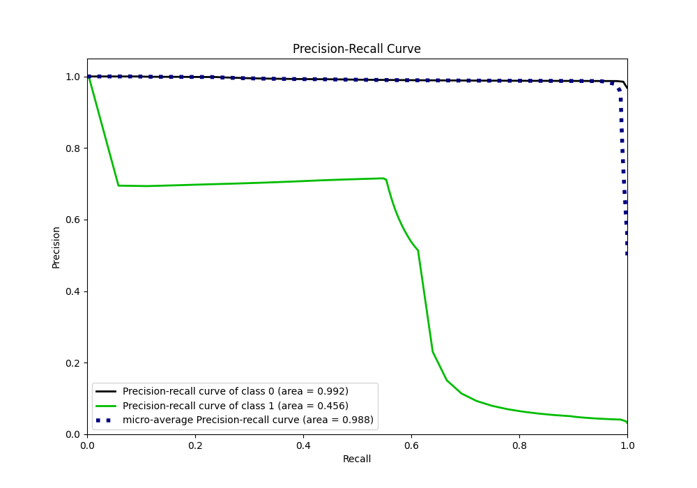
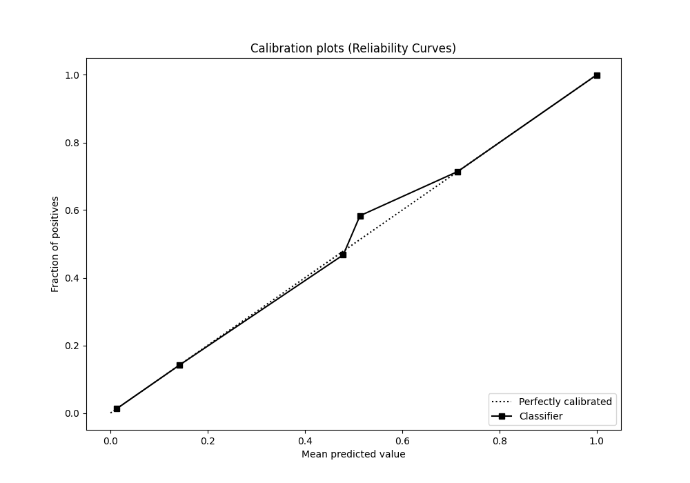
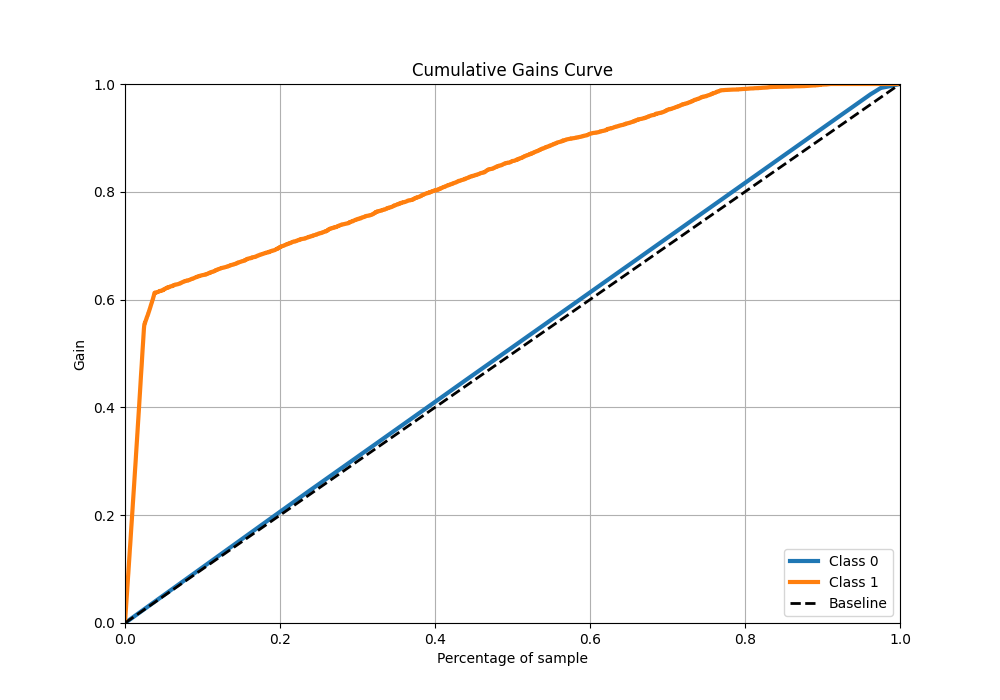
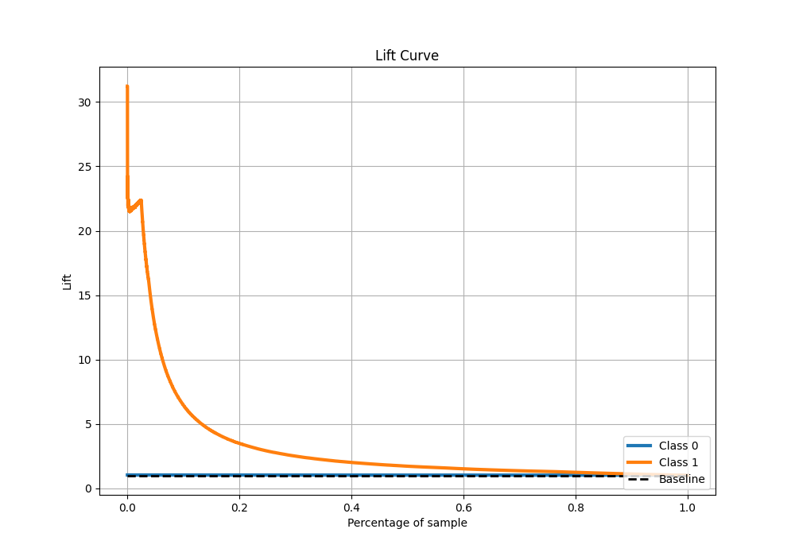

# Summary of 46_ExtraTrees

[<< Go back](../README.md)

## Extra Trees Classifier (Extra Trees)
- **n_jobs**: -1
- **criterion**: gini
- **max_features**: 0.5
- **min_samples_split**: 20
- **max_depth**: 4
- **eval_metric_name**: f1
- **explain_level**: 0

## Validation
 - **validation_type**: kfold
 - **shuffle**: True
 - **stratify**: True
 - **k_folds**: 10

## Optimized metric
f1

## Training time

88.6 seconds

## Metric details
|           |     score |   threshold |
|:----------|----------:|------------:|
| logloss   | 0.0842188 |  nan        |
| auc       | 0.842518  |  nan        |
| f1        | 0.622994  |    0.355931 |
| accuracy  | 0.978541  |    0.355931 |
| precision | 0.71209   |    0.355931 |
| recall    | 1         |    0        |
| mcc       | 0.617263  |    0.355931 |

## Metric details with threshold from accuracy metric
|           |     score |   threshold |
|:----------|----------:|------------:|
| logloss   | 0.0842188 |  nan        |
| auc       | 0.842518  |  nan        |
| f1        | 0.622994  |    0.355931 |
| accuracy  | 0.978541  |    0.355931 |
| precision | 0.71209   |    0.355931 |
| recall    | 0.553713  |    0.355931 |
| mcc       | 0.617263  |    0.355931 |

## Confusion matrix (at threshold=0.355931)
|              |   Predicted as 0 |   Predicted as 1 |
|:-------------|-----------------:|-----------------:|
| Labeled as 0 |           246085 |             1836 |
| Labeled as 1 |             3660 |             4541 |

## Learning curves

## Confusion Matrix

## Normalized Confusion Matrix

## ROC Curve

## Kolmogorov-Smirnov Statistic

## Precision-Recall Curve

## Calibration Curve

## Cumulative Gains Curve

## Lift Curve

[<< Go back](../README.md)
