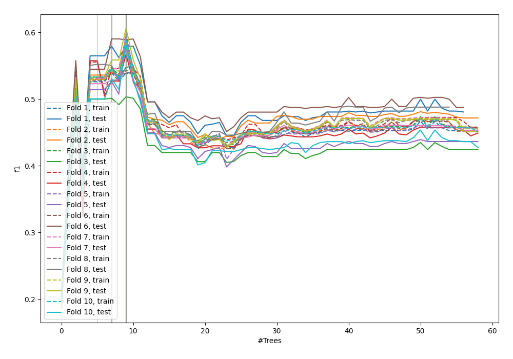
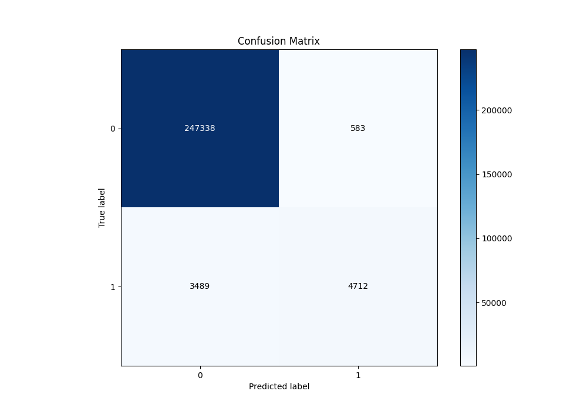
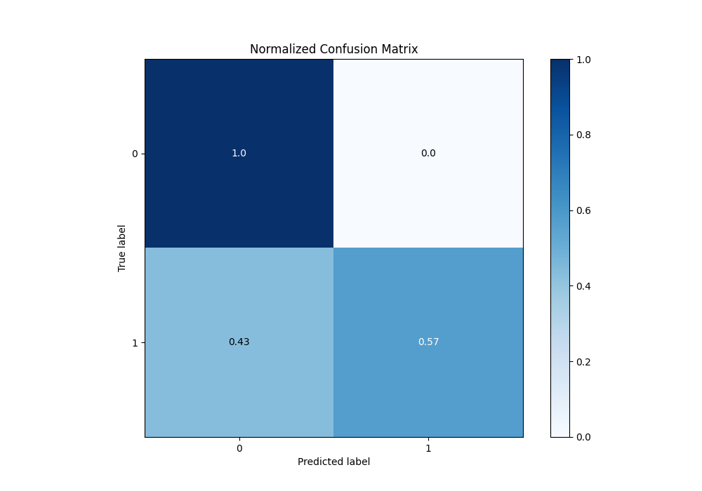
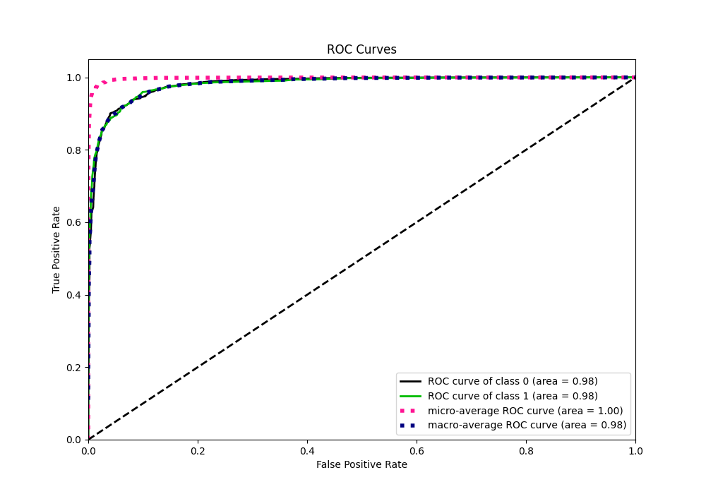
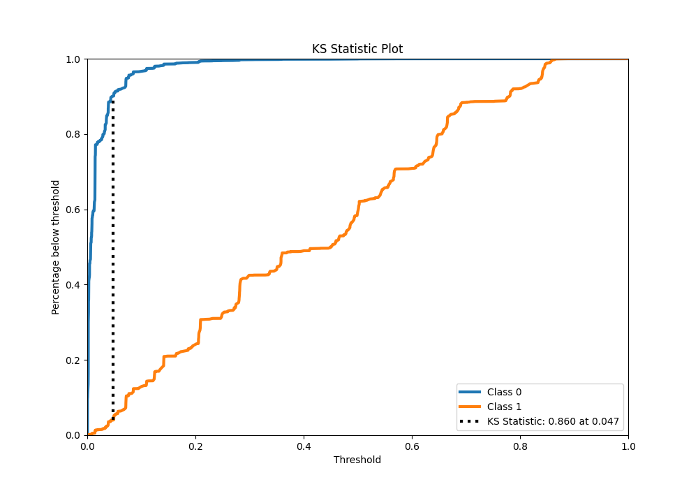
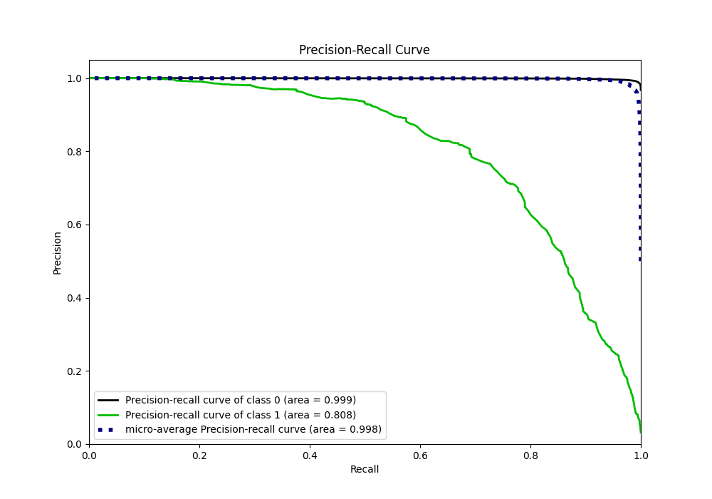
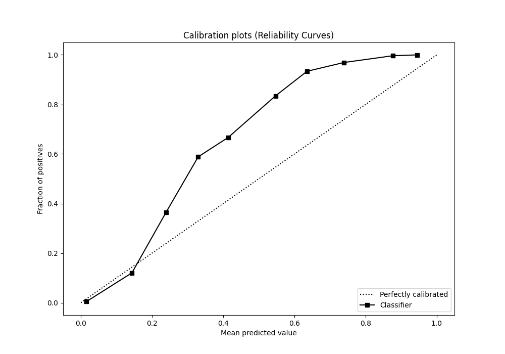
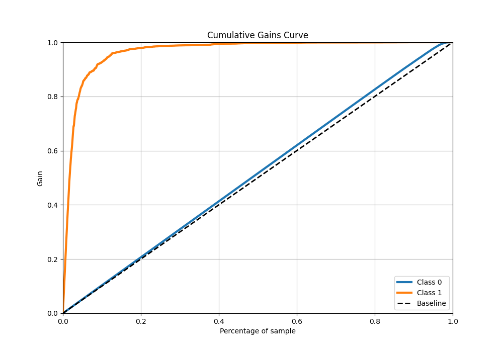
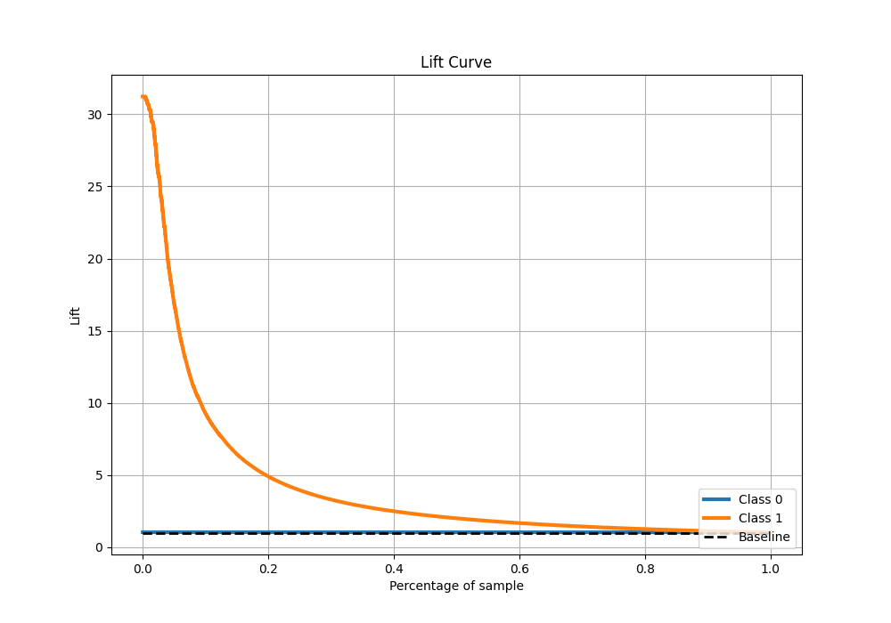

# Summary of 48_ExtraTrees

[<< Go back](../README.md)

## Extra Trees Classifier (Extra Trees)
- **n_jobs**: -1
- **criterion**: gini
- **max_features**: 0.8
- **min_samples_split**: 40
- **max_depth**: 3
- **eval_metric_name**: f1
- **explain_level**: 0

## Validation
 - **validation_type**: kfold
 - **shuffle**: True
 - **stratify**: True
 - **k_folds**: 10

## Optimized metric
f1

## Training time

96.2 seconds

## Metric details
|           |    score |    threshold |
|:----------|---------:|-------------:|
| logloss   | 0.057602 | nan          |
| auc       | 0.981288 | nan          |
| f1        | 0.711885 |   0.148233   |
| accuracy  | 0.984101 |   0.320678   |
| precision | 0.889896 |   0.320678   |
| recall    | 1        |   0.00030002 |
| mcc       | 0.70799  |   0.320678   |

## Metric details with threshold from accuracy metric
|           |    score |   threshold |
|:----------|---------:|------------:|
| logloss   | 0.057602 |  nan        |
| auc       | 0.981288 |  nan        |
| f1        | 0.698281 |    0.320678 |
| accuracy  | 0.984101 |    0.320678 |
| precision | 0.889896 |    0.320678 |
| recall    | 0.574564 |    0.320678 |
| mcc       | 0.70799  |    0.320678 |

## Confusion matrix (at threshold=0.320678)
|              |   Predicted as 0 |   Predicted as 1 |
|:-------------|-----------------:|-----------------:|
| Labeled as 0 |           247338 |              583 |
| Labeled as 1 |             3489 |             4712 |

## Learning curves

## Confusion Matrix

## Normalized Confusion Matrix

## ROC Curve

## Kolmogorov-Smirnov Statistic

## Precision-Recall Curve

## Calibration Curve

## Cumulative Gains Curve

## Lift Curve

[<< Go back](../README.md)
