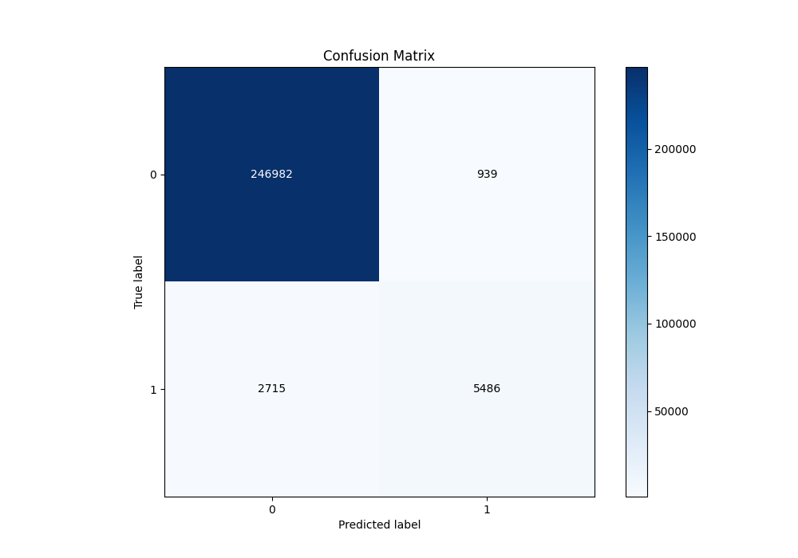

# Summary of 49_ExtraTrees

[<< Go back](../README.md)

## Extra Trees Classifier (Extra Trees)
- **n_jobs**: -1
- **criterion**: entropy
- **max_features**: 0.6
- **min_samples_split**: 50
- **max_depth**: 6
- **eval_metric_name**: f1
- **explain_level**: 0

## Validation
 - **validation_type**: kfold
 - **shuffle**: True
 - **stratify**: True
 - **k_folds**: 10

## Optimized metric
f1

## Training time

119.9 seconds

## Metric details
|           |    score |   threshold |
|:----------|---------:|------------:|
| logloss   | 0.047595 |  nan        |
| auc       | 0.983367 |  nan        |
| f1        | 0.750171 |    0.412316 |
| accuracy  | 0.985733 |    0.412316 |
| precision | 0.853852 |    0.412316 |
| recall    | 1        |    0        |
| mcc       | 0.748807 |    0.412316 |

## Metric details with threshold from accuracy metric
|           |    score |   threshold |
|:----------|---------:|------------:|
| logloss   | 0.047595 |  nan        |
| auc       | 0.983367 |  nan        |
| f1        | 0.750171 |    0.412316 |
| accuracy  | 0.985733 |    0.412316 |
| precision | 0.853852 |    0.412316 |
| recall    | 0.668943 |    0.412316 |
| mcc       | 0.748807 |    0.412316 |

## Confusion matrix (at threshold=0.412316)
|              |   Predicted as 0 |   Predicted as 1 |
|:-------------|-----------------:|-----------------:|
| Labeled as 0 |           246982 |              939 |
| Labeled as 1 |             2715 |             5486 |

## Learning curves

## Confusion Matrix

## Normalized Confusion Matrix

## ROC Curve

## Kolmogorov-Smirnov Statistic

## Precision-Recall Curve

## Calibration Curve

## Cumulative Gains Curve

## Lift Curve

[<< Go back](../README.md)
