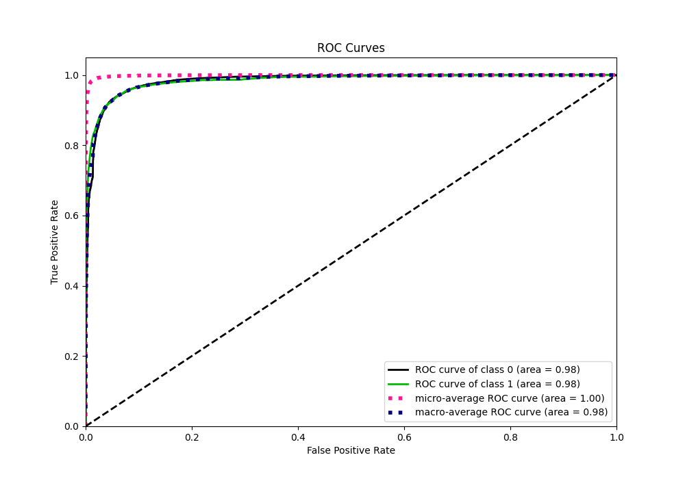
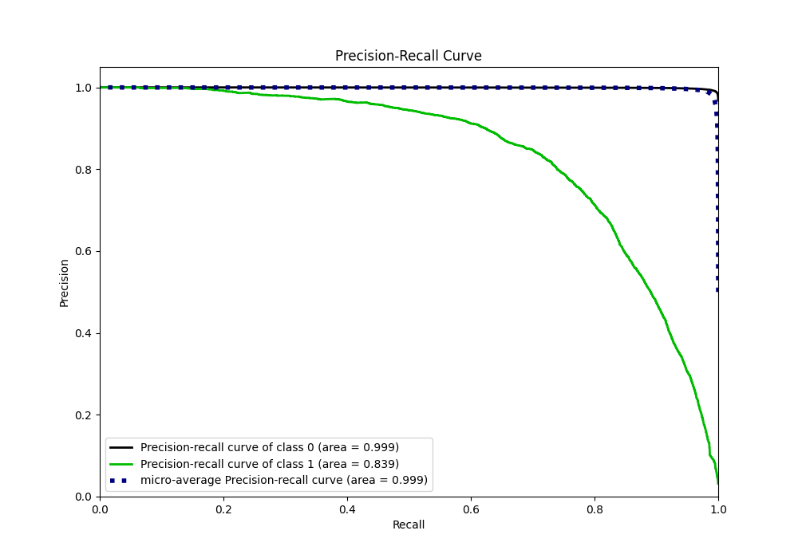

# Summary of 4_Default_LightGBM

[<< Go back](../README.md)

## LightGBM
- **n_jobs**: -1
- **objective**: binary
- **num_leaves**: 63
- **learning_rate**: 0.05
- **feature_fraction**: 0.9
- **bagging_fraction**: 0.9
- **min_data_in_leaf**: 10
- **metric**: custom
- **custom_eval_metric_name**: f1
- **explain_level**: 0

## Validation
 - **validation_type**: kfold
 - **shuffle**: True
 - **stratify**: True
 - **k_folds**: 10

## Optimized metric
f1

## Training time

247.4 seconds

## Metric details
|           |     score |     threshold |
|:----------|----------:|--------------:|
| logloss   | 0.0411996 | nan           |
| auc       | 0.984187  | nan           |
| f1        | 0.766966  |   0.487804    |
| accuracy  | 0.986339  |   0.487804    |
| precision | 0.845025  |   0.487804    |
| recall    | 1         |   8.88951e-06 |
| mcc       | 0.763454  |   0.487804    |

## Metric details with threshold from accuracy metric
|           |     score |   threshold |
|:----------|----------:|------------:|
| logloss   | 0.0411996 |  nan        |
| auc       | 0.984187  |  nan        |
| f1        | 0.766966  |    0.487804 |
| accuracy  | 0.986339  |    0.487804 |
| precision | 0.845025  |    0.487804 |
| recall    | 0.702109  |    0.487804 |
| mcc       | 0.763454  |    0.487804 |

## Confusion matrix (at threshold=0.487804)
|              |   Predicted as 0 |   Predicted as 1 |
|:-------------|-----------------:|-----------------:|
| Labeled as 0 |           246865 |             1056 |
| Labeled as 1 |             2443 |             5758 |

## Learning curves

## Confusion Matrix

## Normalized Confusion Matrix

## ROC Curve

## Kolmogorov-Smirnov Statistic

## Precision-Recall Curve

## Calibration Curve

## Cumulative Gains Curve

## Lift Curve

[<< Go back](../README.md)
