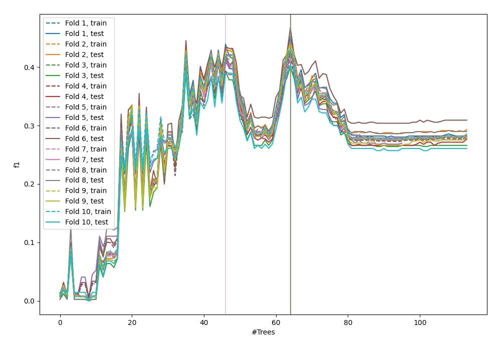
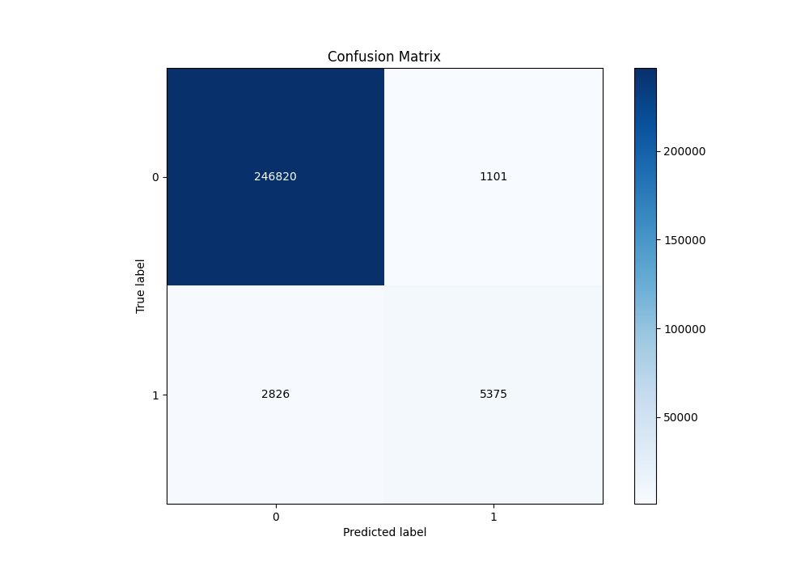
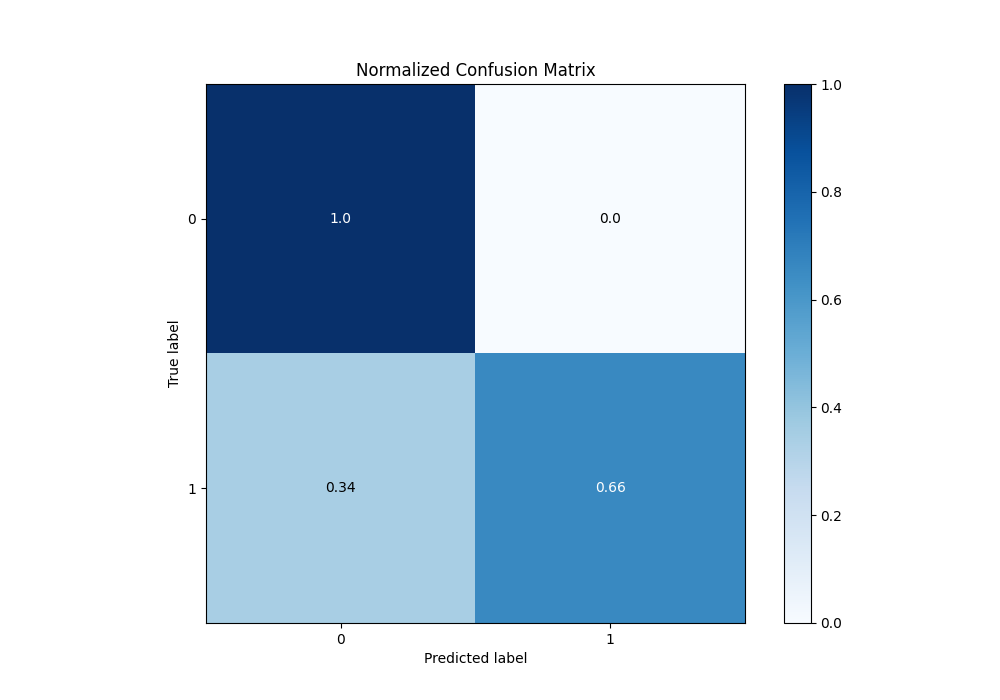
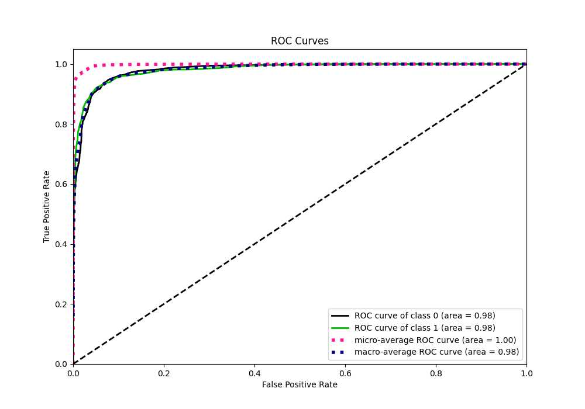
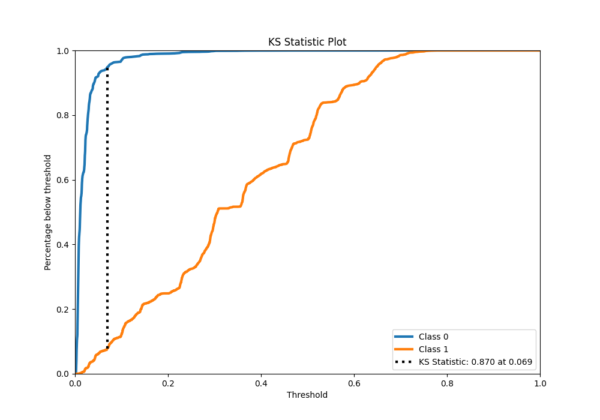
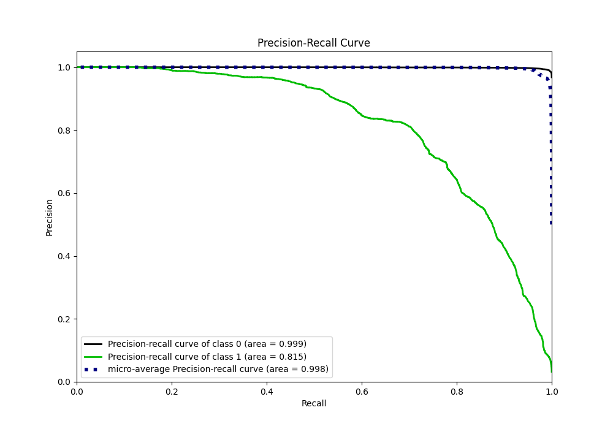
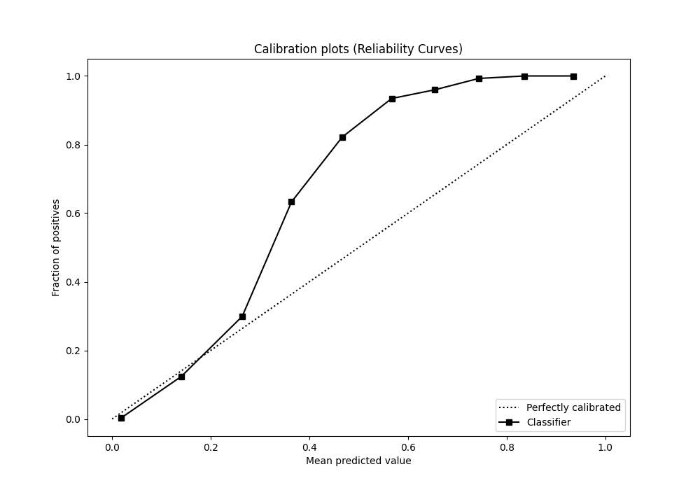
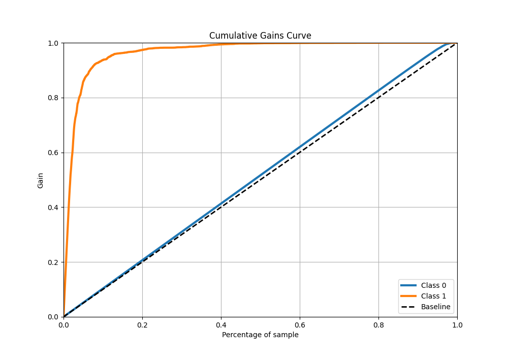
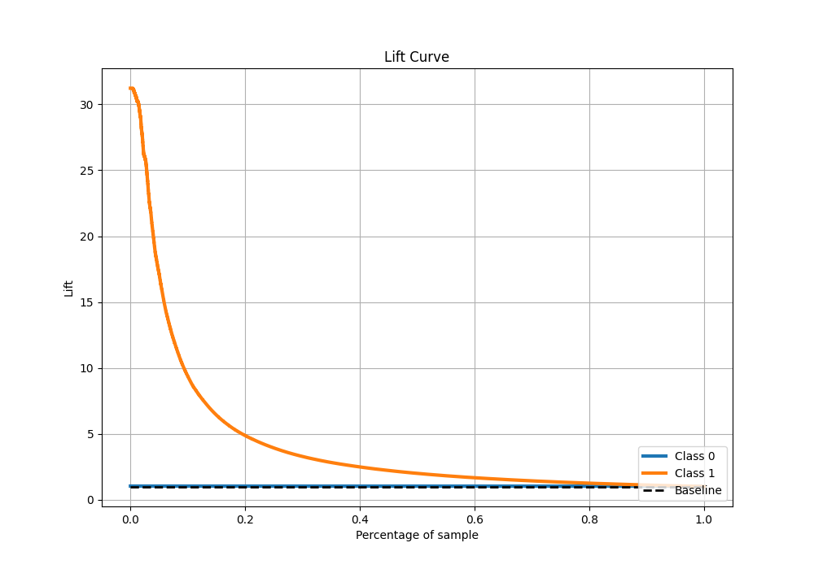

# Summary of 50_ExtraTrees

[<< Go back](../README.md)

## Extra Trees Classifier (Extra Trees)
- **n_jobs**: -1
- **criterion**: gini
- **max_features**: 0.7
- **min_samples_split**: 50
- **max_depth**: 3
- **eval_metric_name**: f1
- **explain_level**: 0

## Validation
 - **validation_type**: kfold
 - **shuffle**: True
 - **stratify**: True
 - **k_folds**: 10

## Optimized metric
f1

## Training time

147.9 seconds

## Metric details
|           |     score |    threshold |
|:----------|----------:|-------------:|
| logloss   | 0.0641484 | nan          |
| auc       | 0.98143   | nan          |
| f1        | 0.733364  |   0.159808   |
| accuracy  | 0.984667  |   0.266399   |
| precision | 0.829988  |   0.266399   |
| recall    | 1         |   0.00173989 |
| mcc       | 0.730018  |   0.266399   |

## Metric details with threshold from accuracy metric
|           |     score |   threshold |
|:----------|----------:|------------:|
| logloss   | 0.0641484 |  nan        |
| auc       | 0.98143   |  nan        |
| f1        | 0.732439  |    0.266399 |
| accuracy  | 0.984667  |    0.266399 |
| precision | 0.829988  |    0.266399 |
| recall    | 0.655408  |    0.266399 |
| mcc       | 0.730018  |    0.266399 |

## Confusion matrix (at threshold=0.266399)
|              |   Predicted as 0 |   Predicted as 1 |
|:-------------|-----------------:|-----------------:|
| Labeled as 0 |           246820 |             1101 |
| Labeled as 1 |             2826 |             5375 |

## Learning curves

## Confusion Matrix

## Normalized Confusion Matrix

## ROC Curve

## Kolmogorov-Smirnov Statistic

## Precision-Recall Curve

## Calibration Curve

## Cumulative Gains Curve

## Lift Curve

[<< Go back](../README.md)
