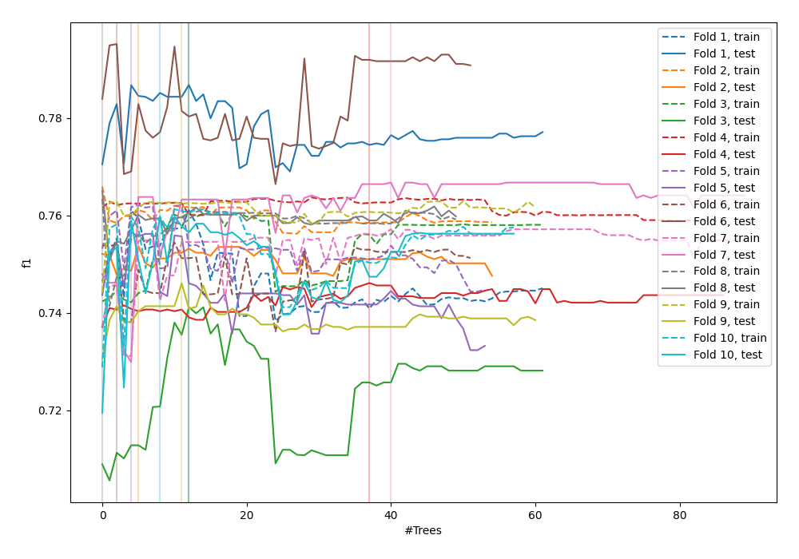
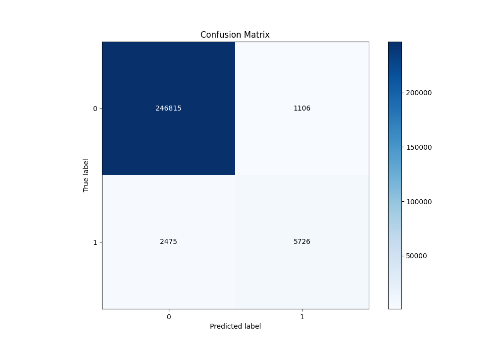
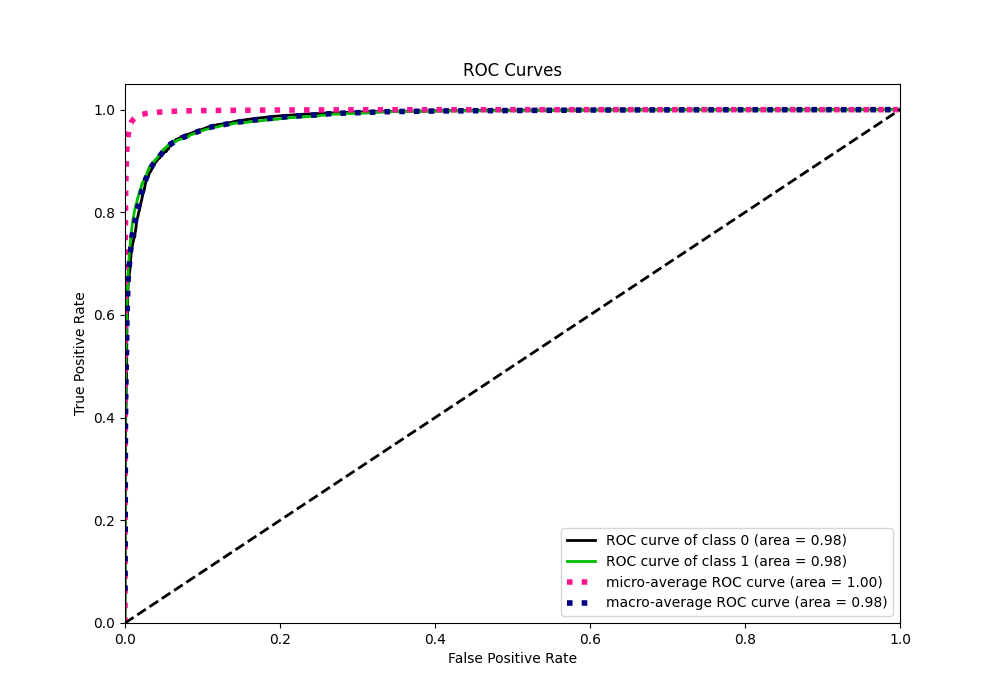
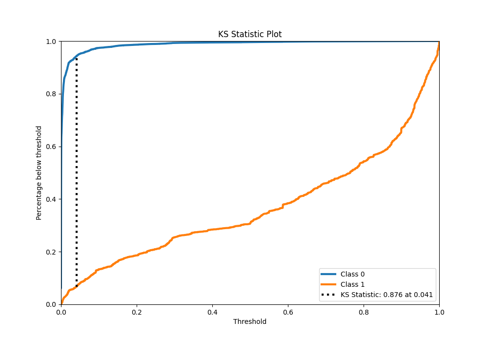
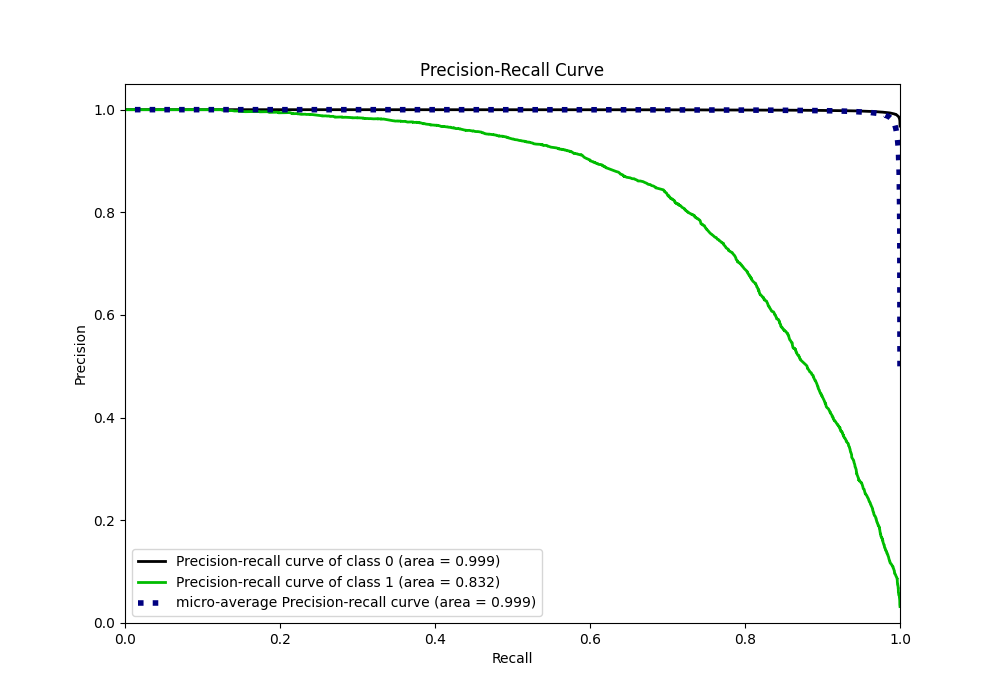
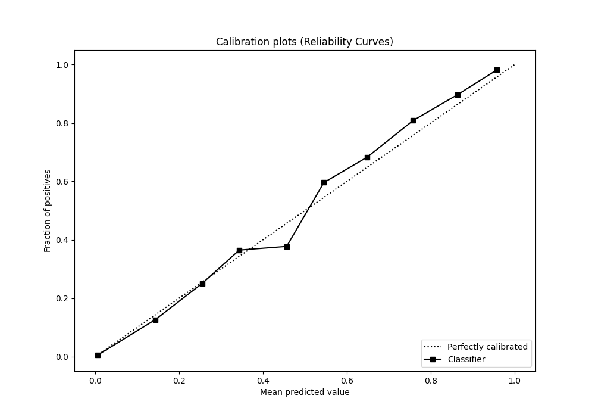
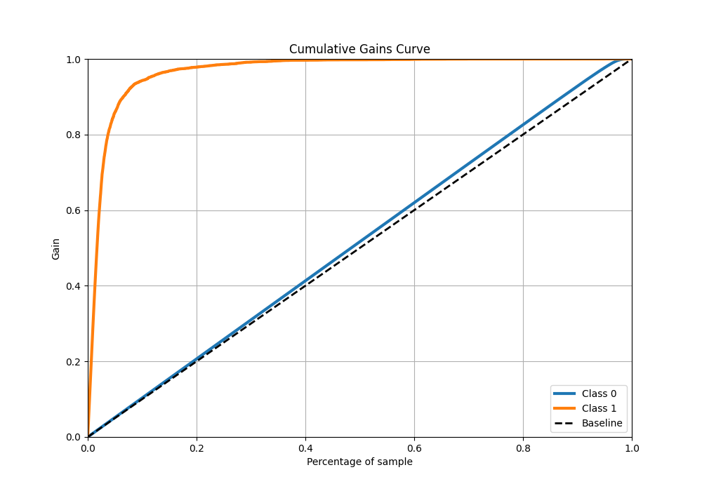
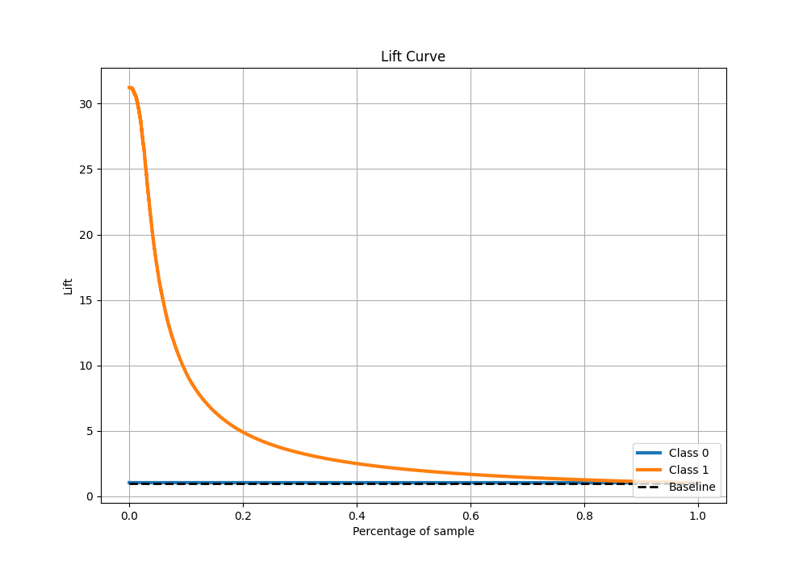

# Summary of 51_ExtraTrees

[<< Go back](../README.md)

## Extra Trees Classifier (Extra Trees)
- **n_jobs**: -1
- **criterion**: gini
- **max_features**: 1.0
- **min_samples_split**: 40
- **max_depth**: 7
- **eval_metric_name**: f1
- **explain_level**: 0

## Validation
 - **validation_type**: kfold
 - **shuffle**: True
 - **stratify**: True
 - **k_folds**: 10

## Optimized metric
f1

## Training time

115.0 seconds

## Metric details
|           |     score |   threshold |
|:----------|----------:|------------:|
| logloss   | 0.0424937 |  nan        |
| auc       | 0.983938  |  nan        |
| f1        | 0.76252   |    0.310877 |
| accuracy  | 0.986018  |    0.477207 |
| precision | 0.838115  |    0.477207 |
| recall    | 0.999756  |    0        |
| mcc       | 0.757992  |    0.477207 |

## Metric details with threshold from accuracy metric
|           |     score |   threshold |
|:----------|----------:|------------:|
| logloss   | 0.0424937 |  nan        |
| auc       | 0.983938  |  nan        |
| f1        | 0.761791  |    0.477207 |
| accuracy  | 0.986018  |    0.477207 |
| precision | 0.838115  |    0.477207 |
| recall    | 0.698208  |    0.477207 |
| mcc       | 0.757992  |    0.477207 |

## Confusion matrix (at threshold=0.477207)
|              |   Predicted as 0 |   Predicted as 1 |
|:-------------|-----------------:|-----------------:|
| Labeled as 0 |           246815 |             1106 |
| Labeled as 1 |             2475 |             5726 |

## Learning curves

## Confusion Matrix

## Normalized Confusion Matrix

## ROC Curve

## Kolmogorov-Smirnov Statistic

## Precision-Recall Curve

## Calibration Curve

## Cumulative Gains Curve

## Lift Curve

[<< Go back](../README.md)
