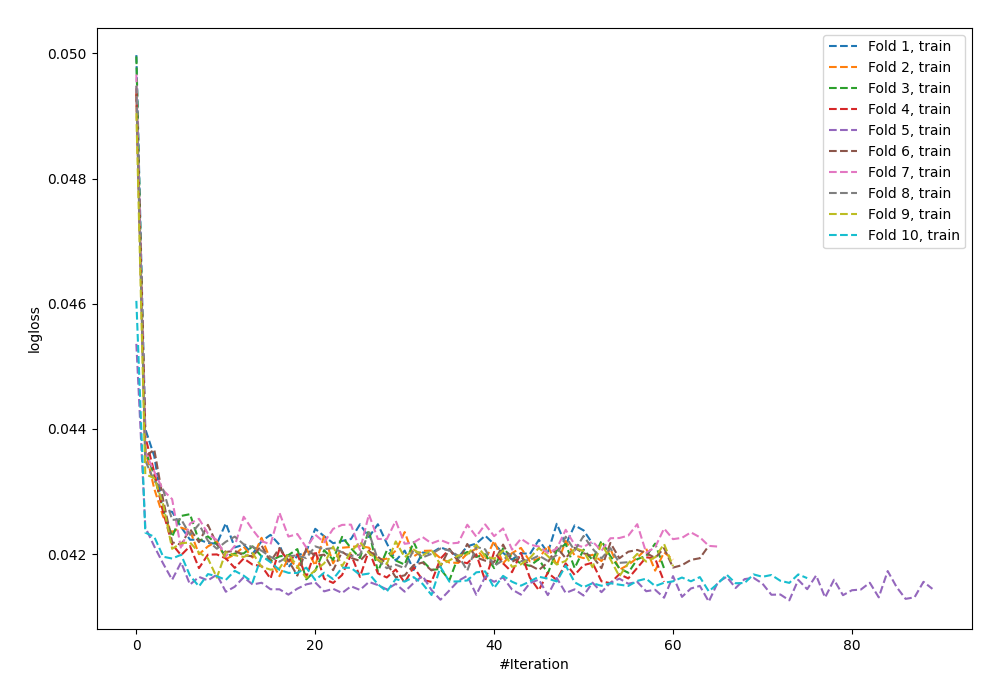
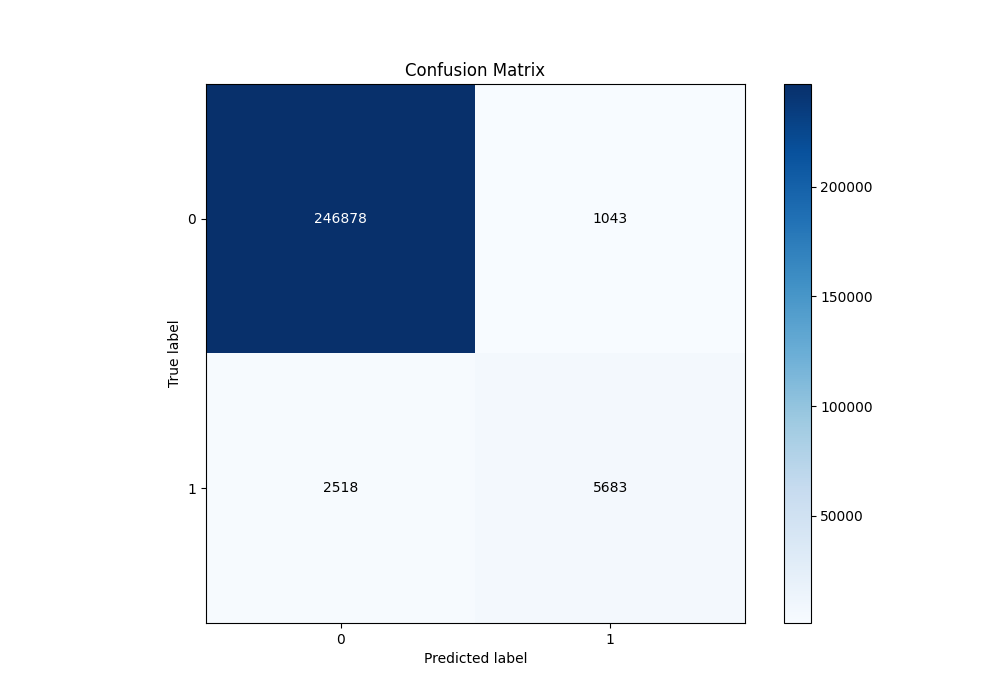
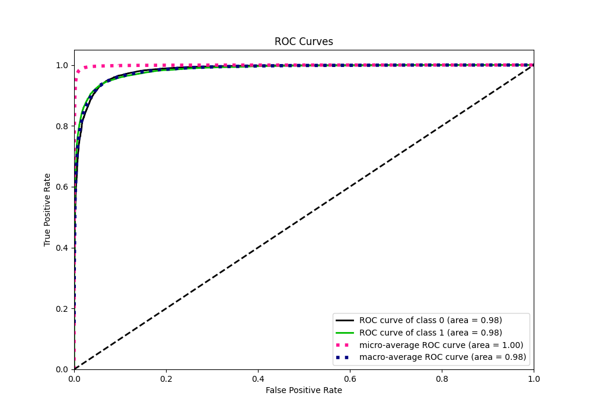
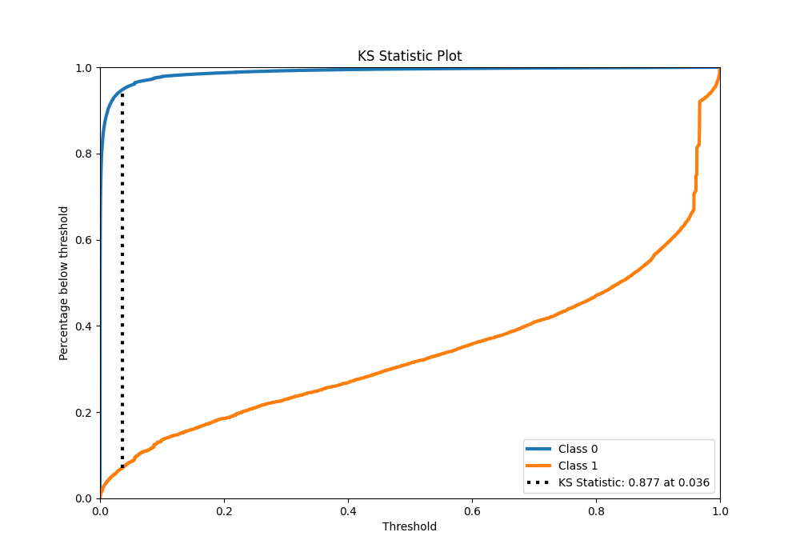
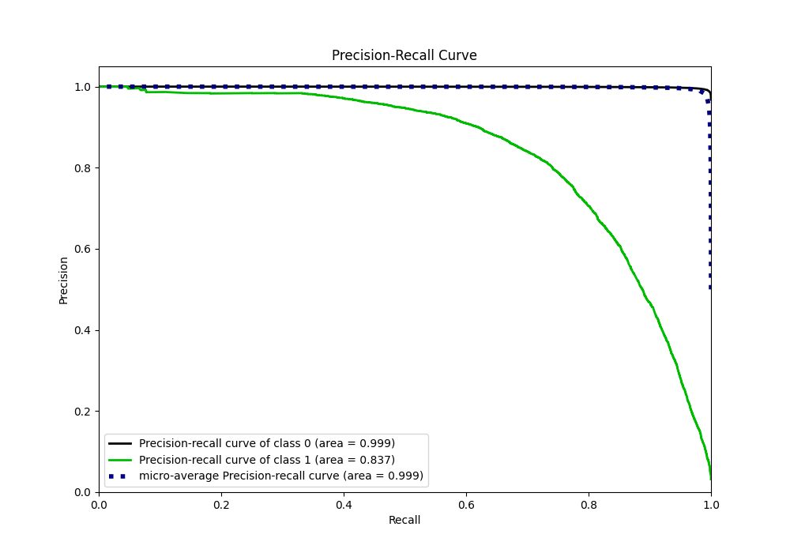
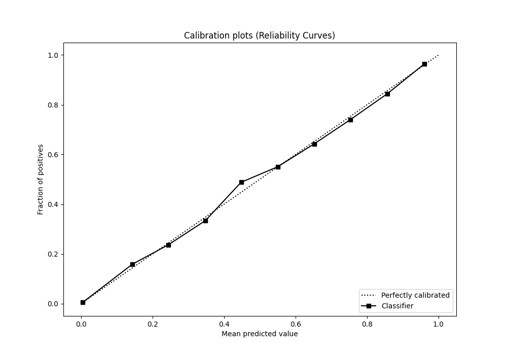
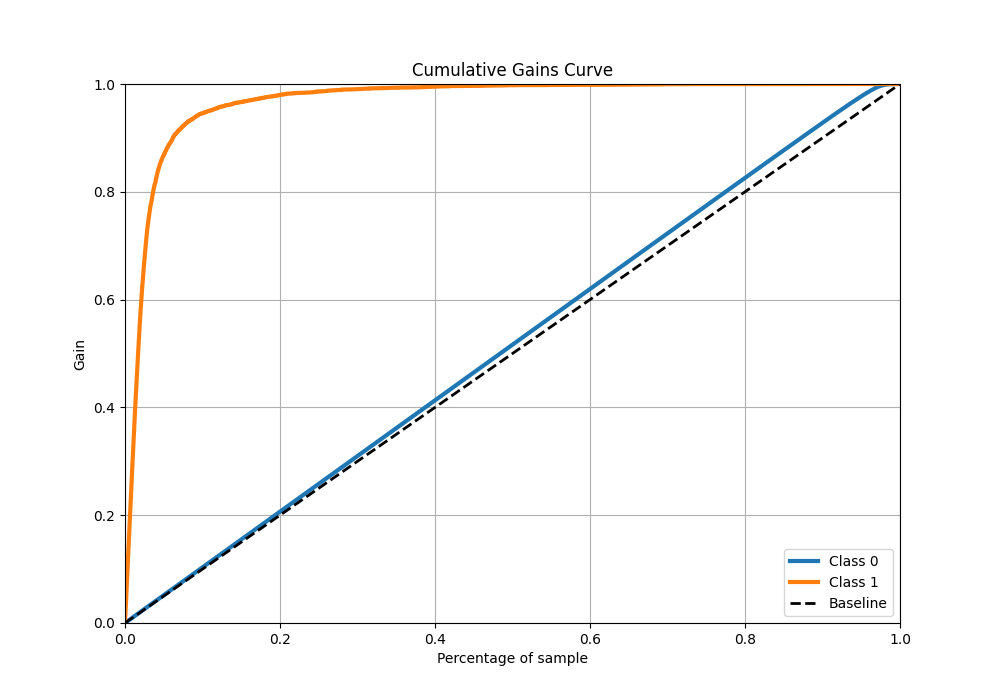
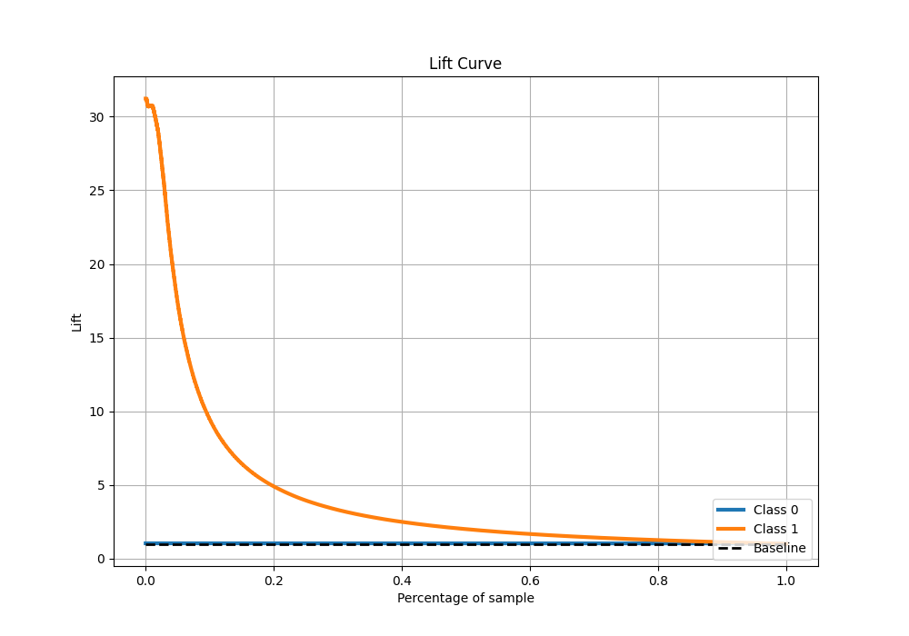

# Summary of 55_NeuralNetwork

[<< Go back](../README.md)

## Neural Network
- **n_jobs**: -1
- **dense_1_size**: 32
- **dense_2_size**: 4
- **learning_rate**: 0.05
- **explain_level**: 0

## Validation
 - **validation_type**: kfold
 - **shuffle**: True
 - **stratify**: True
 - **k_folds**: 10

## Optimized metric
f1

## Training time

414.9 seconds

## Metric details
|           |    score |     threshold |
|:----------|---------:|--------------:|
| logloss   | 0.041661 | nan           |
| auc       | 0.984224 | nan           |
| f1        | 0.761439 |   0.484709    |
| accuracy  | 0.986096 |   0.484709    |
| precision | 0.84493  |   0.484709    |
| recall    | 1        |   1.74246e-13 |
| mcc       | 0.758286 |   0.484709    |

## Metric details with threshold from accuracy metric
|           |    score |   threshold |
|:----------|---------:|------------:|
| logloss   | 0.041661 |  nan        |
| auc       | 0.984224 |  nan        |
| f1        | 0.761439 |    0.484709 |
| accuracy  | 0.986096 |    0.484709 |
| precision | 0.84493  |    0.484709 |
| recall    | 0.692964 |    0.484709 |
| mcc       | 0.758286 |    0.484709 |

## Confusion matrix (at threshold=0.484709)
|              |   Predicted as 0 |   Predicted as 1 |
|:-------------|-----------------:|-----------------:|
| Labeled as 0 |           246878 |             1043 |
| Labeled as 1 |             2518 |             5683 |

## Learning curves

## Confusion Matrix

## Normalized Confusion Matrix

## ROC Curve

## Kolmogorov-Smirnov Statistic

## Precision-Recall Curve

## Calibration Curve

## Cumulative Gains Curve

## Lift Curve

[<< Go back](../README.md)
