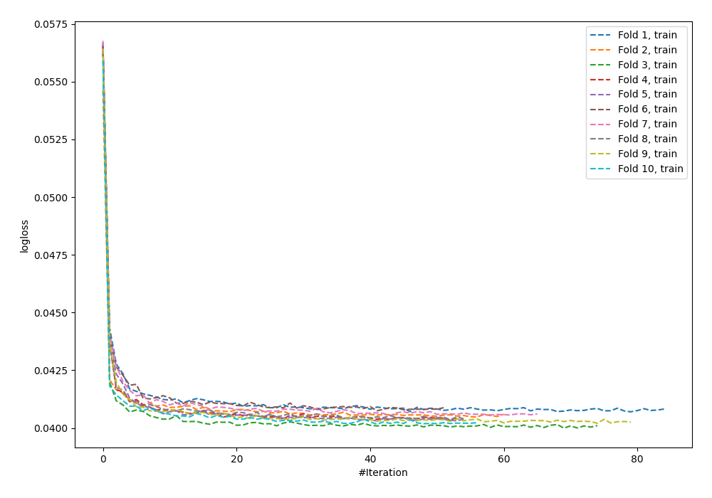
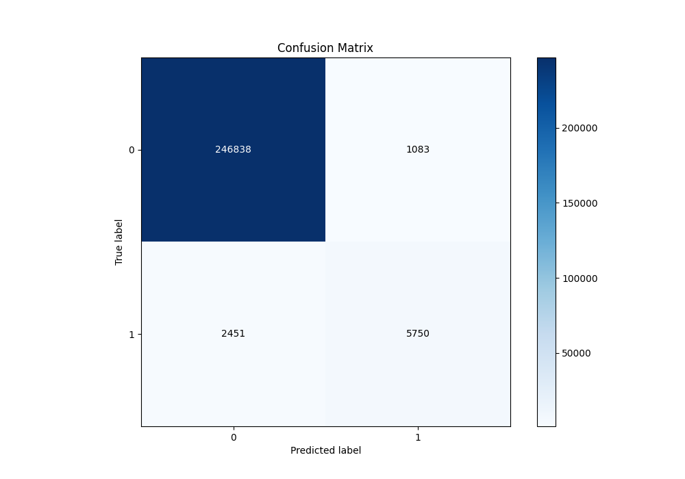
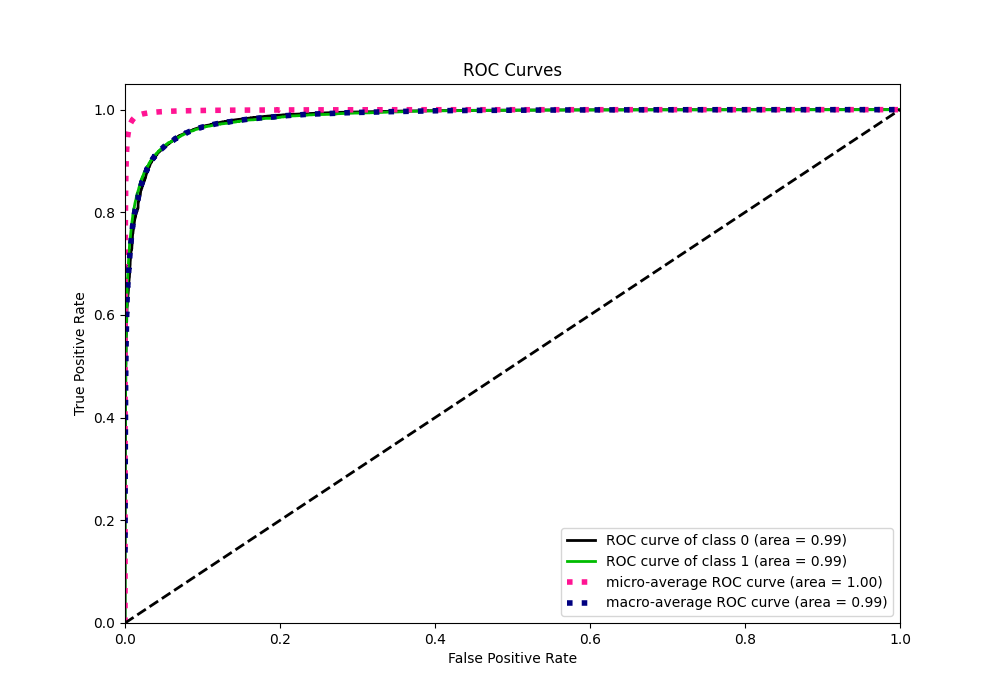
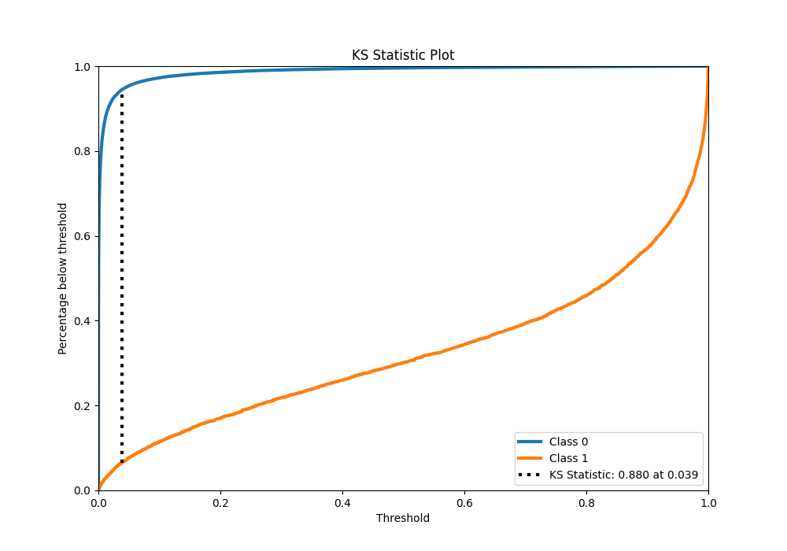
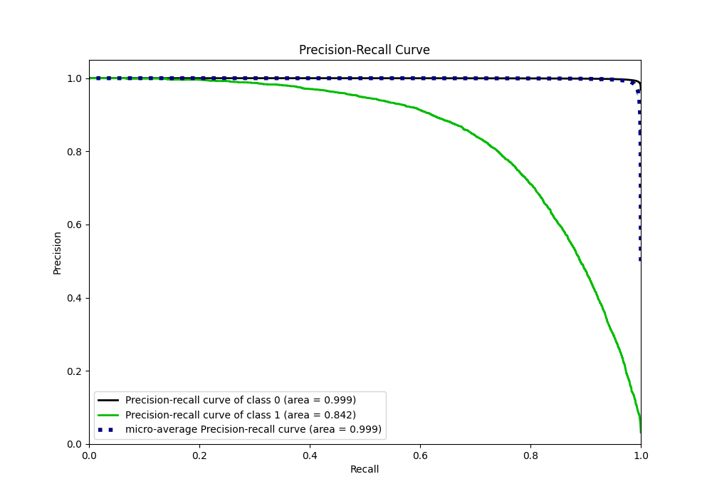
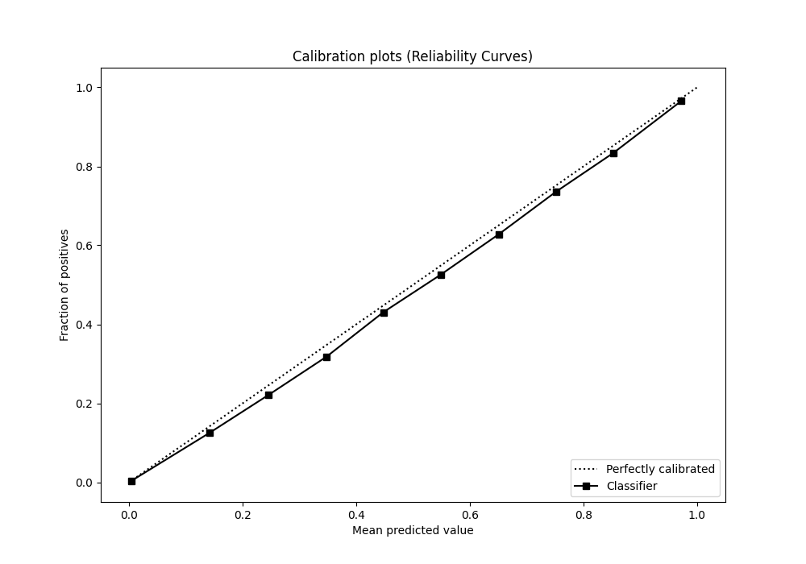
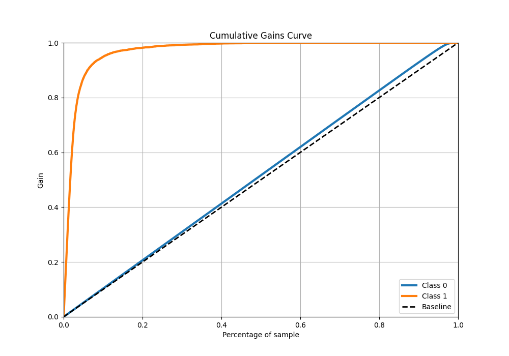
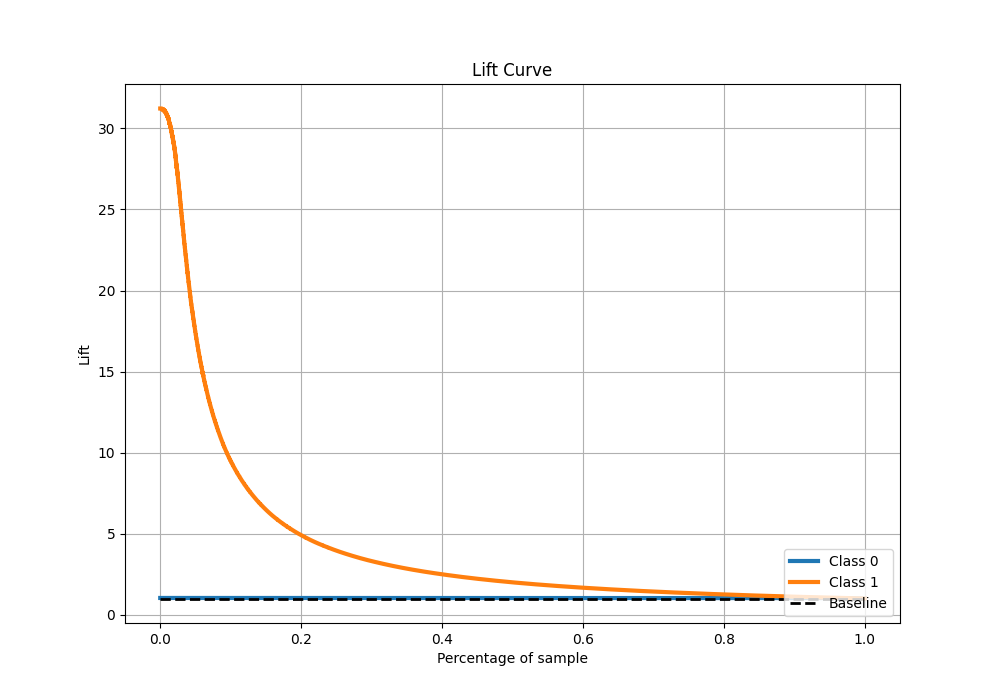

# Summary of 56_NeuralNetwork

[<< Go back](../README.md)

## Neural Network
- **n_jobs**: -1
- **dense_1_size**: 64
- **dense_2_size**: 16
- **learning_rate**: 0.01
- **explain_level**: 0

## Validation
 - **validation_type**: kfold
 - **shuffle**: True
 - **stratify**: True
 - **k_folds**: 10

## Optimized metric
f1

## Training time

632.0 seconds

## Metric details
|           |    score |    threshold |
|:----------|---------:|-------------:|
| logloss   | 0.040773 | nan          |
| auc       | 0.985531 | nan          |
| f1        | 0.764933 |   0.495565   |
| accuracy  | 0.986202 |   0.495565   |
| precision | 0.841504 |   0.495565   |
| recall    | 1        |   2.2514e-12 |
| mcc       | 0.761236 |   0.495565   |

## Metric details with threshold from accuracy metric
|           |    score |   threshold |
|:----------|---------:|------------:|
| logloss   | 0.040773 |  nan        |
| auc       | 0.985531 |  nan        |
| f1        | 0.764933 |    0.495565 |
| accuracy  | 0.986202 |    0.495565 |
| precision | 0.841504 |    0.495565 |
| recall    | 0.701134 |    0.495565 |
| mcc       | 0.761236 |    0.495565 |

## Confusion matrix (at threshold=0.495565)
|              |   Predicted as 0 |   Predicted as 1 |
|:-------------|-----------------:|-----------------:|
| Labeled as 0 |           246838 |             1083 |
| Labeled as 1 |             2451 |             5750 |

## Learning curves

## Confusion Matrix

## Normalized Confusion Matrix

## ROC Curve

## Kolmogorov-Smirnov Statistic

## Precision-Recall Curve

## Calibration Curve

## Cumulative Gains Curve

## Lift Curve

[<< Go back](../README.md)
