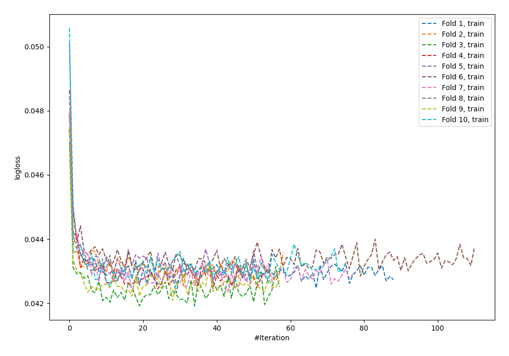
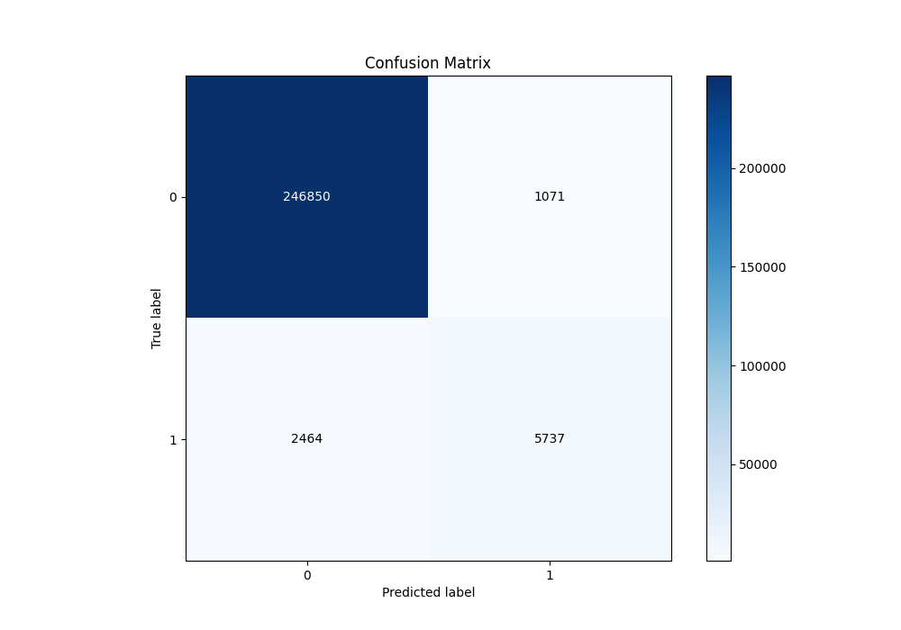
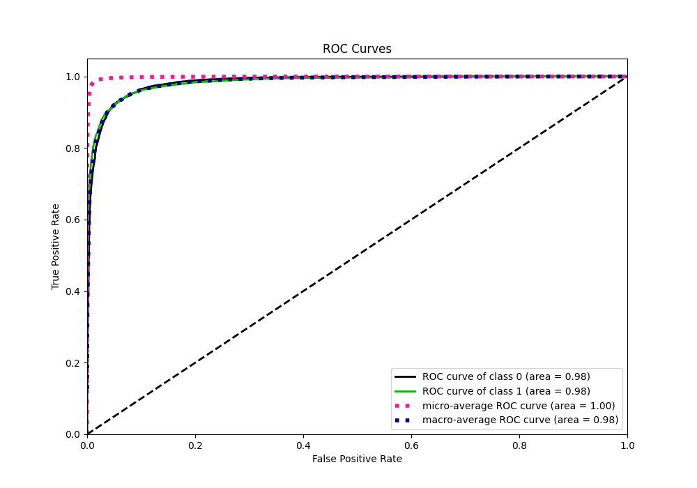
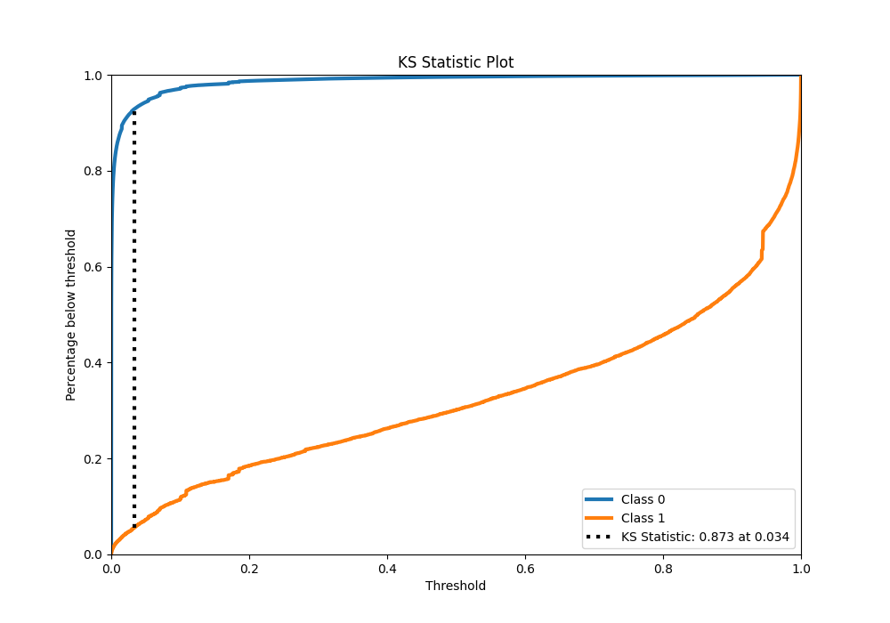
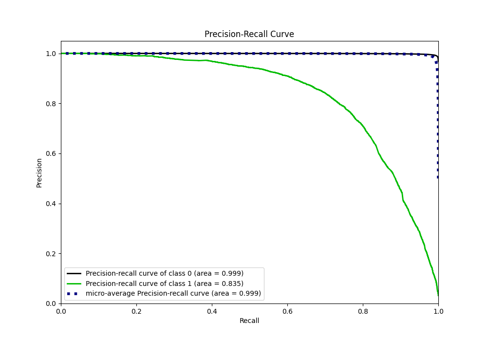
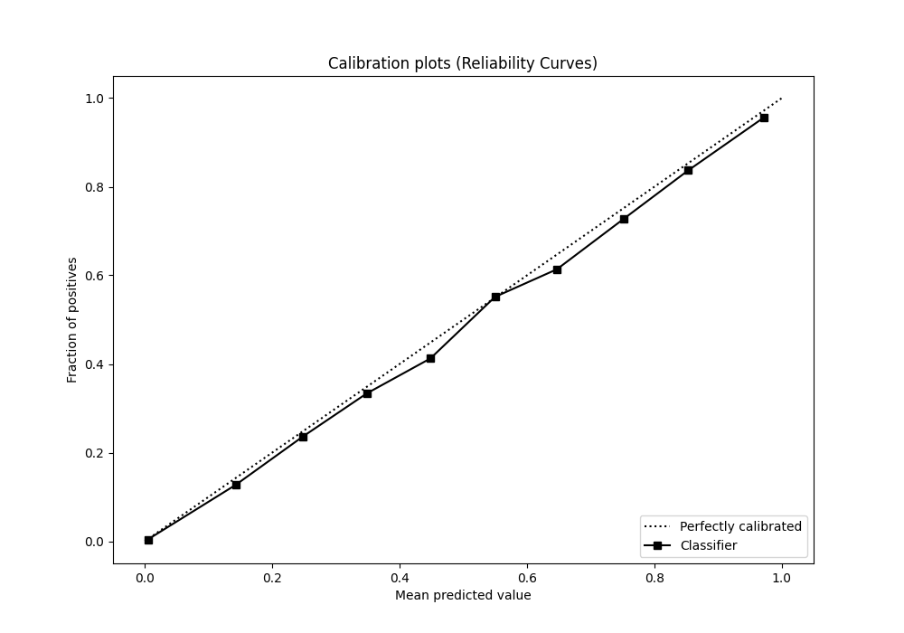
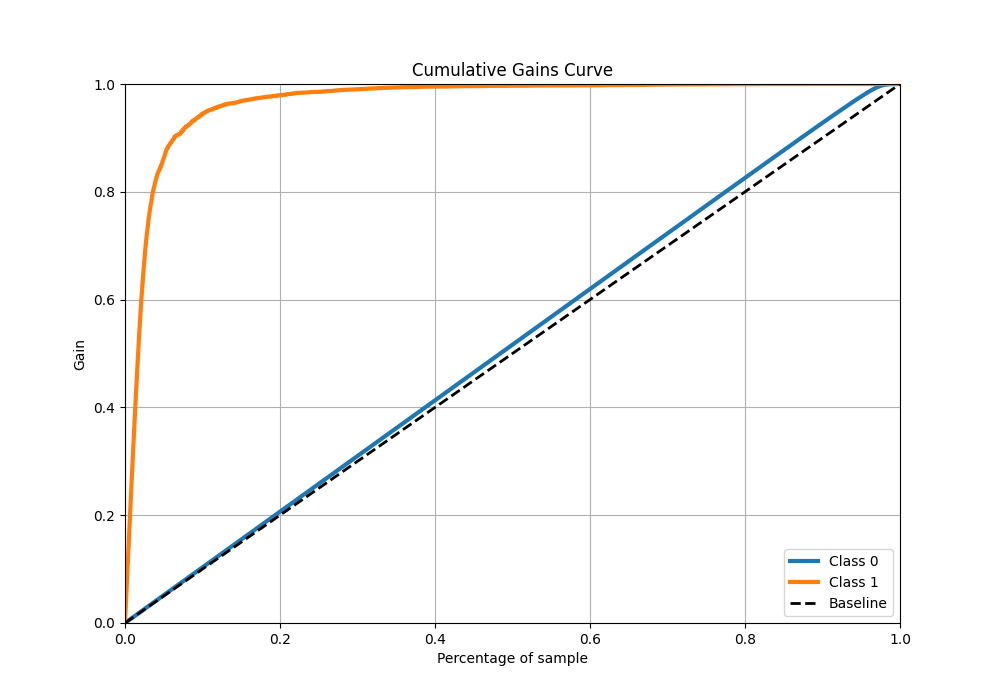
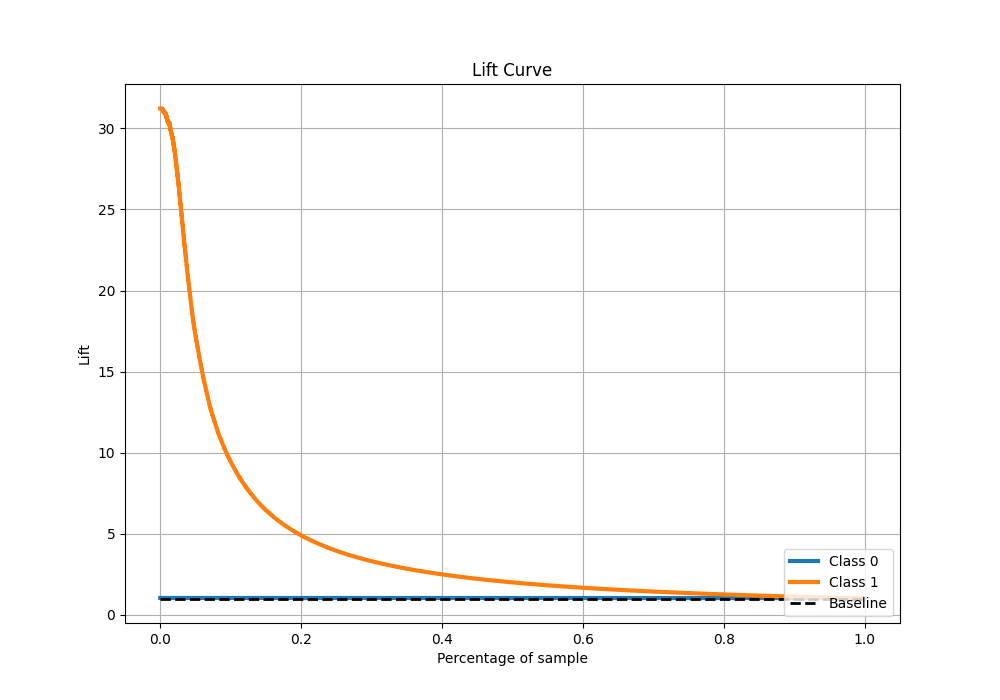

# Summary of 57_NeuralNetwork

[<< Go back](../README.md)

## Neural Network
- **n_jobs**: -1
- **dense_1_size**: 64
- **dense_2_size**: 32
- **learning_rate**: 0.08
- **explain_level**: 0

## Validation
 - **validation_type**: kfold
 - **shuffle**: True
 - **stratify**: True
 - **k_folds**: 10

## Optimized metric
f1

## Training time

1454.5 seconds

## Metric details
|           |     score |     threshold |
|:----------|----------:|--------------:|
| logloss   | 0.0423168 | nan           |
| auc       | 0.983718  | nan           |
| f1        | 0.764752  |   0.32161     |
| accuracy  | 0.986198  |   0.497831    |
| precision | 0.842685  |   0.497831    |
| recall    | 1         |   4.10494e-22 |
| mcc       | 0.760913  |   0.497831    |

## Metric details with threshold from accuracy metric
|           |     score |   threshold |
|:----------|----------:|------------:|
| logloss   | 0.0423168 |  nan        |
| auc       | 0.983718  |  nan        |
| f1        | 0.764475  |    0.497831 |
| accuracy  | 0.986198  |    0.497831 |
| precision | 0.842685  |    0.497831 |
| recall    | 0.699549  |    0.497831 |
| mcc       | 0.760913  |    0.497831 |

## Confusion matrix (at threshold=0.497831)
|              |   Predicted as 0 |   Predicted as 1 |
|:-------------|-----------------:|-----------------:|
| Labeled as 0 |           246850 |             1071 |
| Labeled as 1 |             2464 |             5737 |

## Learning curves

## Confusion Matrix

## Normalized Confusion Matrix

## ROC Curve

## Kolmogorov-Smirnov Statistic

## Precision-Recall Curve

## Calibration Curve

## Cumulative Gains Curve

## Lift Curve

[<< Go back](../README.md)
