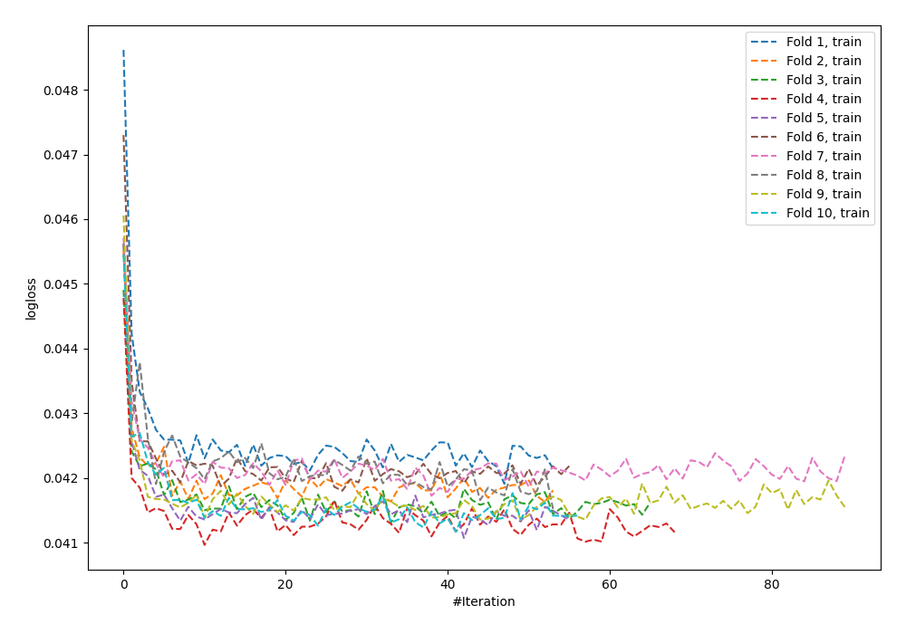
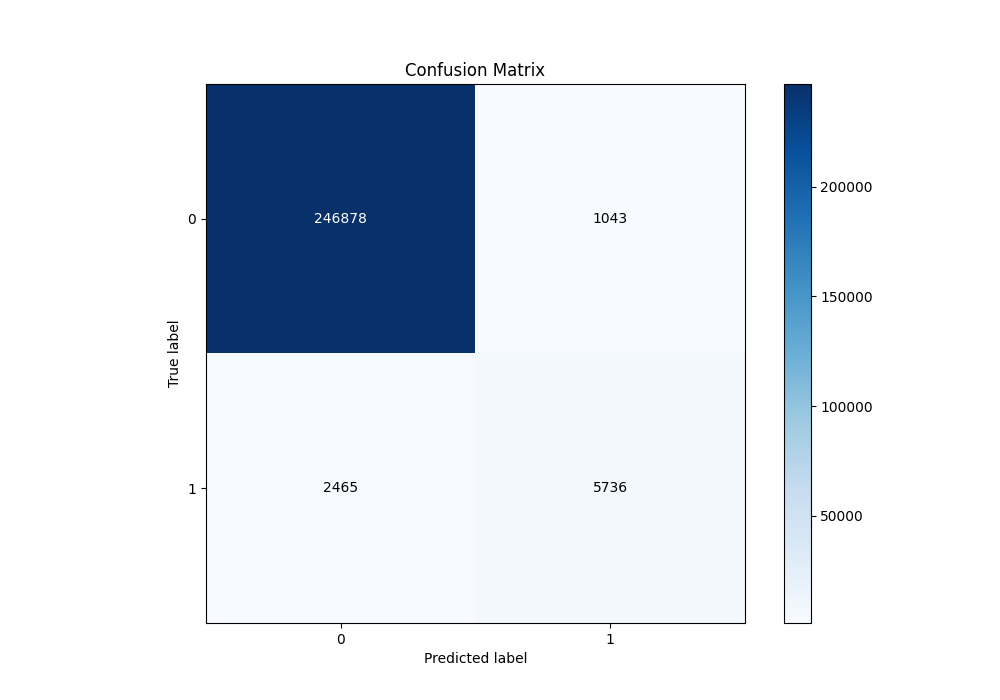
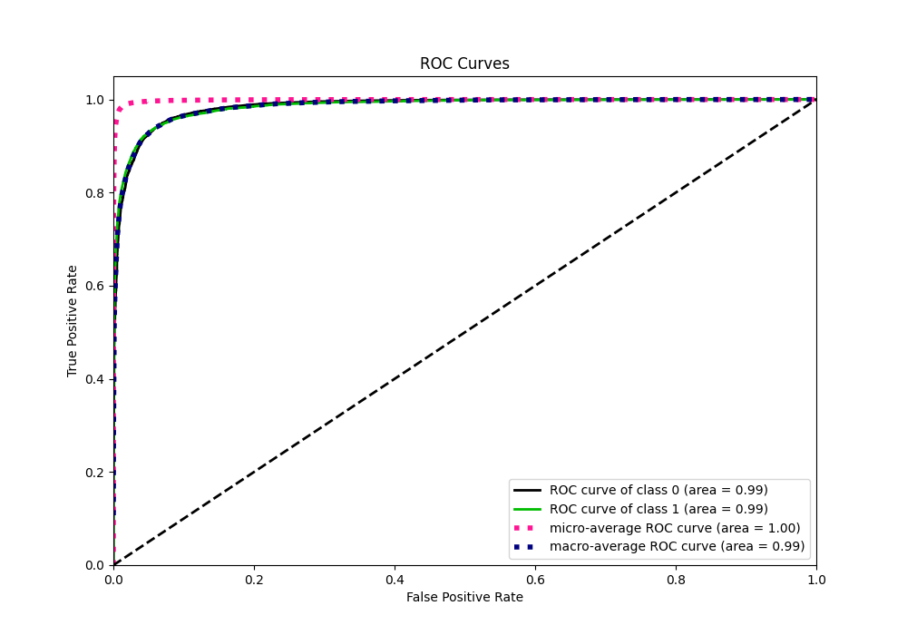
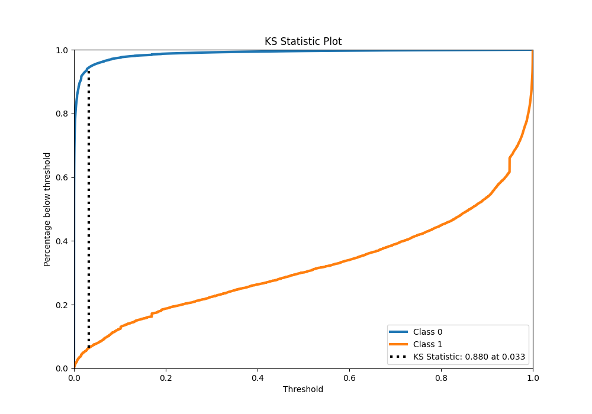
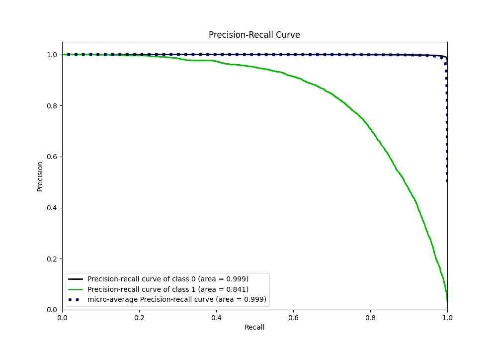
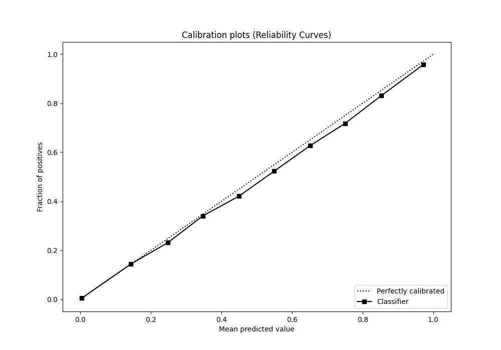
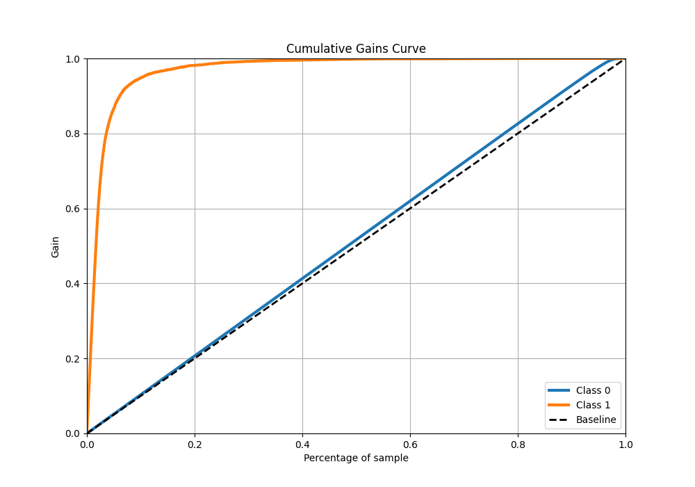
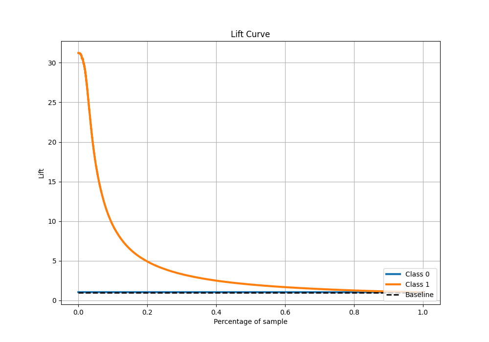

# Summary of 58_NeuralNetwork

[<< Go back](../README.md)

## Neural Network
- **n_jobs**: -1
- **dense_1_size**: 32
- **dense_2_size**: 32
- **learning_rate**: 0.05
- **explain_level**: 0

## Validation
 - **validation_type**: kfold
 - **shuffle**: True
 - **stratify**: True
 - **k_folds**: 10

## Optimized metric
f1

## Training time

597.4 seconds

## Metric details
|           |     score |     threshold |
|:----------|----------:|--------------:|
| logloss   | 0.0410206 | nan           |
| auc       | 0.985119  | nan           |
| f1        | 0.765821  |   0.49771     |
| accuracy  | 0.986303  |   0.49771     |
| precision | 0.846142  |   0.49771     |
| recall    | 1         |   4.59178e-13 |
| mcc       | 0.762484  |   0.49771     |

## Metric details with threshold from accuracy metric
|           |     score |   threshold |
|:----------|----------:|------------:|
| logloss   | 0.0410206 |   nan       |
| auc       | 0.985119  |   nan       |
| f1        | 0.765821  |     0.49771 |
| accuracy  | 0.986303  |     0.49771 |
| precision | 0.846142  |     0.49771 |
| recall    | 0.699427  |     0.49771 |
| mcc       | 0.762484  |     0.49771 |

## Confusion matrix (at threshold=0.49771)
|              |   Predicted as 0 |   Predicted as 1 |
|:-------------|-----------------:|-----------------:|
| Labeled as 0 |           246878 |             1043 |
| Labeled as 1 |             2465 |             5736 |

## Learning curves

## Confusion Matrix

## Normalized Confusion Matrix

## ROC Curve

## Kolmogorov-Smirnov Statistic

## Precision-Recall Curve

## Calibration Curve

## Cumulative Gains Curve

## Lift Curve

[<< Go back](../README.md)
